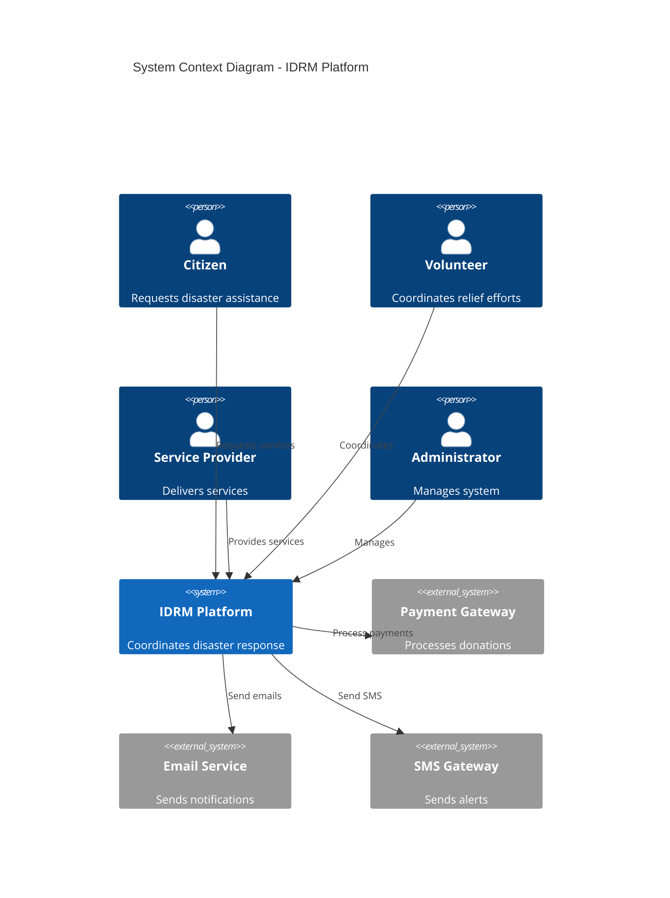
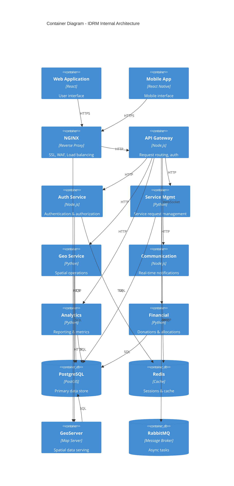
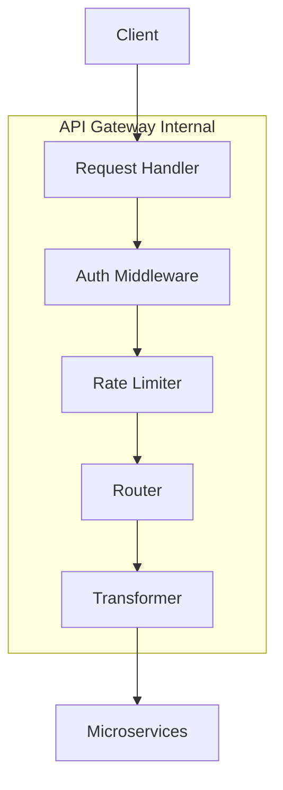
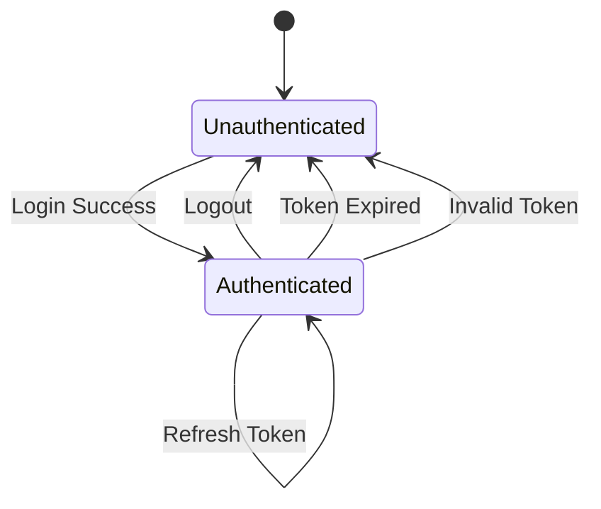
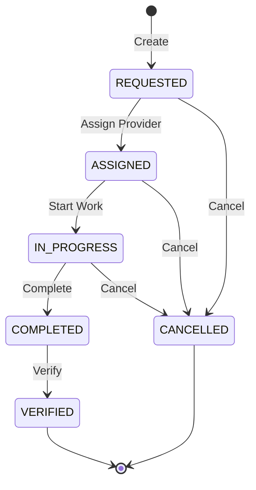
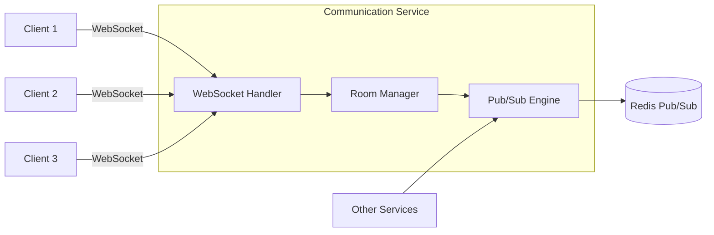
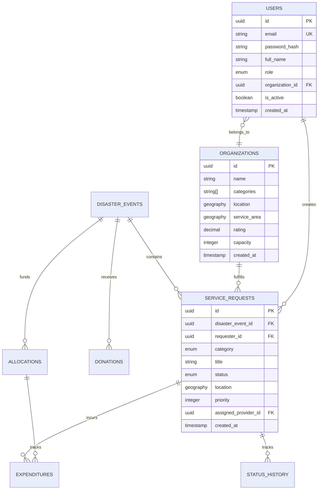
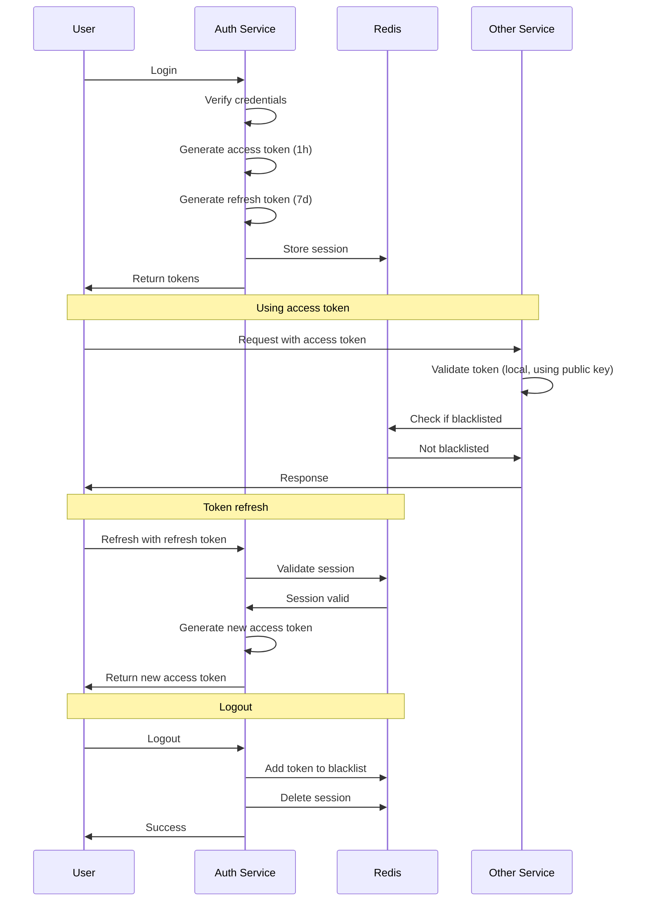

> *Type: Document (specification) · Audience: Architects, DevOps · Status: Archived — v0 historical generation*

---
title: "IDRM MVP - High-Level Design Document"
date: 2024-12-22 15:00:00 +0530
categories: [Architecture, Design]
tags: [hld, system-design, microservices, architecture, nodejs, python, postgis]
author: IDRM Architecture Team
toc: true
math: true
mermaid: true
pin: true
---

# High-Level Design: IDRM MVP

<!-- IDRM-CLEANUP doc=v0-21-hld-devops status=ANNOTATED-VARIANT pass=2026-08-16 -->
> ## 🗺️ VARIANT NOTE — duplicate of `20-architecture-hld.md` (DevOps lens)
> Near-duplicate of the v0 HLD with a DevOps framing. **For the full section-by-section mapping, see the Section
> Map in [`20-architecture-hld.md`](20-architecture-hld.md)** (`v0-20§*`). Delta only: its DevOps additions
> (pipelines, containers→K8s, blue-green, observability, autoscaling) are **FFP** — see `docs/ffp/80` +
> `docs/ffp/20`. The MVP is a native-systemd modular monolith (ADR-001/006). *Program:* `../../_CLEANUP-LEDGER.md`,
> `../../../instructions.txt` §12.

## 1. Introduction

### 1.1 Purpose
This High-Level Design document describes the **architectural design** of the IDRM MVP system. It defines how the system components interact, the technology choices, deployment topology, and design patterns used to implement the requirements specified in the PRD.

### 1.2 Scope
This document covers:
- System architecture and design patterns
- Component-level design with interfaces
- Data flow and interaction diagrams
- Technology stack with rationale
- Deployment architecture
- Security design
- Performance and scalability design

### 1.3 Design Principles

**Modularity**: Each component has a single responsibility with clear boundaries
**Scalability**: Horizontal scaling capability for all stateless services
**Resilience**: Graceful degradation and fault tolerance
**Security**: Defense-in-depth with multiple security layers
**Observability**: Built-in logging, metrics, and tracing
**Maintainability**: Clean code, clear interfaces, comprehensive documentation

## 2. Architectural Design

### 2.1 Architecture Style: Microservices

**Why Microservices?**
- Independent deployment of services
- Technology diversity (Node.js for I/O-heavy, Python for data-heavy)
- Fault isolation (one service failure doesn't crash entire system)
- Team autonomy for service development
- Easier scaling of individual components

**Trade-offs Accepted:**
- Increased operational complexity (mitigated by Docker Compose)
- Network latency between services (acceptable for MVP scale)
- Distributed data management (managed through careful API design)

### 2.2 System Context Diagram



### 2.3 Container Diagram



### 2.4 Deployment Architecture

```
┌─────────────────────────────────────────────────────────────┐
│                    Ubuntu Server 22.04/24.04                 │
│                     IP: 192.168.1.100                        │
│                                                              │
│  ┌────────────────────────────────────────────────────────┐ │
│  │              Docker Bridge Network                      │ │
│  │                  idrm-network                           │ │
│  │                                                          │ │
│  │  ┌─────────┐  ┌─────────┐  ┌──────────┐  ┌──────────┐ │ │
│  │  │ NGINX   │  │ Gateway │  │   Auth   │  │ Services │ │ │
│  │  │ :80/443 │  │  :3000  │  │  :3001   │  │:8001-8004│ │ │
│  │  └─────────┘  └─────────┘  └──────────┘  └──────────┘ │ │
│  │                                                          │ │
│  │  ┌─────────┐  ┌─────────┐  ┌──────────┐  ┌──────────┐ │ │
│  │  │Postgres │  │  Redis  │  │GeoServer │  │ RabbitMQ │ │ │
│  │  │ :5432   │  │  :6379  │  │  :8080   │  │  :5672   │ │ │
│  │  └─────────┘  └─────────┘  └──────────┘  └──────────┘ │ │
│  └────────────────────────────────────────────────────────┘ │
│                                                              │
│  ┌────────────────────────────────────────────────────────┐ │
│  │              Docker Volumes (Persistent)                │ │
│  │  • postgres_data   • redis_data   • geoserver_data     │ │
│  │  • nginx_logs      • app_logs                          │ │
│  └────────────────────────────────────────────────────────┘ │
└─────────────────────────────────────────────────────────────┘
```

## 3. Component Design

### 3.1 API Gateway Component

**Responsibility**: Single entry point for all client requests

**Key Design Decisions:**
- **Technology**: Node.js + Express (non-blocking I/O for high concurrency)
- **Pattern**: API Gateway pattern with Backend for Frontend (BFF)
- **Authentication**: JWT validation before forwarding requests
- **Rate Limiting**: Token bucket algorithm (10 req/sec per IP)

**Interface Contract:**
```typescript
// Request Interface
interface GatewayRequest {
  method: string;
  path: string;
  headers: Record<string, string>;
  body?: any;
  query?: Record<string, string>;
}

// Response Interface
interface GatewayResponse {
  statusCode: number;
  headers: Record<string, string>;
  body: {
    success: boolean;
    data?: any;
    errors?: Array<{code: string; message: string}>;
    meta?: {page: number; total: number};
  };
}
```

**Component Diagram:**


**Data Flow:**
1. Client sends HTTPS request to NGINX
2. NGINX forwards to Gateway on port 3000
3. Gateway validates JWT token (calls Auth Service if needed)
4. Gateway checks rate limit (Redis lookup)
5. Gateway routes to appropriate service
6. Gateway transforms response to standard format
7. Response returned to client

### 3.2 Authentication Service Component

**Responsibility**: User authentication and authorization

**Design Pattern**: Token-based authentication with refresh tokens

**Key Algorithms:**
```
Token Generation:
1. User provides credentials
2. Verify password hash (bcrypt, 12 rounds)
3. Generate access token (JWT, RS256, 1 hour TTL)
4. Generate refresh token (UUID, 7 days TTL)
5. Store session in Redis with TTL
6. Return both tokens

Token Validation:
1. Extract token from Authorization header
2. Verify signature using public key
3. Check expiration
4. Verify not in blacklist (Redis check)
5. Return user context
```

**State Diagram:**


**Interface Specification:**
```python
# Authentication Interface
class IAuthenticationService:
    async def login(email: str, password: str) -> AuthResponse:
        """
        Authenticate user and return tokens
        
        Returns:
            AuthResponse with access_token, refresh_token, expires_in
        Raises:
            InvalidCredentialsError: If credentials are invalid
            UserInactiveError: If user account is deactivated
        """
        pass
    
    async def validate_token(token: str) -> TokenPayload:
        """
        Validate JWT token
        
        Returns:
            TokenPayload with user_id, role, permissions
        Raises:
            TokenExpiredError: If token has expired
            InvalidTokenError: If token is invalid or blacklisted
        """
        pass
    
    async def refresh_token(refresh_token: str) -> AuthResponse:
        """Generate new access token from refresh token"""
        pass
    
    async def logout(token: str) -> None:
        """Blacklist token and invalidate session"""
        pass
```

### 3.3 Service Management Component

**Responsibility**: Manage service requests lifecycle

**Design Pattern**: Repository pattern with domain-driven design

**Core Domain Model:**
```python
class ServiceRequest(AggregateRoot):
    """
    Aggregate root for service request domain
    
    Invariants:
    - Priority must be 1-5
    - Status transitions must follow workflow
    - Location must be valid coordinates
    - Beneficiaries count > 0
    """
    
    def assign_to_provider(self, provider_id: UUID, assigned_by: UUID):
        """
        Business logic for assignment
        
        Rules:
        - Can only assign if status is REQUESTED
        - Provider must be verified and active
        - Provider must serve the category
        - Emits ServiceAssignedEvent
        """
        if self.status != ServiceStatus.REQUESTED:
            raise InvalidStateTransitionError()
        
        self.assigned_provider_id = provider_id
        self.assigned_by = assigned_by
        self.assigned_at = datetime.utcnow()
        self.status = ServiceStatus.ASSIGNED
        
        self.add_domain_event(ServiceAssignedEvent(
            service_id=self.id,
            provider_id=provider_id
        ))
```

**State Machine:**


**Matching Algorithm Design:**
```
Provider Matching Algorithm:
Input: ServiceRequest
Output: List<Provider> (ranked)

1. Spatial Filter:
   SELECT providers
   WHERE ST_DWithin(provider.service_area, request.location, 50km)
   AND provider.categories CONTAINS request.category
   AND provider.is_active = true

2. Scoring Function:
   score = (distance_score * 0.4) + 
           (rating_score * 0.3) + 
           (capacity_score * 0.2) +
           (response_time_score * 0.1)
   
   where:
   - distance_score = max(0, 100 - distance_km)
   - rating_score = (provider.rating / 5.0) * 100
   - capacity_score = min(100, provider.current_capacity * 10)
   - response_time_score = max(0, 100 - avg_response_minutes)

3. Rank by score DESC, LIMIT 10
```

### 3.4 Geospatial Service Component

**Responsibility**: Spatial operations and analysis

**Key Design Decisions:**
- **PostGIS** for complex spatial queries (ST_DWithin, ST_Buffer, ST_Intersects)
- **GeoServer** for map rendering (WMS/WFS/WMTS)
- **Caching** for frequently accessed spatial data

**Spatial Operations Interface:**
```python
class IGeospatialService:
    async def proximity_search(
        self,
        center: Point,
        radius_km: float,
        filters: Optional[Dict] = None
    ) -> List[ServiceRequest]:
        """
        Find service requests within radius
        
        Query Optimization:
        - Uses GiST spatial index
        - Bounding box pre-filter
        - Returns results ordered by distance
        """
        pass
    
    async def cluster_analysis(
        self,
        disaster_id: UUID,
        algorithm: str = "dbscan",
        params: Dict = None
    ) -> List[Cluster]:
        """
        Cluster service requests geographically
        
        Algorithms:
        - DBSCAN: Density-based clustering
        - K-Means: Centroid-based clustering
        - HDBSCAN: Hierarchical density clustering
        """
        pass
    
    async def calculate_service_area(
        self,
        provider_location: Point,
        max_distance_km: float
    ) -> Polygon:
        """
        Calculate service coverage area
        Uses ST_Buffer with proper SRID transformation
        """
        pass
```

**Spatial Query Optimization:**
```sql
-- BAD: No index usage
SELECT * FROM service_requests
WHERE ST_Distance(location, ST_MakePoint(78.0, 17.0)) < 50000;

-- GOOD: Uses spatial index
SELECT * FROM service_requests
WHERE ST_DWithin(
    location,
    ST_SetSRID(ST_MakePoint(78.0, 17.0), 4326),
    50000
)
ORDER BY location <-> ST_SetSRID(ST_MakePoint(78.0, 17.0), 4326)
LIMIT 100;

-- Execution Plan:
-- Index Scan using idx_service_requests_location (cost=0.14..8.16)
-- Index Cond: (location && ST_Expand(point, 50000))
-- Order By: (location <-> point)
```

### 3.5 Communication Service Component

**Responsibility**: Real-time notifications and messaging

**Design Pattern**: Pub/Sub with room-based channels

**Architecture:**


**Event Distribution:**
```javascript
// Event Types
const Events = {
  SERVICE_CREATED: 'service:created',
  SERVICE_ASSIGNED: 'service:assigned',
  SERVICE_UPDATED: 'service:updated',
  DISASTER_ALERT: 'disaster:alert',
  MESSAGE_RECEIVED: 'message:received'
};

// Room Strategy
class RoomManager {
  getUserRoom(userId) {
    return `user:${userId}`;
  }
  
  getRoleRoom(role) {
    return `role:${role}`;
  }
  
  getDisasterRoom(disasterId) {
    return `disaster:${disasterId}`;
  }
  
  getServiceRoom(serviceId) {
    return `service:${serviceId}`;
  }
}

// Broadcasting Strategy
async function broadcastServiceUpdate(serviceId, data) {
  // Notify service creator
  io.to(`user:${data.requesterId}`).emit(Events.SERVICE_UPDATED, data);
  
  // Notify assigned provider
  if (data.providerId) {
    io.to(`user:${data.providerId}`).emit(Events.SERVICE_UPDATED, data);
  }
  
  // Notify disaster coordinators
  io.to(`disaster:${data.disasterId}`).emit(Events.SERVICE_UPDATED, data);
}
```

**Scalability Design:**
- **Redis Adapter**: For horizontal scaling across multiple instances
- **Sticky Sessions**: Via NGINX (ip_hash)
- **Heartbeat**: 30-second ping/pong to detect disconnections
- **Reconnection**: Exponential backoff (1s, 2s, 4s, 8s, max 30s)

## 4. Data Design

### 4.1 Database Schema Design

**Entity-Relationship Diagram:**


### 4.2 Index Strategy

**Rationale for Each Index:**

```sql
-- Spatial Indexes (GiST)
-- WHY: PostGIS spatial operators (ST_DWithin, ST_Intersects) require spatial index
CREATE INDEX idx_service_requests_location 
ON service_requests USING GIST(location);
-- Expected improvement: 1000x faster for proximity queries

CREATE INDEX idx_organizations_service_area 
ON organizations USING GIST(service_area);
-- Used for: "Which providers cover this location?"

-- Composite Indexes
-- WHY: Most queries filter by disaster + category + status
CREATE INDEX idx_service_disaster_category_status
ON service_requests(disaster_event_id, category, status);
-- Query pattern: "Show all requested food services for disaster X"

-- Partial Indexes
-- WHY: 80% of queries are for active requests only
CREATE INDEX idx_active_requests
ON service_requests(created_at DESC)
WHERE status IN ('requested', 'assigned', 'in_progress');
-- Size reduction: ~50% compared to full index

-- Foreign Key Indexes
-- WHY: JOIN performance and referential integrity checks
CREATE INDEX idx_service_requests_requester
ON service_requests(requester_id);

CREATE INDEX idx_service_requests_provider
ON service_requests(assigned_provider_id)
WHERE assigned_provider_id IS NOT NULL;
```

### 4.3 Data Partitioning Strategy

**Time-Based Partitioning for Audit Logs:**

```sql
-- Rationale: Audit logs grow indefinitely, queries are time-bound
CREATE TABLE audit_logs (
    id UUID DEFAULT gen_random_uuid(),
    entity_type VARCHAR(50),
    entity_id UUID,
    action VARCHAR(20),
    user_id UUID,
    changes JSONB,
    created_at TIMESTAMP WITH TIME ZONE NOT NULL
) PARTITION BY RANGE (created_at);

-- Monthly partitions
CREATE TABLE audit_logs_2024_12 PARTITION OF audit_logs
    FOR VALUES FROM ('2024-12-01') TO ('2025-01-01');

CREATE TABLE audit_logs_2025_01 PARTITION OF audit_logs
    FOR VALUES FROM ('2025-01-01') TO ('2025-02-01');

-- Benefits:
-- - Query only relevant partition (12x faster)
-- - Easy archival of old partitions
-- - Vacuum/analyze only active partitions
```

### 4.4 Caching Strategy

**Multi-Level Caching:**

```
Level 1: Application Cache (In-Memory)
- User permissions (5 min TTL)
- Static configuration (1 hour TTL)

Level 2: Redis Cache
- Database query results (15 min TTL)
- GeoServer tile requests (1 hour TTL)
- API responses (5 min TTL)

Level 3: NGINX Cache
- Static assets (24 hour TTL)
- WMS tiles (1 hour TTL)
```

**Cache Invalidation Strategy:**

```python
# Write-through cache pattern
async def update_service_request(service_id: UUID, data: Dict):
    # 1. Update database
    await db.execute(
        "UPDATE service_requests SET ... WHERE id = :id",
        {"id": service_id, ...}
    )
    
    # 2. Invalidate related caches
    cache_keys = [
        f"service:{service_id}",
        f"disaster:{data['disaster_id']}:services",
        f"provider:{data['provider_id']}:services"
    ]
    await redis.delete(*cache_keys)
    
    # 3. Broadcast cache invalidation to other instances
    await redis.publish('cache:invalidate', json.dumps(cache_keys))
```

## 5. Interface Design

### 5.1 External API Contracts

**REST API Design Principles:**
- RESTful resource-based URLs
- HTTP verbs for operations (GET, POST, PUT, PATCH, DELETE)
- Stateless requests
- JSON payloads
- Standard HTTP status codes
- Pagination for lists
- Filtering and sorting via query parameters

**API Versioning Strategy:**
- URL-based versioning: `/api/v1/services`
- Backward compatibility within major version
- Deprecation notices 6 months before removal

**Standard Response Format:**
```json
{
  "success": true,
  "data": {
    "id": "uuid",
    "...": "..."
  },
  "meta": {
    "page": 1,
    "per_page": 20,
    "total": 150,
    "total_pages": 8
  },
  "errors": []
}
```

**Error Response Format:**
```json
{
  "success": false,
  "errors": [
    {
      "code": "VALIDATION_ERROR",
      "message": "Invalid coordinates",
      "field": "location.latitude",
      "details": {
        "min": -90,
        "max": 90,
        "provided": 95
      }
    }
  ]
}
```

### 5.2 Internal Service Interfaces

**Service-to-Service Communication:**

```python
# Synchronous HTTP calls for critical path
class ServiceManagementClient:
    async def assign_service(
        self,
        service_id: UUID,
        provider_id: UUID
    ) -> ServiceRequest:
        """
        Synchronous call when immediate response needed
        Timeout: 5 seconds
        Retry: 3 times with exponential backoff
        """
        response = await httpx.post(
            f"{SERVICE_MGMT_URL}/internal/assign",
            json={"service_id": str(service_id), "provider_id": str(provider_id)},
            timeout=5.0
        )
        return ServiceRequest.parse_obj(response.json())

# Asynchronous events for non-critical operations
class EventPublisher:
    async def publish_service_completed(self, service_id: UUID):
        """
        Async event via RabbitMQ
        Fire-and-forget for analytics, notifications
        """
        await rabbitmq.publish(
            exchange='events',
            routing_key='service.completed',
            body=json.dumps({"service_id": str(service_id)})
        )
```

### 5.3 Database Interface (Repository Pattern)

```python
class IServiceRequestRepository(ABC):
    """
    Abstract repository interface
    Decouples business logic from data access
    """
    
    @abstractmethod
    async def find_by_id(self, id: UUID) -> Optional[ServiceRequest]:
        """Get service request by ID"""
        pass
    
    @abstractmethod
    async def find_by_disaster(
        self,
        disaster_id: UUID,
        filters: Optional[Dict] = None,
        pagination: Optional[Pagination] = None
    ) -> Page[ServiceRequest]:
        """Find all requests for a disaster with filtering"""
        pass
    
    @abstractmethod
    async def find_nearby(
        self,
        location: Point,
        radius_km: float,
        filters: Optional[Dict] = None
    ) -> List[ServiceRequest]:
        """Spatial query for nearby requests"""
        pass
    
    @abstractmethod
    async def save(self, service_request: ServiceRequest) -> ServiceRequest:
        """Insert or update service request"""
        pass
    
    @abstractmethod
    async def delete(self, id: UUID) -> None:
        """Soft delete service request"""
        pass
```

## 6. Security Design

### 6.1 Security Architecture Layers

```
┌─────────────────────────────────────────────────┐
│ Layer 4: Data Security                          │
│ - Encryption at rest (AES-256)                  │
│ - Password hashing (bcrypt, 12 rounds)          │
│ - Sensitive data masking                        │
│ - Audit logging                                 │
└─────────────────────────────────────────────────┘
                        ↑
┌─────────────────────────────────────────────────┐
│ Layer 3: Application Security                   │
│ - JWT authentication (RS256)                    │
│ - RBAC authorization                            │
│ - Input validation & sanitization              │
│ - SQL injection prevention (parameterized)      │
│ - XSS protection (CSP headers)                  │
└─────────────────────────────────────────────────┘
                        ↑
┌─────────────────────────────────────────────────┐
│ Layer 2: Transport Security                     │
│ - TLS 1.3 encryption                            │
│ - Certificate validation                        │
│ - HSTS headers                                  │
└─────────────────────────────────────────────────┘
                        ↑
┌─────────────────────────────────────────────────┐
│ Layer 1: Network Security                       │
│ - Firewall rules (UFW)                          │
│ - DDoS protection (rate limiting)               │
│ - IP whitelisting for admin                     │
└─────────────────────────────────────────────────┘
```

### 6.2 Authentication Design

**JWT Token Structure:**
```json
{
  "header": {
    "alg": "RS256",
    "typ": "JWT",
    "kid": "key-2024-12"
  },
  "payload": {
    "sub": "user-uuid",
    "email": "user@example.com",
    "role": "citizen",
    "org": "org-uuid",
    "permissions": ["services:read", "services:create"],
    "iat": 1703260800,
    "exp": 1703264400,
    "jti": "token-uuid"
  }
}
```

**Why RS256 instead of HS256?**
- Public key can be distributed to all services
- Private key only in Auth Service (better security)
- Key rotation easier
- Industry best practice for microservices

**Token Lifecycle:**


### 6.3 Authorization Design (RBAC)

**Permission Model:**
```python
# Permission format: resource:action
# Examples: services:create, services:read, users:delete

ROLE_PERMISSIONS = {
    'citizen': [
        'services:create',
        'services:read:own',
        'profile:read:own',
        'profile:update:own'
    ],
    'volunteer': [
        'services:create',
        'services:read',
        'services:update:assigned',
        'profile:read:own',
        'profile:update:own'
    ],
    'provider': [
        'services:create',
        'services:read',
        'services:assign',
        'services:update:assigned',
        'profile:read:own',
        'profile:update:own',
        'organization:read:own',
        'organization:update:own'
    ],
    'admin': [
        'services:*',
        'users:*',
        'organizations:*',
        'disasters:*',
        'analytics:*',
        'system:*'
    ]
}

# Authorization check
def check_permission(user: User, permission: str) -> bool:
    user_permissions = ROLE_PERMISSIONS.get(user.role, [])
    
    # Check exact match
    if permission in user_permissions:
        return True
    
    # Check wildcard
    resource = permission.split(':')[0]
    if f"{resource}:*" in user_permissions:
        return True
    
    # Check ownership
    if permission.endswith(':own') and user.id == resource_owner_id:
        return True
    
    return False
```

### 6.4 Input Validation Design

**Multi-Layer Validation:**

```python
# Layer 1: Schema Validation (Pydantic)
from pydantic import BaseModel, validator, Field
from typing import Optional

class ServiceRequestCreate(BaseModel):
    disaster_event_id: UUID
    category: ServiceCategory
    title: str = Field(..., min_length=5, max_length=255)
    description: Optional[str] = Field(None, max_length=5000)
    priority: int = Field(..., ge=1, le=5)
    latitude: float = Field(..., ge=-90, le=90)
    longitude: float = Field(..., ge=-180, le=180)
    beneficiaries_count: int = Field(1, ge=1)
    
    @validator('title')
    def sanitize_title(cls, v):
        # Remove HTML tags
        return re.sub('<[^<]+?>', '', v).strip()
    
    @validator('disaster_event_id')
    def validate_disaster_exists(cls, v):
        # Check disaster exists and is active
        if not disaster_exists(v):
            raise ValueError('Disaster event not found')
        return v

# Layer 2: Business Logic Validation
async def create_service_request(data: ServiceRequestCreate, user: User):
    # Check user can create requests for this disaster
    if not user.has_permission(f'disaster:{data.disaster_event_id}:create'):
        raise PermissionDeniedError()
    
    # Check rate limit (max 10 requests per hour)
    if await get_user_request_count(user.id, hours=1) >= 10:
        raise RateLimitExceededError()
    
    # Create request
    service = ServiceRequest(**data.dict(), requester_id=user.id)
    return await repository.save(service)

# Layer 3: Database Constraints
CREATE TABLE service_requests (
    ...
    priority INTEGER CHECK (priority BETWEEN 1 AND 5),
    beneficiaries_count INTEGER CHECK (beneficiaries_count > 0),
    CONSTRAINT valid_location CHECK (
        ST_X(location) BETWEEN -180 AND 180 AND
        ST_Y(location) BETWEEN -90 AND 90
    )
);
```

## 7. Performance Design

### 7.1 Performance Requirements

| Operation | Target Latency (p95) | Target Throughput |
|-----------|---------------------|-------------------|
| User Login | < 500ms | 100 req/s |
| Service List | < 300ms | 200 req/s |
| Service Create | < 800ms | 50 req/s |
| Proximity Search (10km) | < 600ms | 100 req/s |
| Map Tile Load | < 200ms | 500 req/s |
| Real-time Notification | < 100ms | 1000 msg/s |

### 7.2 Database Query Optimization

**Slow Query Example:**
```sql
-- BEFORE: 2500ms
SELECT s.*, u.full_name, o.name as provider
FROM service_requests s
LEFT JOIN users u ON s.requester_id = u.id
LEFT JOIN organizations o ON s.assigned_provider_id = o.id
WHERE ST_Distance(s.location, ST_MakePoint(78.0, 17.0)) < 50000
  AND s.disaster_event_id = 'disaster-uuid'
ORDER BY s.created_at DESC;

-- AFTER: 85ms
SELECT s.*, u.full_name, o.name as provider
FROM service_requests s
LEFT JOIN users u ON s.requester_id = u.id
LEFT JOIN organizations o ON s.assigned_provider_id = o.id
WHERE s.disaster_event_id = 'disaster-uuid'
  AND ST_DWithin(
    s.location,
    ST_SetSRID(ST_MakePoint(78.0, 17.0), 4326),
    50000
  )
ORDER BY s.created_at DESC
LIMIT 20;

-- Improvements:
-- 1. ST_DWithin uses spatial index (vs ST_Distance sequential scan)
-- 2. Filter by disaster_event_id first (reduces dataset)
-- 3. LIMIT 20 (pagination)
-- 4. Proper SRID specification
```

**Explain Plan:**
```
QUERY PLAN
---------------------------------------------------------
Limit (cost=12.45..12.50 rows=20)
  -> Sort (cost=12.45..12.47 rows=10)
    Sort Key: s.created_at DESC
    -> Index Scan using idx_service_disaster_category_status
       Index Cond: (disaster_event_id = 'disaster-uuid')
       Filter: ST_DWithin(location, point, 50000)
       Rows Removed by Filter: 5
```

### 7.3 Connection Pooling Design

**Why Connection Pooling?**
- Creating DB connections is expensive (50-100ms)
- Pooling reuses connections (< 1ms)
- Prevents connection exhaustion

**Configuration:**
```python
# SQLAlchemy pool settings
engine = create_engine(
    DATABASE_URL,
    poolclass=QueuePool,
    pool_size=20,          # Number of persistent connections
    max_overflow=40,       # Additional connections during spikes
    pool_timeout=30,       # Wait time for available connection
    pool_recycle=3600,     # Recycle connections after 1 hour
    pool_pre_ping=True     # Verify connection before use
)

# Sizing calculation:
# Expected concurrent requests: 200/s
# Average request duration: 100ms
# Required connections: 200 * 0.1 = 20
# Buffer for spikes: 2x = 40
# Total pool: 20 + 40 = 60
```

### 7.4 Caching Design

**Cache Hit Ratio Target: 80%+**

```python
# Cache decorator with TTL
from functools import wraps
import hashlib
import json

def cache(ttl: int = 300):
    """
    Cache function results in Redis
    
    Args:
        ttl: Time to live in seconds
    """
    def decorator(func):
        @wraps(func)
        async def wrapper(*args, **kwargs):
            # Generate cache key
            key_data = f"{func.__name__}:{json.dumps(args)}:{json.dumps(kwargs)}"
            cache_key = f"cache:{hashlib.sha256(key_data.encode()).hexdigest()}"
            
            # Try cache
            cached = await redis.get(cache_key)
            if cached:
                return json.loads(cached)
            
            # Execute function
            result = await func(*args, **kwargs)
            
            # Store in cache
            await redis.setex(cache_key, ttl, json.dumps(result, default=str))
            
            return result
        return wrapper
    return decorator

# Usage
@cache(ttl=300)  # 5 minutes
async def get_disaster_statistics(disaster_id: UUID):
    # Expensive aggregation query
    return await db.query(...).all()
```

**Cache Warming Strategy:**
```python
# Pre-populate cache for common queries on deployment
async def warm_cache():
    active_disasters = await db.query(DisasterEvent).filter_by(
        status='active'
    ).all()
    
    for disaster in active_disasters:
        # Warm statistics
        await get_disaster_statistics(disaster.id)
        
        # Warm service lists
        for category in ServiceCategory:
            await get_services_by_category(disaster.id, category)
```

## 8. Scalability Design

### 8.1 Horizontal Scaling Strategy

**Stateless Services (Can scale horizontally):**
- API Gateway
- Authentication Service
- Service Management
- Geospatial Service
- Analytics Service
- Financial Service

**Stateful Services (Require special handling):**
- Communication Service (use Redis adapter)
- PostgreSQL (use read replicas)
- Redis (use Redis Cluster)

**Scaling Example:**
```yaml
# Scale service management to 3 instances
docker-compose up -d --scale service-management=3

# NGINX load balancing (least connections)
upstream service_mgmt {
    least_conn;
    server service-mgmt-1:8001;
    server service-mgmt-2:8001;
    server service-mgmt-3:8001;
}
```

### 8.2 Database Scaling Design

**Read Replicas for Analytics:**
```
┌─────────────┐
│   Primary   │ ← Writes (Service Management, Auth)
│  PostgreSQL │
└──────┬──────┘
       │ Replication
       ├─────────────┬─────────────┐
       ↓             ↓             ↓
┌──────────┐  ┌──────────┐  ┌──────────┐
│ Replica 1│  │ Replica 2│  │ Replica 3│
│  (Read)  │  │  (Read)  │  │  (Read)  │
└──────────┘  └──────────┘  └──────────┘
      ↑             ↑             ↑
Analytics      Reporting     Dashboards
```

**Configuration:**
```sql
-- Primary (postgresql.conf)
wal_level = replica
max_wal_senders = 3
wal_keep_size = 1GB

-- Replica (recovery.conf)
primary_conninfo = 'host=primary port=5432 user=replicator password=xxx'
hot_standby = on
```

### 8.3 Capacity Planning

**Resource Estimation:**
```
Users: 50,000 registered, 5,000 concurrent during major disaster
Requests per second: 200 (normal), 1,000 (peak)
Data growth: 10GB per disaster event

CPU:
- Gateway: 2 cores × 3 instances = 6 cores
- Services: 2 cores × 6 services = 12 cores
- Database: 4 cores
- Total: 22 cores → 8-core server with headroom

Memory:
- Gateway: 512MB × 3 = 1.5GB
- Services: 1GB × 6 = 6GB
- PostgreSQL: 8GB (shared_buffers: 2GB, effective_cache: 4GB)
- Redis: 2GB
- GeoServer: 2GB
- Total: 19.5GB → 32GB server

Storage:
- Database: 50GB per disaster × 5 years = 250GB
- Logs: 10GB
- Backups: 100GB
- Total: 360GB → 500GB SSD
```

## 9. Monitoring & Operations Design

### 9.1 Health Check Design

```python
# Health check endpoint
@app.get("/health")
async def health_check():
    """
    Multi-level health check
    Returns 200 if healthy, 503 if degraded
    """
    checks = {
        "service": "healthy",
        "database": await check_database(),
        "redis": await check_redis(),
        "disk": check_disk_space(),
        "memory": check_memory()
    }
    
    # Determine overall health
    critical_checks = ["database", "redis"]
    critical_healthy = all(
        checks[c] == "healthy" for c in critical_checks
    )
    
    overall_status = "healthy" if critical_healthy else "degraded"
    status_code = 200 if critical_healthy else 503
    
    return JSONResponse(
        status_code=status_code,
        content={
            "status": overall_status,
            "checks": checks,
            "timestamp": datetime.utcnow().isoformat()
        }
    )

async def check_database():
    try:
        result = await db.execute(text("SELECT 1"))
        latency = result.execution_options.get('execution_time', 0)
        if latency > 1000:  # > 1 second
            return "slow"
        return "healthy"
    except Exception as e:
        logger.error(f"Database health check failed: {e}")
        return "unhealthy"
```

### 9.2 Logging Design

**Structured Logging:**
```python
import logging
import json
from datetime import datetime

class StructuredLogger:
    def __init__(self, service_name):
        self.service_name = service_name
        self.logger = logging.getLogger(service_name)
    
    def log(self, level, message, **kwargs):
        log_entry = {
            "timestamp": datetime.utcnow().isoformat(),
            "service": self.service_name,
            "level": level,
            "message": message,
            **kwargs
        }
        self.logger.log(
            getattr(logging, level.upper()),
            json.dumps(log_entry)
        )
    
    def info(self, message, **kwargs):
        self.log("info", message, **kwargs)
    
    def error(self, message, **kwargs):
        self.log("error", message, **kwargs)

# Usage
logger = StructuredLogger("service-management")
logger.info(
    "Service request created",
    service_id=str(service.id),
    user_id=str(user.id),
    category=service.category,
    duration_ms=125
)

# Output (parseable by log aggregators):
# {"timestamp":"2024-12-22T10:30:00","service":"service-management",
#  "level":"info","message":"Service request created",
#  "service_id":"uuid","user_id":"uuid","category":"food","duration_ms":125}
```

### 9.3 Metrics Design

**Key Metrics to Track:**

```python
from prometheus_client import Counter, Histogram, Gauge

# Request metrics
request_count = Counter(
    'http_requests_total',
    'Total HTTP requests',
    ['method', 'endpoint', 'status']
)

request_duration = Histogram(
    'http_request_duration_seconds',
    'HTTP request duration',
    ['method', 'endpoint']
)

# Business metrics
service_requests_created = Counter(
    'service_requests_created_total',
    'Total service requests created',
    ['category', 'disaster_id']
)

active_service_requests = Gauge(
    'service_requests_active',
    'Number of active service requests',
    ['status']
)

# Database metrics
db_connection_pool_size = Gauge(
    'db_connection_pool_size',
    'Current database connection pool size'
)

db_query_duration = Histogram(
    'db_query_duration_seconds',
    'Database query duration',
    ['query_type']
)
```

### 9.4 Alerting Design

**Alert Rules:**
```yaml
groups:
  - name: idrm_critical
    interval: 1m
    rules:
      - alert: HighErrorRate
        expr: rate(http_requests_total{status=~"5.."}[5m]) > 0.05
        for: 5m
        labels:
          severity: critical
        annotations:
          summary: "High error rate on {{ $labels.service }}"
          description: "Error rate is {{ $value | humanizePercentage }}"
      
      - alert: DatabaseConnectionPoolExhausted
        expr: db_connection_pool_size / db_connection_pool_max > 0.9
        for: 2m
        labels:
          severity: warning
        annotations:
          summary: "Database connection pool nearly full"
      
      - alert: ServiceDown
        expr: up{job="idrm-services"} == 0
        for: 1m
        labels:
          severity: critical
        annotations:
          summary: "Service {{ $labels.instance }} is down"
```

## 10. Deployment Design

### 10.1 Deployment Pipeline

```
┌─────────────┐
│    Code     │
│   Commit    │
└──────┬──────┘
       ↓
┌──────────────┐
│ Run Tests    │
│ - Unit       │
│ - Integration│
└──────┬───────┘
       ↓
┌──────────────┐
│ Build Images │
│ - Docker     │
│ - Tag version│
└──────┬───────┘
       ↓
┌──────────────┐
│Deploy Staging│
│ - Smoke tests│
│ - Integration│
└──────┬───────┘
       ↓
┌──────────────┐
│Manual Approval│
└──────┬───────┘
       ↓
┌──────────────┐
│Deploy Prod   │
│ - Blue-Green │
│ - Health check│
└──────┬───────┘
       ↓
┌──────────────┐
│   Monitor    │
│ - Errors     │
│ - Performance│
└──────────────┘
```

### 10.2 Rollback Strategy

**Blue-Green Deployment:**
```bash
#!/bin/bash
# Deploy new version alongside old

# 1. Deploy green environment
docker-compose -f docker-compose.green.yml up -d

# 2. Wait for health check
for i in {1..30}; do
  if curl -f http://localhost:3001/health; then
    echo "Green environment healthy"
    break
  fi
  sleep 2
done

# 3. Switch NGINX to green
cp nginx-green.conf /etc/nginx/sites-enabled/idrm
nginx -s reload

# 4. Monitor for 5 minutes
sleep 300

# 5. Check error rate
ERROR_RATE=$(check_error_rate)
if [ $ERROR_RATE -gt 5 ]; then
  echo "High error rate, rolling back"
  cp nginx-blue.conf /etc/nginx/sites-enabled/idrm
  nginx -s reload
  exit 1
fi

# 6. Shut down blue environment
docker-compose -f docker-compose.blue.yml down
```

## 11. Conclusion

This High-Level Design document defines the **how** of building the IDRM MVP system:

**Architecture**: Microservices with clear boundaries and well-defined interfaces
**Technology**: Validated stack with Node.js, Python, PostgreSQL+PostGIS, Redis, GeoServer
**Design Patterns**: Repository, CQRS-lite, Pub/Sub, API Gateway
**Security**: Multi-layered defense with authentication, authorization, encryption
**Performance**: Optimized queries, caching, connection pooling
**Scalability**: Horizontal scaling, read replicas, partitioning
**Operations**: Health checks, structured logging, metrics, alerting

The design is production-ready for standalone Ubuntu deployment and provides a solid foundation for future cloud migration.

---

## References

<a href="https://microservices.io/patterns/microservices.html" target="_blank">Microservices Patterns by Chris Richardson</a>

<a href="https://martinfowler.com/articles/microservices.html" target="_blank">Microservices Guide - Martin Fowler</a>

<a href="https://c4model.com/" target="_blank">C4 Model for Software Architecture</a>

<a href="https://www.postgresql.org/docs/16/index.html" target="_blank">PostgreSQL 16 Documentation</a>

<a href="https://postgis.net/docs/manual-3.4/" target="_blank">PostGIS 3.4 Manual</a>

<a href="https://nodejs.org/en/docs/" target="_blank">Node.js Documentation</a>

<a href="https://fastapi.tiangolo.com/" target="_blank">FastAPI Framework</a>

<a href="https://jwt.io/introduction" target="_blank">JWT Best Practices</a>

<a href="https://redis.io/docs/" target="_blank">Redis Documentation</a>

<a href="https://docs.geoserver.org/" target="_blank">GeoServer Documentation</a>

<a href="https://socket.io/docs/v4/" target="_blank">Socket.IO Documentation</a>

<a href="https://www.nginx.com/resources/wiki/" target="_blank">NGINX Documentation</a>

<a href="https://docs.docker.com/compose/" target="_blank">Docker Compose Reference</a>

<a href="https://prometheus.io/docs/introduction/overview/" target="_blank">Prometheus Monitoring</a>

<a href="https://www.crunchydata.com/blog/postgis-performance-tips" target="_blank">PostGIS Performance Tips</a>

<a href="https://github.com/goldbergyoni/nodebestpractices" target="_blank">Node.js Best Practices</a>

<a href="https://owasp.org/www-project-api-security/" target="_blank">OWASP API Security</a>

<a href="https://12factor.net/" target="_blank">Twelve-Factor App Methodology</a>

---

**Document Version**: 1.0  
**Date**: December 22, 2024  
**Status**: Final  
**Classification**: Technical Architecture
