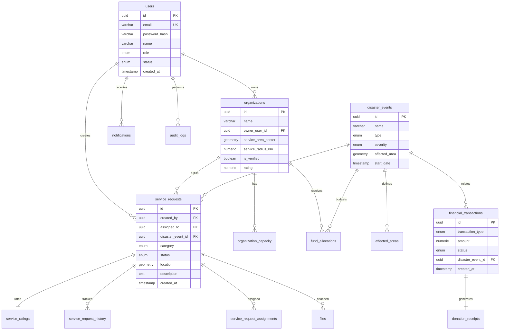
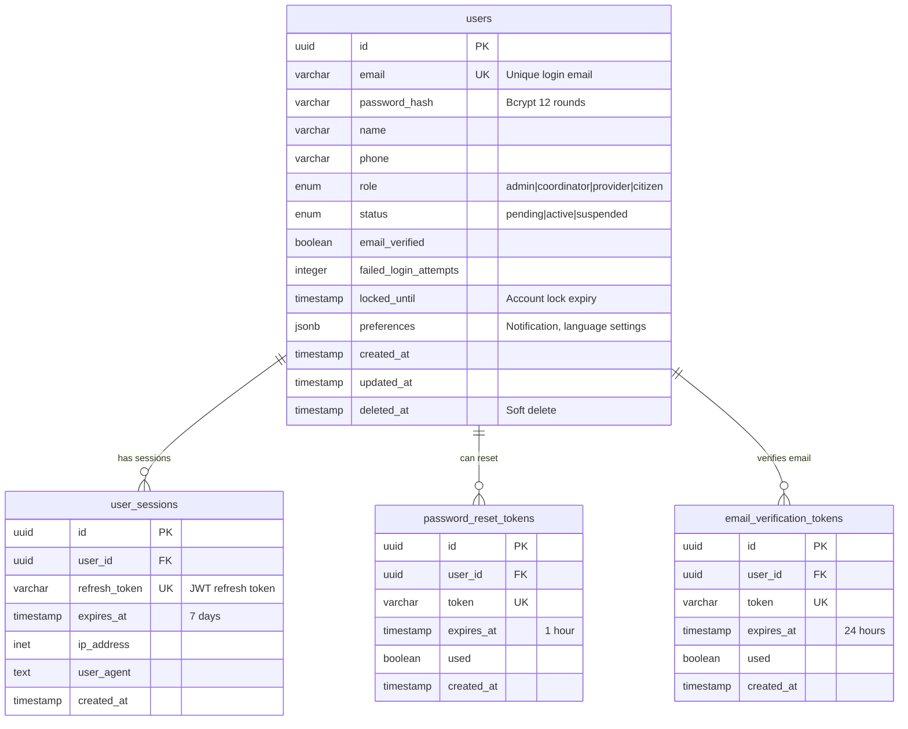
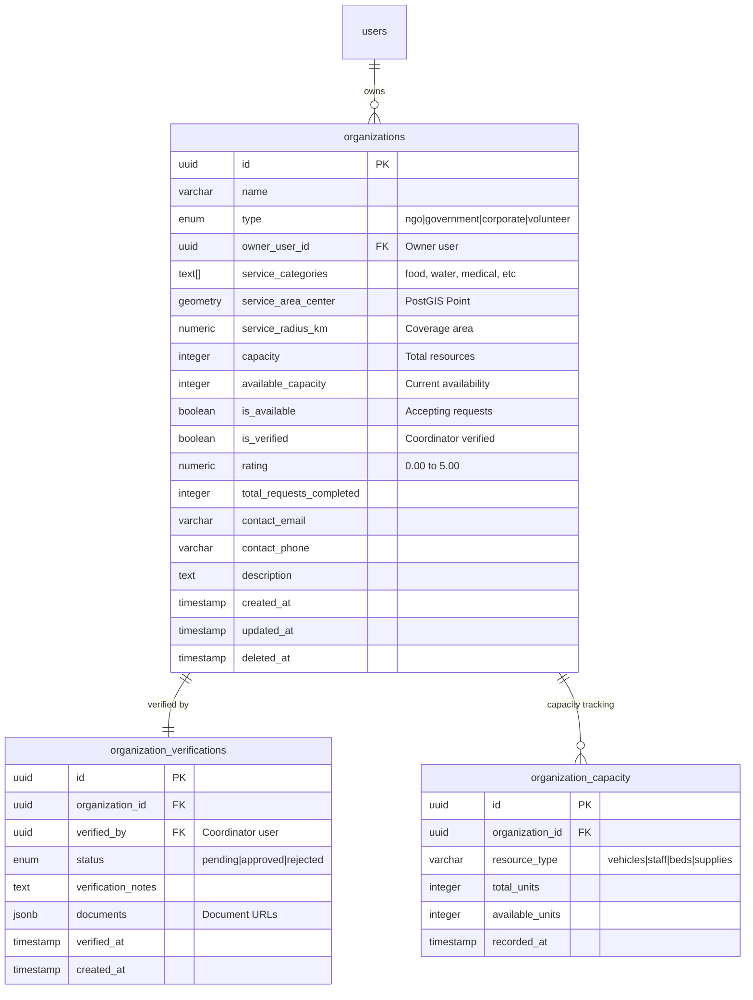
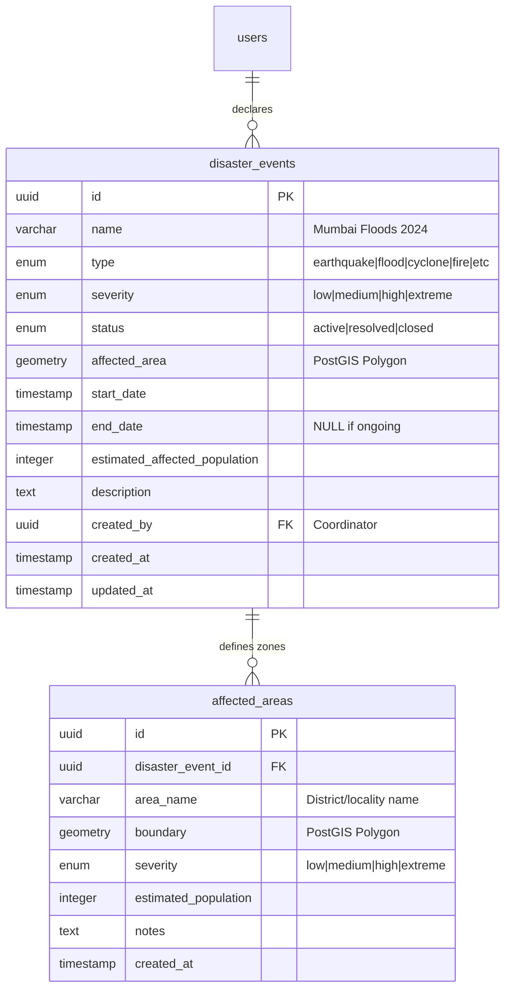
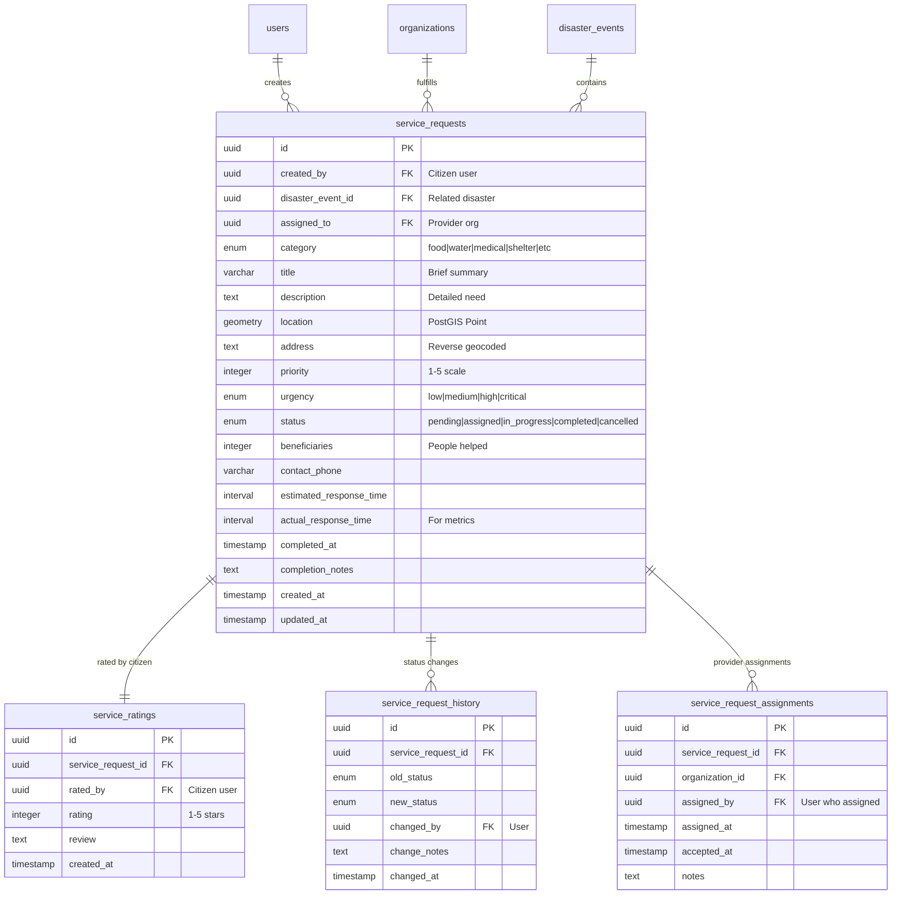
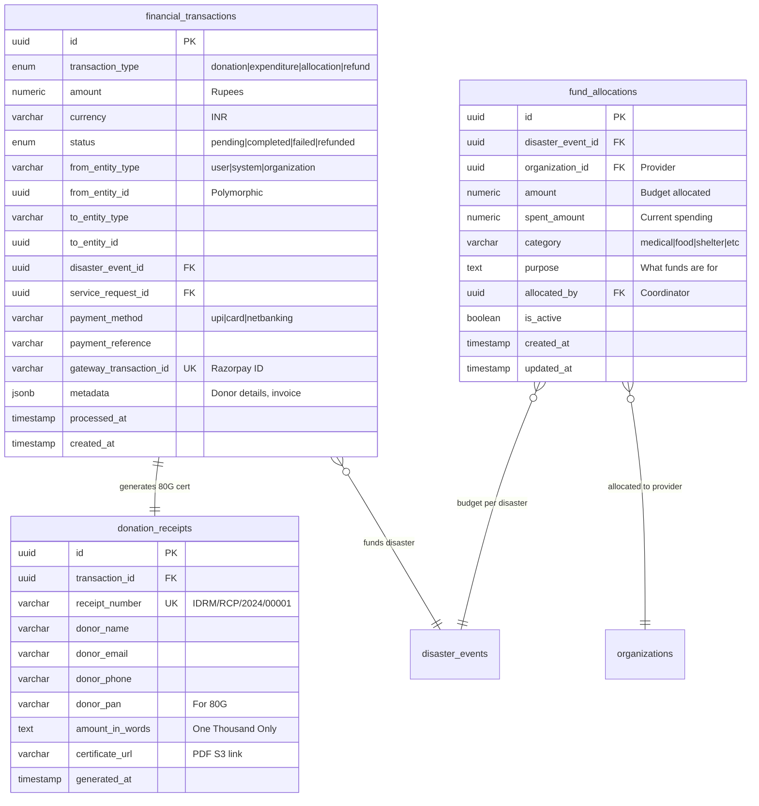
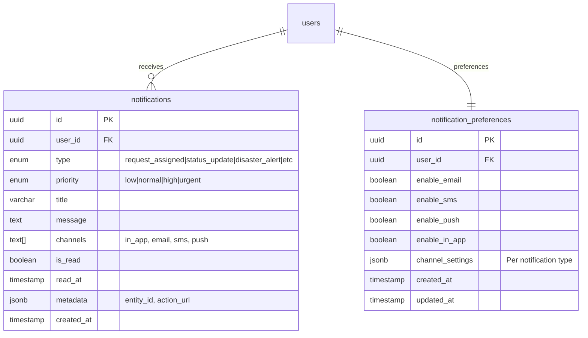
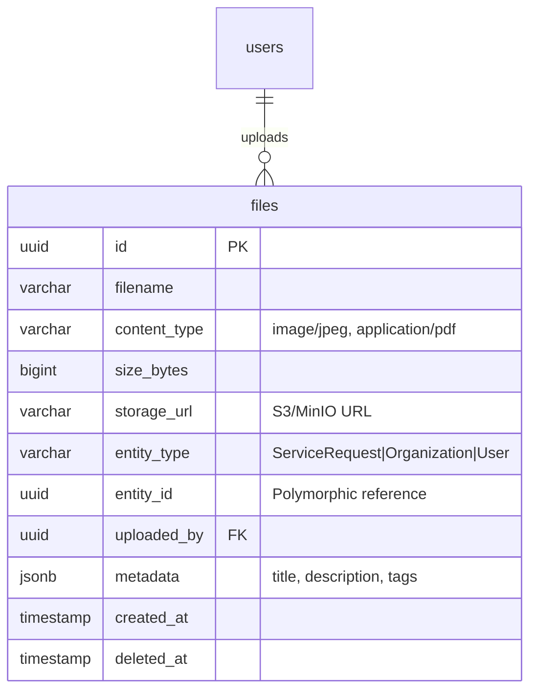
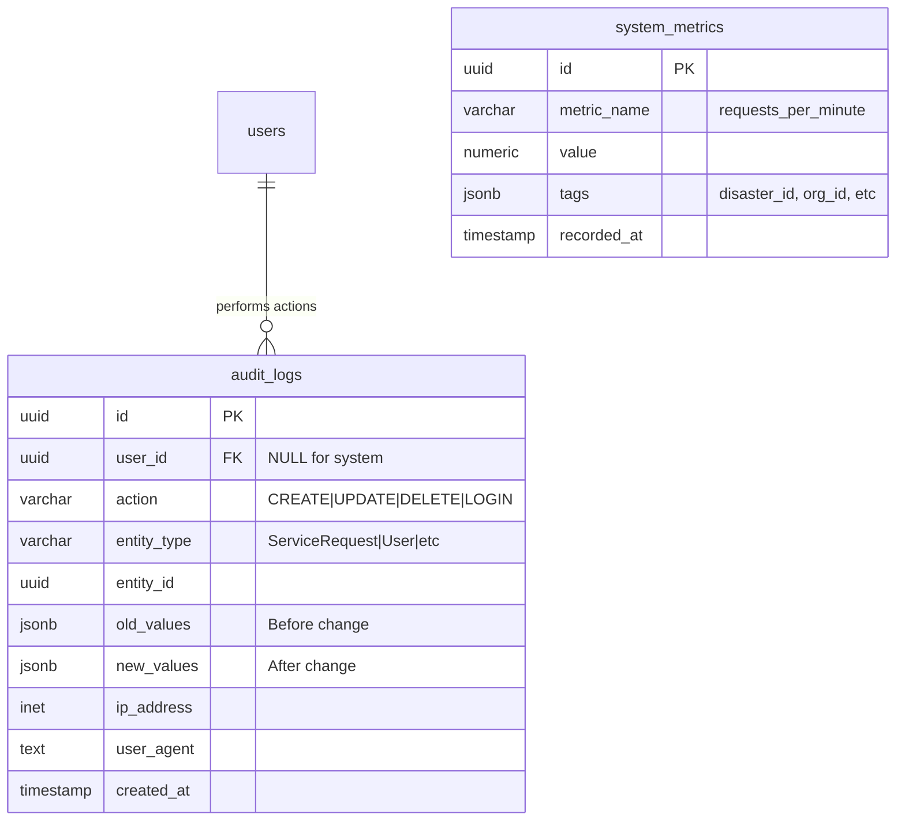

> *Type: Document (specification) · Audience: DBAs, backend devs · Status: Archived — v0 historical generation*

# IDRM Complete Data Model

**Version:** 1.0  
**Database:** PostgreSQL 16 + PostGIS 3.4  
**ORM:** SQLAlchemy 2.0 (Async)  
**Last Updated:** December 23, 2024

---

<!-- IDRM-CLEANUP doc=v0-50-data status=ANNOTATED pass=2026-08-16 -->
> ## 🗺️ SECTION MAP — where each section is addressed now (annotation pass, 2026-08-16)
>
> Retired v0 data model. The canonical MVP schema is **`docs/mvp/50-data-model.md` (13 tables)** — this v0 draft
> is broader (financial, richer org model) and is **superseded** where they differ; **financial = FFP** (money
> deferred). Naming bridge: v0 *"service requests"* = **incidents**. The novice DB concepts here (§3, §10) are now
> taught in the guides. *Legend:* ✅ covered · ⚠ superseded/nuanced · ➕ novel→folded · ⊘ dropped. Program:
> `../../_CLEANUP-LEDGER.md`, `../../../instructions.txt` §12.
>
> | Snippet | Section | → Addressed in (latest) | Phase | Verdict | PICS |
> |---|---|---|---|---|---|
> | `v0-50§1` | §1 Introduction + Design Principles | `docs/mvp/50` | MVP | ✅ | — |
> | `v0-50§2` | §2 Database Overview (stats · table categories) | `docs/mvp/50` (canonical 13 tables) | MVP | ⚠ | — |
> | `v0-50§3` | §3 Core Concepts for Novices (table/relationship/index/types) | `database-101`, `postgresql-postgis-101` | MVP | ✅ (in guides) | — |
> | `v0-50§4` | §4 Complete ER Diagram | `docs/mvp/50` (ER) | MVP | ⚠ | — |
> | `v0-50§5.1` | §5.1 Users & Authentication domain | `docs/mvp/50` + `22` | MVP | ✅ | `PICS-USR-*` |
> | `v0-50§5.2` | §5.2 Organizations & Providers domain | `docs/mvp/50` (providers) | MVP | ⚠ (v0 richer) | `PICS-RES-*` |
> | `v0-50§5.3` | §5.3 Disaster Management domain | disaster-type config → ADM; disaster-**event** entity → FFP | MVP / FFP | ⚠ | `PICS-ADM-*` |
> | `v0-50§5.4` | §5.4 Service Requests domain (= **incidents**) | `docs/mvp/50` + `11` | MVP | ✅ | `PICS-INC-*` |
> | `v0-50§5.5` | §5.5 Financial Operations domain | money/donations → FFP | FFP | ⊘ (MVP) | — |
> | `v0-50§5.6` | §5.6 Notifications domain | `docs/mvp/50` (notifications) | MVP | ✅ | `PICS-NTF-*` |
> | `v0-50§5.7` | §5.7 Files & Media domain | `docs/mvp/50` (files) + MinIO (ADR-007) | MVP | ✅ | `PICS-FIL-*` |
> | `v0-50§5.8` | §5.8 Audit & Analytics domain | audit → `docs/mvp/50`+`22`; analytics → FFP | MVP / FFP | ✅ | `PICS-AUD-*` |
> | `v0-50§6` | §6 Table Specifications | `docs/mvp/50` | MVP | ⚠ | — |
> | `v0-50§7` | §7 Relationships Reference (FKs) | `docs/mvp/50` | MVP | ⚠ | — |
> | `v0-50§8` | §8 Indexes Strategy | `docs/mvp/50` (GiST + B-tree) | MVP | ✅ | `PICS-STK-POSTGIS-01` |
> | `v0-50§9` | §9 Enums & Custom Types | `docs/mvp/50` + ADR-013 (native enums = wire values) | MVP | ✅ | `PICS-STK-ENUM-01` |
> | `v0-50§10` | §10 Sample Queries | `postgresql-postgis-101` (teaching) | MVP | ✅ | — |
> | `v0-50§A` | Appendix: Database Setup (extensions · enums · perf) | `docs/mvp/80` + `50` | MVP | ✅ | — |

## Table of Contents

1. [Introduction](#introduction)
2. [Database Overview](#database-overview)
3. [Core Concepts for Novices](#core-concepts)
4. [Complete Entity-Relationship Diagram](#complete-er-diagram)
5. [Domain Models](#domain-models)
   - [Users & Authentication](#users-auth-domain)
   - [Organizations & Providers](#organizations-domain)
   - [Disaster Management](#disasters-domain)
   - [Service Requests](#service-requests-domain)
   - [Financial Operations](#financial-domain)
   - [Notifications](#notifications-domain)
   - [Files & Media](#files-domain)
   - [Audit & Analytics](#audit-domain)
6. [Table Specifications](#table-specifications)
7. [Relationships Reference](#relationships)
8. [Indexes Strategy](#indexes)
9. [Enums & Custom Types](#enums)
10. [Sample Queries](#sample-queries)

---

## 1. Introduction {#introduction}

This document describes the complete database schema for the **Integrated Disaster Response Management (IDRM)** platform. The database is designed to support:

- **105 API endpoints** across 12 modules
- **Real-time coordination** of disaster relief operations
- **Geospatial queries** using PostGIS for location-based matching
- **Financial transparency** with complete audit trails
- **Scalability** to handle 100,000+ service requests

### Design Principles

✅ **Normalized (3NF):** Eliminate data redundancy  
✅ **Performance-First:** 45+ indexes for fast queries  
✅ **Spatial-Aware:** PostGIS geometry types for location data  
✅ **Audit-Ready:** Complete change tracking  
✅ **Soft Delete:** Maintain historical data  
✅ **Type-Safe:** Enums for status fields  

---

## 2. Database Overview {#database-overview}

### Statistics

| Metric | Value |
|--------|-------|
| **Total Tables** | 25 |
| **Total Fields** | 200+ |
| **Total Relationships** | 31 foreign keys |
| **Total Indexes** | 45+ (B-tree, GiST, GIN) |
| **Enum Types** | 13 custom enums |
| **Spatial Tables** | 5 (using PostGIS) |

### Table Categories

```
Users & Auth (4 tables)
├── users
├── user_sessions
├── password_reset_tokens
└── email_verification_tokens

Organizations (3 tables)
├── organizations
├── organization_verifications
└── organization_capacity

Disasters (2 tables)
├── disaster_events
└── affected_areas

Service Requests (4 tables)
├── service_requests
├── service_request_assignments
├── service_request_history
└── service_ratings

Financial (3 tables)
├── financial_transactions
├── fund_allocations
└── donation_receipts

Support Systems (9 tables)
├── notifications
├── notification_preferences
├── files
├── locations
├── service_clusters
├── websocket_connections
├── chat_messages
├── audit_logs
└── system_metrics
```

---

## 3. Core Concepts for Novices {#core-concepts}

### What is a Database Table?

Think of a table like an Excel spreadsheet:
- **Rows** = Individual records (e.g., one service request)
- **Columns** = Fields/properties (e.g., title, status, location)
- **Primary Key** = Unique identifier for each row (like a row number)

### What is a Relationship?

Tables connect to each other through **foreign keys**:

```
service_requests table          users table
┌─────────────────────┐        ┌──────────────┐
│ id (PK)             │        │ id (PK)      │
│ created_by (FK) ────┼───────>│ name         │
│ title               │        │ email        │
└─────────────────────┘        └──────────────┘
```

This means: "Every service request was created by a user"

### What is an Index?

An index is like a book's index - it helps find data quickly:

**Without Index:** Check every row (slow for millions of rows)  
**With Index:** Jump directly to matching rows (fast!)

### Common Data Types

| Type | Example | Purpose |
|------|---------|---------|
| `UUID` | `a0eebc99-9c0b-4ef8-bb6d-6bb9bd380a11` | Unique ID |
| `VARCHAR(255)` | `"Help needed"` | Text up to 255 characters |
| `TEXT` | Long descriptions | Unlimited text |
| `INTEGER` | `42` | Whole numbers |
| `NUMERIC(12,2)` | `1234.56` | Decimals (money) |
| `BOOLEAN` | `true` or `false` | Yes/No |
| `TIMESTAMP` | `2024-12-23 10:30:00` | Date and time |
| `GEOMETRY(Point)` | `(lat, lng)` | Geographic location |
| `JSONB` | `{"key": "value"}` | Flexible JSON data |

---

## 4. Complete Entity-Relationship Diagram {#complete-er-diagram}

### High-Level Overview



---

## 5. Domain Models {#domain-models}

### 5.1 Users & Authentication Domain {#users-auth-domain}



**Purpose:** Manage user accounts, authentication, and sessions securely.

**Key Features:**
- **Account Security:** Password hashing, failed login tracking, account lockout
- **Session Management:** JWT refresh tokens stored for logout capability
- **Email Verification:** Users must verify email before full access
- **Password Reset:** Secure token-based password recovery

---

### 5.2 Organizations & Providers Domain {#organizations-domain}



**Purpose:** Manage service provider organizations and their capabilities.

**Key Features:**
- **Geospatial Coverage:** Organizations define service area with center point and radius
- **Verification Process:** Coordinators verify organizations before they can accept requests
- **Capacity Tracking:** Real-time tracking of available resources
- **Performance Metrics:** Rating and completion count for provider ranking

---

### 5.3 Disaster Management Domain {#disasters-domain}



**Purpose:** Track disaster events and define affected geographic areas.

**Key Features:**
- **Spatial Boundaries:** PostGIS polygons define exact affected areas
- **Multi-Area Support:** One disaster can have multiple affected zones
- **Status Tracking:** Lifecycle from declaration to closure
- **Impact Estimation:** Population and severity tracking

---

### 5.4 Service Requests Domain {#service-requests-domain}



**Purpose:** Core domain for help requests from citizens.

**Key Features:**
- **Lifecycle Tracking:** Complete history of status changes
- **Provider Matching:** Location-based assignment to providers
- **Performance Metrics:** Response time and completion tracking
- **Quality Feedback:** Citizen ratings improve provider selection

---

### 5.5 Financial Operations Domain {#financial-domain}



**Purpose:** Track all financial transactions and ensure transparency.

**Key Features:**
- **Complete Audit Trail:** Every rupee tracked from donation to expenditure
- **80G Compliance:** Auto-generate tax exemption certificates
- **Budget Management:** Allocations prevent overspending
- **Payment Integration:** Razorpay/Stripe gateway tracking

---

### 5.6 Notifications Domain {#notifications-domain}



**Purpose:** Multi-channel notification system.

**Key Features:**
- **Multiple Channels:** Email, SMS, Push, In-app
- **User Control:** Per-user preferences for each channel
- **Priority Routing:** Urgent notifications bypass quiet hours
- **Read Tracking:** Mark notifications as read

---

### 5.7 Files & Media Domain {#files-domain}



**Purpose:** Store file metadata with references to S3/MinIO.

**Key Features:**
- **Polymorphic Relations:** Files can attach to any entity
- **External Storage:** Actual files in S3, only metadata in DB
- **Soft Delete:** Retain file records for audit

---

### 5.8 Audit & Analytics Domain {#audit-domain}



**Purpose:** Complete audit trail and performance metrics.

**Key Features:**
- **Change Tracking:** Before/after values for all changes
- **Compliance Ready:** Full audit trail for government reporting
- **Performance Monitoring:** Time-series metrics storage

---

## 6. Table Specifications {#table-specifications}

### Core Tables Detailed

#### `users` Table

Primary table for all user accounts in the system.

| Field | Type | Nullable | Default | Description |
|-------|------|----------|---------|-------------|
| **id** | UUID | NO | gen_random_uuid() | Primary key |
| **email** | VARCHAR(255) | NO | - | Unique login email |
| **password_hash** | VARCHAR(255) | NO | - | Bcrypt hashed (12 rounds) |
| **name** | VARCHAR(255) | NO | - | Full name |
| **phone** | VARCHAR(20) | YES | NULL | Phone with country code |
| **role** | user_role_enum | NO | 'citizen' | admin \| coordinator \| provider \| citizen |
| **status** | user_status_enum | NO | 'pending' | pending \| active \| suspended \| deactivated |
| **email_verified** | BOOLEAN | NO | false | Email verification status |
| **failed_login_attempts** | INTEGER | NO | 0 | Counter for security |
| **locked_until** | TIMESTAMP | YES | NULL | Account lock expiry |
| **last_login_at** | TIMESTAMP | YES | NULL | Last successful login |
| **preferences** | JSONB | YES | '{}' | User settings as JSON |
| **created_at** | TIMESTAMP | NO | CURRENT_TIMESTAMP | Creation time |
| **updated_at** | TIMESTAMP | NO | CURRENT_TIMESTAMP | Last update (auto) |
| **deleted_at** | TIMESTAMP | YES | NULL | Soft delete |

**Indexes:**
- PRIMARY KEY on `id`
- UNIQUE on `email`
- INDEX on `phone`
- INDEX on `role`
- GIN INDEX on `preferences`

**Sample Data:**
```sql
INSERT INTO users (email, password_hash, name, phone, role) VALUES
('john@example.com', '$2b$12$...', 'John Doe', '+919876543210', 'citizen'),
('provider@ngo.org', '$2b$12$...', 'Relief NGO', '+919876543211', 'provider'),
('admin@idrm.gov.in', '$2b$12$...', 'System Admin', '+919876543212', 'admin');
```

---

#### `service_requests` Table

The heart of the system - citizens requesting help.

| Field | Type | Nullable | Default | Description |
|-------|------|----------|---------|-------------|
| **id** | UUID | NO | gen_random_uuid() | Primary key |
| **created_by** | UUID | NO | - | FK to users (citizen) |
| **disaster_event_id** | UUID | YES | NULL | FK to disaster_events |
| **assigned_to** | UUID | YES | NULL | FK to organizations |
| **category** | service_category_enum | NO | - | food \| water \| medical \| etc |
| **title** | VARCHAR(255) | NO | - | Brief summary |
| **description** | TEXT | NO | - | Detailed need |
| **location** | GEOMETRY(Point, 4326) | NO | - | PostGIS point (lat,lng) |
| **address** | TEXT | YES | NULL | Reverse geocoded address |
| **priority** | INTEGER | NO | 3 | 1-5 scale |
| **urgency** | urgency_enum | NO | 'medium' | low \| medium \| high \| critical |
| **status** | request_status_enum | NO | 'pending' | pending \| assigned \| in_progress \| completed \| cancelled |
| **beneficiaries** | INTEGER | NO | 1 | People helped |
| **contact_phone** | VARCHAR(20) | NO | - | Requester phone |
| **estimated_response_time** | INTERVAL | YES | NULL | Provider ETA |
| **actual_response_time** | INTERVAL | YES | NULL | For metrics |
| **completed_at** | TIMESTAMP | YES | NULL | Completion time |
| **completion_notes** | TEXT | YES | NULL | Provider notes |
| **created_at** | TIMESTAMP | NO | CURRENT_TIMESTAMP | Request time |
| **updated_at** | TIMESTAMP | NO | CURRENT_TIMESTAMP | Last update |

**Indexes:**
- PRIMARY KEY on `id`
- GiST INDEX on `location` (spatial queries)
- INDEX on `status`
- INDEX on `category`
- INDEX on `disaster_event_id`
- INDEX on `created_by`
- INDEX on `assigned_to`
- INDEX on `created_at`
- GIN INDEX on `to_tsvector('english', description)` (full-text search)

**Sample Query - Find Nearby Requests:**
```sql
SELECT id, title, ST_Distance(
  location::geography,
  ST_SetSRID(ST_MakePoint(77.5946, 12.9716), 4326)::geography
) AS distance_meters
FROM service_requests
WHERE status = 'pending'
  AND ST_DWithin(
    location::geography,
    ST_SetSRID(ST_MakePoint(77.5946, 12.9716), 4326)::geography,
    5000  -- 5 km radius
  )
ORDER BY distance_meters;
```

---

## 7. Relationships Reference {#relationships}

### All Foreign Key Relationships

| From Table | From Field | To Table | To Field | Type | Description |
|------------|------------|----------|----------|------|-------------|
| user_sessions | user_id | users | id | Many-to-One | Sessions belong to user |
| organizations | owner_user_id | users | id | Many-to-One | Organization owner |
| service_requests | created_by | users | id | Many-to-One | Citizen who requested |
| service_requests | assigned_to | organizations | id | Many-to-One | Provider assigned |
| service_requests | disaster_event_id | disaster_events | id | Many-to-One | Related disaster |
| disaster_events | created_by | users | id | Many-to-One | Coordinator who declared |
| financial_transactions | disaster_event_id | disaster_events | id | Many-to-One | Transaction for disaster |
| fund_allocations | disaster_event_id | disaster_events | id | Many-to-One | Budget per disaster |
| fund_allocations | organization_id | organizations | id | Many-to-One | Allocation to provider |
| notifications | user_id | users | id | Many-to-One | Notifications to user |
| audit_logs | user_id | users | id | Many-to-One | User's actions |

---

## 8. Indexes Strategy {#indexes}

### Index Types Explained

**B-tree Index:** Default, good for equality and range queries
- Use for: Primary keys, foreign keys, status fields, timestamps
- Example: `CREATE INDEX idx_users_email ON users(email);`

**GiST Index (Spatial):** For geometry/geography columns
- Use for: PostGIS Point/Polygon queries
- Example: `CREATE INDEX idx_requests_location ON service_requests USING gist(location);`

**GIN Index:** For JSONB and full-text search
- Use for: JSONB columns, text search vectors
- Example: `CREATE INDEX idx_users_preferences ON users USING gin(preferences);`

### Critical Indexes

**For Fast Provider Matching:**
```sql
-- Spatial index on service requests
CREATE INDEX idx_requests_location ON service_requests USING gist(location);

-- Spatial index on organizations
CREATE INDEX idx_orgs_location ON organizations USING gist(service_area_center);

-- Filter by status
CREATE INDEX idx_requests_status ON service_requests(status) 
WHERE status = 'pending';  -- Partial index
```

**For Dashboard Queries:**
```sql
-- Recent requests first
CREATE INDEX idx_requests_created_desc ON service_requests(created_at DESC);

-- User's requests
CREATE INDEX idx_requests_by_user ON service_requests(created_by, created_at DESC);

-- Provider's assignments
CREATE INDEX idx_requests_by_provider ON service_requests(assigned_to, status);
```

**For Financial Transparency:**
```sql
-- Transactions per disaster
CREATE INDEX idx_transactions_disaster ON financial_transactions(disaster_event_id, created_at DESC);

-- Donations
CREATE INDEX idx_donations ON financial_transactions(transaction_type, created_at DESC)
WHERE transaction_type = 'donation';
```

---

## 9. Enums & Custom Types {#enums}

### Enum Definitions

**user_role_enum:**
```sql
CREATE TYPE user_role_enum AS ENUM ('admin', 'coordinator', 'provider', 'citizen');
```
- **admin**: Full system access
- **coordinator**: Disaster management, provider verification
- **provider**: View and accept service requests
- **citizen**: Create requests, rate services

**service_category_enum:**
```sql
CREATE TYPE service_category_enum AS ENUM (
  'food', 'water', 'medical', 'shelter', 'evacuation',
  'search_rescue', 'relief_supplies', 'clothing', 
  'sanitation', 'communication', 'other'
);
```

**request_status_enum:**
```sql
CREATE TYPE request_status_enum AS ENUM (
  'pending',      -- Just created, waiting for provider
  'assigned',     -- Provider accepted
  'in_progress',  -- Provider started work
  'completed',    -- Service delivered
  'cancelled',    -- Cancelled by citizen/coordinator
  'rejected'      -- Provider rejected
);
```

**disaster_type_enum:**
```sql
CREATE TYPE disaster_type_enum AS ENUM (
  'earthquake', 'flood', 'cyclone', 'tsunami',
  'fire', 'landslide', 'drought', 'other'
);
```

---

## 10. Sample Queries {#sample-queries}

### Common Operations

**1. Find providers within 10km of a location:**
```sql
SELECT 
  o.id,
  o.name,
  o.service_categories,
  o.rating,
  ST_Distance(
    o.service_area_center::geography,
    ST_SetSRID(ST_MakePoint(77.5946, 12.9716), 4326)::geography
  ) / 1000 AS distance_km
FROM organizations o
WHERE 
  o.is_verified = true
  AND o.is_available = true
  AND ST_DWithin(
    o.service_area_center::geography,
    ST_SetSRID(ST_MakePoint(77.5946, 12.9716), 4326)::geography,
    10000  -- 10 km
  )
ORDER BY distance_km;
```

**2. Check if a location is in an active disaster zone:**
```sql
SELECT 
  de.id,
  de.name,
  de.type,
  de.severity
FROM disaster_events de
WHERE 
  de.status = 'active'
  AND ST_Contains(
    de.affected_area,
    ST_SetSRID(ST_MakePoint(77.5946, 12.9716), 4326)
  );
```

**3. Get financial summary for a disaster:**
```sql
SELECT 
  SUM(CASE WHEN transaction_type = 'donation' THEN amount ELSE 0 END) as total_donations,
  SUM(CASE WHEN transaction_type = 'expenditure' THEN amount ELSE 0 END) as total_spent,
  COUNT(CASE WHEN transaction_type = 'donation' THEN 1 END) as donation_count
FROM financial_transactions
WHERE disaster_event_id = 'uuid-here'
  AND status = 'completed';
```

**4. Provider performance metrics:**
```sql
SELECT 
  o.id,
  o.name,
  COUNT(sr.id) as total_requests,
  COUNT(CASE WHEN sr.status = 'completed' THEN 1 END) as completed,
  AVG(EXTRACT(EPOCH FROM sr.actual_response_time) / 60) as avg_response_minutes,
  AVG(rat.rating) as avg_rating
FROM organizations o
LEFT JOIN service_requests sr ON sr.assigned_to = o.id
LEFT JOIN service_ratings rat ON rat.service_request_id = sr.id
WHERE sr.created_at >= NOW() - INTERVAL '30 days'
GROUP BY o.id, o.name
ORDER BY avg_rating DESC;
```

**5. User's recent notifications:**
```sql
SELECT 
  n.title,
  n.message,
  n.type,
  n.priority,
  n.is_read,
  n.created_at
FROM notifications n
WHERE n.user_id = 'user-uuid-here'
ORDER BY 
  CASE WHEN n.is_read THEN 1 ELSE 0 END,  -- Unread first
  n.created_at DESC
LIMIT 20;
```

---

## Appendix: Database Setup

### Create Extensions

```sql
-- PostGIS for spatial data
CREATE EXTENSION IF NOT EXISTS postgis;

-- UUID generation
CREATE EXTENSION IF NOT EXISTS "uuid-ossp";

-- Full-text search
CREATE EXTENSION IF NOT EXISTS pg_trgm;
```

### Create All Enums

```sql
-- User enums
CREATE TYPE user_role_enum AS ENUM ('admin', 'coordinator', 'provider', 'citizen');
CREATE TYPE user_status_enum AS ENUM ('pending', 'active', 'suspended', 'deactivated');

-- Organization enums
CREATE TYPE org_type_enum AS ENUM ('ngo', 'government', 'corporate', 'volunteer');

-- Disaster enums
CREATE TYPE disaster_type_enum AS ENUM ('earthquake', 'flood', 'cyclone', 'fire', 'landslide', 'tsunami', 'drought', 'other');
CREATE TYPE severity_enum AS ENUM ('low', 'medium', 'high', 'extreme');
CREATE TYPE disaster_status_enum AS ENUM ('active', 'resolved', 'closed');

-- Service request enums
CREATE TYPE service_category_enum AS ENUM ('food', 'water', 'medical', 'shelter', 'evacuation', 'search_rescue', 'relief_supplies', 'clothing', 'sanitation', 'communication', 'other');
CREATE TYPE urgency_enum AS ENUM ('low', 'medium', 'high', 'critical');
CREATE TYPE request_status_enum AS ENUM ('pending', 'assigned', 'in_progress', 'completed', 'cancelled', 'rejected');

-- Financial enums
CREATE TYPE transaction_type_enum AS ENUM ('donation', 'expenditure', 'allocation', 'refund', 'transfer');
CREATE TYPE transaction_status_enum AS ENUM ('pending', 'processing', 'completed', 'failed', 'refunded');

-- Notification enums
CREATE TYPE notification_type_enum AS ENUM ('request_assigned', 'status_update', 'disaster_alert', 'payment_received', 'verification_complete', 'system_announcement');
CREATE TYPE notification_priority_enum AS ENUM ('low', 'normal', 'high', 'urgent');
```

### Performance Tips

1. **Use connection pooling** (AsyncPG: 20-60 connections)
2. **Analyze query plans** with `EXPLAIN ANALYZE`
3. **Update table statistics** regularly with `ANALYZE`
4. **Monitor slow queries** (log queries > 100ms)
5. **Use prepared statements** to prevent SQL injection
6. **Batch inserts** for bulk operations
7. **Partition large tables** (audit_logs, system_metrics) by date

---

**This completes the IDRM Data Model documentation. All 25 tables, 31 relationships, 45+ indexes, and 13 enums are production-ready for implementation.**
