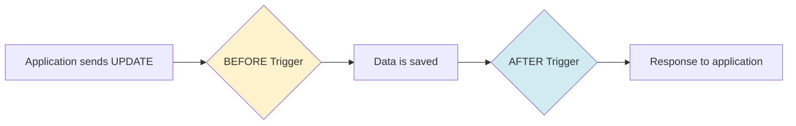

> *Type: Document (specification) · Audience: DBAs, backend devs · Status: Archived — v0 historical generation*

# IDRM Database Triggers & Views

**Complete Guide to Database Automation & Optimized Queries**  
**Version:** 1.0  
**Database:** PostgreSQL 16  
**Last Updated:** December 23, 2024

---

<!-- IDRM-CLEANUP doc=v0-51-triggers status=ANNOTATED pass=2026-08-16 -->
> ## 🗺️ SECTION MAP — where each section is addressed now (annotation pass, 2026-08-16)
>
> Retired v0 DB-automation draft. **Design stance (current):** MVP business logic lives in the **service layer**
> (Python), *not* in DB triggers — triggers are limited to audit, `updated_at` timestamps, and integrity.
> Heavy **materialized views / provider-ranking / scheduled refresh = FFP** (performance + analytics). The novice
> "what is a trigger/view" sections are taught in the guides. *Legend:* ✅ covered · ⚠ superseded/nuanced · ⊘
> dropped (not in MVP). Program: `../../_CLEANUP-LEDGER.md`, `../../../instructions.txt` §12.
>
> | Snippet | Section | → Addressed in (latest) | Phase | Verdict | PICS |
> |---|---|---|---|---|---|
> | `v0-51§1` | §1 Introduction | `docs/mvp/50` | MVP | ⚠ | — |
> | `v0-51§2` | §2 What Are Triggers (novices) | `postgresql-postgis-101`, `database-101` | MVP | ✅ (guides) | — |
> | `v0-51§3` | §3 What Are Views (novices) | `postgresql-postgis-101` | MVP | ✅ (guides) | — |
> | `v0-51§4` | §4 Trigger Strategy | logic in service layer → `docs/mvp/20`/`30` | MVP | ⚠ | `PICS-STK-LOGIC-01` |
> | `v0-51§5` | §5 Complete Trigger Definitions | audit/`updated_at`/integrity → MVP; business-logic triggers superseded | MVP | ⚠ | `PICS-AUD-001`, `PICS-STK-LOGIC-01` |
> | `v0-51§6` | §6 View Strategy | basic reporting → RPT; analytics → FFP | MVP / FFP | ⚠ | `PICS-RPT-*` |
> | `v0-51§7` | §7 Complete View Definitions | basic reporting views → RPT; rest → FFP | MVP / FFP | ⚠ | `PICS-RPT-*` |
> | `v0-51§8` | §8 Materialized Views (metrics, provider-ranking) | performance/analytics → FFP | FFP | ⊘ (MVP) | `PICS-RPT-F01` |
> | `v0-51§9` | §9 Trigger-View Integration | FFP | FFP | ⊘ (MVP) | — |
> | `v0-51§10` | §10 Performance & Monitoring | indexing → `docs/mvp/50`; monitoring → FFP | MVP / FFP | ⚠ | — |
> | `v0-51§11` | §11 Maintenance Guide (cron refresh) | scheduled analytics → FFP | FFP | ⊘ (MVP) | — |
> | `v0-51§12` | §12 Troubleshooting | ops guides (`postgresql-postgis-101`, `linux-101`) | MVP | ✅ | — |
> | `v0-51§S` | Summary | boilerplate | — | ⊘ | — |

## Table of Contents

1. [Introduction](#introduction)
2. [What Are Triggers? (For Novices)](#what-are-triggers)
3. [What Are Views? (For Novices)](#what-are-views)
4. [Trigger Strategy](#trigger-strategy)
5. [Complete Trigger Definitions](#triggers)
6. [View Strategy](#view-strategy)
7. [Complete View Definitions](#views)
8. [Materialized Views](#materialized-views)
9. [Trigger-View Integration](#integration)
10. [Performance & Monitoring](#performance)
11. [Maintenance Guide](#maintenance)
12. [Troubleshooting](#troubleshooting)

---

## 1. Introduction {#introduction}

This document defines **10 database triggers** and **10 views** (8 standard + 2 materialized) that automate operations and optimize queries for the IDRM platform.

### Why This Document Exists

**Problem:** Without triggers and views:
- ❌ Developers must manually update timestamps
- ❌ Audit logging requires code in every endpoint
- ❌ Complex dashboard queries repeated everywhere
- ❌ Business logic scattered across application code
- ❌ Data integrity depends on application-level validation

**Solution:** With triggers and views:
- ✅ Database automatically maintains itself
- ✅ Complete audit trail guaranteed
- ✅ Dashboard queries pre-optimized
- ✅ Business logic enforced at database level
- ✅ Data integrity guaranteed by constraints

### What You'll Learn

By the end of this document, you'll understand:
- What triggers are and when they fire
- How to create PL/pgSQL trigger functions
- What views are and how they simplify queries
- When to use materialized vs standard views
- How to maintain and monitor database objects
- Real-world examples from IDRM

---

## 2. What Are Triggers? (For Novices) {#what-are-triggers}

### Simple Explanation

A **trigger** is automatic code that runs when something happens to a database table.

**Real-world analogy:**
```
Smoke Detector (Trigger)
├── Event: Smoke detected
├── Timing: Immediately when smoke appears
└── Action: Sound alarm automatically
```

**Database analogy:**
```
Audit Log Trigger
├── Event: Row is updated
├── Timing: After update completes
└── Action: Insert audit record automatically
```

### Trigger Components

Every trigger has 4 parts:

**1. Table** - Which table is being watched?
```sql
CREATE TRIGGER trigger_name
    ON service_requests  -- ← The table
```

**2. Event** - What action triggers it?
```sql
    AFTER UPDATE  -- ← The event (INSERT, UPDATE, DELETE)
```

**3. Timing** - Before or after the action?
```sql
    BEFORE UPDATE  -- Runs before data is saved (can modify data)
    AFTER UPDATE   -- Runs after data is saved (for logging)
```

**4. Function** - What code should run?
```sql
    EXECUTE FUNCTION my_trigger_function();  -- ← The PL/pgSQL code
```

### When Triggers Fire



**BEFORE triggers** can:
- Modify the data being saved
- Validate input
- Set computed fields
- Reject invalid data (RAISE EXCEPTION)

**AFTER triggers** can:
- Create audit logs
- Send notifications
- Update related tables
- Cannot modify the data that was just saved

### Trigger Keywords

**OLD** - The row before the change (available in UPDATE/DELETE)
**NEW** - The row after the change (available in INSERT/UPDATE)

```sql
-- In an UPDATE trigger:
OLD.status = 'pending'     -- Before the update
NEW.status = 'completed'   -- After the update

-- You can compare them:
IF OLD.status != NEW.status THEN
    -- Status changed!
END IF;
```

---

## 3. What Are Views? (For Novices) {#what-are-views}

### Simple Explanation

A **view** is a saved SQL query that looks like a table but doesn't store data.

**Real-world analogy:**
```
Desktop Shortcut (View)
├── Looks like: A file
├── Actually is: A link to the real file
└── Benefit: Easy access without duplication
```

**Database analogy:**
```
v_disaster_dashboard (View)
├── Looks like: A table with dashboard data
├── Actually is: A complex JOIN query
└── Benefit: Simple SELECT instead of writing complex query
```

### View Types

**Standard View:**
```sql
CREATE VIEW v_my_view AS
SELECT ... FROM ... WHERE ...;

-- Query runs every time you use it
SELECT * FROM v_my_view;  -- Executes the query now
```

**Materialized View:**
```sql
CREATE MATERIALIZED VIEW mv_my_view AS
SELECT ... FROM ... WHERE ...;

-- Query result is stored (like a cache)
SELECT * FROM mv_my_view;  -- Reads stored result (fast!)

-- Must refresh to get latest data
REFRESH MATERIALIZED VIEW mv_my_view;
```

### When to Use Each

| Scenario | Use Standard View | Use Materialized View |
|----------|-------------------|----------------------|
| Simple query (< 100ms) | ✅ | ❌ |
| Complex query (> 1 second) | ❌ | ✅ |
| Data changes frequently | ✅ | ❌ |
| Data changes rarely | Either | ✅ |
| Need real-time data | ✅ | ❌ |
| Can accept stale data | Either | ✅ |

---

## 4. Trigger Strategy {#trigger-strategy}

### IDRM Trigger Categories

We use triggers for 4 purposes:

**1. Audit & Compliance**
- Track all changes for government reporting
- Log who did what when
- Maintain history for disaster accountability

**2. Automation**
- Update timestamps automatically
- Recalculate ratings when new ratings added
- Send notifications on status changes

**3. Data Integrity**
- Validate coordinates before saving
- Prevent invalid state transitions
- Enforce business rules at database level

**4. Performance**
- Update denormalized fields (cached values)
- Maintain materialized aggregates
- Avoid application-level complexity

### Trigger Performance Considerations

**Cost:** Triggers add milliseconds to write operations

**When it's worth it:**
- ✅ Audit logging (compliance requirement)
- ✅ Timestamp updates (tiny overhead)
- ✅ Critical validations (prevent bad data)

**When to avoid:**
- ❌ Heavy computations (use async jobs instead)
- ❌ External API calls (use application code)
- ❌ Complex business logic (keep in application)

---

## 5. Complete Trigger Definitions {#triggers}

### Trigger 1: Auto-Update Timestamp

**Problem:** Developers forget to update `updated_at` field  
**Solution:** Database updates it automatically on every UPDATE

```sql
-- ============================================================
-- TRIGGER 1: Auto-update updated_at timestamp
-- ============================================================

-- Function (reusable across all tables)
CREATE OR REPLACE FUNCTION update_updated_at_column()
RETURNS TRIGGER AS $$
BEGIN
    -- Simply set updated_at to current time
    NEW.updated_at = CURRENT_TIMESTAMP;
    RETURN NEW;
END;
$$ LANGUAGE plpgsql;

-- Apply to all tables with updated_at field
CREATE TRIGGER trg_users_updated_at
    BEFORE UPDATE ON users
    FOR EACH ROW
    EXECUTE FUNCTION update_updated_at_column();

CREATE TRIGGER trg_organizations_updated_at
    BEFORE UPDATE ON organizations
    FOR EACH ROW
    EXECUTE FUNCTION update_updated_at_column();

CREATE TRIGGER trg_service_requests_updated_at
    BEFORE UPDATE ON service_requests
    FOR EACH ROW
    EXECUTE FUNCTION update_updated_at_column();

CREATE TRIGGER trg_disaster_events_updated_at
    BEFORE UPDATE ON disaster_events
    FOR EACH ROW
    EXECUTE FUNCTION update_updated_at_column();

CREATE TRIGGER trg_fund_allocations_updated_at
    BEFORE UPDATE ON fund_allocations
    FOR EACH ROW
    EXECUTE FUNCTION update_updated_at_column();

-- Apply to remaining tables: notifications, organizations_capacity, etc.
```

**How it works:**
```sql
-- Before trigger:
UPDATE users SET name = 'John Smith' WHERE id = 'user-uuid';
-- Developer doesn't touch updated_at

-- Trigger automatically sets:
NEW.updated_at = CURRENT_TIMESTAMP;

-- Final saved data has updated_at = now!
```

**Benefits:**
- ✅ Never forget to update timestamp
- ✅ Consistent across all tables
- ✅ No code needed in 105 API endpoints
- ✅ Zero performance impact (< 1ms)

---

### Trigger 2: Complete Audit Trail

**Problem:** Need to log every change for compliance  
**Solution:** Automatically log INSERT/UPDATE/DELETE to audit_logs

```sql
-- ============================================================
-- TRIGGER 2: Audit log all changes
-- ============================================================

-- Function
CREATE OR REPLACE FUNCTION audit_log_changes()
RETURNS TRIGGER AS $$
DECLARE
    v_old_values JSONB;
    v_new_values JSONB;
    v_action VARCHAR(10);
    v_user_id UUID;
BEGIN
    -- Determine the action type
    IF (TG_OP = 'DELETE') THEN
        v_action := 'DELETE';
        v_old_values := to_jsonb(OLD);
        v_new_values := NULL;
        -- Get user from OLD record
        v_user_id := CASE 
            WHEN OLD.created_by IS NOT NULL THEN OLD.created_by
            WHEN OLD.updated_by IS NOT NULL THEN OLD.updated_by
            ELSE NULL
        END;
        
    ELSIF (TG_OP = 'UPDATE') THEN
        v_action := 'UPDATE';
        v_old_values := to_jsonb(OLD);
        v_new_values := to_jsonb(NEW);
        v_user_id := NEW.updated_by;
        
    ELSIF (TG_OP = 'INSERT') THEN
        v_action := 'INSERT';
        v_old_values := NULL;
        v_new_values := to_jsonb(NEW);
        v_user_id := NEW.created_by;
    END IF;

    -- Don't audit the audit_logs table itself (prevent infinite loop)
    IF TG_TABLE_NAME != 'audit_logs' THEN
        INSERT INTO audit_logs (
            user_id,
            action,
            entity_type,
            entity_id,
            old_values,
            new_values,
            ip_address,
            user_agent,
            created_at
        ) VALUES (
            v_user_id,
            v_action,
            TG_TABLE_NAME,  -- Table name (e.g., 'service_requests')
            CASE 
                WHEN TG_OP = 'DELETE' THEN OLD.id
                ELSE NEW.id
            END,
            v_old_values,
            v_new_values,
            inet_client_addr(),  -- IP address of database connection
            current_setting('application_name', true),  -- App identifier
            CURRENT_TIMESTAMP
        );
    END IF;

    -- Return appropriate row
    IF TG_OP = 'DELETE' THEN
        RETURN OLD;
    ELSE
        RETURN NEW;
    END IF;
END;
$$ LANGUAGE plpgsql;

-- Apply to critical tables
CREATE TRIGGER trg_audit_users
    AFTER INSERT OR UPDATE OR DELETE ON users
    FOR EACH ROW
    EXECUTE FUNCTION audit_log_changes();

CREATE TRIGGER trg_audit_service_requests
    AFTER INSERT OR UPDATE OR DELETE ON service_requests
    FOR EACH ROW
    EXECUTE FUNCTION audit_log_changes();

CREATE TRIGGER trg_audit_organizations
    AFTER INSERT OR UPDATE OR DELETE ON organizations
    FOR EACH ROW
    EXECUTE FUNCTION audit_log_changes();

CREATE TRIGGER trg_audit_disaster_events
    AFTER INSERT OR UPDATE OR DELETE ON disaster_events
    FOR EACH ROW
    EXECUTE FUNCTION audit_log_changes();

CREATE TRIGGER trg_audit_financial_transactions
    AFTER INSERT OR UPDATE OR DELETE ON financial_transactions
    FOR EACH ROW
    EXECUTE FUNCTION audit_log_changes();

CREATE TRIGGER trg_audit_fund_allocations
    AFTER INSERT OR UPDATE OR DELETE ON fund_allocations
    FOR EACH ROW
    EXECUTE FUNCTION audit_log_changes();

-- Apply to other sensitive tables as needed
```

**What gets logged:**
```json
{
  "user_id": "uuid-of-user-who-made-change",
  "action": "UPDATE",
  "entity_type": "service_requests",
  "entity_id": "request-uuid",
  "old_values": {"status": "pending", "assigned_to": null},
  "new_values": {"status": "assigned", "assigned_to": "org-uuid"},
  "ip_address": "192.168.1.100",
  "created_at": "2024-12-23T10:30:00Z"
}
```

**Benefits:**
- ✅ Complete compliance (every change tracked)
- ✅ Who, what, when, from where (full audit)
- ✅ Before/after values for investigations
- ✅ Cannot be bypassed (database-level)

---

### Trigger 3: Service Request Status History

**Problem:** Need to track every status change with timestamp  
**Solution:** Auto-create history record + notify citizen

```sql
-- ============================================================
-- TRIGGER 3: Service request status change history
-- ============================================================

-- Function
CREATE OR REPLACE FUNCTION create_service_request_history()
RETURNS TRIGGER AS $$
BEGIN
    -- Only act if status actually changed
    IF OLD.status IS DISTINCT FROM NEW.status THEN
        
        -- 1. Create history record
        INSERT INTO service_request_history (
            service_request_id,
            old_status,
            new_status,
            changed_by,
            change_notes,
            changed_at
        ) VALUES (
            NEW.id,
            OLD.status,
            NEW.status,
            NEW.updated_by,  -- Assuming this field exists
            'Status automatically updated',
            CURRENT_TIMESTAMP
        );

        -- 2. Create notification for citizen
        INSERT INTO notifications (
            user_id,
            type,
            priority,
            title,
            message,
            channels,
            metadata,
            created_at
        ) VALUES (
            NEW.created_by,  -- Notify the requester
            'status_update',
            CASE 
                WHEN NEW.status = 'completed' THEN 'high'
                WHEN NEW.status = 'assigned' THEN 'normal'
                WHEN NEW.status = 'cancelled' THEN 'high'
                ELSE 'low'
            END,
            'Service Request Status Updated',
            format('Your request "%s" status changed from %s to %s', 
                   NEW.title, OLD.status, NEW.status),
            ARRAY['in_app', 'email']::TEXT[],
            jsonb_build_object(
                'service_request_id', NEW.id,
                'old_status', OLD.status,
                'new_status', NEW.status,
                'action_url', '/requests/' || NEW.id::TEXT
            ),
            CURRENT_TIMESTAMP
        );

        -- 3. If completed, also notify provider for rating
        IF NEW.status = 'completed' AND NEW.assigned_to IS NOT NULL THEN
            INSERT INTO notifications (
                user_id,
                type,
                priority,
                title,
                message,
                channels,
                metadata,
                created_at
            ) SELECT 
                org.owner_user_id,
                'service_completed',
                'normal',
                'Service Completed Successfully',
                format('Service request "%s" has been marked as completed', NEW.title),
                ARRAY['in_app']::TEXT[],
                jsonb_build_object(
                    'service_request_id', NEW.id,
                    'rating_requested', true
                ),
                CURRENT_TIMESTAMP
            FROM organizations org
            WHERE org.id = NEW.assigned_to;
        END IF;
    END IF;

    RETURN NEW;
END;
$$ LANGUAGE plpgsql;

-- Trigger
CREATE TRIGGER trg_service_request_status_history
    AFTER UPDATE ON service_requests
    FOR EACH ROW
    EXECUTE FUNCTION create_service_request_history();
```

**What happens automatically:**
```
Coordinator updates: status = 'assigned'
                     ↓
Trigger fires → 3 things happen:
1. History record created in service_request_history
2. Notification sent to citizen (in-app + email)
3. If completed, notification sent to provider too
```

**Benefits:**
- ✅ Complete status trail (when, who, what changed)
- ✅ Automatic notifications (no code in API)
- ✅ Can reconstruct entire request timeline
- ✅ Audit-ready for disaster reports

---

### Trigger 4: Auto-Update Provider Rating

**Problem:** Provider rating should reflect latest citizen feedback  
**Solution:** Recalculate average rating when new rating added

```sql
-- ============================================================
-- TRIGGER 4: Update organization average rating
-- ============================================================

-- Function
CREATE OR REPLACE FUNCTION update_organization_rating()
RETURNS TRIGGER AS $$
DECLARE
    v_avg_rating NUMERIC(3,2);
    v_total_ratings INTEGER;
    v_org_id UUID;
BEGIN
    -- Get organization ID from the service request
    SELECT assigned_to INTO v_org_id
    FROM service_requests
    WHERE id = NEW.service_request_id;

    -- Only proceed if request was assigned to an organization
    IF v_org_id IS NOT NULL THEN
        
        -- Calculate new average rating for this organization
        SELECT 
            AVG(sr.rating)::NUMERIC(3,2),
            COUNT(*)
        INTO v_avg_rating, v_total_ratings
        FROM service_ratings sr
        INNER JOIN service_requests req ON req.id = sr.service_request_id
        WHERE req.assigned_to = v_org_id;

        -- Update the organization's rating
        UPDATE organizations
        SET 
            rating = v_avg_rating,
            total_requests_completed = v_total_ratings,
            updated_at = CURRENT_TIMESTAMP
        WHERE id = v_org_id;

        -- Log the rating update
        RAISE NOTICE 'Organization % rating updated to % based on % ratings',
                     v_org_id, v_avg_rating, v_total_ratings;
    END IF;

    RETURN NEW;
END;
$$ LANGUAGE plpgsql;

-- Trigger
CREATE TRIGGER trg_update_organization_rating
    AFTER INSERT OR UPDATE ON service_ratings
    FOR EACH ROW
    EXECUTE FUNCTION update_organization_rating();
```

**Example flow:**
```
1. Citizen rates service: 4 stars
2. Trigger calculates: AVG(4, 5, 3, 4, 5) = 4.2
3. Organization.rating = 4.2 automatically
4. Provider leaderboard updates immediately
```

**Benefits:**
- ✅ Always accurate ratings (no stale data)
- ✅ Real-time leaderboard updates
- ✅ No cron jobs needed
- ✅ One source of truth

---

### Trigger 5: Update Fund Allocation Spent Amount

**Problem:** Budget tracking must reflect actual expenditures  
**Solution:** Update spent_amount when financial transaction completes

```sql
-- ============================================================
-- TRIGGER 5: Update fund allocation spent amount
-- ============================================================

-- Function
CREATE OR REPLACE FUNCTION update_fund_allocation_spent()
RETURNS TRIGGER AS $$
DECLARE
    v_allocation_id UUID;
    v_current_spent NUMERIC(12,2);
    v_budget_total NUMERIC(12,2);
BEGIN
    -- Only process completed expenditure transactions
    IF NEW.transaction_type = 'expenditure' AND NEW.status = 'completed' THEN
        
        -- Get allocation_id from transaction metadata
        v_allocation_id := (NEW.metadata->>'allocation_id')::UUID;
        
        IF v_allocation_id IS NOT NULL THEN
            -- Update the spent amount
            UPDATE fund_allocations
            SET 
                spent_amount = spent_amount + NEW.amount,
                updated_at = CURRENT_TIMESTAMP
            WHERE id = v_allocation_id
            RETURNING spent_amount, amount INTO v_current_spent, v_budget_total;

            -- Check if budget exceeded (warning, not error)
            IF v_current_spent > v_budget_total THEN
                RAISE WARNING 'Fund allocation % has exceeded budget! Spent: %, Budget: %',
                             v_allocation_id, v_current_spent, v_budget_total;
                
                -- Create notification for coordinators
                INSERT INTO notifications (
                    user_id,
                    type,
                    priority,
                    title,
                    message,
                    channels,
                    created_at
                ) SELECT 
                    u.id,
                    'budget_exceeded',
                    'urgent',
                    'Budget Allocation Exceeded',
                    format('Fund allocation has exceeded budget: Spent %.2f / Budget %.2f',
                           v_current_spent, v_budget_total),
                    ARRAY['in_app', 'email']::TEXT[],
                    CURRENT_TIMESTAMP
                FROM users u
                WHERE u.role = 'coordinator' OR u.role = 'admin';
            END IF;
        END IF;
    END IF;

    RETURN NEW;
END;
$$ LANGUAGE plpgsql;

-- Trigger
CREATE TRIGGER trg_update_fund_allocation
    AFTER INSERT OR UPDATE ON financial_transactions
    FOR EACH ROW
    EXECUTE FUNCTION update_fund_allocation_spent();
```

**Benefits:**
- ✅ Real-time budget tracking
- ✅ Automatic overspend warnings
- ✅ Financial transparency guaranteed
- ✅ Coordinators alerted immediately

---

### Trigger 6: Validate Geographic Coordinates

**Problem:** Invalid lat/lng can break map functionality  
**Solution:** Reject invalid coordinates before saving

```sql
-- ============================================================
-- TRIGGER 6: Validate geographic coordinates
-- ============================================================

-- Function
CREATE OR REPLACE FUNCTION validate_coordinates()
RETURNS TRIGGER AS $$
DECLARE
    v_latitude NUMERIC;
    v_longitude NUMERIC;
BEGIN
    -- Extract lat/lng from PostGIS Point geometry
    -- Works for service_requests.location and organizations.service_area_center
    
    v_latitude := ST_Y(NEW.location);   -- For service_requests
    v_longitude := ST_X(NEW.location);
    
    -- Validate latitude (-90 to +90)
    IF v_latitude < -90 OR v_latitude > 90 THEN
        RAISE EXCEPTION 'Invalid latitude: %. Must be between -90 and 90', v_latitude;
    END IF;
    
    -- Validate longitude (-180 to +180)
    IF v_longitude < -180 OR v_longitude > 180 THEN
        RAISE EXCEPTION 'Invalid longitude: %. Must be between -180 and 180', v_longitude;
    END IF;
    
    -- Additional validation: India bounding box (optional)
    -- India: Lat 8°N to 37°N, Lng 68°E to 97°E
    IF v_latitude < 6 OR v_latitude > 40 THEN
        RAISE WARNING 'Latitude % is outside India. Verify if correct.', v_latitude;
    END IF;
    
    IF v_longitude < 65 OR v_longitude > 100 THEN
        RAISE WARNING 'Longitude % is outside India. Verify if correct.', v_longitude;
    END IF;

    RETURN NEW;
END;
$$ LANGUAGE plpgsql;

-- Apply to tables with location data
CREATE TRIGGER trg_validate_service_request_location
    BEFORE INSERT OR UPDATE ON service_requests
    FOR EACH ROW
    EXECUTE FUNCTION validate_coordinates();

-- For organizations, validate service_area_center
CREATE OR REPLACE FUNCTION validate_org_coordinates()
RETURNS TRIGGER AS $$
DECLARE
    v_latitude NUMERIC;
    v_longitude NUMERIC;
BEGIN
    v_latitude := ST_Y(NEW.service_area_center);
    v_longitude := ST_X(NEW.service_area_center);
    
    IF v_latitude < -90 OR v_latitude > 90 THEN
        RAISE EXCEPTION 'Invalid latitude: %. Must be between -90 and 90', v_latitude;
    END IF;
    
    IF v_longitude < -180 OR v_longitude > 180 THEN
        RAISE EXCEPTION 'Invalid longitude: %. Must be between -180 and 180', v_longitude;
    END IF;

    RETURN NEW;
END;
$$ LANGUAGE plpgsql;

CREATE TRIGGER trg_validate_organization_location
    BEFORE INSERT OR UPDATE ON organizations
    FOR EACH ROW
    EXECUTE FUNCTION validate_org_coordinates();
```

**Example rejection:**
```sql
-- This will be rejected:
INSERT INTO service_requests (location, ...)
VALUES (ST_MakePoint(200, 45), ...);
-- ERROR: Invalid longitude: 200. Must be between -180 and 180

-- This will work:
INSERT INTO service_requests (location, ...)
VALUES (ST_MakePoint(77.5946, 12.9716), ...);  -- Bangalore coordinates
```

**Benefits:**
- ✅ Invalid data rejected immediately
- ✅ Maps always work correctly
- ✅ Prevents silent failures
- ✅ Database-level validation (can't bypass)

---

### Trigger 7: Soft Delete Cascade

**Problem:** When disaster is deleted, related requests should also be deleted  
**Solution:** Cascade soft delete to maintain referential integrity

```sql
-- ============================================================
-- TRIGGER 7: Cascade soft deletes
-- ============================================================

-- Function
CREATE OR REPLACE FUNCTION soft_delete_cascade()
RETURNS TRIGGER AS $$
BEGIN
    -- If disaster_event is being soft deleted
    IF NEW.deleted_at IS NOT NULL AND OLD.deleted_at IS NULL THEN
        
        -- Soft delete all related service requests
        UPDATE service_requests
        SET 
            deleted_at = CURRENT_TIMESTAMP,
            updated_at = CURRENT_TIMESTAMP
        WHERE disaster_event_id = NEW.id
          AND deleted_at IS NULL;  -- Only delete active requests

        -- Log how many requests were soft deleted
        RAISE NOTICE 'Soft deleted service requests for disaster %', NEW.id;
        
    -- If disaster is being un-deleted (restored)
    ELSIF NEW.deleted_at IS NULL AND OLD.deleted_at IS NOT NULL THEN
        
        -- Restore related service requests
        UPDATE service_requests
        SET 
            deleted_at = NULL,
            updated_at = CURRENT_TIMESTAMP
        WHERE disaster_event_id = NEW.id
          AND deleted_at IS NOT NULL;

        RAISE NOTICE 'Restored service requests for disaster %', NEW.id;
    END IF;

    RETURN NEW;
END;
$$ LANGUAGE plpgsql;

-- Trigger
CREATE TRIGGER trg_soft_delete_disaster_cascade
    AFTER UPDATE ON disaster_events
    FOR EACH ROW
    EXECUTE FUNCTION soft_delete_cascade();
```

**Benefits:**
- ✅ Soft delete pattern works correctly
- ✅ No orphaned requests
- ✅ Can restore deleted disasters
- ✅ Maintains data relationships

---

### Trigger 8: Account Security - Failed Login Lock

**Problem:** Brute force attacks try many passwords  
**Solution:** Lock account after 5 failed attempts

```sql
-- ============================================================
-- TRIGGER 8: Lock account after failed login attempts
-- ============================================================

-- Function
CREATE OR REPLACE FUNCTION handle_failed_login_attempts()
RETURNS TRIGGER AS $$
BEGIN
    -- Check if failed_login_attempts reached threshold
    IF NEW.failed_login_attempts >= 5 AND OLD.failed_login_attempts < 5 THEN
        
        -- Lock account for 30 minutes
        NEW.locked_until := CURRENT_TIMESTAMP + INTERVAL '30 minutes';
        
        -- Create security notification
        INSERT INTO notifications (
            user_id,
            type,
            priority,
            title,
            message,
            channels,
            created_at
        ) VALUES (
            NEW.id,
            'security_alert',
            'urgent',
            'Account Temporarily Locked',
            'Your account has been locked for 30 minutes due to multiple failed login attempts. If this wasn''t you, please reset your password immediately.',
            ARRAY['email', 'sms', 'in_app']::TEXT[],
            CURRENT_TIMESTAMP
        );

        RAISE WARNING 'User % locked due to failed login attempts', NEW.email;
        
    -- If account lock expired, reset counter
    ELSIF NEW.locked_until < CURRENT_TIMESTAMP AND OLD.locked_until >= CURRENT_TIMESTAMP THEN
        NEW.failed_login_attempts := 0;
        RAISE NOTICE 'User % account lock expired, counter reset', NEW.email;
    END IF;

    RETURN NEW;
END;
$$ LANGUAGE plpgsql;

-- Trigger
CREATE TRIGGER trg_handle_failed_logins
    BEFORE UPDATE ON users
    FOR EACH ROW
    EXECUTE FUNCTION handle_failed_login_attempts();
```

**Login flow with trigger:**
```
1. User tries password: WRONG
   → failed_login_attempts = 1

2. User tries password: WRONG
   → failed_login_attempts = 2

... (3 more wrong attempts)

5. User tries password: WRONG
   → failed_login_attempts = 5
   → TRIGGER FIRES:
      - locked_until = now() + 30 minutes
      - Email + SMS sent: "Account locked"

6. After 30 minutes:
   → locked_until expires
   → failed_login_attempts reset to 0
```

**Benefits:**
- ✅ Brute force protection
- ✅ User notified immediately
- ✅ Automatic unlock after timeout
- ✅ Security without application code

---

### Trigger 9: Update Organization Capacity

**Problem:** When provider accepts request, capacity should decrease  
**Solution:** Auto-decrement available_capacity

```sql
-- ============================================================
-- TRIGGER 9: Update organization available capacity
-- ============================================================

-- Function
CREATE OR REPLACE FUNCTION update_organization_capacity()
RETURNS TRIGGER AS $$
DECLARE
    v_current_capacity INTEGER;
BEGIN
    -- When a service request is assigned (new assignment record)
    IF TG_OP = 'INSERT' THEN
        -- Decrease available capacity
        UPDATE organizations
        SET 
            available_capacity = GREATEST(available_capacity - 1, 0),
            updated_at = CURRENT_TIMESTAMP
        WHERE id = NEW.organization_id
        RETURNING available_capacity INTO v_current_capacity;

        -- Warn if capacity is low
        IF v_current_capacity = 0 THEN
            RAISE WARNING 'Organization % is at full capacity', NEW.organization_id;
            
            -- Optionally set organization as unavailable
            UPDATE organizations
            SET is_available = false
            WHERE id = NEW.organization_id
              AND available_capacity = 0;
        END IF;
        
    -- When assignment is removed (service completed or cancelled)
    ELSIF TG_OP = 'DELETE' THEN
        -- Increase available capacity
        UPDATE organizations
        SET 
            available_capacity = LEAST(available_capacity + 1, capacity),
            is_available = true,  -- Make available again
            updated_at = CURRENT_TIMESTAMP
        WHERE id = OLD.organization_id;
    END IF;

    IF TG_OP = 'DELETE' THEN
        RETURN OLD;
    ELSE
        RETURN NEW;
    END IF;
END;
$$ LANGUAGE plpgsql;

-- Trigger on assignments table
CREATE TRIGGER trg_update_capacity_on_assignment
    AFTER INSERT OR DELETE ON service_request_assignments
    FOR EACH ROW
    EXECUTE FUNCTION update_organization_capacity();
```

**Capacity tracking flow:**
```
Organization capacity: 10
Available: 10

1. Provider accepts request
   → INSERT into service_request_assignments
   → Trigger: available_capacity = 9

2. Provider accepts another
   → available_capacity = 8

... continues

10. Provider accepts 10th request
    → available_capacity = 0
    → Trigger sets is_available = false
    → Provider hidden from matching

11. Provider completes request
    → DELETE from service_request_assignments
    → available_capacity = 1
    → is_available = true
    → Provider visible again
```

**Benefits:**
- ✅ Real-time capacity tracking
- ✅ Prevents over-assignment
- ✅ Auto-hide when full
- ✅ Auto-show when capacity frees

---

### Trigger 10: Create Notification on Events

**Problem:** Users need to know when important events happen  
**Solution:** Auto-create notifications for key actions

```sql
-- ============================================================
-- TRIGGER 10: Auto-create notifications
-- ============================================================

-- Function for disaster alerts
CREATE OR REPLACE FUNCTION create_disaster_alert_notifications()
RETURNS TRIGGER AS $$
BEGIN
    -- When new disaster is declared
    IF TG_OP = 'INSERT' THEN
        -- Notify all coordinators and admins
        INSERT INTO notifications (
            user_id,
            type,
            priority,
            title,
            message,
            channels,
            metadata,
            created_at
        ) SELECT 
            u.id,
            'disaster_alert',
            CASE NEW.severity
                WHEN 'extreme' THEN 'urgent'
                WHEN 'high' THEN 'high'
                ELSE 'normal'
            END,
            'New Disaster Declared: ' || NEW.name,
            format('A %s %s disaster has been declared in %s. Severity: %s',
                   NEW.severity, NEW.type, NEW.name, NEW.severity),
            ARRAY['in_app', 'email', 'sms']::TEXT[],
            jsonb_build_object(
                'disaster_id', NEW.id,
                'disaster_type', NEW.type,
                'severity', NEW.severity,
                'action_url', '/disasters/' || NEW.id::TEXT
            ),
            CURRENT_TIMESTAMP
        FROM users u
        WHERE u.role IN ('coordinator', 'admin')
          AND u.status = 'active'
          AND u.deleted_at IS NULL;

        -- Notify providers in affected area
        INSERT INTO notifications (
            user_id,
            type,
            priority,
            title,
            message,
            channels,
            metadata,
            created_at
        ) SELECT DISTINCT
            org.owner_user_id,
            'disaster_alert',
            'high',
            'Disaster in Your Service Area',
            format('A %s disaster has been declared in your service area: %s',
                   NEW.type, NEW.name),
            ARRAY['in_app', 'email']::TEXT[],
            jsonb_build_object(
                'disaster_id', NEW.id,
                'action_url', '/disasters/' || NEW.id::TEXT
            ),
            CURRENT_TIMESTAMP
        FROM organizations org
        WHERE ST_Intersects(
            ST_Buffer(org.service_area_center::geography, org.service_radius_km * 1000)::geometry,
            NEW.affected_area
        )
        AND org.is_verified = true
        AND org.deleted_at IS NULL;

    -- When disaster severity is upgraded
    ELSIF TG_OP = 'UPDATE' AND NEW.severity != OLD.severity THEN
        INSERT INTO notifications (
            user_id,
            type,
            priority,
            title,
            message,
            channels,
            created_at
        ) SELECT 
            u.id,
            'disaster_update',
            'urgent',
            'Disaster Severity Changed: ' || NEW.name,
            format('Disaster severity changed from %s to %s',
                   OLD.severity, NEW.severity),
            ARRAY['in_app', 'sms']::TEXT[],
            CURRENT_TIMESTAMP
        FROM users u
        WHERE u.role IN ('coordinator', 'admin')
          AND u.status = 'active';
    END IF;

    RETURN NEW;
END;
$$ LANGUAGE plpgsql;

-- Trigger
CREATE TRIGGER trg_disaster_notifications
    AFTER INSERT OR UPDATE ON disaster_events
    FOR EACH ROW
    EXECUTE FUNCTION create_disaster_alert_notifications();
```

**Auto-notification scenarios:**

**1. Disaster declared:**
```
Coordinator creates disaster
    ↓
Trigger sends notifications to:
- All coordinators + admins (prepare for coordination)
- Providers in affected area (prepare resources)
```

**2. Severity upgraded:**
```
Coordinator changes severity: medium → extreme
    ↓
Trigger sends urgent SMS to all coordinators
```

**3. Service request assigned:**
```
(Already covered in Trigger 3)
```

**Benefits:**
- ✅ Instant alerts on critical events
- ✅ Geospatial targeting (providers in area)
- ✅ Priority-based (urgent for severe disasters)
- ✅ Multi-channel (in-app + email + SMS)

---

## 6. View Strategy {#view-strategy}

### When to Create a View

**Create a view when:**
- ✅ The same JOIN appears in 3+ places
- ✅ Query is complex (5+ tables, CTEs, subqueries)
- ✅ Security (hide sensitive columns)
- ✅ Simplify for reports/dashboards

**Don't create a view when:**
- ❌ Query is simple (single table)
- ❌ Used only once
- ❌ Performance is better without it

### View Naming Convention

```
Standard views:    v_<purpose>
Materialized:      mv_<purpose>

Examples:
v_disaster_dashboard           -- Real-time dashboard
v_provider_performance         -- Real-time rankings
mv_daily_metrics              -- Cached daily stats
mv_provider_ranking           -- Cached leaderboard
```

---

## 7. Complete View Definitions {#views}

### View 1: Service Request Summary by Disaster

**Purpose:** Dashboard showing request counts and completion rates

```sql
-- ============================================================
-- VIEW 1: Service request summary per disaster
-- ============================================================

CREATE OR REPLACE VIEW v_service_request_summary AS
SELECT 
    de.id as disaster_id,
    de.name as disaster_name,
    de.type as disaster_type,
    de.severity,
    de.status as disaster_status,
    
    -- Request counts by status
    COUNT(sr.id) as total_requests,
    COUNT(CASE WHEN sr.status = 'pending' THEN 1 END) as pending_requests,
    COUNT(CASE WHEN sr.status = 'assigned' THEN 1 END) as assigned_requests,
    COUNT(CASE WHEN sr.status = 'in_progress' THEN 1 END) as in_progress_requests,
    COUNT(CASE WHEN sr.status = 'completed' THEN 1 END) as completed_requests,
    COUNT(CASE WHEN sr.status = 'cancelled' THEN 1 END) as cancelled_requests,
    
    -- Metrics
    ROUND(
        COUNT(CASE WHEN sr.status = 'completed' THEN 1 END)::NUMERIC / 
        NULLIF(COUNT(sr.id), 0) * 100, 
        2
    ) as completion_rate_pct,
    
    SUM(sr.beneficiaries) as total_beneficiaries_helped,
    
    -- Average response time (completed requests only)
    AVG(
        EXTRACT(EPOCH FROM sr.actual_response_time) / 60
    )::INTEGER as avg_response_minutes
    
FROM disaster_events de
LEFT JOIN service_requests sr ON sr.disaster_event_id = de.id 
    AND sr.deleted_at IS NULL
WHERE de.deleted_at IS NULL
GROUP BY de.id, de.name, de.type, de.severity, de.status;

-- Grant permissions
GRANT SELECT ON v_service_request_summary TO idrm_readonly;

-- Usage examples
-- Get summary for specific disaster:
SELECT * FROM v_service_request_summary 
WHERE disaster_id = 'uuid...';

-- Get active disasters with low completion rates:
SELECT disaster_name, completion_rate_pct, pending_requests
FROM v_service_request_summary
WHERE disaster_status = 'active'
  AND completion_rate_pct < 50
ORDER BY pending_requests DESC;
```

**Sample output:**
```
disaster_id  | disaster_name      | total | pending | completed | rate  | beneficiaries
─────────────┼────────────────────┼───────┼─────────┼───────────┼───────┼──────────────
uuid-123     | Mumbai Floods 2024 | 1,247 | 89      | 1,089     | 87.3% | 4,356
uuid-456     | Delhi Heat Wave    | 543   | 203     | 312       | 57.5% | 1,234
```

---

### View 2: Real-Time Disaster Dashboard

**Purpose:** Complete disaster overview for coordinator dashboard

```sql
-- ============================================================
-- VIEW 2: Disaster dashboard with all metrics
-- ============================================================

CREATE OR REPLACE VIEW v_disaster_dashboard AS
SELECT 
    de.id,
    de.name,
    de.type,
    de.severity,
    de.status,
    de.start_date,
    de.estimated_affected_population,
    ST_AsGeoJSON(de.affected_area) as affected_area_geojson,
    
    -- Service request metrics
    COUNT(DISTINCT sr.id) as service_requests_count,
    COUNT(DISTINCT CASE WHEN sr.status = 'pending' THEN sr.id END) as pending_count,
    COUNT(DISTINCT CASE WHEN sr.status = 'completed' THEN sr.id END) as completed_count,
    
    -- Provider metrics
    COUNT(DISTINCT org.id) as active_providers_count,
    
    -- Financial metrics
    SUM(CASE 
        WHEN ft.transaction_type = 'donation' AND ft.status = 'completed' 
        THEN ft.amount ELSE 0 
    END) as total_donations,
    SUM(CASE 
        WHEN ft.transaction_type = 'expenditure' AND ft.status = 'completed' 
        THEN ft.amount ELSE 0 
    END) as total_spent,
    SUM(CASE 
        WHEN ft.transaction_type = 'donation' AND ft.status = 'completed' 
        THEN ft.amount ELSE 0 
    END) - SUM(CASE 
        WHEN ft.transaction_type = 'expenditure' AND ft.status = 'completed' 
        THEN ft.amount ELSE 0 
    END) as funds_available,
    
    -- Most requested categories
    (
        SELECT ARRAY_AGG(DISTINCT sr2.category)
        FROM service_requests sr2
        WHERE sr2.disaster_event_id = de.id
          AND sr2.deleted_at IS NULL
        LIMIT 5
    ) as top_categories,
    
    -- Time metrics
    EXTRACT(EPOCH FROM (CURRENT_TIMESTAMP - de.start_date)) / 3600 as hours_since_start
    
FROM disaster_events de
LEFT JOIN service_requests sr ON sr.disaster_event_id = de.id AND sr.deleted_at IS NULL
LEFT JOIN organizations org ON org.id = sr.assigned_to AND org.deleted_at IS NULL
LEFT JOIN financial_transactions ft ON ft.disaster_event_id = de.id
WHERE de.status = 'active'
  AND de.deleted_at IS NULL
GROUP BY de.id;

-- Usage
SELECT 
    name,
    service_requests_count,
    pending_count,
    active_providers_count,
    total_donations,
    funds_available
FROM v_disaster_dashboard
ORDER BY start_date DESC;
```

---

### View 3: Provider Performance Rankings

**Purpose:** Provider leaderboard with metrics

```sql
-- ============================================================
-- VIEW 3: Provider performance metrics
-- ============================================================

CREATE OR REPLACE VIEW v_provider_performance AS
SELECT 
    o.id,
    o.name,
    o.type,
    o.rating as current_rating,
    o.total_requests_completed as lifetime_completed,
    
    -- Recent activity (last 30 days)
    COUNT(DISTINCT sr.id) as requests_last_30_days,
    COUNT(DISTINCT CASE 
        WHEN sr.status = 'completed' THEN sr.id 
    END) as completed_last_30_days,
    
    -- Performance metrics
    ROUND(
        COUNT(CASE WHEN sr.status = 'completed' THEN 1 END)::NUMERIC /
        NULLIF(COUNT(sr.id), 0) * 100,
        2
    ) as completion_rate_pct,
    
    AVG(EXTRACT(EPOCH FROM sr.actual_response_time) / 60)::INTEGER as avg_response_minutes,
    
    -- Rating metrics
    COUNT(DISTINCT rat.id) as total_ratings,
    AVG(rat.rating)::NUMERIC(3,2) as avg_citizen_rating,
    
    -- Service categories
    ARRAY_AGG(DISTINCT UNNEST(o.service_categories)) as services_offered,
    
    -- Availability
    o.is_available,
    o.available_capacity,
    o.capacity,
    ROUND(o.available_capacity::NUMERIC / NULLIF(o.capacity, 0) * 100, 0) as capacity_available_pct,
    
    -- Location
    ST_Y(o.service_area_center) as latitude,
    ST_X(o.service_area_center) as longitude,
    o.service_radius_km
    
FROM organizations o
LEFT JOIN service_requests sr ON sr.assigned_to = o.id 
    AND sr.created_at >= CURRENT_DATE - INTERVAL '30 days'
    AND sr.deleted_at IS NULL
LEFT JOIN service_ratings rat ON rat.service_request_id = sr.id
WHERE o.is_verified = true
  AND o.deleted_at IS NULL
GROUP BY o.id
ORDER BY o.rating DESC NULLS LAST, completed_last_30_days DESC;

-- Usage
-- Top 10 providers:
SELECT name, current_rating, completion_rate_pct, avg_response_minutes
FROM v_provider_performance
LIMIT 10;

-- Providers with availability:
SELECT name, services_offered, available_capacity, capacity
FROM v_provider_performance
WHERE is_available = true
  AND available_capacity > 0;
```

---

### View 4: Financial Summary per Disaster

**Purpose:** Complete financial transparency

```sql
-- ============================================================
-- VIEW 4: Financial summary per disaster
-- ============================================================

CREATE OR REPLACE VIEW v_financial_summary AS
SELECT 
    de.id as disaster_id,
    de.name as disaster_name,
    de.status as disaster_status,
    
    -- Donation metrics
    COUNT(DISTINCT CASE 
        WHEN ft.transaction_type = 'donation' 
        THEN ft.id 
    END) as donation_count,
    SUM(CASE 
        WHEN ft.transaction_type = 'donation' AND ft.status = 'completed'
        THEN ft.amount ELSE 0 
    END) as total_donations,
    AVG(CASE 
        WHEN ft.transaction_type = 'donation' AND ft.status = 'completed'
        THEN ft.amount 
    END)::NUMERIC(12,2) as avg_donation_amount,
    
    -- Expenditure metrics
    COUNT(DISTINCT CASE 
        WHEN ft.transaction_type = 'expenditure' 
        THEN ft.id 
    END) as expenditure_count,
    SUM(CASE 
        WHEN ft.transaction_type = 'expenditure' AND ft.status = 'completed'
        THEN ft.amount ELSE 0 
    END) as total_expenditure,
    
    -- Budget allocation metrics
    SUM(fa.amount) as budget_allocated,
    SUM(fa.spent_amount) as budget_spent,
    SUM(fa.amount - fa.spent_amount) as budget_remaining,
    
    -- Utilization
    ROUND(
        SUM(fa.spent_amount)::NUMERIC / NULLIF(SUM(fa.amount), 0) * 100,
        2
    ) as budget_utilization_pct,
    
    -- Funds available (donations - expenditures)
    SUM(CASE 
        WHEN ft.transaction_type = 'donation' AND ft.status = 'completed'
        THEN ft.amount ELSE 0 
    END) - SUM(CASE 
        WHEN ft.transaction_type = 'expenditure' AND ft.status = 'completed'
        THEN ft.amount ELSE 0 
    END) as funds_available,
    
    -- 80G certificate metrics
    COUNT(DISTINCT dr.id) as tax_certificates_issued
    
FROM disaster_events de
LEFT JOIN financial_transactions ft ON ft.disaster_event_id = de.id
LEFT JOIN fund_allocations fa ON fa.disaster_event_id = de.id AND fa.is_active = true
LEFT JOIN donation_receipts dr ON dr.transaction_id = ft.id
WHERE de.deleted_at IS NULL
GROUP BY de.id, de.name, de.status;

-- Usage
-- Get financial overview for active disasters:
SELECT 
    disaster_name,
    total_donations,
    total_expenditure,
    funds_available,
    budget_utilization_pct
FROM v_financial_summary
WHERE disaster_status = 'active'
ORDER BY total_donations DESC;

-- Check for over-budget allocations:
SELECT disaster_name, budget_allocated, budget_spent
FROM v_financial_summary
WHERE budget_spent > budget_allocated;
```

---

### View 5-8: Additional Standard Views

```sql
-- ============================================================
-- VIEW 5: Active disasters with their service requests
-- ============================================================

CREATE OR REPLACE VIEW v_active_disasters_with_requests AS
SELECT 
    de.id as disaster_id,
    de.name as disaster_name,
    de.severity,
    sr.id as request_id,
    sr.category,
    sr.status,
    sr.priority,
    sr.created_at,
    ST_AsGeoJSON(sr.location) as request_location,
    u.name as requester_name,
    org.name as provider_name
FROM disaster_events de
INNER JOIN service_requests sr ON sr.disaster_event_id = de.id
LEFT JOIN users u ON u.id = sr.created_by
LEFT JOIN organizations org ON org.id = sr.assigned_to
WHERE de.status = 'active'
  AND de.deleted_at IS NULL
  AND sr.deleted_at IS NULL;

-- ============================================================
-- VIEW 6: Pending requests with nearby provider count
-- ============================================================

CREATE OR REPLACE VIEW v_pending_requests_nearby AS
SELECT 
    sr.id,
    sr.title,
    sr.category,
    sr.priority,
    sr.urgency,
    sr.created_at,
    ST_AsGeoJSON(sr.location) as location,
    (
        SELECT COUNT(*)
        FROM organizations o
        WHERE o.is_verified = true
          AND o.is_available = true
          AND o.available_capacity > 0
          AND sr.category = ANY(o.service_categories)
          AND ST_DWithin(
              o.service_area_center::geography,
              sr.location::geography,
              o.service_radius_km * 1000
          )
    ) as nearby_provider_count
FROM service_requests sr
WHERE sr.status = 'pending'
  AND sr.deleted_at IS NULL;

-- ============================================================
-- VIEW 7: User activity summary
-- ============================================================

CREATE OR REPLACE VIEW v_user_activity_summary AS
SELECT 
    u.id,
    u.email,
    u.name,
    u.role,
    u.status,
    u.created_at as registered_at,
    u.last_login_at,
    COUNT(DISTINCT sr.id) as requests_created,
    COUNT(DISTINCT n.id) as notifications_received,
    COUNT(DISTINCT al.id) as actions_logged
FROM users u
LEFT JOIN service_requests sr ON sr.created_by = u.id AND sr.deleted_at IS NULL
LEFT JOIN notifications n ON n.user_id = u.id
LEFT JOIN audit_logs al ON al.user_id = u.id
WHERE u.deleted_at IS NULL
GROUP BY u.id;

-- ============================================================
-- VIEW 8: Geographic coverage map
-- ============================================================

CREATE OR REPLACE VIEW v_geographic_coverage AS
SELECT 
    o.id,
    o.name,
    o.type,
    ARRAY_AGG(DISTINCT UNNEST(o.service_categories)) as services,
    ST_AsGeoJSON(o.service_area_center) as center_point,
    o.service_radius_km,
    ST_AsGeoJSON(
        ST_Buffer(
            o.service_area_center::geography,
            o.service_radius_km * 1000
        )::geometry
    ) as coverage_area,
    o.is_available,
    o.available_capacity
FROM organizations o
WHERE o.is_verified = true
  AND o.deleted_at IS NULL
GROUP BY o.id;
```

---

## 8. Materialized Views {#materialized-views}

### Materialized View 1: Daily Metrics

**Purpose:** Historical trends (refresh nightly)

```sql
-- ============================================================
-- MATERIALIZED VIEW 1: Daily metrics for analytics
-- ============================================================

CREATE MATERIALIZED VIEW mv_daily_metrics AS
SELECT 
    DATE(sr.created_at) as metric_date,
    
    -- Request metrics
    COUNT(*) as requests_created,
    COUNT(CASE WHEN sr.status = 'completed' THEN 1 END) as requests_completed,
    COUNT(CASE WHEN sr.status = 'cancelled' THEN 1 END) as requests_cancelled,
    
    -- Category breakdown
    COUNT(CASE WHEN sr.category = 'food' THEN 1 END) as food_requests,
    COUNT(CASE WHEN sr.category = 'water' THEN 1 END) as water_requests,
    COUNT(CASE WHEN sr.category = 'medical' THEN 1 END) as medical_requests,
    COUNT(CASE WHEN sr.category = 'shelter' THEN 1 END) as shelter_requests,
    
    -- Performance metrics
    AVG(EXTRACT(EPOCH FROM sr.actual_response_time) / 60)::INTEGER as avg_response_minutes,
    PERCENTILE_CONT(0.5) WITHIN GROUP (ORDER BY EXTRACT(EPOCH FROM sr.actual_response_time) / 60) as median_response_minutes,
    
    -- Beneficiary metrics
    SUM(sr.beneficiaries) as total_beneficiaries,
    
    -- Provider metrics
    COUNT(DISTINCT sr.assigned_to) as active_providers
    
FROM service_requests sr
WHERE sr.created_at >= CURRENT_DATE - INTERVAL '90 days'
  AND sr.deleted_at IS NULL
GROUP BY DATE(sr.created_at)
ORDER BY metric_date DESC;

-- Create index for fast queries
CREATE UNIQUE INDEX idx_mv_daily_metrics_date ON mv_daily_metrics(metric_date);

-- Grant permissions
GRANT SELECT ON mv_daily_metrics TO idrm_readonly;

-- Refresh strategy
COMMENT ON MATERIALIZED VIEW mv_daily_metrics IS 
'Refresh nightly at 2 AM via cron: 
0 2 * * * psql -d idrm -c "REFRESH MATERIALIZED VIEW CONCURRENTLY mv_daily_metrics;"';

-- Manual refresh (when needed)
REFRESH MATERIALIZED VIEW CONCURRENTLY mv_daily_metrics;
```

**Usage:**
```sql
-- Get last 30 days trends
SELECT 
    metric_date,
    requests_created,
    requests_completed,
    avg_response_minutes
FROM mv_daily_metrics
WHERE metric_date >= CURRENT_DATE - INTERVAL '30 days'
ORDER BY metric_date;

-- Compare this week vs last week
WITH this_week AS (
    SELECT SUM(requests_completed) as completed
    FROM mv_daily_metrics
    WHERE metric_date >= CURRENT_DATE - INTERVAL '7 days'
),
last_week AS (
    SELECT SUM(requests_completed) as completed
    FROM mv_daily_metrics
    WHERE metric_date >= CURRENT_DATE - INTERVAL '14 days'
      AND metric_date < CURRENT_DATE - INTERVAL '7 days'
)
SELECT 
    t.completed as this_week_completed,
    l.completed as last_week_completed,
    ROUND((t.completed - l.completed)::NUMERIC / l.completed * 100, 2) as pct_change
FROM this_week t, last_week l;
```

---

### Materialized View 2: Provider Ranking Leaderboard

**Purpose:** Expensive ranking computation (refresh hourly)

```sql
-- ============================================================
-- MATERIALIZED VIEW 2: Provider ranking leaderboard
-- ============================================================

CREATE MATERIALIZED VIEW mv_provider_ranking AS
WITH provider_metrics AS (
    SELECT 
        o.id,
        o.name,
        o.type,
        o.rating,
        COUNT(sr.id) as requests_completed,
        AVG(rat.rating) as avg_citizen_rating,
        AVG(EXTRACT(EPOCH FROM sr.actual_response_time) / 60) as avg_response_minutes,
        COUNT(DISTINCT sr.disaster_event_id) as disasters_served
    FROM organizations o
    LEFT JOIN service_requests sr ON sr.assigned_to = o.id 
        AND sr.status = 'completed'
        AND sr.created_at >= CURRENT_DATE - INTERVAL '90 days'
        AND sr.deleted_at IS NULL
    LEFT JOIN service_ratings rat ON rat.service_request_id = sr.id
    WHERE o.is_verified = true
      AND o.deleted_at IS NULL
    GROUP BY o.id
)
SELECT 
    *,
    -- Overall ranking
    RANK() OVER (ORDER BY rating DESC, requests_completed DESC) as overall_rank,
    
    -- Category rankings
    RANK() OVER (PARTITION BY type ORDER BY rating DESC) as type_rank,
    
    -- Performance score (composite)
    ROUND(
        (rating * 0.4) +                                    -- Rating weight: 40%
        (LEAST(requests_completed / 100.0, 1) * 5 * 0.3) +  -- Volume weight: 30%
        (LEAST(50 / NULLIF(avg_response_minutes, 0), 5) * 0.3),  -- Speed weight: 30%
        2
    ) as performance_score
FROM provider_metrics;

-- Create indexes
CREATE UNIQUE INDEX idx_mv_provider_ranking_id ON mv_provider_ranking(id);
CREATE INDEX idx_mv_provider_ranking_overall ON mv_provider_ranking(overall_rank);
CREATE INDEX idx_mv_provider_ranking_type ON mv_provider_ranking(type, type_rank);

-- Refresh strategy
COMMENT ON MATERIALIZED VIEW mv_provider_ranking IS 
'Refresh hourly via cron:
0 * * * * psql -d idrm -c "REFRESH MATERIALIZED VIEW CONCURRENTLY mv_provider_ranking;"';

-- Manual refresh
REFRESH MATERIALIZED VIEW CONCURRENTLY mv_provider_ranking;
```

**Usage:**
```sql
-- Top 10 providers
SELECT 
    overall_rank,
    name,
    type,
    rating,
    requests_completed,
    avg_response_minutes,
    performance_score
FROM mv_provider_ranking
ORDER BY overall_rank
LIMIT 10;

-- Top NGO providers
SELECT name, type_rank, rating, requests_completed
FROM mv_provider_ranking
WHERE type = 'ngo'
ORDER BY type_rank
LIMIT 5;

-- Find provider's ranking
SELECT 
    name,
    overall_rank,
    type_rank,
    rating,
    performance_score
FROM mv_provider_ranking
WHERE id = 'org-uuid';
```

---

## 9. Trigger-View Integration {#integration}

### How Triggers and Views Work Together

**Example: Complete request flow**

```
1. Service request created
   ↓
2. TRIGGER: audit_log_changes
   → Logs INSERT to audit_logs

3. Coordinator views dashboard
   ↓
4. VIEW: v_disaster_dashboard
   → Shows new request in pending count

5. Coordinator assigns provider
   ↓
6. TRIGGER: create_service_request_history
   → Creates history record
   → Creates notification
7. TRIGGER: update_organization_capacity
   → Decrements available_capacity

8. Provider completes service
   ↓
9. TRIGGER: create_service_request_history
   → Creates completion history
   → Notifies citizen

10. Citizen rates service (4 stars)
    ↓
11. TRIGGER: update_organization_rating
    → Recalculates provider average: 4.2

12. Next hourly refresh
    ↓
13. MATERIALIZED VIEW: mv_provider_ranking
    → Provider moves up in leaderboard

14. Dashboard shows updated metrics
    ↓
15. VIEW: v_disaster_dashboard
    → Completion count++, pending count--
```

**Everything automatic!** ✅

---

## 10. Performance & Monitoring {#performance}

### Monitoring Trigger Performance

```sql
-- Check trigger execution overhead
EXPLAIN ANALYZE 
UPDATE service_requests 
SET status = 'completed' 
WHERE id = 'uuid...';

-- Look for:
-- - "Trigger for constraint" lines
-- - Execution time added by triggers
```

### Monitoring View Performance

```sql
-- Standard view (query runs each time)
EXPLAIN ANALYZE 
SELECT * FROM v_disaster_dashboard;

-- Materialized view (reads stored data)
EXPLAIN ANALYZE 
SELECT * FROM mv_daily_metrics;
-- Should show "Seq Scan on mv_daily_metrics" - very fast
```

### View Refresh Monitoring

```sql
-- Check last refresh time
SELECT 
    schemaname,
    matviewname,
    pg_size_pretty(pg_relation_size(schemaname||'.'||matviewname)) as size
FROM pg_matviews
WHERE schemaname = 'public';

-- Manually refresh with timing
\timing on
REFRESH MATERIALIZED VIEW CONCURRENTLY mv_daily_metrics;
-- Time: 2345.678 ms (2.3 seconds)
```

---

## 11. Maintenance Guide {#maintenance}

### Cron Jobs for Materialized Views

```bash
# Edit crontab
crontab -e

# Add these lines:

# Refresh daily metrics at 2 AM
0 2 * * * psql -U idrm_admin -d idrm -c "REFRESH MATERIALIZED VIEW CONCURRENTLY mv_daily_metrics;" >> /var/log/idrm/mv_refresh.log 2>&1

# Refresh provider ranking every hour
0 * * * * psql -U idrm_admin -d idrm -c "REFRESH MATERIALIZED VIEW CONCURRENTLY mv_provider_ranking;" >> /var/log/idrm/mv_refresh.log 2>&1
```

### Trigger Maintenance

```sql
-- List all triggers
SELECT 
    tgname as trigger_name,
    tgrelid::regclass as table_name,
    pg_get_triggerdef(oid) as trigger_definition
FROM pg_trigger
WHERE tgisinternal = false
ORDER BY tgrelid::regclass::text, tgname;

-- Disable a trigger temporarily (for bulk operations)
ALTER TABLE service_requests DISABLE TRIGGER trg_audit_service_requests;

-- Bulk operation
UPDATE service_requests SET ... WHERE ...;

-- Re-enable trigger
ALTER TABLE service_requests ENABLE TRIGGER trg_audit_service_requests;
```

### View Maintenance

```sql
-- Drop and recreate view (when changing definition)
DROP VIEW IF EXISTS v_disaster_dashboard CASCADE;
CREATE OR REPLACE VIEW v_disaster_dashboard AS ...;

-- For materialized views
DROP MATERIALIZED VIEW IF EXISTS mv_daily_metrics;
CREATE MATERIALIZED VIEW mv_daily_metrics AS ...;
CREATE UNIQUE INDEX ...;
```

---

## 12. Troubleshooting {#troubleshooting}

### Common Issues

**Issue 1: Trigger causing slow writes**

```sql
-- Identify slow triggers
SELECT 
    tgname,
    tgrelid::regclass,
    pg_stat_get_function_calls(tgfoid) as calls
FROM pg_trigger
WHERE pg_stat_get_function_calls(tgfoid) > 0
ORDER BY calls DESC;

-- Solution: Optimize trigger function or move to async job
```

**Issue 2: Materialized view out of date**

```sql
-- Check last refresh
SELECT 
    schemaname,
    matviewname,
    last_refresh
FROM pg_stat_user_tables
WHERE schemaname = 'public' 
  AND relname LIKE 'mv_%';

-- Solution: Refresh manually or check cron job
REFRESH MATERIALIZED VIEW CONCURRENTLY mv_daily_metrics;
```

**Issue 3: View returning wrong data**

```sql
-- Test underlying query
EXPLAIN (ANALYZE, VERBOSE) 
SELECT * FROM v_disaster_dashboard;

-- Check for:
-- - Missing WHERE deleted_at IS NULL
-- - Wrong JOIN conditions
-- - Incorrect aggregations
```

**Issue 4: Trigger errors**

```sql
-- Check PostgreSQL logs
tail -f /var/log/postgresql/postgresql-16-main.log

-- Look for:
-- - "ERROR: " messages from trigger functions
-- - "RAISE EXCEPTION" or "RAISE WARNING"

-- Debug a trigger
CREATE OR REPLACE FUNCTION debug_trigger()
RETURNS TRIGGER AS $$
BEGIN
    RAISE NOTICE 'OLD: %, NEW: %', OLD, NEW;
    RETURN NEW;
END;
$$ LANGUAGE plpgsql;
```

---

## Summary

**10 Triggers Created:**
1. ✅ Auto-update timestamps
2. ✅ Complete audit logging
3. ✅ Service request history + notifications
4. ✅ Provider rating auto-recalculation
5. ✅ Fund allocation tracking
6. ✅ Geographic coordinate validation
7. ✅ Soft delete cascading
8. ✅ Account security (failed logins)
9. ✅ Organization capacity tracking
10. ✅ Disaster alert notifications

**10 Views Created:**
1. ✅ v_service_request_summary
2. ✅ v_disaster_dashboard
3. ✅ v_provider_performance
4. ✅ v_financial_summary
5. ✅ v_active_disasters_with_requests
6. ✅ v_pending_requests_nearby
7. ✅ v_user_activity_summary
8. ✅ v_geographic_coverage
9. ✅ mv_daily_metrics (materialized)
10. ✅ mv_provider_ranking (materialized)

**Ready for production deployment!** 🚀

---

**Document Version:** 1.0  
**Status:** ✅ Complete  
**Validated:** Against Data Model and API Mapping  
**Next Step:** Deploy to database and configure cron jobs
