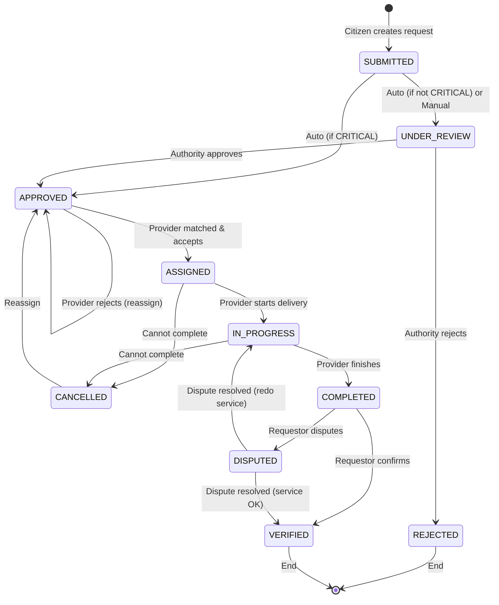
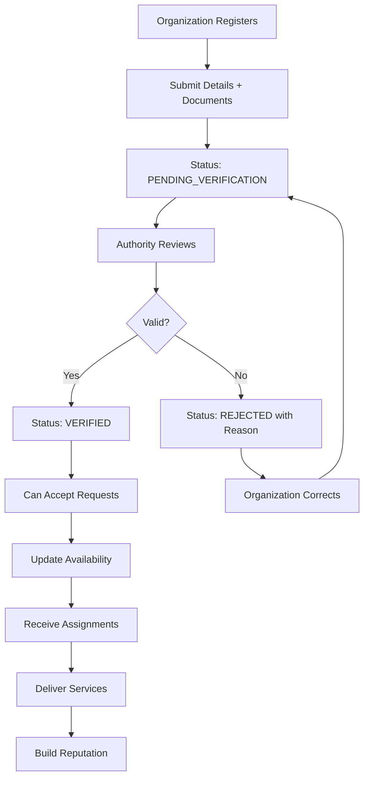
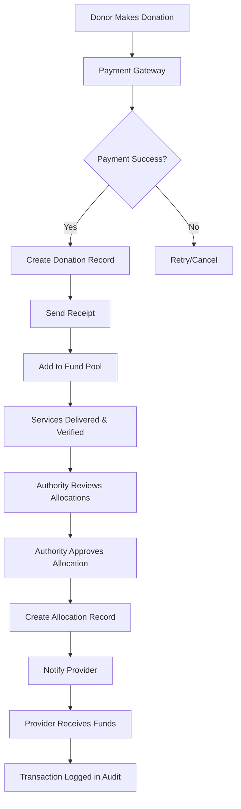
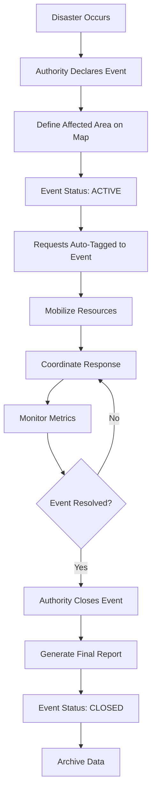

> *Type: Document (specification) · Audience: Product, developers · Status: Archived — v2 historical generation*

# IDRM MVP - Functional Specification (FS)
## Integrated Disaster Response Management Platform

**Document Type**: Functional Specification  
**Version**: 2.0  
**Date**: May 10, 2026  
**Status**: Final  
**Classification**: Internal Use

---

<!-- IDRM-CLEANUP doc=v2-11-funcspec status=ANNOTATED pass=2026-08-16 -->
> ## 🗺️ SECTION MAP (annotation pass, 2026-08-16)
> Gen-2 functional spec — **aligns with the current MVP.** Maps to `docs/mvp/11` (scope+acceptance), `10` (PRD),
> `13` (traceability), `22` (roles). *Legend:* ✅ covered · ⚠ superseded/nuanced · ⊘ dropped/FFP.
>
> | Snippet | Section | → Addressed in | Phase | Verdict |
> |---|---|---|---|---|
> | `v2-11§over` | Exec Summary · System Overview | `docs/mvp/10` | MVP | ✅ |
> | `v2-11§roles` | User Roles & Permissions | `docs/mvp/22` (RBAC matrix) | MVP | ✅ |
> | `v2-11§fr` | Functional Requirements · User Stories | `docs/mvp/11` (F1–F11) + `13` | MVP | ✅ |
> | `v2-11§wf` | Business Workflows · Business Rules | `docs/mvp/11` (lifecycle) + `30` | MVP | ✅ |
> | `v2-11§nfr` | Non-Functional Requirements | `docs/mvp/10` §9 | MVP | ✅ |
> | `v2-11§acc` | Success + Acceptance Criteria | `docs/mvp/11` + `13`; conformance → `26` | MVP | ✅ |
>
> *Program:* `../../_CLEANUP-LEDGER.md`, `../../../instructions.txt` §12.

## Document Control

| Version | Date | Author | Changes |
|---------|------|--------|---------|
| 1.0 | Dec 2, 2024 | Technical Team | Initial draft |
| 2.0 | May 10, 2026 | Technical Team | Updated for v2.0 stack (Bun, Python geospatial) |

---

## Table of Contents

1. [Executive Summary](#1-executive-summary)
2. [System Overview](#2-system-overview)
3. [User Roles and Permissions](#3-user-roles-and-permissions)
4. [Functional Requirements](#4-functional-requirements)
5. [User Stories](#5-user-stories)
6. [Business Workflows](#6-business-workflows)
7. [Business Rules](#7-business-rules)
8. [Non-Functional Requirements](#8-non-functional-requirements)
9. [Success Criteria](#9-success-criteria)
10. [Acceptance Criteria](#10-acceptance-criteria)

---

## 1. Executive Summary

### 1.1 Purpose

This Functional Specification (FS) document defines **WHAT** the IDRM (Integrated Disaster Response Management) platform does from a business and user perspective. It describes the system's behavior, user interactions, and business processes without diving into technical implementation details.

### 1.2 Scope

The IDRM MVP is a **map-based disaster response coordination platform** that:

- Enables citizens to **request emergency services** (medical, food, shelter, rescue)
- Allows service providers to **view and respond** to requests on an interactive map
- Provides authorities with **real-time visibility** into disaster response operations
- Ensures **transparent financial tracking** of donations and allocations
- Maintains **audit trails** for accountability

### 1.3 Intended Audience

This document is for:
- **Business Stakeholders**: Understand system capabilities
- **Product Managers**: Define and prioritize features
- **UX/UI Designers**: Design user interfaces
- **Developers**: Understand user requirements before implementation
- **QA Testers**: Create test cases based on functional requirements
- **Training Teams**: Develop user documentation

---

## 2. System Overview

### 2.1 Business Context

**Problem**: Disaster response in India is fragmented across multiple agencies with:
- No unified coordination system
- Delayed information sharing
- Limited transparency in resource allocation
- Difficulty tracking service delivery

**Solution**: IDRM provides a **single digital platform** where:
- All stakeholders share information in real-time
- Service requests are visible on a map
- Resources are allocated transparently
- Every action is logged and auditable

### 2.2 System Capabilities (High-Level)

```
┌─────────────────────────────────────────────────┐
│              IDRM Platform                      │
├─────────────────────────────────────────────────┤
│                                                 │
│  📍 Map Visualization                          │
│     - Service requests as markers              │
│     - Provider locations                       │
│     - Disaster-affected areas                  │
│                                                 │
│  🚨 Service Management                         │
│     - Request submission                        │
│     - Provider matching                         │
│     - Status tracking                           │
│     - Completion verification                   │
│                                                 │
│  💰 Financial Transparency                     │
│     - Donation tracking                         │
│     - Fund allocation                           │
│     - Audit reports                             │
│                                                 │
│  🔐 Security & Privacy                         │
│     - Role-based access                         │
│     - Privacy levels (Public/Protected/Private) │
│     - Audit logging                             │
│                                                 │
│  📊 Analytics & Reporting                      │
│     - Real-time dashboards                      │
│     - Performance metrics                       │
│     - Impact assessment                         │
│                                                 │
└─────────────────────────────────────────────────┘
```

### 2.3 Key Business Processes

1. **Service Request Lifecycle**
   - Citizen submits request → Authority reviews → Provider assigned → Service delivered → Completion verified

2. **Provider Onboarding**
   - Organization registers → Admin verifies → Provider activated → Capacity managed

3. **Donation Flow**
   - Donor contributes → Funds pooled → Authority allocates → Provider receives → Transaction audited

4. **Disaster Event Management**
   - Event declared → Affected area mapped → Resources mobilized → Response coordinated → Event closed

---

## 3. User Roles and Permissions

### 3.1 Role Definitions

#### 3.1.1 System Administrator

**Description**: Technical admin with full system access

**Responsibilities**:
- Manage all user accounts
- Configure system settings
- Monitor system health
- Manage organizations
- Access all data (for maintenance)

**Key Permissions**:
- Create/edit/delete users
- Assign roles
- View all system data
- Configure global settings
- Access audit logs

**Typical Users**: IT team, system administrators

---

#### 3.1.2 Disaster Management Authority

**Description**: Government officials overseeing disaster response

**Responsibilities**:
- Declare disaster events
- Approve high-priority service requests
- Allocate funds
- Monitor response effectiveness
- Generate reports for government

**Key Permissions**:
- Create/manage disaster events
- Approve/reject service requests
- View all requests in their jurisdiction
- Allocate donations
- Generate all reports
- Cannot delete audit logs

**Typical Users**: District collectors, disaster management officials, NDRF coordinators

---

#### 3.1.3 Organization Admin

**Description**: NGO/organization administrators

**Responsibilities**:
- Manage organization details
- Add/remove team members
- Assign service providers
- Monitor organization performance
- Report to authorities

**Key Permissions**:
- Edit organization profile
- Add/remove users in their organization
- View organization's service history
- Assign providers to requests
- Cannot approve own organization's requests

**Typical Users**: NGO directors, relief organization managers

---

#### 3.1.4 Event Manager

**Description**: On-ground coordinators during disasters

**Responsibilities**:
- Coordinate field operations
- Assign tasks to providers
- Update service status
- Communicate with teams
- Report to authorities

**Key Permissions**:
- View all services in assigned area
- Assign providers to requests
- Update service status
- Send notifications to teams
- Create field reports

**Typical Users**: Field coordinators, disaster response team leads

---

#### 3.1.5 Service Provider

**Description**: Organizations/individuals delivering services

**Responsibilities**:
- Respond to assigned requests
- Update service delivery status
- Report completion
- Maintain availability status
- Document service delivery

**Key Permissions**:
- View assigned requests
- Accept/reject assignments
- Update status (In Progress, Completed)
- Upload proof of delivery
- Update availability

**Typical Users**: NGO workers, volunteers, medical teams, food distribution centers

---

#### 3.1.6 Volunteer

**Description**: Field workers collecting data and assisting

**Responsibilities**:
- Collect ground data
- Verify service delivery
- Report issues
- Assist providers
- Update request details

**Key Permissions**:
- Create service requests
- Update request details (with photo evidence)
- Verify completed services
- Add notes to requests
- Cannot approve requests

**Typical Users**: Community volunteers, field surveyors, student volunteers

---

#### 3.1.7 Citizen

**Description**: General public requesting services

**Responsibilities**:
- Submit service requests
- Track request status
- Confirm service completion
- Rate service quality
- Report issues

**Key Permissions**:
- Create service requests
- View own requests
- Update own profile
- Confirm service completion
- Cannot see other users' requests

**Typical Users**: Affected individuals, community members

---

#### 3.1.8 Auditor

**Description**: Financial and operational auditors

**Responsibilities**:
- Review financial transactions
- Audit service delivery
- Generate compliance reports
- Monitor fund utilization
- Report irregularities

**Key Permissions**:
- Read-only access to all financial data
- Read-only access to audit logs
- Generate financial reports
- Export data for analysis
- Cannot modify any data

**Typical Users**: Government auditors, CAG officials, accountability officers

---

### 3.2 Role Permission Matrix

| Function | Sys Admin | DM Authority | Org Admin | Event Mgr | Provider | Volunteer | Citizen | Auditor |
|----------|-----------|--------------|-----------|-----------|----------|-----------|---------|---------|
| **User Management** |
| Create users | ✅ | ✅ (in jurisdiction) | ✅ (in org) | ❌ | ❌ | ❌ | ❌ | ❌ |
| Edit users | ✅ | ✅ (in jurisdiction) | ✅ (in org) | ❌ | ❌ | ❌ | ✅ (self) | ❌ |
| Delete users | ✅ | ✅ (in jurisdiction) | ✅ (in org) | ❌ | ❌ | ❌ | ❌ | ❌ |
| Assign roles | ✅ | ✅ | ✅ (in org) | ❌ | ❌ | ❌ | ❌ | ❌ |
| **Service Requests** |
| Create request | ✅ | ✅ | ✅ | ✅ | ✅ | ✅ | ✅ | ❌ |
| View all requests | ✅ | ✅ | ✅ (org) | ✅ (area) | ❌ | ❌ | ❌ | ✅ |
| View own requests | ✅ | ✅ | ✅ | ✅ | ✅ | ✅ | ✅ | ❌ |
| Approve request | ✅ | ✅ | ❌ | ❌ | ❌ | ❌ | ❌ | ❌ |
| Assign provider | ✅ | ✅ | ✅ | ✅ | ❌ | ❌ | ❌ | ❌ |
| Update status | ✅ | ✅ | ✅ | ✅ | ✅ (assigned) | ✅ (verified) | ❌ | ❌ |
| Delete request | ✅ | ✅ | ❌ | ❌ | ❌ | ❌ | ✅ (own, before review) | ❌ |
| Verify completion | ✅ | ✅ | ✅ | ✅ | ❌ | ✅ | ✅ (own) | ❌ |
| **Organizations** |
| Create org | ✅ | ✅ | ❌ | ❌ | ❌ | ❌ | ❌ | ❌ |
| Edit org | ✅ | ✅ | ✅ (own) | ❌ | ❌ | ❌ | ❌ | ❌ |
| Verify org | ✅ | ✅ | ❌ | ❌ | ❌ | ❌ | ❌ | ❌ |
| **Disaster Events** |
| Create event | ✅ | ✅ | ❌ | ❌ | ❌ | ❌ | ❌ | ❌ |
| Edit event | ✅ | ✅ | ❌ | ❌ | ❌ | ❌ | ❌ | ❌ |
| View events | ✅ | ✅ | ✅ | ✅ | ✅ | ✅ | ✅ | ✅ |
| Close event | ✅ | ✅ | ❌ | ❌ | ❌ | ❌ | ❌ | ❌ |
| **Financial** |
| Make donation | ✅ | ✅ | ✅ | ✅ | ✅ | ✅ | ✅ | ❌ |
| View donations | ✅ | ✅ | ✅ (org) | ❌ | ❌ | ❌ | ✅ (own) | ✅ |
| Allocate funds | ✅ | ✅ | ❌ | ❌ | ❌ | ❌ | ❌ | ❌ |
| View allocations | ✅ | ✅ | ✅ (org) | ❌ | ✅ (received) | ❌ | ❌ | ✅ |
| **Analytics** |
| View dashboard | ✅ | ✅ | ✅ (org) | ✅ (area) | ✅ (own) | ❌ | ❌ | ✅ |
| Generate reports | ✅ | ✅ | ✅ (org) | ✅ (area) | ✅ (own) | ❌ | ❌ | ✅ |
| Export data | ✅ | ✅ | ✅ (org) | ❌ | ❌ | ❌ | ❌ | ✅ |
| **Audit** |
| View audit logs | ✅ | ✅ | ❌ | ❌ | ❌ | ❌ | ❌ | ✅ |
| Export logs | ✅ | ✅ | ❌ | ❌ | ❌ | ❌ | ❌ | ✅ |

**Legend**: ✅ = Allowed | ❌ = Not Allowed

---

## 4. Functional Requirements

### 4.1 User Management (UM)

#### UM-001: User Registration

**Description**: New users can register for an account

**Actors**: Citizen, Service Provider, Organization Admin

**Preconditions**: None

**Flow**:
1. User navigates to registration page
2. User enters: email, password, full name, phone number
3. User selects role (Citizen or Service Provider)
4. System validates email format and password strength
5. System sends verification email
6. User clicks verification link
7. System activates account

**Postconditions**: 
- User account created with "Citizen" role by default
- Verification email sent
- User can login after verification

**Business Rules**:
- Email must be unique
- Password minimum 8 characters with 1 uppercase, 1 lowercase, 1 number
- Phone number must be valid Indian mobile (10 digits)
- Email verification required within 24 hours

---

#### UM-002: User Login

**Description**: Registered users can login to the system

**Actors**: All user roles

**Preconditions**: 
- User has registered account
- Email is verified

**Flow**:
1. User enters email and password
2. System validates credentials
3. System generates JWT access token (15 min expiry)
4. System generates refresh token (7 days expiry)
5. System returns tokens and user profile
6. User redirected to dashboard

**Postconditions**:
- User session created
- Tokens stored securely
- User can access authorized features

**Business Rules**:
- Max 5 failed login attempts in 15 minutes (account locked for 30 min)
- Session expires after 15 minutes of inactivity
- User can be logged in on max 3 devices simultaneously

---

#### UM-003: Password Reset

**Description**: Users can reset forgotten passwords

**Actors**: All user roles

**Preconditions**: User has registered email

**Flow**:
1. User clicks "Forgot Password"
2. User enters registered email
3. System sends password reset link (valid 1 hour)
4. User clicks link
5. User enters new password (twice for confirmation)
6. System validates password strength
7. System updates password
8. System invalidates all existing sessions
9. User redirected to login

**Postconditions**:
- Password updated
- All sessions terminated
- Reset link invalidated

**Business Rules**:
- Reset link expires in 1 hour
- New password cannot be same as last 3 passwords
- All active sessions terminated after password reset

---

#### UM-004: Profile Management

**Description**: Users can view and update their profile

**Actors**: All user roles

**Preconditions**: User is logged in

**Flow**:
1. User navigates to profile page
2. User views current profile information
3. User edits allowed fields
4. User submits changes
5. System validates changes
6. System updates profile
7. System shows success message

**Postconditions**: Profile updated

**Business Rules**:
- Cannot change email (must contact admin)
- Phone number must remain unique
- Role cannot be self-assigned (admin only)

---

#### UM-005: Role Assignment

**Description**: Admins can assign roles to users

**Actors**: System Admin, Disaster Management Authority

**Preconditions**: 
- Admin is logged in
- Target user exists

**Flow**:
1. Admin searches for user
2. Admin views user details
3. Admin selects new role
4. Admin confirms assignment
5. System validates permission
6. System updates user role
7. System sends email notification to user

**Postconditions**: 
- User role updated
- User gains new permissions
- Notification sent

**Business Rules**:
- DM Authority can only assign roles within their jurisdiction
- System Admin can assign any role
- Role change logged in audit trail

---

### 4.2 Service Request Management (SR)

#### SR-001: Create Service Request

**Description**: Users can submit service requests

**Actors**: All roles except Auditor

**Preconditions**: User is logged in

**Flow**:
1. User clicks "New Request"
2. User selects service type (Medical, Food, Shelter, Rescue, etc.)
3. User selects priority (Critical, High, Medium, Low)
4. User marks location on map OR enters address
5. User enters description
6. User selects privacy level (Public, Protected, Private)
7. User optionally uploads photo
8. User submits request
9. System validates input
10. System saves request with status "SUBMITTED"
11. System sends confirmation to user
12. System notifies relevant authorities

**Postconditions**:
- Request created with unique ID
- Status set to SUBMITTED
- Notifications sent
- Request visible on map (based on privacy level)

**Business Rules**:
- CRITICAL requests auto-approved
- Location must be within valid geographic bounds
- Photo size max 5MB
- Description max 1000 characters
- Request automatically assigned to nearest provider if CRITICAL

---

#### SR-002: View Service Requests

**Description**: Users can view service requests based on their role

**Actors**: All roles

**Preconditions**: User is logged in

**Flow**:
1. User navigates to services page or map
2. System fetches requests based on user role and filters
3. System displays requests as list or map markers
4. User can filter by: type, status, priority, date range
5. User can search by: location, ID, description
6. User clicks request to view details

**Postconditions**: Requests displayed

**Business Rules**:
- Citizens see only own requests
- Providers see assigned requests + available requests in their area
- Event Managers see all requests in assigned area
- Authorities see all requests in jurisdiction
- Auditors see all requests (read-only)
- Privacy level respected (Public = all, Protected = authorities+providers, Private = authorities only)

---

#### SR-003: Update Service Request

**Description**: Users can update service request details

**Actors**: Creator, Event Manager, DM Authority, System Admin

**Preconditions**: 
- User is logged in
- User has permission to edit request

**Flow**:
1. User views request details
2. User clicks "Edit"
3. User modifies allowed fields
4. User submits changes
5. System validates changes
6. System saves updates
7. System logs changes in audit trail
8. System sends notification to relevant users

**Postconditions**:
- Request updated
- Changes logged
- Notifications sent

**Business Rules**:
- Citizens can edit only before review
- Event Managers can update any field except financial
- Status changes restricted by role
- All changes logged with user ID and timestamp

---

#### SR-004: Approve/Reject Service Request

**Description**: Authorities can approve or reject requests

**Actors**: DM Authority, System Admin

**Preconditions**:
- Request status is SUBMITTED or UNDER_REVIEW
- User has approval permission

**Flow**:
1. Authority views request details
2. Authority reviews request validity
3. Authority clicks "Approve" or "Reject"
4. If rejecting, authority enters reason
5. System updates status to APPROVED or REJECTED
6. System sends notification to requestor
7. If approved, system triggers provider matching

**Postconditions**:
- Status updated
- Notifications sent
- If approved, matching initiated

**Business Rules**:
- CRITICAL requests auto-approved (skip this step)
- Rejection requires reason (min 20 characters)
- Approved requests automatically move to assignment queue
- Duplicate requests auto-rejected

---

#### SR-005: Assign Service Provider

**Description**: Coordinators can assign providers to approved requests

**Actors**: DM Authority, Organization Admin, Event Manager

**Preconditions**:
- Request status is APPROVED
- Provider is available and has capacity

**Flow**:
1. Coordinator views approved request
2. System shows matching providers (based on location, service type, availability)
3. Coordinator selects provider
4. Coordinator sets estimated completion time
5. System sends assignment notification to provider
6. Provider accepts or rejects within 10 minutes
7. If accepted, status → ASSIGNED
8. If rejected, system suggests next provider

**Postconditions**:
- Request assigned to provider
- Status updated
- Notifications sent
- ETA set

**Business Rules**:
- Provider must be within 50km for non-CRITICAL (10km for CRITICAL)
- Provider must have capacity (current_load < capacity)
- Provider must offer the requested service type
- Auto-assign nearest provider if CRITICAL and no response in 10 min
- Provider can accept max 5 concurrent requests

---

#### SR-006: Update Service Status

**Description**: Providers update service delivery status

**Actors**: Service Provider, Event Manager

**Preconditions**:
- Request is ASSIGNED to provider
- Provider is logged in

**Flow**:
1. Provider views assigned request
2. Provider clicks status update button
3. Provider selects new status:
   - IN_PROGRESS: Started service delivery
   - COMPLETED: Service delivered
   - CANCELLED: Unable to complete (requires reason)
4. Provider enters notes
5. Provider optionally uploads photo (required for COMPLETED)
6. System validates status transition
7. System updates status
8. System sends notification to requestor

**Postconditions**:
- Status updated
- Notes and photos saved
- Notifications sent

**Business Rules**:
- Valid transitions: ASSIGNED → IN_PROGRESS → COMPLETED
- Can cancel from any status (requires reason)
- COMPLETED requires photo proof for HIGH/CRITICAL requests
- If CANCELLED, request returns to APPROVED status for reassignment

---

#### SR-007: Complete Service

**Description**: Mark service as completed

**Actors**: Service Provider

**Preconditions**:
- Request status is IN_PROGRESS
- Service delivered

**Flow**:
1. Provider navigates to request
2. Provider clicks "Mark Complete"
3. Provider uploads proof photo (required)
4. Provider enters completion notes
5. Provider submits
6. System updates status to COMPLETED
7. System sends notification to requestor for verification
8. System updates provider capacity (current_load - 1)

**Postconditions**:
- Status = COMPLETED
- Provider capacity updated
- Verification notification sent

**Business Rules**:
- Photo required for completion
- Completion notes min 50 characters
- Requestor has 24 hours to verify
- Auto-verified if no response in 24 hours

---

#### SR-008: Verify Service Completion

**Description**: Requestor verifies service was delivered

**Actors**: Citizen (requestor), Volunteer, Event Manager

**Preconditions**:
- Request status is COMPLETED
- User is requestor or has verification permission

**Flow**:
1. User receives completion notification
2. User views completed request
3. User reviews proof photo and notes
4. User clicks "Verify" or "Dispute"
5. If verifying:
   - User optionally rates service (1-5 stars)
   - System updates status to VERIFIED
6. If disputing:
   - User enters reason
   - System creates dispute ticket
   - Event Manager investigates

**Postconditions**:
- Status = VERIFIED or dispute created
- Rating saved (if provided)
- Provider performance updated

**Business Rules**:
- Auto-verified after 24 hours if no action
- Dispute requires reason (min 50 characters)
- Rating affects provider performance score
- Verified services cannot be reopened

---

### 4.3 Provider Management (PM)

#### PM-001: Register as Service Provider

**Description**: Organizations can register as service providers

**Actors**: Organization Admin

**Preconditions**: User has account

**Flow**:
1. User navigates to "Register Organization"
2. User enters organization details:
   - Name
   - Type (NGO, Government, International Org, Private)
   - Registration number
   - Address and location
   - Contact email/phone
   - Services offered (multi-select)
   - Coverage area (draw on map)
   - Capacity (max concurrent requests)
3. User uploads registration documents
4. User submits
5. System creates organization with status PENDING_VERIFICATION
6. System notifies authorities for verification

**Postconditions**:
- Organization created
- Status = PENDING_VERIFICATION
- Verification request sent

**Business Rules**:
- Registration number must be unique
- Must offer at least one service type
- Coverage area must be polygon with max 100km radius
- Capacity must be between 1-100

---

#### PM-002: Verify Service Provider

**Description**: Authorities verify and approve providers

**Actors**: DM Authority, System Admin

**Preconditions**:
- Organization status is PENDING_VERIFICATION
- Authority has verification permission

**Flow**:
1. Authority views pending organizations
2. Authority reviews organization details and documents
3. Authority verifies registration number externally
4. Authority clicks "Approve" or "Reject"
5. If rejecting, authority enters reason
6. System updates organization status
7. System sends notification to organization admin

**Postconditions**:
- Organization status updated
- Notification sent
- If approved, organization can accept requests

**Business Rules**:
- Only verified organizations can receive assignments
- Rejection requires detailed reason
- Organization can resubmit after corrections

---

#### PM-003: Manage Provider Availability

**Description**: Providers can set their availability status

**Actors**: Service Provider, Organization Admin

**Preconditions**:
- Provider is verified
- User belongs to organization

**Flow**:
1. Provider navigates to profile
2. Provider toggles availability status
3. Provider sets reason if unavailable
4. System updates status
5. System notifies coordinators
6. If unavailable, system unassigns pending requests

**Postconditions**:
- Availability updated
- Pending assignments handled

**Business Rules**:
- Unavailable providers excluded from matching
- Existing IN_PROGRESS requests not affected
- Must set reason if marking unavailable
- Auto-available after 24 hours unless extended

---

#### PM-004: Update Provider Capacity

**Description**: Providers can update their service capacity

**Actors**: Organization Admin

**Preconditions**: Organization is verified

**Flow**:
1. Admin navigates to organization settings
2. Admin updates capacity number
3. Admin submits
4. System validates (must be ≥ current_load)
5. System updates capacity
6. System adjusts matching algorithm

**Postconditions**: Capacity updated

**Business Rules**:
- New capacity must be ≥ current active assignments
- Capacity between 1-100
- Change logged in audit trail

---

### 4.4 Geospatial Features (GEO)

#### GEO-001: Map Visualization

**Description**: Users can view an interactive map with service requests

**Actors**: All roles except Auditor

**Preconditions**: User is logged in

**Flow**:
1. User navigates to map page
2. System loads map with current user location as center
3. System fetches service requests based on user role and filters
4. System displays requests as markers:
   - Color by service type
   - Size by priority
   - Icon by status
5. User can zoom, pan, and click markers
6. Clicking marker shows request popup with summary

**Postconditions**: Map displayed with requests

**Business Rules**:
- Max 1000 markers loaded at once (clustering if more)
- Privacy levels respected
- Map defaults to user's jurisdiction/area
- Real-time updates every 30 seconds

---

#### GEO-002: Location Search

**Description**: Users can search for locations on map

**Actors**: All roles

**Preconditions**: User is on map page

**Flow**:
1. User enters address or place name in search box
2. System queries geocoding service
3. System shows suggestions as user types
4. User selects suggestion
5. Map centers on selected location
6. System displays nearby service requests

**Postconditions**: Map centered on searched location

**Business Rules**:
- Search restricted to India
- Max 10 suggestions shown
- Results prioritized by: exact match > partial match > nearby

---

#### GEO-003: Provider Matching by Location

**Description**: System matches service requests with nearby providers

**Actors**: System (automatic)

**Preconditions**: Request is APPROVED

**Flow**:
1. System identifies request location
2. System queries providers within radius:
   - CRITICAL: 10km
   - HIGH: 25km
   - MEDIUM/LOW: 50km
3. System filters by:
   - Service type match
   - Availability = true
   - Current_load < capacity
4. System ranks by:
   - Distance (nearest first)
   - Performance rating
   - Current load (lower first)
5. System returns ranked list

**Postconditions**: Matching providers identified

**Business Rules**:
- Spatial query using PostGIS ST_DWithin
- Max 20 providers returned
- If no match, expand radius by 25km (max 3 iterations)

---

#### GEO-004: Service Request Clustering

**Description**: System clusters nearby requests for visualization

**Actors**: System (automatic)

**Preconditions**: Map is loaded

**Flow**:
1. System identifies all visible requests
2. If count > 100:
   - System applies K-means clustering (k=50)
   - System creates cluster markers showing count
3. User clicks cluster
4. Map zooms to cluster bounds
5. Individual markers become visible

**Postconditions**: Clustered markers displayed

**Business Rules**:
- Clustering applies when zoom level < 10
- Cluster size indicates number of requests
- Clicking cluster zooms to show individual markers

---

#### GEO-005: Map Tile Serving

**Description**: System serves map tiles for visualization

**Actors**: System (automatic)

**Preconditions**: Map page loaded

**Flow**:
1. Map client requests tiles for current viewport
2. Python geospatial service receives request
3. Service checks Redis cache
4. If cached, return tile
5. If not cached:
   - Query PostGIS for features in tile bounds
   - Render tile as PNG
   - Cache tile (1 hour TTL)
   - Return tile
6. Client displays tile

**Postconditions**: Map tiles displayed

**Business Rules**:
- Tiles cached for 1 hour
- Standard tile size: 256x256 pixels
- Zoom levels: 1-18
- Tiles respect privacy levels

---

### 4.5 Financial Transparency (FIN)

#### FIN-001: Make Donation

**Description**: Users can donate to disaster response efforts

**Actors**: All roles except Auditor

**Preconditions**: User is logged in

**Flow**:
1. User navigates to donations page
2. User enters amount (INR)
3. User selects purpose:
   - General fund
   - Specific disaster event
   - Specific service type
4. User optionally stays anonymous
5. User selects payment method
6. User redirects to payment gateway
7. Payment processed
8. System receives payment confirmation
9. System creates donation record
10. System sends receipt via email

**Postconditions**:
- Donation recorded
- Receipt sent
- Funds added to designated pool

**Business Rules**:
- Minimum donation: ₹100
- Maximum donation: ₹10,00,000 per transaction
- Anonymous donations allowed
- All donations tax-deductible (80G certificate issued)
- Transaction ID unique and traceable

---

#### FIN-002: Track Donations

**Description**: Users can view their donation history

**Actors**: Donor

**Preconditions**: User has made donations

**Flow**:
1. User navigates to "My Donations"
2. System fetches user's donation history
3. System displays table with:
   - Date, Amount, Purpose, Status, Receipt
4. User can filter by date range
5. User can download receipts

**Postconditions**: Donation history displayed

**Business Rules**:
- Only user's own donations visible
- Auditors can view all donations (anonymized if requested)
- Receipts downloadable as PDF

---

#### FIN-003: Allocate Funds

**Description**: Authorities allocate funds to service providers

**Actors**: DM Authority, System Admin

**Preconditions**:
- Funds available in pool
- Service delivery verified

**Flow**:
1. Authority navigates to fund allocation
2. Authority selects disaster event or service type
3. System shows available funds
4. Authority selects verified services for payment
5. Authority enters allocation amount for each
6. Authority adds notes
7. System validates (total ≤ available)
8. Authority confirms allocation
9. System creates allocation records
10. System sends notifications to providers

**Postconditions**:
- Funds allocated
- Records created
- Notifications sent

**Business Rules**:
- Can only allocate for VERIFIED services
- Total allocation cannot exceed available funds
- Allocation requires multi-level approval for >₹1,00,000
- All allocations logged in audit trail

---

#### FIN-004: Financial Reporting

**Description**: Generate financial transparency reports

**Actors**: DM Authority, Auditor

**Preconditions**: User has reporting permission

**Flow**:
1. User navigates to financial reports
2. User selects report type:
   - Donations received
   - Funds allocated
   - Funds utilized
   - Balance by purpose
3. User selects date range
4. User optionally filters by event/org
5. System generates report
6. System displays report with charts
7. User can export as PDF/CSV

**Postconditions**: Report generated and exported

**Business Rules**:
- Reports include all transactions in period
- Anonymize donors if requested
- Include breakdown by: event, service type, organization
- Include audit trail references

---

### 4.6 Communication (COM)

#### COM-001: Email Notifications

**Description**: System sends email notifications for key events

**Actors**: System (automatic)

**Preconditions**: Event triggers notification

**Triggers**:
- New service request created
- Request approved/rejected
- Provider assigned
- Service status changed
- Completion verification needed
- Donation received
- Funds allocated

**Flow**:
1. Event occurs in system
2. System identifies recipients based on event type
3. System generates email from template
4. System sends via SMTP
5. System logs email sent

**Postconditions**: Email sent and logged

**Business Rules**:
- Users can opt-out of non-critical emails
- CRITICAL requests always notify (cannot opt-out)
- Email templates customizable
- Failed emails retried 3 times

---

#### COM-002: Real-time Notifications

**Description**: System sends real-time in-app notifications

**Actors**: System (automatic)

**Preconditions**: User is logged in (WebSocket connected)

**Flow**:
1. Event occurs
2. System identifies online users to notify
3. System sends notification via WebSocket
4. Client displays notification toast
5. Notification added to user's notification center

**Postconditions**: Notification delivered

**Business Rules**:
- Notifications persist for 7 days
- Users can mark as read
- Clicking notification navigates to relevant page
- Real-time for: status updates, assignments, messages

---

#### COM-003: SMS Notifications

**Description**: System sends SMS for critical events

**Actors**: System (automatic)

**Preconditions**: 
- Event is CRITICAL priority
- User has verified phone number

**Triggers**:
- CRITICAL request created
- CRITICAL request assigned
- CRITICAL request requires immediate action

**Flow**:
1. CRITICAL event occurs
2. System identifies recipients
3. System generates SMS text (max 160 chars)
4. System sends via SMS gateway
5. System logs SMS sent

**Postconditions**: SMS sent

**Business Rules**:
- Only for CRITICAL priority
- Users can opt-out (but will receive disclaimer)
- SMS fallback if email fails
- India phone numbers only

---

### 4.7 Privacy & Security (SEC)

#### SEC-001: Privacy Level Management

**Description**: Users can control visibility of their service requests

**Actors**: Request creator

**Preconditions**: User is creating/editing request

**Privacy Levels**:

| Level | Description | Who Can View |
|-------|-------------|--------------|
| **Public** | Full details visible | Everyone |
| **Protected** | Location precise to block (~1km²) | Authorities + Assigned Providers |
| **Private** | Exact location, full details | Authorities only |

**Flow**:
1. User selects privacy level when creating request
2. System stores privacy level
3. System applies visibility rules:
   - Public: All fields visible, exact location
   - Protected: Address fuzzy to block, exact location hidden
   - Private: Full details only to authorities
4. Map markers reflect privacy:
   - Public: Exact location
   - Protected: Block center
   - Private: District center

**Postconditions**: Privacy settings applied

**Business Rules**:
- Default privacy: PROTECTED
- CRITICAL requests override to PUBLIC (with user consent)
- Cannot change privacy after service assigned
- Personal info (name, phone) always private

---

#### SEC-002: PII Protection

**Description**: System protects Personally Identifiable Information

**Actors**: System (automatic)

**Protected Data**:
- Full name
- Email
- Phone number
- Exact address
- Aadhaar/ID numbers

**Implementation**:
- PII fields encrypted at rest (AES-256)
- PII excluded from logs
- PII masked in UI for unauthorized users
- PII never included in exports without authorization

**Business Rules**:
- Only authorized roles see PII
- Audit log for all PII access
- PII automatically anonymized after 2 years (inactive accounts)

---

#### SEC-003: Audit Logging

**Description**: System logs all critical actions for accountability

**Actors**: System (automatic)

**Logged Actions**:
- User login/logout
- Service request create/update/delete
- Approval/rejection
- Provider assignment
- Status changes
- Fund allocation
- Report generation
- PII access

**Log Fields**:
- Timestamp
- User ID
- Action type
- Entity type and ID
- Changes made (before/after)
- IP address
- User agent

**Flow**:
1. User performs action
2. System intercepts action
3. System creates audit log entry
4. System stores in immutable log table
5. Action proceeds

**Postconditions**: Action logged

**Business Rules**:
- Audit logs immutable (cannot be edited/deleted)
- Retained for 10 years
- Accessible only to Auditors and System Admins
- Logs encrypted at rest

---

### 4.8 Reporting & Analytics (REP)

#### REP-001: Dashboard Metrics

**Description**: Users can view role-specific dashboards

**Actors**: All roles except Citizen

**Preconditions**: User is logged in

**Dashboards by Role**:

**DM Authority Dashboard**:
- Total requests by status
- Critical requests map
- Average response time by service type
- Provider performance rankings
- Funds donated vs allocated
- Geographic heatmap of requests

**Organization Admin Dashboard**:
- Organization's service delivery count
- Average completion time
- Team performance metrics
- Funds received
- Service type breakdown

**Event Manager Dashboard**:
- Active requests in area
- Pending assignments
- In-progress services
- Provider availability

**Service Provider Dashboard**:
- Assigned requests
- Completion rate
- Average rating
- Current capacity utilization

**Flow**:
1. User navigates to dashboard
2. System fetches relevant metrics
3. System generates charts/graphs
4. User can select date range
5. Dashboard updates in real-time

**Postconditions**: Dashboard displayed

**Business Rules**:
- Data refreshes every 30 seconds
- Historical data available for 1 year
- Can export dashboard as PDF

---

#### REP-002: Custom Reports

**Description**: Users can generate custom reports

**Actors**: DM Authority, Organization Admin, Auditor

**Preconditions**: User has reporting permission

**Report Types**:
- Service request summary
- Provider performance
- Financial transactions
- Response time analysis
- Geographic distribution
- Impact assessment

**Flow**:
1. User navigates to reports
2. User selects report type
3. User sets parameters:
   - Date range
   - Filters (event, service type, org, etc.)
   - Grouping (by day, week, month)
4. User clicks "Generate"
5. System queries database
6. System generates report with:
   - Summary statistics
   - Charts/graphs
   - Detailed data table
7. User can export as PDF, CSV, or Excel

**Postconditions**: Report generated

**Business Rules**:
- Max date range: 1 year
- Reports cached for 1 hour
- Export limits: PDF (50 pages), CSV (100K rows)

---

#### REP-003: Data Export

**Description**: Authorized users can export data for analysis

**Actors**: Auditor, DM Authority

**Preconditions**: User has export permission

**Exportable Data**:
- Service requests (anonymized)
- Financial transactions
- Audit logs
- Performance metrics

**Flow**:
1. User navigates to data export
2. User selects data type
3. User sets filters and date range
4. User selects format (CSV, JSON, Excel)
5. User confirms export
6. System generates export file
7. System sends download link via email
8. User downloads file

**Postconditions**: Data exported

**Business Rules**:
- PII automatically anonymized
- Export logged in audit trail
- Files expire after 24 hours
- Max file size: 100MB (request chunked export if larger)

---

## 5. User Stories

### 5.1 Citizen Stories

#### Story 1: Emergency Medical Help

**As a** citizen affected by a flood  
**I want to** request emergency medical assistance  
**So that** my sick family member can receive treatment

**Acceptance Criteria**:
- Can create request in <2 minutes
- Can mark location on map
- Request marked as CRITICAL automatically prioritized
- Receive confirmation within 30 seconds
- Can track status in real-time
- Receive SMS when provider assigned

---

#### Story 2: Track Request Status

**As a** citizen who submitted a request  
**I want to** track the status of my request  
**So that** I know when help will arrive

**Acceptance Criteria**:
- Can view request on map with status
- Receive notifications on status changes
- Can see estimated arrival time
- Can see assigned provider contact
- Can verify completion when service delivered

---

### 5.2 Service Provider Stories

#### Story 3: Accept Service Assignment

**As a** service provider (NGO worker)  
**I want to** view and accept service requests near me  
**So that** I can efficiently deliver help

**Acceptance Criteria**:
- Can view all requests within 25km on map
- Can filter by service type
- Receive push notification for assignments
- Can accept/reject within 10 minutes
- Can see request details and navigation

---

#### Story 4: Update Service Status

**As a** service provider delivering food  
**I want to** update service status as I progress  
**So that** coordinators and citizens know the current state

**Acceptance Criteria**:
- Can mark "In Progress" when starting
- Can upload photos during delivery
- Can mark "Completed" with proof photo
- Requestor receives notification
- Status visible on map in real-time

---

### 5.3 Event Manager Stories

#### Story 5: Coordinate Multiple Providers

**As an** event manager during a cyclone  
**I want to** see all active requests and assign providers  
**So that** response is coordinated and efficient

**Acceptance Criteria**:
- Can view all requests in assigned area on map
- Can see provider locations and availability
- Can assign providers to requests
- Can override auto-assignments if needed
- Can communicate with providers and requestors

---

#### Story 6: Monitor Response Metrics

**As an** event manager  
**I want to** view real-time metrics of response efforts  
**So that** I can identify gaps and reallocate resources

**Acceptance Criteria**:
- Dashboard shows pending, in-progress, completed counts
- Can see average response time
- Can identify areas with high demand
- Can see provider utilization
- Can generate hourly reports

---

### 5.4 DM Authority Stories

#### Story 7: Declare Disaster Event

**As a** disaster management authority  
**I want to** declare a disaster event and define affected area  
**So that** response efforts can be coordinated

**Acceptance Criteria**:
- Can create event with name, type, severity
- Can draw affected area on map
- All requests in area auto-tagged to event
- Can activate emergency protocols
- Event visible to all stakeholders

---

#### Story 8: Allocate Funds Transparently

**As a** disaster management authority  
**I want to** allocate donated funds to service providers  
**So that** financial support reaches those delivering help

**Acceptance Criteria**:
- Can view available funds by source
- Can see verified service deliveries awaiting payment
- Can allocate specific amounts to providers
- All allocations logged and auditable
- Providers receive payment notifications

---

### 5.5 Donor Stories

#### Story 9: Donate with Transparency

**As a** donor wanting to help  
**I want to** donate money and see how it's used  
**So that** I can trust my contribution makes an impact

**Acceptance Criteria**:
- Can donate in <3 clicks
- Can specify purpose (event, service type)
- Receive tax receipt immediately
- Can track how funds are allocated
- Can view impact report (services funded)

---

### 5.6 Organization Admin Stories

#### Story 10: Manage Provider Team

**As an** organization admin  
**I want to** manage my team of service providers  
**So that** we can efficiently respond to requests

**Acceptance Criteria**:
- Can add/remove team members
- Can set provider availability
- Can view team performance metrics
- Can see all requests assigned to org
- Can communicate with team

---

### 5.7 Auditor Stories

#### Story 11: Audit Financial Transactions

**As a** government auditor  
**I want to** review all financial transactions  
**So that** I can ensure accountability and compliance

**Acceptance Criteria**:
- Can view all donations (anonymized if requested)
- Can view all allocations
- Can trace fund flow from donor to provider
- Can generate audit reports
- Can export data for external analysis

---

#### Story 12: Review Service Delivery

**As an** auditor  
**I want to** review service delivery records  
**So that** I can verify claims and identify fraud

**Acceptance Criteria**:
- Can view all service requests and completions
- Can see proof photos and verification
- Can identify duplicate requests
- Can flag suspicious patterns
- Can generate compliance reports

---

## 6. Business Workflows

### 6.1 Service Request Lifecycle



**States**:
- **SUBMITTED**: Initial state when request created
- **UNDER_REVIEW**: Awaiting authority approval
- **APPROVED**: Validated, ready for assignment
- **ASSIGNED**: Provider assigned, not started
- **IN_PROGRESS**: Provider actively delivering service
- **COMPLETED**: Provider marked complete, awaiting verification
- **VERIFIED**: Requestor confirmed completion
- **REJECTED**: Request invalid/duplicate
- **CANCELLED**: Provider unable to complete
- **DISPUTED**: Requestor disputes completion

---

### 6.2 Provider Onboarding Workflow



---

### 6.3 Donation to Disbursement Workflow



---

### 6.4 Disaster Event Management Workflow



---

## 7. Business Rules

### 7.1 Service Request Rules

**BR-001**: CRITICAL requests are auto-approved and bypass manual review  
**BR-002**: Requests with priority HIGH or CRITICAL require photo proof upon completion  
**BR-003**: Duplicate requests (same location + service type within 1km, 24 hours) are auto-rejected  
**BR-004**: Service requests auto-expire after 30 days if status is SUBMITTED or UNDER_REVIEW  
**BR-005**: Providers must accept/reject assignment within 10 minutes or it auto-reassigns  
**BR-006**: Completed services auto-verify after 24 hours if requestor doesn't respond  
**BR-007**: Maximum 3 reassignment attempts before request escalated to authority

---

### 7.2 Provider Rules

**BR-008**: Providers can accept max 5 concurrent requests  
**BR-009**: Provider capacity must always be ≥ current active assignments  
**BR-010**: Unavailable providers excluded from matching for 24 hours (unless reactivated)  
**BR-011**: Providers with <3.0 rating (out of 5) flagged for review after 10 completed services  
**BR-012**: New providers limited to MEDIUM/LOW priority requests until 5 successful completions

---

### 7.3 Financial Rules

**BR-013**: Minimum donation amount: ₹100  
**BR-014**: Maximum donation per transaction: ₹10,00,000  
**BR-015**: Fund allocations >₹1,00,000 require multi-level approval  
**BR-016**: Can only allocate funds for VERIFIED services  
**BR-017**: Total allocations cannot exceed available funds in designated pool  
**BR-018**: All donations are tax-deductible (80G certificate auto-generated)

---

### 7.4 Privacy Rules

**BR-019**: CRITICAL requests default to PUBLIC privacy (with user consent notification)  
**BR-020**: Personal information (name, phone, email) never displayed to unauthorized users  
**BR-021**: Privacy level cannot be changed after provider assigned  
**BR-022**: Anonymous donations are aggregated separately in reports

---

### 7.5 Timing Rules

**BR-023**: Response time targets:
- CRITICAL: <30 minutes from submission to assignment
- HIGH: <2 hours
- MEDIUM: <6 hours
- LOW: <24 hours

**BR-024**: Service completion time targets:
- CRITICAL: <2 hours from assignment
- HIGH: <6 hours
- MEDIUM: <24 hours
- LOW: <72 hours

**BR-025**: JWT access token expires in 15 minutes  
**BR-026**: JWT refresh token expires in 7 days  
**BR-027**: Password reset link expires in 1 hour  
**BR-028**: Email verification link expires in 24 hours

---

### 7.6 Data Retention Rules

**BR-029**: Active user data retained indefinitely  
**BR-030**: Service request data retained for 7 years  
**BR-031**: Financial records retained for 10 years  
**BR-032**: Audit logs retained for 10 years  
**BR-033**: Inactive user accounts (2+ years no login) auto-anonymized

---

## 8. Non-Functional Requirements

### 8.1 Performance Requirements

**NFR-001**: API response time p95 <300ms for simple queries  
**NFR-002**: Map tile serving <100ms per tile  
**NFR-003**: Spatial queries <500ms for 50km radius  
**NFR-004**: Dashboard refresh <2 seconds  
**NFR-005**: Support 10,000 concurrent users  
**NFR-006**: Support 100,000 service requests per disaster event

---

### 8.2 Scalability Requirements

**NFR-007**: Horizontal scaling for all stateless services  
**NFR-008**: Database read replicas for reporting  
**NFR-009**: Redis clustering for high availability  
**NFR-010**: CDN for static assets  
**NFR-011**: Auto-scaling based on CPU/memory thresholds

---

### 8.3 Availability Requirements

**NFR-012**: System uptime ≥99.5% (max 3.65 hours downtime/month)  
**NFR-013**: Database backup every 1 hour  
**NFR-014**: Point-in-time recovery available  
**NFR-015**: Disaster recovery RTO: 4 hours, RPO: 1 hour  
**NFR-016**: Zero-downtime deployments

---

### 8.4 Security Requirements

**NFR-017**: All communication over HTTPS (TLS 1.3)  
**NFR-018**: Passwords hashed with bcrypt (cost factor 12)  
**NFR-019**: JWT tokens for stateless authentication  
**NFR-020**: PII encrypted at rest (AES-256)  
**NFR-021**: Rate limiting: 100 req/min per user, 5 login attempts per 15 min  
**NFR-022**: OWASP Top 10 compliance  
**NFR-023**: Regular security audits (quarterly)

---

### 8.5 Usability Requirements

**NFR-024**: Mobile-responsive UI (works on 360px+ screens)  
**NFR-025**: WCAG 2.1 Level AA accessibility  
**NFR-026**: Support Hindi and English languages  
**NFR-027**: Offline capability for mobile app (view cached data)  
**NFR-028**: Max 3 clicks to create service request

---

### 8.6 Reliability Requirements

**NFR-029**: Automated health checks every 30 seconds  
**NFR-030**: Automatic failover for database  
**NFR-031**: Circuit breakers for external services  
**NFR-032**: Graceful degradation (map works even if analytics down)  
**NFR-033**: Idempotent API endpoints (retry-safe)

---

## 9. Success Criteria

### 9.1 Operational Metrics

**Success is measured by**:

1. **Response Time**:
   - Average time from CRITICAL request submission to provider assignment: <30 minutes
   - 95% of CRITICAL requests assigned within 30 minutes

2. **Completion Rate**:
   - Service completion rate >85%
   - Verification rate >80%

3. **Provider Performance**:
   - Provider response rate >90% (accept within 10 min)
   - Average provider rating ≥4.0 out of 5

4. **System Uptime**:
   - System availability ≥99.5%
   - Zero data loss incidents

---

### 9.2 User Adoption Metrics

**Target by Month 6**:

1. **User Base**:
   - Active users: 10,000+
   - Registered organizations: 500+
   - Service providers: 2,000+

2. **Activity**:
   - Service requests processed: 50,000+
   - Completion rate: 85%+
   - User retention: 60%+

---

### 9.3 Financial Metrics

**Transparency and Efficiency**:

1. **Donation Tracking**:
   - Donation transparency score: 100% (all transactions traceable)
   - Average fund allocation time: <24 hours

2. **Efficiency**:
   - Administrative overhead: <5% of donations
   - Fund utilization rate: >90%

---

### 9.4 Impact Metrics

**Real-World Outcomes**:

1. **Lives Impacted**:
   - People served: Tracked via verified service completions
   - Response time improvement: 50%+ faster vs traditional methods

2. **Resource Efficiency**:
   - Resource utilization: >80% of provider capacity used
   - Reduction in duplicate services: >70%

---

## 10. Acceptance Criteria

### 10.1 MVP Launch Criteria

**The MVP is ready to launch when**:

- [ ] All 8 user roles implemented with correct permissions
- [ ] Service request lifecycle complete (all states functional)
- [ ] Map visualization works with 1000+ markers
- [ ] Provider matching algorithm functional
- [ ] Donation and allocation workflow complete
- [ ] Email and real-time notifications working
- [ ] Security measures implemented (JWT, RBAC, encryption)
- [ ] Audit logging functional
- [ ] Dashboard and basic reports available
- [ ] System uptime >99% in staging for 1 week
- [ ] Load tested for 1,000 concurrent users
- [ ] User acceptance testing completed with 50+ test users
- [ ] Documentation complete (user guides, API docs)
- [ ] Training completed for initial user group

---

### 10.2 Feature Acceptance Criteria

**Each feature must meet**:

1. **Functional**:
   - All specified requirements implemented
   - All user stories satisfied
   - All business rules enforced

2. **Quality**:
   - Unit test coverage ≥70%
   - Integration tests passing
   - No critical or high-priority bugs
   - Performance targets met

3. **Security**:
   - Security review completed
   - No SQL injection vulnerabilities
   - No XSS vulnerabilities
   - Authorization rules enforced

4. **Usability**:
   - UI/UX review completed
   - Mobile-responsive
   - Accessibility tested
   - User feedback incorporated

5. **Documentation**:
   - User documentation complete
   - API documentation complete
   - Code comments adequate
   - Deployment guide updated

---

## 11. Appendices

### 11.1 Glossary

| Term | Definition |
|------|------------|
| **Service Request** | Request for emergency assistance (medical, food, shelter, etc.) |
| **Provider** | Organization or individual delivering services |
| **Authority** | Government official overseeing disaster response |
| **Event** | Declared disaster (flood, earthquake, etc.) |
| **Privacy Level** | Visibility setting (Public, Protected, Private) |
| **Verification** | Confirmation of service completion by requestor |
| **Allocation** | Assignment of funds to provider for service delivery |
| **Audit Trail** | Immutable log of all system actions |

---

### 11.2 Service Type Taxonomy

**Primary Service Types**:
1. **MEDICAL** - Emergency medical care, ambulance, first aid
2. **FOOD** - Meals, drinking water, rations
3. **SHELTER** - Temporary housing, evacuation centers
4. **RESCUE** - Search and rescue, evacuation
5. **SANITATION** - Toilets, hygiene kits, waste disposal
6. **COMMUNICATION** - Mobile charging, information dissemination
7. **TRANSPORT** - Evacuation vehicles, logistics support
8. **PSYCHOSOCIAL** - Counseling, trauma support
9. **LEGAL** - Documentation, legal aid
10. **OTHER** - Miscellaneous needs

---

### 11.3 Disaster Type Taxonomy

**Natural Disasters**:
- FLOOD
- CYCLONE
- EARTHQUAKE
- LANDSLIDE
- DROUGHT
- HEATWAVE
- COLDWAVE
- TSUNAMI
- WILDFIRE
- AVALANCHE

**Man-Made Disasters**:
- INDUSTRIAL_ACCIDENT
- CHEMICAL_SPILL
- BUILDING_COLLAPSE
- FIRE
- TRANSPORT_ACCIDENT

---

### 11.4 References

- IDRM MVP PRD v2.0 (Technical specifications)
- IDRM Architecture v2.0 (System design)
- National Disaster Management Authority (NDMA) Guidelines
- OWASP Security Guidelines
- WCAG 2.1 Accessibility Standards

---

## Document Approval

| Role | Name | Signature | Date |
|------|------|-----------|------|
| Product Owner | TBD | | |
| Technical Lead | TBD | | |
| Business Analyst | TBD | | |
| QA Lead | TBD | | |

---

**END OF FUNCTIONAL SPECIFICATION**

**Document Version**: 2.0  
**Last Updated**: May 10, 2026  
**Status**: Final for MVP  
**Next Review**: Post-MVP Launch
