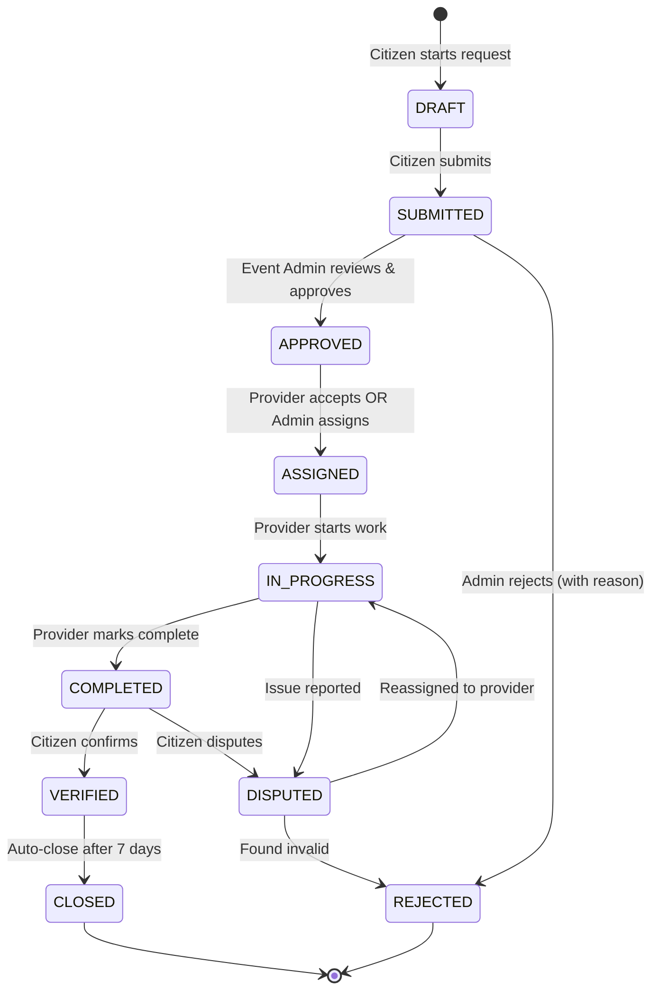

> *Type: Document (specification) · Audience: Product, developers · Status: Archived — v3 historical generation*

# IDRM: Functional Specification

<!-- IDRM-CLEANUP doc=v3-11-funcspec status=ANNOTATED-VARIANT pass=2026-08-16 -->
> ## 🗺️ VARIANT NOTE — functional spec → `docs/mvp/11`
> → [`../../../../docs/mvp/11-requirements-scope-and-acceptance.md`](../../../../docs/mvp/11-requirements-scope-and-acceptance.md)
> (F1–F11, lifecycle, acceptance) + traceability `docs/mvp/13`; conformance rows in `docs/mvp/26`. MVP-aligned.
> *Program:* `../../_CLEANUP-LEDGER.md`, `../../../instructions.txt` §12.
## Complete Business Requirements & User Stories

**Version**: 3.0 Consolidated  
**Audience**: Product managers, business analysts, QA engineers, UX designers  
**Reading Time**: 60-90 minutes  
**Last Updated**: May 15, 2026

---

## 📚 **Table of Contents**

1. [Executive Summary](#1-executive-summary)
2. [System Overview](#2-system-overview)
3. [User Roles & Permissions](#3-user-roles--permissions)
4. [Functional Requirements](#4-functional-requirements)
5. [User Stories](#5-user-stories)
6. [Business Workflows](#6-business-workflows)
7. [Business Rules](#7-business-rules)
8. [Non-Functional Requirements](#8-non-functional-requirements)
9. [Success Criteria](#9-success-criteria)
10. [Acceptance Criteria](#10-acceptance-criteria)
11. [Out of Scope](#11-out-of-scope)

---

## 1. **Executive Summary**

### 1.1 Document Purpose

This Functional Specification defines **WHAT the IDRM platform does** from a business perspective, focusing on user needs, system capabilities, and expected behaviors—without technical implementation details.

### 1.2 System Scope

**IDRM MVP** is a **map-based disaster response coordination platform** for India that:

**Core Capabilities**:
- ✅ Enables citizens to **request emergency services** during disasters
- ✅ Allows service providers to **view and accept** requests on an interactive map
- ✅ Provides authorities with **real-time visibility** into response operations
- ✅ Ensures **transparent financial tracking** of donations
- ✅ Maintains **complete audit trails** for accountability

**Target Scale** (MVP):
- 100,000 monthly active users
- 10,000 concurrent users
- Pan-India coverage
- 1,000+ service provider organizations

### 1.3 Intended Audience

| Reader | Use This Document For |
|--------|----------------------|
| **Business Stakeholders** | Understanding system capabilities and ROI |
| **Product Managers** | Prioritizing features and managing backlog |
| **UX/UI Designers** | Designing user interfaces and flows |
| **Developers** | Understanding user requirements before coding |
| **QA Engineers** | Creating test cases and acceptance tests |
| **Training Teams** | Developing user documentation and training |

---

## 2. **System Overview**

### 2.1 The Problem

**Current State of Disaster Response in India**:

1. **Fragmentation**: Multiple agencies operate independently with no unified system
2. **Information Silos**: No real-time sharing of information across stakeholders
3. **Delayed Coordination**: Manual phone/email communication causes delays
4. **Limited Transparency**: Citizens and donors can't track relief efforts
5. **Duplicate Efforts**: Same areas served multiple times, others neglected
6. **Privacy Concerns**: Sensitive victim data shared without proper access control

**Impact**: Slower response times, wasted resources, reduced public trust

### 2.2 The Solution

**IDRM Platform Provides**:

```
┌─────────────────────────────────────────────┐
│         Single Unified Platform              │
├─────────────────────────────────────────────┤
│                                             │
│  📍 MAP-BASED COORDINATION                  │
│     All activity visible on one map         │
│     Real-time updates                       │
│                                             │
│  🚨 SERVICE REQUEST MANAGEMENT              │
│     Citizens submit requests                │
│     Providers view and respond              │
│     Authorities oversee                     │
│                                             │
│  💰 FINANCIAL TRANSPARENCY                  │
│     Track every rupee donated               │
│     See how funds are allocated             │
│     Audit trails for compliance             │
│                                             │
│  🔐 PRIVACY & SECURITY                      │
│     Role-based access control               │
│     Three privacy levels                    │
│     Sensitive data protected                │
│                                             │
│  📊 ANALYTICS & INSIGHTS                    │
│     Real-time dashboards                    │
│     Performance metrics                     │
│     Impact assessment reports               │
│                                             │
└─────────────────────────────────────────────┘
```

### 2.3 Key Business Processes

**1. Service Request Lifecycle**:
```
Citizen submits request → 
Authority reviews → 
Provider accepts → 
Service delivered → 
Citizen confirms → 
System archives
```

**2. Provider Onboarding**:
```
Organization registers → 
Admin verifies credentials → 
Provider activated → 
Capacity configured → 
Start accepting requests
```

**3. Donation Flow**:
```
Donor contributes → 
Funds pooled → 
Authority allocates to service → 
Provider receives payment → 
Transaction logged
```

**4. Disaster Event Management**:
```
Authority declares event → 
Affected area mapped → 
Resources mobilized → 
Requests coordinated → 
Event closed → 
Impact report generated
```

---

## 3. **User Roles & Permissions**

### 3.1 Role Hierarchy

```
┌─────────────────────────────────────┐
│       System Admin (Level 8)        │
│    Full platform control            │
└──────────────┬──────────────────────┘
               │
      ┌────────┴────────┬─────────────┐
      │                 │             │
┌─────▼─────┐   ┌───────▼────┐  ┌────▼────┐
│Event Admin│   │  Auditor   │  │Executive│
│ (Level 7) │   │ (Level 7)  │  │(Level 6)│
└─────┬─────┘   └────────────┘  └────┬────┘
      │                              │
      ├──────────┬──────────┬────────┤
      │          │          │        │
  ┌───▼───┐  ┌──▼───┐  ┌───▼──┐ ┌──▼────┐
  │Manager│  │Event │  │Organ-│ │Service│
  │(Lv 5) │  │Mgr(5)│  │izer  │ │Prov(4)│
  └───┬───┘  └──────┘  └───┬──┘ └───────┘
      │                    │
  ┌───▼──────────────┬─────▼────┐
  │   Volunteer      │ Citizen  │
  │   (Level 3)      │ (Level 2)│
  └──────────────────┴──────────┘
```

### 3.2 Complete Role Definitions

#### **Individual** (Level 1)

**WHO**: General public, no account required

**CAN DO**:
- ✅ View public disaster information
- ✅ See public service statistics
- ✅ Browse public map (limited features)

**CANNOT DO**:
- ❌ Submit service requests
- ❌ See detailed service information
- ❌ Access any personal data

**Use Case**: Anonymous visitors checking disaster status

---

#### **Participant / Citizen** (Level 2)

**WHO**: Registered citizens affected by disasters

**CAN DO**:
- ✅ Create service requests (medical, food, shelter, rescue)
- ✅ Track own request status in real-time
- ✅ Upload photos/documents as evidence
- ✅ Set privacy level for requests (Public/Protected/Private)
- ✅ Confirm service completion
- ✅ Rate service quality
- ✅ Update own profile information

**CANNOT DO**:
- ❌ View other users' private requests
- ❌ Accept or fulfill service requests
- ❌ Access system administration features
- ❌ See financial donation details

**Use Case**: Person needing help during flood submits request for food supplies

---

#### **Volunteer** (Level 3)

**WHO**: Community volunteers assisting in disaster response

**CAN DO**:
- ✅ All Participant/Citizen permissions, PLUS:
- ✅ Create requests on behalf of others
- ✅ View requests in their assigned area
- ✅ Add field notes and updates to requests
- ✅ Verify service delivery (with photos)
- ✅ Mark requests as "Verified Complete"

**CANNOT DO**:
- ❌ Approve or assign service requests
- ❌ Access financial information
- ❌ Manage organizations

**Use Case**: Volunteer surveying affected area creates multiple requests for elderly residents

---

#### **Organizer** (Level 4)

**WHO**: Team leads coordinating groups of volunteers

**CAN DO**:
- ✅ All Volunteer permissions, PLUS:
- ✅ Manage volunteer team members
- ✅ Assign tasks to volunteers
- ✅ View team performance metrics
- ✅ Create field reports
- ✅ Coordinate multiple volunteers

**CANNOT DO**:
- ❌ Approve service requests formally
- ❌ Allocate financial resources
- ❌ Access system-wide data

**Use Case**: NGO team lead assigns 5 volunteers to survey flood-affected neighborhoods

---

#### **Service Provider** (Level 4)

**WHO**: Organizations/individuals delivering disaster relief services

**CAN DO**:
- ✅ View available service requests (matching their service type)
- ✅ Accept service assignments
- ✅ Update service delivery status (In Progress, Completed)
- ✅ Upload proof of delivery (photos, receipts)
- ✅ Manage their availability/capacity
- ✅ View their service history
- ✅ Communicate with requesters (if permitted by privacy level)

**CANNOT DO**:
- ❌ Create service requests (conflict of interest)
- ❌ Approve or prioritize requests
- ❌ View financial allocation details
- ❌ Access other providers' data

**Use Case**: Medical clinic accepts request to provide first aid, updates status after treatment

---

#### **Manager** (Level 5)

**WHO**: Service provider organization managers

**CAN DO**:
- ✅ All Service Provider permissions, PLUS:
- ✅ Manage multiple service providers in organization
- ✅ View organization-wide performance metrics
- ✅ Allocate resources within organization
- ✅ Generate organization reports
- ✅ Manage organization profile and service areas

**CANNOT DO**:
- ❌ Approve requests outside organization scope
- ❌ Access other organizations' data
- ❌ Modify system-wide settings

**Use Case**: NGO manager assigns 3 medical teams to different disaster zones

---

#### **Executive** (Level 6)

**WHO**: Senior leadership of service provider organizations

**CAN DO**:
- ✅ All Manager permissions, PLUS:
- ✅ View high-level strategic analytics
- ✅ Access financial summaries for organization
- ✅ Generate executive reports
- ✅ Make strategic decisions on resource allocation

**CANNOT DO**:
- ❌ Day-to-day operational management
- ❌ Direct service delivery
- ❌ System administration

**Use Case**: NGO director reviews quarterly disaster response impact report

---

#### **Event Admin** (Level 7)

**WHO**: Government disaster management authorities

**CAN DO**:
- ✅ Create and manage disaster events
- ✅ Define affected geographical areas (draw on map)
- ✅ Approve high-priority service requests
- ✅ Assign priorities to requests
- ✅ Allocate financial resources to services
- ✅ View all requests within jurisdiction
- ✅ Generate official reports for government
- ✅ Coordinate between multiple providers
- ✅ Declare event status (Active, Resolved, Closed)

**CANNOT DO**:
- ❌ Delete audit logs
- ❌ Modify system configuration
- ❌ Access other jurisdictions without permission

**Use Case**: District Collector declares flood event, defines affected taluks, allocates ₹50 lakhs for relief

---

#### **Auditor** (Level 7)

**WHO**: Financial and operational auditors

**CAN DO**:
- ✅ View all financial transactions (read-only)
- ✅ Access complete audit logs
- ✅ Generate compliance reports
- ✅ Track fund utilization
- ✅ Verify service delivery records
- ✅ Flag irregularities
- ✅ Export data for external audits

**CANNOT DO**:
- ❌ Modify any data
- ❌ Approve or reject requests
- ❌ Allocate funds
- ❌ Delete logs

**Use Case**: CAG auditor reviews ₹1 crore disaster fund allocation across 3 months

---

#### **System Admin** (Level 8)

**WHO**: IT team managing the platform

**CAN DO**:
- ✅ **EVERYTHING** - Full system access
- ✅ Create/edit/delete user accounts
- ✅ Assign any role to any user
- ✅ Configure system settings
- ✅ Access all data (for maintenance/troubleshooting)
- ✅ Manage organizations
- ✅ View system health metrics
- ✅ Perform database backups
- ✅ Reset passwords

**CANNOT DO**:
- ❌ Nothing - but actions are heavily audited

**Use Case**: IT admin troubleshoots login issue, views user session logs

---

### 3.3 Permission Matrix

| Permission | Individual | Citizen | Volunteer | Organizer | Service Provider | Manager | Executive | Event Admin | Auditor | Sys Admin |
|------------|:----------:|:-------:|:---------:|:---------:|:----------------:|:-------:|:---------:|:-----------:|:-------:|:---------:|
| **View public map** | ✅ | ✅ | ✅ | ✅ | ✅ | ✅ | ✅ | ✅ | ✅ | ✅ |
| **Create service request** | ❌ | ✅ | ✅ | ✅ | ❌ | ❌ | ❌ | ✅ | ❌ | ✅ |
| **View own requests** | ❌ | ✅ | ✅ | ✅ | ✅ | ✅ | ✅ | ✅ | ✅ | ✅ |
| **View all requests** | ❌ | ❌ | ⚠️ Area | ⚠️ Area | ⚠️ Type | ⚠️ Org | ⚠️ Org | ✅ | ✅ | ✅ |
| **Accept service request** | ❌ | ❌ | ❌ | ❌ | ✅ | ✅ | ❌ | ❌ | ❌ | ✅ |
| **Approve service request** | ❌ | ❌ | ❌ | ❌ | ❌ | ❌ | ❌ | ✅ | ❌ | ✅ |
| **Create disaster event** | ❌ | ❌ | ❌ | ❌ | ❌ | ❌ | ❌ | ✅ | ❌ | ✅ |
| **Allocate funds** | ❌ | ❌ | ❌ | ❌ | ❌ | ❌ | ⚠️ Org | ✅ | ❌ | ✅ |
| **View financial data** | ❌ | ❌ | ❌ | ❌ | ❌ | ⚠️ Org | ⚠️ Org | ✅ | ✅ | ✅ |
| **Manage users** | ❌ | ❌ | ❌ | ⚠️ Team | ⚠️ Org | ⚠️ Org | ⚠️ Org | ⚠️ Jurisdiction | ❌ | ✅ |
| **View audit logs** | ❌ | ❌ | ❌ | ❌ | ❌ | ❌ | ❌ | ⚠️ Limited | ✅ | ✅ |
| **System configuration** | ❌ | ❌ | ❌ | ❌ | ❌ | ❌ | ❌ | ❌ | ❌ | ✅ |

**Legend**:
- ✅ = Full access
- ❌ = No access
- ⚠️ = Limited access (scope indicated)

---

## 4. **Functional Requirements**

### 4.1 User Management (FR-UM)

#### FR-UM-001: User Registration

**Requirement**: System shall allow new users to register with email and password

**Acceptance Criteria**:
- User provides: email, password, full name, phone number
- Email must be unique (no duplicates)
- Password must be at least 8 characters with 1 uppercase, 1 number, 1 special character
- System sends email verification link
- Account is inactive until email verified
- User receives welcome email after verification

**Priority**: ❗ Critical  
**User Roles**: All prospective users

---

#### FR-UM-002: Email Verification

**Requirement**: System shall verify user email address before account activation

**Acceptance Criteria**:
- Verification email sent within 1 minute of registration
- Verification link valid for 24 hours
- User clicks link, account activated
- If link expires, user can request new verification email
- System logs all verification attempts

**Priority**: ❗ Critical  
**User Roles**: All new users

---

#### FR-UM-003: Login/Logout

**Requirement**: System shall authenticate users via email and password

**Acceptance Criteria**:
- User enters email and password
- System validates credentials
- If valid, generates JWT token (1 hour expiry)
- If invalid, shows error message (max 5 attempts before 15-minute lockout)
- Logout invalidates token immediately
- Session timeout after 1 hour of inactivity

**Priority**: ❗ Critical  
**User Roles**: All registered users

---

#### FR-UM-004: Password Reset

**Requirement**: System shall allow users to reset forgotten passwords

**Acceptance Criteria**:
- User requests password reset via email
- System sends reset link (valid 1 hour)
- User clicks link, enters new password
- Password must meet complexity requirements
- System confirms reset, invalidates old sessions
- System logs password reset event

**Priority**: ⚠️ High  
**User Roles**: All registered users

---

#### FR-UM-005: Profile Management

**Requirement**: System shall allow users to update their profile information

**Acceptance Criteria**:
- User can update: name, phone, profile picture, notification preferences
- User CANNOT change: email (immutable), role (admin-only)
- Changes logged in audit trail
- Profile picture max 2MB, formats: JPG, PNG
- Phone number must be Indian format (+91 XXXXXXXXXX)

**Priority**: ⚠️ High  
**User Roles**: All registered users

---

### 4.2 Service Request Management (FR-SR)

#### FR-SR-001: Create Service Request

**Requirement**: System shall allow authorized users to create service requests

**Acceptance Criteria**:
- User provides: service type, description, location (GPS or address), urgency, photos (optional)
- Service types: Medical, Food, Shelter, Rescue, Water, Clothing, Other
- Urgency levels: Critical, High, Medium, Low
- Location can be set by: dropping pin on map, entering address, or auto-detected GPS
- Photos: max 5, each max 5MB
- Privacy level: Public, Protected, or Private
- Request gets unique ID
- Requester receives confirmation notification

**Priority**: ❗ Critical  
**User Roles**: Participant, Volunteer, Organizer, Event Admin

---

#### FR-SR-002: View Service Requests

**Requirement**: System shall display service requests based on user role and permissions

**Acceptance Criteria**:
- **Citizen**: Sees only own requests
- **Volunteer**: Sees requests in assigned area
- **Service Provider**: Sees requests matching their service type within service area
- **Manager**: Sees all requests for their organization
- **Event Admin**: Sees all requests in jurisdiction
- **Auditor**: Sees all requests (read-only)
- Map view shows color-coded markers: Red (Critical), Orange (High), Yellow (Medium), Green (Low)
- List view with filters: status, type, urgency, date range

**Priority**: ❗ Critical  
**User Roles**: All registered users (scoped by role)

---

#### FR-SR-003: Update Service Request

**Requirement**: System shall allow authorized users to update service request details

**Acceptance Criteria**:
- **Requester**: Can update description, urgency, photos until request is ASSIGNED
- **Volunteer**: Can add field notes and additional photos
- **Service Provider**: Can update status (In Progress, Completed)
- **Event Admin**: Can update any field
- All changes logged with timestamp and user
- Notifications sent to relevant stakeholders on status change

**Priority**: ❗ Critical  
**User Roles**: Participant, Volunteer, Service Provider, Event Admin

---

#### FR-SR-004: Delete/Cancel Service Request

**Requirement**: System shall allow users to cancel service requests under specific conditions

**Acceptance Criteria**:
- **Requester**: Can delete request if status is DRAFT or SUBMITTED (not yet assigned)
- **Event Admin**: Can cancel any request (logged with reason)
- Cancelled requests marked as CANCELLED (not deleted from database)
- Provider notified if request was assigned
- Cannot delete completed or verified requests (audit requirement)

**Priority**: ⚠️ High  
**User Roles**: Participant (own requests), Event Admin (any request)

---

#### FR-SR-005: Assign Service Provider

**Requirement**: System shall facilitate assignment of service providers to requests

**Acceptance Criteria**:
- **Manual Assignment**: Event Admin or Manager assigns specific provider
- **Self-Assignment**: Service Provider accepts available request
- **Auto-Suggestion**: System suggests nearby providers with capacity
- Provider notified of assignment via email + in-app notification
- Request status changes to ASSIGNED
- Only one provider per request
- Cannot assign if provider at capacity

**Priority**: ❗ Critical  
**User Roles**: Service Provider (self), Manager (org), Event Admin (any)

---

#### FR-SR-006: Track Service Status

**Requirement**: System shall track service request through complete lifecycle

**Acceptance Criteria**:
- **Status Flow**: DRAFT → SUBMITTED → APPROVED → ASSIGNED → IN_PROGRESS → COMPLETED → VERIFIED → CLOSED
- Each status change logged with: timestamp, user who changed it, reason (if applicable)
- Status timeline visible to requester and assigned provider
- Notifications sent at each status change
- Cannot skip states (except Event Admin can force-change)

**Priority**: ❗ Critical  
**User Roles**: All (view), Service Provider + Event Admin (update)

---

### 4.3 Geospatial Features (FR-GEO)

#### FR-GEO-001: Interactive Map Display

**Requirement**: System shall display an interactive map showing all relevant service requests and providers

**Acceptance Criteria**:
- Base map: OpenStreetMap or similar
- Shows India at zoom level 5 on load
- Service requests as markers (color by urgency)
- Provider locations as different marker icon
- Disaster zone boundaries (if applicable)
- Pan and zoom controls
- Search location by name or coordinates
- Marker clustering for dense areas (>50 markers)

**Priority**: ❗ Critical  
**User Roles**: All users

---

#### FR-GEO-002: Proximity Search

**Requirement**: System shall find service requests or providers near a given location

**Acceptance Criteria**:
- User selects location on map or enters coordinates
- User sets radius (1km, 5km, 10km, 25km, 50km)
- System queries PostGIS for all requests/providers within radius
- Results sorted by distance (nearest first)
- Shows distance in kilometers
- Results update in real-time as user pans map

**Priority**: ⚠️ High  
**User Roles**: Service Provider, Manager, Event Admin

---

#### FR-GEO-003: Service Area Definition

**Requirement**: System shall allow service providers to define their service coverage area

**Acceptance Criteria**:
- Provider draws polygon on map defining service area
- Or provider enters list of districts/pincodes
- System stores as PostGIS geometry
- Only requests within service area shown to provider
- Service area visible to Event Admins for planning

**Priority**: ⚠️ High  
**User Roles**: Manager (define), Event Admin (view all)

---

#### FR-GEO-004: Disaster Zone Mapping

**Requirement**: System shall allow authorities to map disaster-affected areas

**Acceptance Criteria**:
- Event Admin draws polygon on map showing affected area
- System calculates: area (sq km), estimated population (future)
- All requests within polygon automatically linked to disaster event
- Disaster zone visible on public map (different color overlay)
- Can update boundaries as situation evolves

**Priority**: ⚠️ High  
**User Roles**: Event Admin

---

### 4.4 Provider Management (FR-PM)

#### FR-PM-001: Provider Registration

**Requirement**: System shall allow service provider organizations to register

**Acceptance Criteria**:
- Organization provides: name, type (NGO/Govt/Private), registration number, services offered, contact details
- System verifies registration number (manual or API check - future)
- Admin reviews and approves registration
- Organization gets account credentials
- Can add team members after approval

**Priority**: ❗ Critical  
**User Roles**: Prospective providers → Admin approves

---

#### FR-PM-002: Capacity Management

**Requirement**: System shall track service provider capacity and availability

**Acceptance Criteria**:
- Provider sets capacity: number of concurrent requests they can handle
- System shows current load: X requests in progress out of Y capacity
- Prevents assignment if at capacity
- Provider can update capacity in real-time
- Dashboard shows capacity utilization metrics

**Priority**: ⚠️ High  
**User Roles**: Service Provider, Manager

---

#### FR-PM-003: Provider Performance Metrics

**Requirement**: System shall track and display provider performance statistics

**Acceptance Criteria**:
- Metrics: total requests completed, average completion time, success rate, user ratings
- Visible to: Manager (own org), Event Admin (all orgs), Auditor
- Used for: performance reviews, capacity planning, resource allocation
- Historical trends shown in charts

**Priority**: 🔵 Medium  
**User Roles**: Manager, Event Admin, Auditor

---

### 4.5 Financial Transparency (FR-FIN)

#### FR-FIN-001: Donation Recording

**Requirement**: System shall record all monetary donations

**Acceptance Criteria**:
- Donor provides: amount, payment method, donor name (optional - can be anonymous)
- System generates unique donation ID
- Payment processed via payment gateway (Razorpay/Paytm - future)
- Donor receives receipt via email
- Donation logged in audit trail

**Priority**: ⚠️ High  
**User Roles**: Anyone (donors)

---

#### FR-FIN-002: Fund Allocation

**Requirement**: System shall track allocation of donated funds to service requests

**Acceptance Criteria**:
- Event Admin allocates funds to specific disaster event or service request
- System tracks: amount allocated, date, allocating authority, purpose
- Cannot allocate more than available balance
- Transaction logged with complete audit trail
- Donor can see how their donation was used (if not anonymous)

**Priority**: ⚠️ High  
**User Roles**: Event Admin (allocate), Donor (view own)

---

#### FR-FIN-003: Financial Reports

**Requirement**: System shall generate financial transparency reports

**Acceptance Criteria**:
- Reports available: donations received, funds allocated, funds disbursed, balance remaining
- Filter by: date range, disaster event, service type
- Export formats: PDF, Excel
- Public summary report (aggregate numbers only)
- Detailed report for Auditors (transaction-level data)

**Priority**: ⚠️ High  
**User Roles**: Event Admin, Auditor (detailed), Public (summary)

---

### 4.6 Notifications (FR-NOT)

#### FR-NOT-001: Email Notifications

**Requirement**: System shall send email notifications for key events

**Acceptance Criteria**:
- Events triggering email: account verification, password reset, service request status change, provider assignment, service completed
- Email templates: professional, branded, clear call-to-action
- Sent within 1 minute of event
- User can opt-out of non-critical emails
- Delivery status logged

**Priority**: ⚠️ High  
**User Roles**: All users

---

#### FR-NOT-002: In-App Notifications

**Requirement**: System shall show in-app notifications for real-time updates

**Acceptance Criteria**:
- Notification badge shows unread count
- Clicking opens notification center
- Notifications include: icon, title, message, timestamp, link to relevant page
- Mark as read/unread
- Auto-delete after 30 days

**Priority**: 🔵 Medium  
**User Roles**: All registered users

---

#### FR-NOT-003: SMS Notifications (Future)

**Requirement**: System shall send SMS notifications for critical alerts

**Acceptance Criteria**:
- Only for CRITICAL urgency service requests
- Sent to: requester, assigned provider, Event Admin
- Message: brief, includes request ID and location
- User can opt-out (except for critical safety alerts)

**Priority**: 🟢 Low (Future Phase)  
**User Roles**: Participant, Service Provider, Event Admin

---

### 4.7 Reporting & Analytics (FR-REP)

#### FR-REP-001: Dashboard

**Requirement**: System shall provide role-specific dashboards with key metrics

**Acceptance Criteria**:
- **Citizen**: Own request status, nearby services
- **Provider**: Assigned requests, completion rate, pending tasks
- **Manager**: Organization performance, team metrics
- **Event Admin**: Overall disaster response metrics, resource allocation, geographic heat maps
- Real-time data updates
- Interactive charts and graphs

**Priority**: ⚠️ High  
**User Roles**: All registered users (scoped by role)

---

#### FR-REP-002: Impact Reports

**Requirement**: System shall generate impact assessment reports for completed disaster events

**Acceptance Criteria**:
- Metrics: total requests received, services provided, funds utilized, response time (avg/median), affected population served
- Geographic distribution of services
- Provider performance summary
- Financial transparency section
- Export as PDF for government submission

**Priority**: 🔵 Medium  
**User Roles**: Event Admin, Auditor

---

### 4.8 Security & Privacy (FR-SEC)

#### FR-SEC-001: Privacy Levels

**Requirement**: System shall support three privacy levels for service requests

**Acceptance Criteria**:
- **Public**: Anyone can see (name visible, full details)
- **Protected**: Only authorized responders (name redacted, contact via system)
- **Private**: Only requester and admins (all details hidden from public)
- Requester chooses level when creating request
- Default: Protected
- Cannot downgrade privacy (only upgrade)

**Priority**: ❗ Critical  
**User Roles**: All creating requests

---

#### FR-SEC-002: Audit Logging

**Requirement**: System shall log all sensitive actions for audit purposes

**Acceptance Criteria**:
- Logged actions: user login/logout, service request creation/update/deletion, fund allocation, role changes, system config changes
- Log entry includes: timestamp (UTC), user ID, IP address, action type, affected resource, old/new values
- Logs immutable (cannot be edited or deleted)
- Logs retained for 7 years (compliance)
- Accessible to: Auditor, System Admin

**Priority**: ❗ Critical  
**User Roles**: System (automatic logging)

---

#### FR-SEC-003: Data Encryption

**Requirement**: System shall encrypt sensitive data at rest and in transit

**Acceptance Criteria**:
- All HTTP traffic via HTTPS (TLS 1.3)
- Passwords hashed with bcrypt (cost 12)
- PII (Personally Identifiable Information) encrypted in database
- Database connections encrypted
- Backup files encrypted

**Priority**: ❗ Critical  
**User Roles**: System (automatic)

---

## 5. **User Stories**

### 5.1 Citizen/Participant Stories

#### **Story 1: Request Medical Help During Flood**

**As a** flood-affected citizen  
**I want to** request medical assistance for my injured family member  
**So that** we can receive timely medical care

**Acceptance Criteria**:
- ✅ I can create a service request from my phone
- ✅ I can mark the location where we are stranded
- ✅ I can upload a photo of the injury
- ✅ I can set urgency as "Critical"
- ✅ I receive confirmation that request was submitted
- ✅ I can track the request status in real-time
- ✅ I'm notified when a medical team is assigned
- ✅ I can confirm when help arrives

**Priority**: ❗ Critical

---

#### **Story 2: Track My Request Status**

**As a** citizen who submitted a request  
**I want to** see the real-time status of my request  
**So that** I know if help is coming and when

**Acceptance Criteria**:
- ✅ I can see request status (Submitted, Approved, Assigned, In Progress, Completed)
- ✅ I can see which organization is assigned
- ✅ I can see estimated time of arrival (if available)
- ✅ I receive notifications when status changes
- ✅ I can see provider's contact (if privacy allows)

**Priority**: ❗ Critical

---

### 5.2 Volunteer Stories

#### **Story 3: Survey Affected Area**

**As a** volunteer surveying a flood-affected neighborhood  
**I want to** create service requests on behalf of multiple affected people  
**So that** they receive help even if they don't have internet/phone

**Acceptance Criteria**:
- ✅ I can create multiple requests quickly
- ✅ I can use GPS to mark exact locations
- ✅ I can take photos as evidence
- ✅ I can mark urgency based on my assessment
- ✅ System saves my draft if internet is lost
- ✅ Requests sync when internet returns

**Priority**: ⚠️ High

---

### 5.3 Service Provider Stories

#### **Story 4: Accept Service Request**

**As a** service provider (medical clinic)  
**I want to** see available requests near my location  
**So that** I can accept and respond to them

**Acceptance Criteria**:
- ✅ I see requests matching my service type (medical)
- ✅ I see requests within my service area (10km radius)
- ✅ I can see request details: location, urgency, description, photos
- ✅ I can accept a request with one click
- ✅ I'm notified immediately if someone else accepts it first
- ✅ Requester is notified when I accept
- ✅ I receive requester contact details (respecting privacy level)

**Priority**: ❗ Critical

---

#### **Story 5: Update Service Delivery Status**

**As a** service provider delivering food supplies  
**I want to** update the status as I work  
**So that** everyone knows the current progress

**Acceptance Criteria**:
- ✅ I can mark status as "In Progress" when I start
- ✅ I can add notes during delivery
- ✅ I can upload photos of delivered supplies
- ✅ I can mark as "Completed" when done
- ✅ Requester is notified at each step
- ✅ Event Admin can see real-time progress

**Priority**: ❗ Critical

---

### 5.4 Event Admin Stories

#### **Story 6: Declare Disaster Event**

**As an** Event Admin (District Collector)  
**I want to** declare a flood disaster event for my district  
**So that** resources can be mobilized and coordinated

**Acceptance Criteria**:
- ✅ I can create a disaster event with name, type, date
- ✅ I can draw affected area on map (select taluks/villages)
- ✅ System calculates affected area (sq km)
- ✅ All requests in that area automatically link to event
- ✅ Public map shows disaster zone
- ✅ I can activate emergency mode (high priority for all requests)
- ✅ I can close event when response is complete

**Priority**: ❗ Critical

---

#### **Story 7: Allocate Funds to Services**

**As an** Event Admin  
**I want to** allocate donated funds to specific service categories  
**So that** providers can be compensated for their services

**Acceptance Criteria**:
- ✅ I see total available funds
- ✅ I can allocate amount to disaster event or service type
- ✅ System prevents over-allocation
- ✅ Transaction is logged with my approval
- ✅ Providers see allocated budget for their services
- ✅ Public can see how funds were allocated (transparency)

**Priority**: ⚠️ High

---

### 5.5 Auditor Stories

#### **Story 8: Audit Financial Transactions**

**As an** Auditor from CAG  
**I want to** view all financial transactions for a disaster event  
**So that** I can verify proper utilization of funds

**Acceptance Criteria**:
- ✅ I can see all donations received (date, amount, donor)
- ✅ I can see all allocations made (date, amount, purpose, approver)
- ✅ I can see all disbursements (date, amount, recipient, service)
- ✅ I can match donation to utilization
- ✅ I can export complete transaction log as Excel
- ✅ I can see audit trail (who approved what when)

**Priority**: ⚠️ High

---

## 6. **Business Workflows**

### 6.1 Service Request Workflow



**State Descriptions**:

| State | Description | Who Can Change | Next States |
|-------|-------------|----------------|-------------|
| **DRAFT** | Citizen creating request, not submitted | Citizen | SUBMITTED (submit), [deleted] |
| **SUBMITTED** | Request submitted, awaiting review | Event Admin | APPROVED, REJECTED |
| **APPROVED** | Approved, visible to providers | Provider, Admin | ASSIGNED |
| **ASSIGNED** | Provider accepted, not started | Provider | IN_PROGRESS |
| **IN_PROGRESS** | Service delivery underway | Provider | COMPLETED, DISPUTED |
| **COMPLETED** | Provider marked complete | Citizen | VERIFIED, DISPUTED |
| **VERIFIED** | Citizen confirmed completion | System (auto) | CLOSED |
| **DISPUTED** | Issue with delivery | Admin | IN_PROGRESS, REJECTED |
| **REJECTED** | Request invalid/declined | Admin | [end state] |
| **CLOSED** | Successfully completed & verified | System (auto) | [end state] |

---

### 6.2 Provider Onboarding Workflow

```
Step 1: Organization Registration
├─ Fill registration form
├─ Provide: org name, type, reg number, services offered, contact
└─ Submit for review

Step 2: Admin Verification
├─ Admin reviews application
├─ Verifies registration number
├─ Checks credentials
└─ Approves OR Rejects (with reason)

Step 3: Account Setup (if approved)
├─ System creates organization account
├─ Sends credentials to org admin
└─ Org admin logs in

Step 4: Configuration
├─ Add team members (providers)
├─ Define service areas (draw on map or list pincodes)
├─ Set capacity (max concurrent requests)
└─ Upload documents (certificates, licenses)

Step 5: Go Live
├─ Admin activates organization
├─ Providers can now see and accept requests
└─ Organization appears in provider directory
```

---

### 6.3 Disaster Event Lifecycle

```
Phase 1: Event Declaration
├─ Disaster occurs (flood, earthquake, etc.)
├─ Event Admin creates disaster event
│   ├─ Event name, type, severity
│   └─ Draw affected area on map
├─ System links all requests in area to event
└─ Public notified via platform

Phase 2: Response Mobilization (0-72 hours)
├─ High-priority requests (CRITICAL, HIGH)
├─ Rapid provider assignments
├─ Real-time coordination
└─ Emergency fund allocation

Phase 3: Ongoing Response (3 days - 4 weeks)
├─ All priority levels addressed
├─ Capacity monitoring
├─ Provider performance tracking
└─ Regular status updates

Phase 4: Recovery & Closure (4+ weeks)
├─ Complete remaining requests
├─ Verify all deliveries
├─ Financial reconciliation
└─ Event marked as RESOLVED

Phase 5: Post-Event Analysis
├─ Generate impact report
├─ Lessons learned documentation
├─ Archive event data
└─ Event status: CLOSED
```

---

## 7. **Business Rules**

### 7.1 Service Request Rules

**BR-SR-001**: A service request MUST have exactly one requester  
**BR-SR-002**: A service request CAN have zero or one assigned provider  
**BR-SR-003**: Privacy level can only be increased, never decreased  
**BR-SR-004**: CRITICAL requests MUST be reviewed within 1 hour  
**BR-SR-005**: A request cannot be deleted if status is IN_PROGRESS or later  
**BR-SR-006**: Requester can only edit request before it's ASSIGNED  
**BR-SR-007**: Only requests in APPROVED status can be assigned to providers  
**BR-SR-008**: A provider can only accept requests within their service area  
**BR-SR-009**: Request auto-closes 7 days after VERIFIED status  

### 7.2 Provider Rules

**BR-PM-001**: A provider organization MUST have at least one team member  
**BR-PM-002**: Provider cannot accept requests if at full capacity  
**BR-PM-003**: Provider can only see requests matching their service type(s)  
**BR-PM-004**: Provider service area cannot be empty  
**BR-PM-005**: Provider cannot accept own organization's requests (conflict of interest)  

### 7.3 Financial Rules

**BR-FIN-001**: Total allocations CANNOT exceed total donations  
**BR-FIN-002**: All financial transactions MUST be logged in audit trail  
**BR-FIN-003**: Donations are non-refundable (exception: technical error)  
**BR-FIN-004**: Only Event Admin can allocate funds above ₹1 lakh  
**BR-FIN-005**: Anonymous donations shown in reports as "Anonymous Donor"  

### 7.4 Role & Permission Rules

**BR-ROLE-001**: A user can have multiple roles  
**BR-ROLE-002**: Only System Admin can assign System Admin role  
**BR-ROLE-003**: User cannot have both Service Provider and Event Admin roles (conflict)  
**BR-ROLE-004**: New users default to "Participant" role  
**BR-ROLE-005**: Role changes MUST be logged in audit trail  

---

## 8. **Non-Functional Requirements**

### 8.1 Performance Requirements

| Requirement | Target | Measurement |
|-------------|--------|-------------|
| **Page Load Time** | <2 seconds | p95 (95th percentile) |
| **API Response Time** | <200ms | p95 for standard queries |
| **Map Tile Load** | <100ms | Average |
| **Database Query** | <50ms | Average |
| **Concurrent Users** | 10,000 | Sustained without degradation |
| **Peak Load** | 25,000 | During major disaster (1 hour) |

### 8.2 Scalability Requirements

**NFR-SCALE-001**: System shall support horizontal scaling of services  
**NFR-SCALE-002**: Database shall support read replicas for scaling reads  
**NFR-SCALE-003**: System shall handle 100,000 service requests per disaster event  
**NFR-SCALE-004**: Map service shall support 10,000 concurrent tile requests  

### 8.3 Availability Requirements

**NFR-AVAIL-001**: System uptime: 99.5% (excluding planned maintenance)  
**NFR-AVAIL-002**: Planned maintenance window: Sundays 2-4 AM IST  
**NFR-AVAIL-003**: Recovery Time Objective (RTO): 4 hours  
**NFR-AVAIL-004**: Recovery Point Objective (RPO): 1 hour (max data loss)  

### 8.4 Security Requirements

**NFR-SEC-001**: All passwords hashed with bcrypt (cost factor 12)  
**NFR-SEC-002**: JWT tokens expire after 1 hour (access token)  
**NFR-SEC-003**: HTTPS mandatory for all production traffic  
**NFR-SEC-004**: Rate limiting: 100 requests per user per minute  
**NFR-SEC-005**: Audit logs retained for 7 years  
**NFR-SEC-006**: PII encrypted at rest using AES-256  

### 8.5 Usability Requirements

**NFR-USE-001**: System accessible on mobile devices (responsive design)  
**NFR-USE-002**: Core features work on 3G connection (< 1 Mbps)  
**NFR-USE-003**: Interface available in English and Hindi (future: regional languages)  
**NFR-USE-004**: No more than 3 clicks to create service request  
**NFR-USE-005**: Help documentation accessible from every page  

### 8.6 Compliance Requirements

**NFR-COMP-001**: Comply with IT Act 2000 (India)  
**NFR-COMP-002**: Comply with Data Protection regulations  
**NFR-COMP-003**: Audit trail as per government requirements  
**NFR-COMP-004**: Financial transaction records as per accounting standards  

---

## 9. **Success Criteria**

### 9.1 MVP Success Metrics

**Adoption Metrics**:
- ✅ 1,000+ registered citizens in first 3 months
- ✅ 50+ registered service provider organizations
- ✅ 10+ government agencies using platform

**Usage Metrics**:
- ✅ 500+ service requests per month
- ✅ 80%+ requests fulfilled within 24 hours
- ✅ 70%+ user satisfaction rating

**Performance Metrics**:
- ✅ 99% uptime
- ✅ <2 second page load time
- ✅ <200ms API response time

**Business Impact**:
- ✅ 20% reduction in duplicate relief efforts
- ✅ 30% faster average response time vs manual coordination
- ✅ 100% financial transparency (all transactions logged)

### 9.2 Long-Term Success Criteria

**After 1 Year**:
- 100,000+ monthly active users
- 1,000+ service provider organizations
- Pan-India coverage (all states)
- ₹10 crore+ in donations tracked
- 50,000+ service requests fulfilled

---

## 10. **Acceptance Criteria**

### 10.1 Feature Acceptance

Each feature is considered "done" when:
- ✅ All functional requirements implemented
- ✅ All acceptance criteria from user stories met
- ✅ Unit tests written and passing (>80% coverage)
- ✅ Integration tests passing
- ✅ Code reviewed and approved
- ✅ Deployed to staging environment
- ✅ QA tested and bugs resolved
- ✅ Product Owner approval received
- ✅ User documentation updated

### 10.2 MVP Acceptance

MVP is considered complete and production-ready when:
- ✅ All Critical (❗) requirements implemented
- ✅ All High (⚠️) requirements implemented
- ✅ System performance meets NFR targets
- ✅ Security audit completed and issues resolved
- ✅ Load testing completed (10,000 concurrent users)
- ✅ Disaster recovery plan tested
- ✅ User training materials prepared
- ✅ Go-live checklist completed
- ✅ Stakeholder sign-off received

---

## 11. **Out of Scope**

The following are **NOT** included in MVP:

### 11.1 Features Deferred to Future Phases

**Phase 2** (Post-MVP):
- ❌ Mobile apps (iOS/Android native)
- ❌ SMS notifications
- ❌ Push notifications
- ❌ Multi-language support (beyond English/Hindi)
- ❌ Offline mode
- ❌ Advanced analytics (AI/ML predictions)
- ❌ Integration with government databases (Aadhaar, etc.)

**Phase 3** (Long-term):
- ❌ Blockchain for donation tracking
- ❌ Drone footage integration
- ❌ Satellite imagery overlays
- ❌ Predictive disaster modeling
- ❌ International disaster coordination

### 11.2 Explicitly Not Supported

**Technical Limitations**:
- ❌ Internet Explorer browser support
- ❌ Devices with <2GB RAM
- ❌ Operating systems: Windows XP, older Android <8

**Functional Limitations**:
- ❌ Financial transactions (payment gateway integration - future)
- ❌ Direct messaging between users (privacy concerns - future)
- ❌ Video uploads (bandwidth limitations - future)
- ❌ Real-time voice/video calls

---

## ✅ **Functional Specification Summary**

**What This Document Defined**:
- ✅ **8 User Roles** with complete permission matrix
- ✅ **35+ Functional Requirements** across 8 categories
- ✅ **12+ User Stories** with acceptance criteria
- ✅ **Complete Business Workflows** for key processes
- ✅ **Business Rules** governing system behavior
- ✅ **Non-Functional Requirements** for performance, security, scalability
- ✅ **Success Criteria** for MVP and long-term
- ✅ **Clear Scope** - what's in and what's out

**Key Business Capabilities**:
1. **Service Request Management** - End-to-end lifecycle
2. **Geospatial Coordination** - Map-based visibility
3. **Provider Management** - Capacity and performance tracking
4. **Financial Transparency** - Complete donation tracking
5. **Role-Based Access** - Privacy and security
6. **Audit & Compliance** - Full accountability

---

## 📖 **What's Next?**

**For Technical Implementation**:
→ [21-TECHNICAL-DESIGN.md](21-TECHNICAL-DESIGN.md) - Detailed component design  
→ [22-DATABASE-DESIGN.md](22-DATABASE-DESIGN.md) - Complete database schema  
→ [23-API-SPECIFICATION.md](23-API-SPECIFICATION.md) - API endpoint documentation

**For Understanding Architecture**:
→ [10-SYSTEM-ARCHITECTURE.md](10-SYSTEM-ARCHITECTURE.md) - System design

**For Setup & Deployment**:
→ [30-DEVELOPMENT-SETUP.md](30-DEVELOPMENT-SETUP.md) - Local environment  
→ [31-STAGING-SETUP.md](31-STAGING-SETUP.md) - Staging deployment

---

**Document Information**  
**Version**: 3.0 Consolidated  
**Created**: May 15, 2026  
**Part of**: IDRM Consolidated Documentation Suite  
**Previous**: [10-SYSTEM-ARCHITECTURE.md](10-SYSTEM-ARCHITECTURE.md)  
**Next**: [21-TECHNICAL-DESIGN.md](21-TECHNICAL-DESIGN.md)  
**Related**: [IDRM-MVP-PRD-v2.md](historical/IDRM-MVP-PRD-v2.md)  
**Feedback**: Open an issue or submit a PR on GitHub
