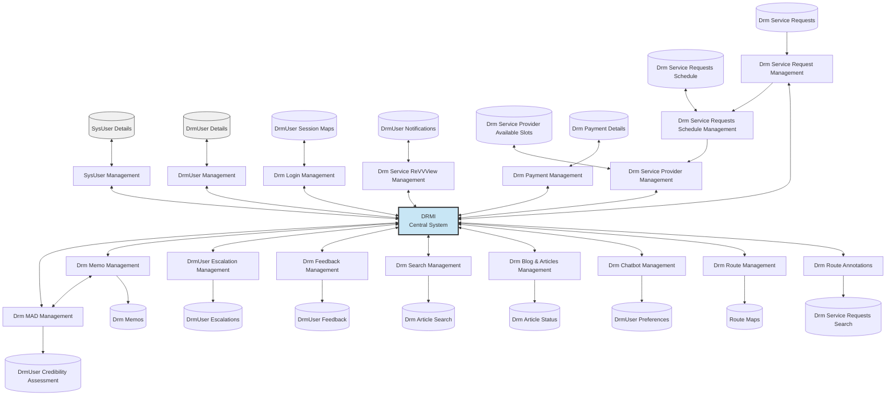
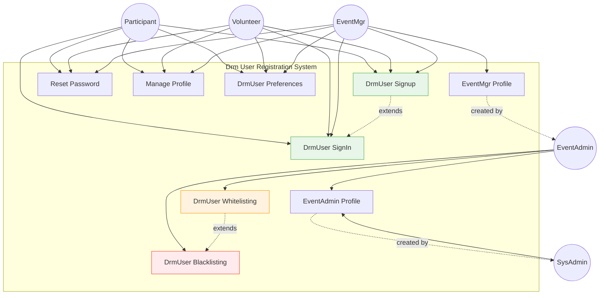
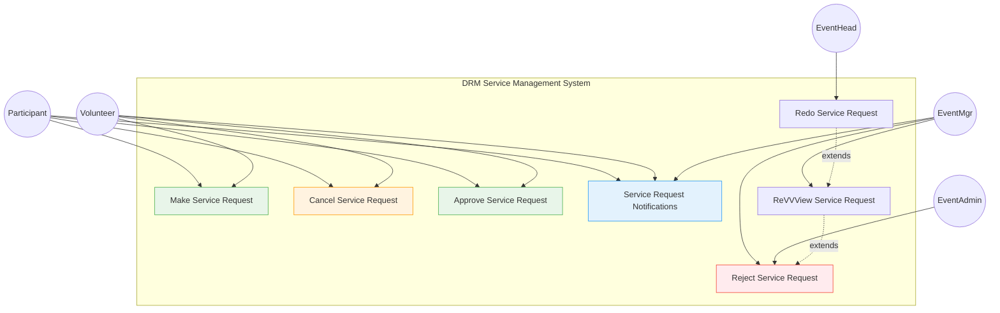

```mermaid
classDiagram
    %% Column 1: Core System
    class DrmWiz {
        +wizardLogic()
    }
    class Dashboards {
        +displayMetrics()
    }
    class OpsMode {
        +manageOperations()
    }
    class PoliceD {
        +policeOperations()
    }
    class MADAlerts {
        +generateAlerts()
    }
    class MADHandling {
        +handleMAD()
    }
    class MADBlacklists {
        +manageBlacklists()
    }
    class MADWhitelists {
        +manageWhitelists()
    }
    class DrmNotes {
        +createNotes()
    }

    %% Column 2: Annotation & Validation
    class DRDAnnotator {
        +annotateRoutes()
    }
    class Services {
        +manageServices()
    }
    class Validators {
        +validateData()
    }
    class Providers {
        +manageProviders()
    }
    class Requestors {
        +manageRequestors()
    }
    class ReVV {
        +validateRequests()
    }
    class AnnotatorNotes {
        +documentAnnotations()
    }
    class MLOps {
        +mlOperations()
    }
    class HealthMon {
        +monitorHealth()
    }
    class DevSecOps {
        +securityOperations()
    }
    class ConfigNotes {
        +configurationDocs()
    }

    %% Column 3: Team & Visibility
    class TeamVis {
        +teamVisibility()
    }
    class LocationAlerts {
        +locationBasedAlerts()
    }
    class LiveTracking {
        +trackLiveData()
    }
    class TeamNotify {
        +notifyTeam()
    }
    class Charity {
        +charityManagement()
    }
    class Pooling {
        +resourcePooling()
    }
    class Grants {
        +manageGrants()
    }
    class SevaCard {
        +volunteerCards()
    }
    class eServing {
        +electronicServing()
    }
    class CharityNotes {
        +charityDocs()
    }

    %% Column 4: Search & Discovery
    class Search {
        +searchFunctionality()
    }
    class Filters {
        +filterResults()
    }
    class ServiceType {
        +categorizeServices()
    }
    class ServiceID {
        +identifyServices()
    }
    class Location {
        +locationServices()
    }
    class Contextual {
        +contextualSearch()
    }
    class Tagging {
        +tagManagement()
    }
    class Trending {
        +trendAnalysis()
    }
    class Bookmarks {
        +manageBookmarks()
    }
    class SearchNotes {
        +searchDocs()
    }

    %% Column 5: Content & Communication
    class ChatBot {
        +chatInteraction()
    }
    class Blog {
        +contentManagement()
    }
    class Article {
        +articlePublishing()
    }
    class Feedback {
        +collectFeedback()
    }
    class IIntegrations {
        +integrateServices()
    }
    class MDValidator {
        +validateMarkdown()
    }
    class MDEditor {
        +editMarkdown()
    }
    class InfoNotes {
        +informationDocs()
    }

    %% Column 6: Scheduling & Tasks
    class Scheduler {
        +scheduleEvents()
    }
    class Event {
        +manageEvents()
    }
    class Task {
        +taskManagement()
    }
    class SubTask {
        +subTaskManagement()
    }
    class CollabNotes {
        +collaborationDocs()
    }
    class Notifications {
        +sendNotifications()
    }
    class Escalations {
        +escalateIssues()
    }
    class Grievances {
        +grievanceHandling()
    }
    class Pending {
        +pendingItems()
    }
    class ActNotes {
        +actionNotes()
    }

    %% Column 7: Authentication & IAM
    class IAMAA {
        +identityManagement()
    }
    class SignUp {
        +userRegistration()
    }
    class SignIn {
        +userAuthentication()
    }
    class PrivacyPP {
        +privacyPolicy()
    }
    class MFA {
        +multiFactorAuth()
    }
    class OAuth {
        +oauthIntegration()
    }
    class JWT {
        +tokenManagement()
    }
    class OTP {
        +oneTimePassword()
    }
    class Biometric {
        +biometricAuth()
    }
    class EPA {
        +externalProviderAuth()
    }
    class IAMAANotes {
        +iamDocs()
    }

    %% Column 8: Roles & Permissions
    class Roles {
        +roleManagement()
    }
    class Individual {
        +individualUsers()
    }
    class SysAdmin {
        +systemAdmin()
    }
    class Auditor {
        +auditOperations()
    }
    class EventAdmin {
        +eventAdministration()
    }
    class Manager {
        +managerOperations()
    }
    class Organizer {
        +organizeEvents()
    }
    class Executive {
        +executiveOperations()
    }
    class Volunteer {
        +volunteerOperations()
    }
    class Participant {
        +participantOperations()
    }
    class RolesNotes {
        +roleDocs()
    }

    %% Column 9: Session Management
    class SessionMgmt {
        +manageSessionss()
    }
    class CookieMgmt {
        +manageCookies()
    }
    class SessionMapping {
        +mapSessions()
    }
    class Blacklisting {
        +blacklistSessions()
    }
    class SessionSuspend {
        +suspendSessions()
    }
    class SessionNotes {
        +sessionDocs()
    }
    class Ratings {
        +ratingSystem()
    }
    class Credibility {
        +credibilityScoring()
    }
    class Transparency {
        +transparencyMetrics()
    }
    class RatingNotes {
        +ratingDocs()
    }

    %% Relationships (representative sample - add more as needed)
    DrmWiz --> Dashboards
    DRDAnnotator --> Services
    TeamVis --> LocationAlerts
    Search --> Filters
    ChatBot --> Blog
    Scheduler --> Event
    IAMAA --> SignUp
    Roles --> Individual
    SessionMgmt --> CookieMgmt
```

> *Type: Document (specification) · Audience: Architects, developers · Status: Archived — v3 historical generation*

# IDRM Mermaid Diagram Library

<!-- IDRM-CLEANUP doc=v3-23-diagrams status=ANNOTATED-VARIANT pass=2026-08-16 -->
> ## 🗺️ VARIANT NOTE — diagrams (reference)
> Gen-3 Mermaid diagrams. Current architecture diagrams live in [`../../../../docs/mvp/20-architecture-system.md`](../../../../docs/mvp/20-architecture-system.md)
> + `docs/mvp/30`; any depicting microservices/Redis/gateway are **FFP** (`docs/ffp/20`). Reusable as reference only.
> *Program:* `../../_CLEANUP-LEDGER.md`, `../../../instructions.txt` §12.
## All System Diagrams in Mermaid Format

**Purpose**: Mermaid conversions of all PNG diagrams for embedding in consolidated documentation  
**Version**: 3.0 Consolidated  
**Date**: May 15, 2026

---

## Table of Contents

1. [Entity Classes Diagram](#1-entity-classes-diagram) (DRM_components.png)
2. [Data Flow Diagram](#2-data-flow-diagram) (DRM_DFD.png)
3. [User Registration Use Case](#3-user-registration-use-case) (DRM_Registration.png)
4. [Service Management Use Case](#4-service-management-use-case) (DRM_Service_Management.png)
5. [Entity Class Hierarchy](#5-entity-class-hierarchy) (DRM_Entity_Classes.png)

---

## 1. Entity Classes Diagram

**Source**: DRM_components.png  
**Type**: Class Diagram (SOLID design with SoC)  
**Purpose**: Shows all entity classes organized by domain

### Mermaid Diagram



**Notes**:
- All entity classes follow SOLID design principles
- Separation of Concerns (SoC) implemented throughout
- Classes organized by domain/functionality
- Relationships can be expanded based on detailed requirements

---

## 2. Data Flow Diagram

**Source**: DRM_DFD.png  
**Type**: Data Flow Diagram (Level 1)  
**Purpose**: Shows data flow between system components and central DRMI

### Mermaid Diagram



**Notes**:
- DRMI is the central integration point
- Data flows bidirectionally between DRMI and management components
- Data stores feed into and receive from management components
- Service request flow has sequential processing (Request → Schedule → Provider)

---

## 3. User Registration Use Case

**Source**: DRM_Registration.png  
**Type**: Use Case Diagram  
**Purpose**: Shows user registration and authentication use cases for different user roles

### Mermaid Diagram



**Notes**:
- Five user roles: Participant, Volunteer, EventMgr, EventAdmin, SysAdmin
- Basic users (Participant, Volunteer) have standard auth capabilities
- EventMgr has extended profile capabilities
- EventAdmin manages whitelisting/blacklisting
- SysAdmin creates EventAdmin profiles
- Hierarchical profile creation: SysAdmin → EventAdmin → EventMgr

---

## 4. Service Management Use Case

**Source**: DRM_Service_Management.png  
**Type**: Use Case Diagram  
**Purpose**: Shows service request management use cases for different user roles

### Mermaid Diagram



**Notes**:
- Five user roles involved in service management
- Basic users (Participant, Volunteer) can make, cancel, and approve requests
- EventHead can redo requests
- EventMgr can review, re-validate, and reject requests
- EventAdmin has final rejection authority
- Extension relationships show workflow progression: Redo → ReVVView → Reject

---

## 5. Entity Class Hierarchy

**Source**: DRM_Entity_Classes.png  
**Type**: Class Hierarchy Diagram  
**Purpose**: Shows entity class inheritance and relationships organized by domain

### Mermaid Diagram

```mermaid
classDiagram
    %% Column 1: Portal & Locales
    class DrmPortal {
        +portalConfig()
    }
    class Locales {
        +localeSettings()
    }
    class Blog {
        +content()
    }
    class Article {
        +title
        +body
        +author
    }
    class ChatBot {
        +respondToQuery()
    }
    class Feedback {
        +submitFeedback()
    }
    class Carousel {
        +displayItems()
    }
    class Trending {
        +getTrendingTopics()
    }
    class Showcase {
        +featuredContent()
    }
    class Contextual {
        +contextualHelp()
    }
    class ToCGen {
        +generateTableOfContents()
    }
    class Profile {
        +userProfile()
    }

    DrmPortal --> Locales
    Locales --> Blog
    Blog --> Article
    Article -.-> ChatBot
    ChatBot -.-> Feedback

    %% Column 2: User Management & Auth
    class DrmUser {
        +username
        +email
    }
    class DrmUsrPrivy {
        +privacySettings()
    }
    class DrmIamAAA {
        +authenticate()
        +authorize()
    }
    class OAuth {
        +oauthLogin()
    }
    class Biometric {
        +biometricAuth()
    }
    class EPA {
        +externalProviderAuth()
    }
    class JWT {
        +generateToken()
    }
    class OTP {
        +sendOTP()
    }
    class Credibility {
        +calculateScore()
    }
    class Rating {
        +rateUser()
    }
    class Preferences {
        +userPreferences()
    }
    class Bookmarks {
        +savedItems()
    }

    DrmUser --> DrmUsrPrivy
    DrmUsrPrivy --> DrmIamAAA
    DrmIamAAA -.-> OAuth

    %% Column 3: Session & RBAC
    class DrmSession {
        +sessionId
        +expiry
    }
    class SessionMgmt {
        +createSession()
    }
    class RBAC {
        +checkPermissions()
    }
    class Blacklist {
        +isBlacklisted()
    }
    class Whitelist {
        +isWhitelisted()
    }
    class PoliceD {
        +policeData()
    }
    class Transparency {
        +auditLog()
    }
    class CookieMgmt {
        +manageCookies()
    }
    class Sharing {
        +shareContent()
    }
    class Integrations {
        +integrateService()
    }

    DrmSession --> SessionMgmt
    SessionMgmt --> RBAC
    RBAC -.-> Blacklist
    Blacklist -.-> Whitelist
    PoliceD -.-> Transparency

    %% Column 4: Team Visibility & Scheduling
    class DrmTeamVis {
        +teamDashboard()
    }
    class DrmAnnotator {
        +annotateData()
    }
    class DrmReVVV {
        +reviewValidateVerify()
    }
    class DrmScheduler {
        +scheduleTask()
    }
    class SvcRequest {
        +requestService()
    }
    class SvcProvider {
        +provideService()
    }
    class Location {
        +geoLocation()
    }
    class LiveTracking {
        +trackLive()
    }
    class DrmDashboard {
        +analytics()
    }
    class DrmGrant {
        +grantAccess()
    }
    class DrmCharity {
        +charityOps()
    }
    class DrmPooling {
        +resourcePool()
    }

    DrmTeamVis --> DrmAnnotator
    DrmAnnotator -.-> DrmReVVV
    DrmReVVV --> DrmScheduler
    DrmScheduler --> SvcRequest
    SvcRequest -.-> SvcProvider
    SvcProvider -.-> Location
    Location -.-> LiveTracking

    %% Column 5: Portal & Lists
    class DrmPortal2 {
        +portal2Config()
    }
    class TODOList {
        +taskList()
    }
    class Pending {
        +pendingItems()
    }
    class TaskTracker {
        +trackProgress()
    }
    class SubTask {
        +subTaskDetails()
    }
    class Notifications {
        +sendNotification()
    }
    class Escalations {
        +escalateTo()
    }
    class Grievances {
        +handleGrievance()
    }
    class Alerts {
        +alertUser()
    }
    class Events {
        +manageEvents()
    }
    class Memos {
        +createMemo()
    }
    class TaskScheduler {
        +scheduleTask()
    }

    DrmPortal2 --> TODOList
    TODOList --> Pending
    Pending -.-> TaskTracker
    TaskTracker --> SubTask

    %% Relationships across columns (representative)
    DrmUser -.-> DrmSession
    DrmTeamVis -.-> DrmDashboard
    Notifications -.-> Alerts

    style DrmPortal fill:#c8e6f5,stroke:#333
    style DrmUser fill:#c8e6f5,stroke:#333
    style DrmSession fill:#c8e6f5,stroke:#333
    style DrmTeamVis fill:#c8e6f5,stroke:#333
    style DrmPortal2 fill:#c8e6f5,stroke:#333
```

**Notes**:
- Entity classes organized into 5 major domains
- Solid lines (-->) indicate composition/aggregation
- Dashed lines (-.->indicate dependency
- Key domains: Portal/Content, User/Auth, Session/RBAC, Team/Scheduling, Tasks/Notifications
- Color coding highlights main domain entry points

---

## Usage Guidelines

### Embedding in Documentation

Each diagram should be embedded in its appropriate consolidated document:

| Diagram | Embed In | Section |
|---------|----------|---------|
| Entity Classes | 10-SYSTEM-ARCHITECTURE.md | Component Architecture |
| Data Flow | 10-SYSTEM-ARCHITECTURE.md | Data Flow Patterns |
| User Registration | 21-TECHNICAL-DESIGN.md | Authentication Flow |
| Service Management | 21-TECHNICAL-DESIGN.md | Service Request Flow |
| Entity Class Hierarchy | 22-DATABASE-DESIGN.md | Entity Relationships |

### Mermaid Rendering

These diagrams render automatically in:
- GitHub (native support)
- GitLab (native support)
- VS Code (with Mermaid extension)
- Claude.ai documentation
- Most modern markdown viewers

### Customization

To modify diagrams:
1. Copy the Mermaid code
2. Edit using [Mermaid Live Editor](https://mermaid.live)
3. Test rendering
4. Update in documentation

---

## Implementation Scope Markers

### Legend

- **Implemented in MVP**: ✅ Green fill
- **Planned for v2.0**: 🟡 Yellow fill
- **Future Enhancement**: 🔵 Blue fill
- **Administrative**: 🟣 Purple fill
- **Security Critical**: 🔴 Red outline

*To be applied during document consolidation based on roadmap*

---

**Version**: 3.0 Consolidated  
**Last Updated**: May 15, 2026  
**Status**: ✅ Phase 2 Complete - Ready for embedding
