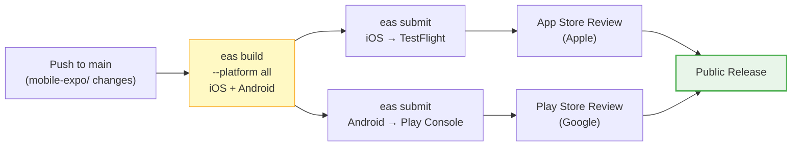

# IDRM CI/CD Detailed Workflow
## v3 — GitHub Actions Pipeline

**Source**: IDRM-DEPLOYMENT-GUIDE.md §4 · .github/workflows/  
**Type**: CI/CD Workflow Diagram  
**Version**: 3.0  
**Purpose**: Complete view of the GitHub Actions pipeline — triggers, job graph, parallel jobs, approval gates, and environment promotion for all three service groups (Backend, Gateway, Frontends)

---

## Top-Level Flow — Branch to Environment

```mermaid
flowchart LR
    subgraph TRIGGERS["Triggers"]
        PD["Push to<br/>develop"]
        PM["Push to<br/>main"]
        PR["Pull Request<br/>(any branch)"]
    end

    subgraph QUAL["Stage 1 · Code Quality"]
        L1["Backend Lint<br/>Ruff · mypy"]
        L2["Gateway Lint<br/>ESLint · tsc"]
        L3["Frontend Lint<br/>ESLint · tsc"]
    end

    subgraph TESTS["Stage 2 · Tests"]
        T1["Backend Tests<br/>pytest · testcontainers<br/>Unit + Integration"]
        T2["Gateway Tests<br/>bun test<br/>Unit"]
        T3["Frontend Tests<br/>vitest · RTL<br/>Component"]
    end

    subgraph BUILDS["Stage 3 · Docker Builds"]
        BK["Build<br/>idrm/backend"]
        BG["Build<br/>idrm/gateway"]
        BW["Build<br/>idrm/web-html"]
        BA["Build<br/>idrm/web-react"]
    end

    subgraph SEC["Stage 4 · Security"]
        SC["Trivy Image Scan<br/>CVE check"]
        SB["Bandit SAST<br/>Python security"]
        SD["Dependency Audit<br/>bun audit"]
    end

    subgraph DEPLOY["Stage 5 · Deploy"]
        DS["Auto-deploy<br/>Staging"]
        SM["Smoke Tests<br/>Staging"]
        AP["Manual Approval<br/>Required for prod"]
        DP["Blue-Green<br/>Production"]
        SP["Smoke Tests<br/>Production"]
    end

    PD --> QUAL
    PM --> QUAL
    PR --> QUAL

    QUAL --> TESTS
    TESTS --> BUILDS
    BUILDS --> SEC

    SEC -->|develop branch| DS
    DS --> SM
    SM -->|main branch only| AP
    AP --> DP
    DP --> SP

    style DS fill:#f3e5f5,stroke:#9c27b0
    style AP fill:#fff9c4,stroke:#f9a825,stroke-width:2px
    style DP fill:#e8f5e9,stroke:#4caf50,stroke-width:2px
    style SP fill:#e8f5e9,stroke:#4caf50,stroke-width:2px
    style PR fill:#e3f2fd,stroke:#2196f3
    style PD fill:#e3f2fd,stroke:#2196f3
    style PM fill:#e3f2fd,stroke:#2196f3
```



---

## Detailed Job Graph — Parallelism & Dependencies

```mermaid
flowchart TB
    subgraph A["Stage 1 — Lint (parallel)"]
        direction LR
        A1["lint-backend<br/>Ruff · mypy"]
        A2["lint-gateway<br/>ESLint · tsc"]
        A3["lint-frontend<br/>ESLint · tsc"]
    end

    subgraph B["Stage 2 — Test (parallel, needs Stage 1)"]
        direction LR
        B1["test-backend<br/>pytest + PostgreSQL + Redis<br/>testcontainers"]
        B2["test-gateway<br/>bun test<br/>mock backend"]
        B3["test-frontend-html<br/>vitest<br/>jsdom"]
        B4["test-frontend-react<br/>vitest + RTL<br/>jsdom"]
    end

    subgraph C["Stage 3 — Build (parallel, needs Stage 2)"]
        direction LR
        C1["build-backend<br/>Docker · Miniconda image<br/>push to GHCR"]
        C2["build-gateway<br/>Docker · Bun image<br/>push to GHCR"]
        C3["build-web-html<br/>Docker · NGINX<br/>push to GHCR"]
        C4["build-web-react<br/>Docker · NGINX<br/>push to GHCR"]
    end

    subgraph D["Stage 4 — Security (parallel, needs Stage 3)"]
        direction LR
        D1["trivy-scan<br/>all 4 images<br/>CRITICAL/HIGH only"]
        D2["bandit-sast<br/>Python source<br/>severity ≥ MEDIUM"]
        D3["dep-audit<br/>bun audit<br/>gateway + frontends"]
    end

    E["deploy-staging<br/>docker-compose up -d<br/>auto on develop push"]
    F["smoke-staging<br/>curl health endpoints<br/>WebSocket connect test"]
    G["approve-production<br/>Required reviewer sign-off<br/>main branch only"]
    H["deploy-production<br/>Blue-Green swap<br/>zero downtime"]
    I["smoke-production<br/>E2E health check<br/>Slack notification"]

    A --> B
    B --> C
    C --> D
    D --> E
    E --> F
    F --> G
    G --> H
    H --> I

    style G fill:#fff9c4,stroke:#f9a825,stroke-width:3px
    style H fill:#e8f5e9,stroke:#4caf50,stroke-width:2px
    style I fill:#e8f5e9,stroke:#4caf50,stroke-width:2px
```



---

## Workflow Files Reference

| File | Triggers | Purpose |
|------|----------|---------|
| `.github/workflows/backend-ci.yml` | Push/PR on `src/backend/app-python/**` | Lint → pytest → Docker build → Trivy + Bandit |
| `.github/workflows/gateway-ci.yml` | Push/PR on `src/backend/api-gateway/**` | ESLint + tsc → bun test → Docker build → dep audit |
| `.github/workflows/frontend-ci.yml` | Push/PR on `src/frontend/**` | ESLint + tsc → vitest → Docker build (web only) |
| `.github/workflows/deploy-staging.yml` | Push to `develop` (after all CI passes) | Pull images → docker-compose up → smoke tests |
| `.github/workflows/deploy-production.yml` | Push to `main` + manual approval | Blue-green deploy → smoke tests → Slack alert |
| `.github/workflows/mobile-eas.yml` | Push to `main` (mobile-expo changes) | `eas build` → `eas submit` to App Stores |

---

## Backend CI — Key Steps

```yaml
# .github/workflows/backend-ci.yml (excerpt)
jobs:
  lint-and-type-check:
    runs-on: ubuntu-latest
    steps:
      - uses: actions/checkout@v4
      - uses: actions/setup-python@v5
        with: { python-version: "3.11" }
      - run: pip install ruff mypy
      - run: ruff check src/backend/app-python/
      - run: mypy src/backend/app-python/

  test-backend:
    needs: lint-and-type-check
    services:
      postgres: { image: postgis/postgis:16-3.4 }
      redis:    { image: redis:7.2-alpine }
    steps:
      - run: |
          conda activate idrm-mvp
          pytest tests/ -v --cov=src/backend/app-python --cov-report=xml
      - uses: codecov/codecov-action@v4

  security:
    needs: build-backend
    steps:
      - uses: aquasecurity/trivy-action@master
        with: { image-ref: "ghcr.io/org/idrm-backend:${{ github.sha }}" }
      - run: bandit -r src/backend/app-python/ -ll
```

---

## Deploy Jobs — Staging vs Production

```
develop push                       main push
     │                                  │
     ▼                                  ▼
All CI jobs pass                  All CI jobs pass
     │                                  │
     ▼                                  ▼
deploy-staging (automatic)        Manual approval gate
     │                            (GitHub env: production)
     ▼                                  │
Health checks pass                      ▼
     │                            deploy-production (Blue-Green)
     ▼                                  │
Done ✓                                  ▼
                                  Smoke tests pass
                                        │
                                        ▼
                                  Slack notification ✓
```

---

## Smoke Test Endpoints

| Check | Endpoint | Expected |
|-------|----------|---------|
| API health | `GET /api/health` | `200 {"status":"ok"}` |
| Auth service | `GET /api/v1/auth/status` | `200` |
| WebSocket | `ws://…/ws` connect | Connection established |
| Web frontend | `GET https://idrm.gov.in` | `200`, HTML |
| Admin frontend | `GET https://admin.idrm.gov.in` | `200`, HTML |
| DB connectivity | Backend health includes DB check | `"database":"connected"` |
| Redis connectivity | Backend health includes Redis check | `"cache":"connected"` |

---

## Mobile — Separate EAS Pipeline



> **Note**: Mobile EAS builds are triggered only when files under `src/frontend/mobile-expo/**` change — unrelated backend or web pushes do not trigger a new app build.

---

## Failure Behaviour

| Failing stage | Effect | Recovery |
|--------------|--------|---------|
| Lint | All downstream jobs cancelled | Fix code, re-push |
| Unit tests | Build jobs cancelled | Fix failing tests |
| Docker build | Security + deploy cancelled | Fix Dockerfile / dependencies |
| Security scan (CRITICAL CVE) | Deploy cancelled — must remediate | Update base image or dependency |
| Security scan (MEDIUM/LOW) | Warning only — deploy proceeds | Track in issue backlog |
| Staging deploy | Production gate never opens | Fix infra, re-run |
| Production smoke tests | Automatic rollback to previous version | Investigate logs, fix, re-deploy |
