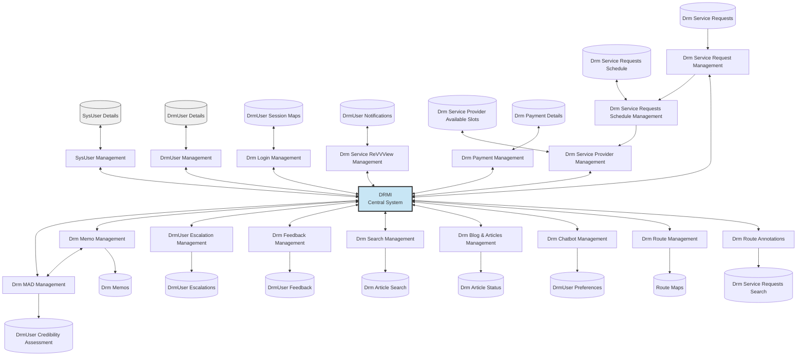

# IDRM Original Data Flow Diagram — Full System
## v1 Archive Recreation — All Modules (Pre-MVP Scope)

**Source**: DRM_DFD.png (99KB) — recreated from 303-PNG-IMAGES-ANALYSIS-V3.md analysis  
**Type**: Data Flow Diagram — Level 1 (Full System)  
**Version**: 1.0 (Original / Archive)  
**Purpose**: Preserved recreation of the original DRM_DFD.png — shows the **complete** planned system including all post-MVP modules. Archived because 70% of features are post-MVP. For current MVP architecture see `IDRM-DFD.md`.

> ⚠️ **Archive Notice**: This diagram represents the original full-scope vision. The modules marked `[POST-MVP]` are **not implemented** in v3. They are preserved here for roadmap reference only.  
> For the active MVP diagram, see: [`IDRM-DFD.md`](./IDRM-DFD.md)

---

## Section A — Annotated Recreation (MVP vs Post-MVP colour-coded)

> Green border = MVP · Grey dashed border = Post-MVP · Purple = Data stores

```mermaid
flowchart TB
    subgraph EXT["External Actors"]
        Citizen["Citizen<br/>(Service Requestor)"]
        Provider["Service Provider<br/>(NGO · Hospital · Volunteer)"]
        Admin["Admin /<br/>DM Authority"]
        PublicUser["Public User<br/>(Blog Reader)"]
    end

    subgraph CORE["Central DRMI System"]
        direction TB

        subgraph AUTH["Login & User Management"]
            LoginMgmt["Login Management<br/>Register · SignIn · Reset Password<br/>JWT · MFA"]
            UserMgmt["User Management<br/>Profiles · Roles · Preferences<br/>Whitelisting · Blacklisting"]
        end

        subgraph SVC["Service Operations"]
            SvcReqMgmt["Service Request Management<br/>Create · Approve · Assign<br/>Track · Complete · Verify"]
            SvcProvMgmt["Service Provider Management<br/>Register Provider · Verify<br/>Availability · Rating"]
            SvcSchedMgmt["Service Request Schedule Management<br/>Schedule · Reassign<br/>Deadline tracking"]
            GeoSvc["Geospatial Service<br/>Nearby · Cluster<br/>Route · LiveTracking"]
        end

        subgraph COMM["Communication"]
            NotifMgmt["Notification Management<br/>In-app · Email · SMS<br/>Push · WebSocket"]
            ChatbotMgmt["Chatbot Management<br/>Guided intake · FAQ<br/>Automated triage"]
        end

        subgraph CONTENT["Content Management"]
            BlogMgmt["Blog & Articles Management<br/>Create · Publish<br/>Categories · Tags"]
            MADMgmt["MAD Management<br/>Missing After Disaster<br/>Report · Search · Match"]
            MemoMgmt["Memo Management<br/>Internal memos<br/>Coordinator notes"]
        end

        subgraph OPS["Operations & Finance"]
            EscMgmt["Escalation Management<br/>Auto-escalate · SLA breach<br/>Supervisor alerts"]
            PayMgmt["Payment Management<br/>Donation · Disbursement<br/>Transaction history"]
        end
    end

    subgraph DS["Data Stores"]
        UserDB[("Users & Sessions<br/>PostgreSQL")]
        ServiceDB[("Service Requests<br/>PostgreSQL + PostGIS")]
        OrgDB[("Organizations<br/>PostgreSQL")]
        ContentDB[("Blog · MAD · Memos<br/>PostgreSQL")]
        PayDB[("Transactions<br/>PostgreSQL")]
        Cache[("Cache · Sessions<br/>Redis")]
        FileStore[("Media · Attachments<br/>Object Storage")]
    end

    %% Citizen flows
    Citizen -->|"Register / Login"| LoginMgmt
    Citizen -->|"Create request + GPS"| SvcReqMgmt
    Citizen -->|"Report missing person"| MADMgmt
    Citizen -->|"Chat intake"| ChatbotMgmt
    Citizen -->|"Donate"| PayMgmt

    %% Provider flows
    Provider -->|"Register / Login"| LoginMgmt
    Provider -->|"Accept / complete request"| SvcReqMgmt
    Provider -->|"Set availability"| SvcProvMgmt
    Provider -->|"Receive payout"| PayMgmt

    %% Admin flows
    Admin -->|"Manage users"| UserMgmt
    Admin -->|"Approve providers"| SvcProvMgmt
    Admin -->|"Approve requests"| SvcReqMgmt
    Admin -->|"Escalate cases"| EscMgmt
    Admin -->|"Write memos"| MemoMgmt
    Admin -->|"View analytics"| SvcSchedMgmt

    %% Public flows
    PublicUser -->|"Read articles"| BlogMgmt
    PublicUser -->|"Search missing persons"| MADMgmt

    %% Internal module flows
    LoginMgmt --> UserMgmt
    SvcReqMgmt --> GeoSvc
    SvcReqMgmt --> SvcProvMgmt
    SvcReqMgmt --> SvcSchedMgmt
    SvcReqMgmt --> NotifMgmt
    SvcReqMgmt --> EscMgmt
    ChatbotMgmt --> SvcReqMgmt
    EscMgmt --> NotifMgmt
    PayMgmt --> NotifMgmt

    %% Data store reads/writes
    LoginMgmt <--> UserDB
    LoginMgmt <--> Cache
    UserMgmt <--> UserDB
    SvcReqMgmt <--> ServiceDB
    SvcReqMgmt <--> Cache
    SvcProvMgmt <--> OrgDB
    GeoSvc --> ServiceDB
    NotifMgmt --> Cache
    BlogMgmt <--> ContentDB
    MADMgmt <--> ContentDB
    MADMgmt --> FileStore
    MemoMgmt <--> ContentDB
    PayMgmt <--> PayDB

    %% Notifications back to actors
    NotifMgmt -->|"Push / Email / SMS"| Citizen
    NotifMgmt -->|"Push / Email / SMS"| Provider
    NotifMgmt -->|"Alerts"| Admin

    %% Styling — MVP modules in green, post-MVP in grey
    style LoginMgmt fill:#e8f5e9,stroke:#4caf50,stroke-width:2px
    style UserMgmt fill:#e8f5e9,stroke:#4caf50,stroke-width:2px
    style SvcReqMgmt fill:#e8f5e9,stroke:#4caf50,stroke-width:2px
    style SvcProvMgmt fill:#e8f5e9,stroke:#4caf50,stroke-width:2px
    style GeoSvc fill:#e8f5e9,stroke:#4caf50,stroke-width:2px
    style NotifMgmt fill:#e8f5e9,stroke:#4caf50,stroke-width:2px
    style SvcSchedMgmt fill:#e8f5e9,stroke:#4caf50,stroke-width:2px

    style ChatbotMgmt fill:#f5f5f5,stroke:#9e9e9e,stroke-dasharray:5 5
    style BlogMgmt fill:#f5f5f5,stroke:#9e9e9e,stroke-dasharray:5 5
    style MADMgmt fill:#f5f5f5,stroke:#9e9e9e,stroke-dasharray:5 5
    style MemoMgmt fill:#f5f5f5,stroke:#9e9e9e,stroke-dasharray:5 5
    style EscMgmt fill:#f5f5f5,stroke:#9e9e9e,stroke-dasharray:5 5
    style PayMgmt fill:#f5f5f5,stroke:#9e9e9e,stroke-dasharray:5 5

    style UserDB fill:#f3e5f5,stroke:#9c27b0
    style ServiceDB fill:#f3e5f5,stroke:#9c27b0
    style OrgDB fill:#f3e5f5,stroke:#9c27b0
    style ContentDB fill:#f5f5f5,stroke:#9e9e9e
    style PayDB fill:#f5f5f5,stroke:#9e9e9e
    style Cache fill:#fff3e0,stroke:#ff9800
    style FileStore fill:#f5f5f5,stroke:#9e9e9e
```

---

## Module Inventory

| Module | MVP Status | v3 Implementation |
|--------|-----------|-----------------|
| **Login Management** | ✅ MVP | `/auth/*` — JWT, bcrypt, refresh tokens |
| **User Management** | ✅ MVP | `/users/*` — profiles, roles, preferences |
| **Service Request Management** | ✅ MVP | `/services/*` — full CRUD + status machine |
| **Service Provider Management** | ✅ MVP | `/services/*` + `/users/*` — org registration, matching |
| **Service Request Schedule Management** | ✅ MVP | Provider assignment + timeline tracking |
| **Geospatial Service** | ✅ MVP | `/geo/*` — Python/GeoPandas + PostGIS |
| **Notification Management** | ✅ MVP | `/notifications/*` — in-app, email, push, WebSocket |
| **Escalation Management** | ⏳ v3.1 | Auto-escalate on SLA breach — post-MVP |
| **Chatbot Management** | ⏳ v3.2 | Guided intake bot — post-MVP |
| **Blog & Articles Management** | ⏳ v3.2 | Public content — post-MVP |
| **MAD Management** | ⏳ v3.2 | Missing After Disaster registry — post-MVP |
| **Memo Management** | ⏳ v3.1 | Internal coordinator notes — post-MVP |
| **Payment Management** | ⏳ v4 | Donations + disbursements — post-MVP |

---

## Actor Roles in Original Design

| Actor | Original Name | v3 Equivalent | Platforms |
|-------|--------------|--------------|----------|
| Citizen / Participant | Participant | `CITIZEN` role | Web HTML · Mobile |
| Service Provider | Volunteer / EventHead | `PROVIDER` + `VOLUNTEER` roles | Mobile · Web React |
| Coordinator | EventMgr | `EVENT_MANAGER` / `DM_AUTHORITY` roles | Web React |
| Admin | EventAdmin / SysAdmin | `ADMIN` + `DM_AUTHORITY` roles | Web React |
| Public | Anonymous | Unauthenticated | Web HTML |

---

## Why This Was Archived

From **303-PNG-IMAGES-ANALYSIS-V3.md**:

> **v3 MVP Relevance: 30% relevant**  
> The original DRM_DFD.png had 70% non-MVP features. The modules retained for MVP are:  
> User Management · Login Management · Service Request Management · Service Provider Management · Notification Management · Geospatial Service  
>  
> **Recommendation**: Archive original — too many non-MVP features. Create v3 MVP DFD with only the five core modules relevant to the disaster response workflow.

The MVP diagram was created at [`IDRM-DFD.md`](./IDRM-DFD.md). This file preserves the full original vision.

---

## Section B — Original DRM_DFD.png Source Diagram (Verbatim Archive)

> This is the exact Mermaid transcription of `DRM_DFD.png` — node IDs, label text, and data flow arrows preserved as-is, including the original naming conventions (SysUser, DrmUser, ReVVView, etc.).  
> **One fix applied**: the unquoted `&` in `Blog & Articles Management` was wrapped in quotes to satisfy the Mermaid parser — no other changes made.

