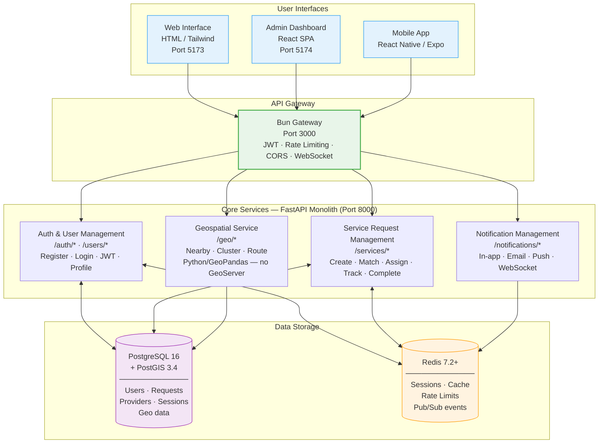

# IDRM Data Flow Diagram
## v3 MVP — Core Data Flows Only

**Source**: 303-PNG-IMAGES-ANALYSIS-V3.md · Original: DRM_DFD.png (archived — contained 70% non-MVP features)  
**Type**: Data Flow Diagram — Level 1 (MVP subset)  
**Version**: 3.0  
**Purpose**: Shows how data moves between the three frontend platforms, the Bun gateway, core backend modules, and the data stores — scoped to MVP features only

> **v3 MVP scope**: User management, service request management, provider management, geospatial queries, and notifications. Payment, Chatbot, Blog, MAD, Memo, and Escalation management are excluded from this diagram (post-MVP features).

---



---

## Key Data Flows

### Citizen — Service Request Flow

```
Citizen (web or mobile)
  → POST /services/requests         ← creates request with GPS coordinates
    → Bun Gateway validates JWT
      → ServiceSvc writes to PostgreSQL (PostGIS geometry)
        → GeoSvc queries nearby providers within radius
          → ServiceSvc assigns nearest available provider
            → NotifySvc publishes WebSocket event + sends push notification
              → Provider sees new request on map in real-time
```

### Authentication Flow

```
Any platform
  → POST /auth/login                ← email + password
    → AuthSvc: bcrypt verify, generate JWT pair
      → Redis: store session (7-day TTL)
        → Client: receive access token (15 min) + refresh token (7 days)
          → All subsequent requests: Bearer token in header
            → Bun Gateway: JWT validate + Redis blacklist check
```

### Real-Time Update Flow

```
Provider status change
  → FastAPI publishes to Redis pub/sub channel
    → Bun Gateway WebSocket server subscribes to Redis
      → WebSocket pushes event to all connected clients
        → Map updates in real-time on all platforms
```

---

## Data Stores — MVP Scope

| Store | Technology | Contents | TTL |
|-------|-----------|----------|-----|
| Users | PostgreSQL | Profiles, credentials, roles | Permanent |
| Service Requests | PostgreSQL + PostGIS | Requests with geospatial points | Permanent |
| Sessions | Redis | JWT payload + metadata | 7 days |
| Token Blacklist | Redis | Invalidated JTIs on logout | Access token TTL |
| Rate Limits | Redis | Request counts per IP/endpoint | 60 seconds |
| Real-time State | Redis Pub/Sub | Service status events | Ephemeral |
| Geo Queries | PostGIS (in PostgreSQL) | Spatial indexes, proximity queries | Permanent |

---

> **Original DFD** (`DRM_DFD.png` — 99KB): Archived. The original diagram contained 70% non-MVP features (Payment, Chatbot, Blog & Articles, MAD, Memo, Escalation Management). This v3 MVP diagram retains only the five core modules relevant to the disaster response workflow.
