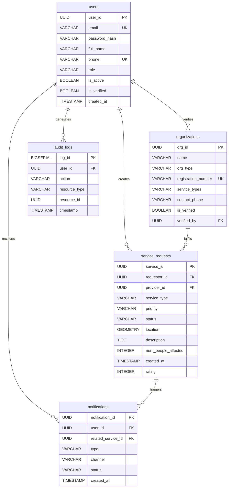
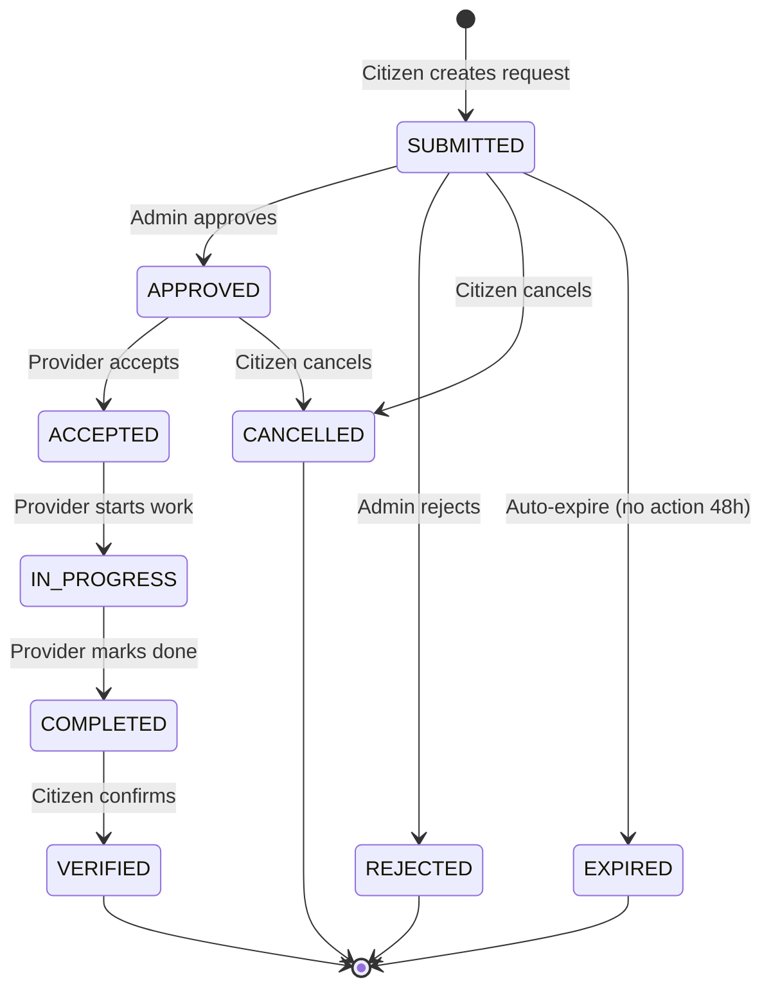

# IDRM Database Schema Visualization
## v3 — PostgreSQL 16 + PostGIS 3.4

**Source**: IDRM-LLD.md §9–§11  
**Type**: Entity-Relationship Diagram  
**Version**: 3.0  
**Purpose**: Visual map of all core tables, their columns, data types, and relationships — the single authoritative schema reference for MVP

---

## Entity-Relationship Diagram



---

## Table Details

### `users` — Authentication & Profiles

| Column | Type | Constraint | Notes |
|--------|------|-----------|-------|
| `user_id` | UUID | PK · `gen_random_uuid()` | Internal identifier |
| `email` | VARCHAR(255) | UNIQUE NOT NULL | Login credential · regex validated |
| `password_hash` | VARCHAR(255) | NOT NULL | bcrypt hash |
| `full_name` | VARCHAR(255) | NOT NULL | Letters/spaces/hyphens only |
| `phone` | VARCHAR(20) | UNIQUE | E.164 format (`+91xxxxxxxxxx`) |
| `role` | VARCHAR(50) | NOT NULL · DEFAULT `CITIZEN` | `CITIZEN` · `PROVIDER` · `VOLUNTEER` · `EVENT_MANAGER` · `DM_AUTHORITY` · `ADMIN` |
| `is_active` | BOOLEAN | DEFAULT `TRUE` | Soft-delete flag |
| `is_verified` | BOOLEAN | DEFAULT `FALSE` | Email verification status |
| `preferences` | JSONB | DEFAULT `{language:en, notifications:{...}}` | Language + notification prefs |
| `created_at` | TIMESTAMP | DEFAULT NOW | Immutable |
| `updated_at` | TIMESTAMP | Auto-updated by trigger | |
| `last_login` | TIMESTAMP | | Set on each login |

**Indexes**: `email`, `phone`, `role`, `is_active` (partial WHERE TRUE), `created_at`

---

### `service_requests` — Core Entity

| Column | Type | Constraint | Notes |
|--------|------|-----------|-------|
| `service_id` | UUID | PK | |
| `requestor_id` | UUID | FK → `users` ON DELETE CASCADE | Who made the request |
| `provider_id` | UUID | FK → `organizations` ON DELETE SET NULL | Assigned provider (nullable until matched) |
| `service_type` | VARCHAR(50) | CHECK | `RESCUE` · `MEDICAL` · `FOOD` · `SHELTER` · `WATER` · `OTHER` |
| `priority` | VARCHAR(20) | CHECK | `CRITICAL` · `HIGH` · `MEDIUM` · `LOW` |
| `status` | VARCHAR(50) | DEFAULT `SUBMITTED` | `SUBMITTED` → `APPROVED` → `ACCEPTED` → `IN_PROGRESS` → `COMPLETED` → `VERIFIED` |
| `location` | GEOMETRY(Point, 4326) | NOT NULL | PostGIS WGS-84 point (lng/lat) |
| `address` | TEXT | | Human-readable reverse-geocoded address |
| `description` | TEXT | 10–500 chars | What is needed |
| `num_people_affected` | INTEGER | 1–1000 · DEFAULT 1 | Scope of request |
| `privacy_level` | VARCHAR(20) | DEFAULT `PUBLIC` | `PUBLIC` or `PRIVATE` |
| `contact_phone` | VARCHAR(20) | | Override contact (optional) |
| `accepted_at` | TIMESTAMP | `≥ created_at` | When provider accepted |
| `completed_at` | TIMESTAMP | `≥ accepted_at` | When service delivered |
| `verified_at` | TIMESTAMP | `≥ completed_at` | When citizen confirmed |
| `rating` | INTEGER | 1–5 or NULL | Citizen satisfaction |

**Indexes**: `requestor_id`, `provider_id`, `status`, `priority`, `service_type`, `created_at`, `(status, priority)` composite, GiST spatial on `location`, GIN full-text on `description`

---

### `organizations` — Service Providers

| Column | Type | Constraint | Notes |
|--------|------|-----------|-------|
| `org_id` | UUID | PK | |
| `name` | VARCHAR(255) | NOT NULL | Organisation display name |
| `org_type` | VARCHAR(50) | CHECK | `NGO` · `HOSPITAL` · `GOVT_AGENCY` · `VOLUNTEER_GROUP` |
| `registration_number` | VARCHAR(100) | UNIQUE | Government registration (optional) |
| `service_types` | VARCHAR(50)[] | NOT NULL | Array of types this org can provide |
| `contact_person` | VARCHAR(255) | | Named point of contact |
| `contact_phone` | VARCHAR(20) | NOT NULL | Primary contact number |
| `contact_email` | VARCHAR(255) | | Optional email |
| `is_verified` | BOOLEAN | DEFAULT FALSE | Admin-verified status |
| `verified_by` | UUID | FK → `users` | Admin who verified |

---

### `notifications` — Delivery Tracking

| Column | Type | Constraint | Notes |
|--------|------|-----------|-------|
| `notification_id` | UUID | PK | |
| `user_id` | UUID | FK → `users` ON DELETE CASCADE | Recipient |
| `related_service_id` | UUID | FK → `service_requests` ON DELETE CASCADE | Source event (nullable) |
| `type` | VARCHAR(50) | | `request_created` · `request_assigned` · `request_updated` · `system_alert` |
| `channel` | VARCHAR(20) | | `EMAIL` · `SMS` · `PUSH` · `IN_APP` · `WEBSOCKET` |
| `subject` | VARCHAR(255) | | Email/push title |
| `message` | TEXT | | Notification body |
| `status` | VARCHAR(20) | DEFAULT `PENDING` | `PENDING` · `SENT` · `FAILED` · `READ` |
| `sent_at` | TIMESTAMP | | When delivery was attempted |
| `read_at` | TIMESTAMP | | When user acknowledged (in-app only) |

---

### `audit_logs` — Immutable Event Log

| Column | Type | Constraint | Notes |
|--------|------|-----------|-------|
| `log_id` | BIGSERIAL | PK | Auto-incrementing — not UUID |
| `user_id` | UUID | FK → `users` ON DELETE SET NULL | Actor (nullable for system events) |
| `user_email` | VARCHAR(255) | | Denormalised — preserved even if user deleted |
| `action` | VARCHAR(100) | NOT NULL | `SERVICE_CREATED` · `SERVICE_ACCEPTED` · `USER_UPDATED` · etc. |
| `resource_type` | VARCHAR(50) | | `ServiceRequest` · `User` · `Organization` |
| `resource_id` | UUID | | ID of affected resource |
| `request_id` | UUID | | HTTP request trace ID |
| `metadata` | JSONB | | Before/after diffs, IP, user-agent |
| `timestamp` | TIMESTAMP | DEFAULT NOW | Immutable — no updated_at |

> **Partitioning**: `audit_logs` is designed for monthly table partitioning (`audit_logs_2026_05`, etc.) once row count exceeds ~1 million. Partition key: `timestamp`.

---

## Spatial Data — PostGIS Detail

```
Column: service_requests.location
  Type:  GEOMETRY(Point, 4326)
  SRID:  4326 = WGS-84 (standard GPS coordinates)
  Index: GIST (for fast radius/bbox queries)

Example insertion:
  ST_SetSRID(ST_MakePoint(longitude, latitude), 4326)

Example nearby query:
  WHERE ST_DWithin(
    location::geography,
    ST_SetSRID(ST_MakePoint(80.2707, 13.0827), 4326)::geography,
    10000   -- 10 km in metres (geography uses metres)
  )
```

---

## Status State Machine — `service_requests`



---

## Redis Key Patterns (non-relational supplement)

| Key pattern | Value | TTL | Purpose |
|------------|-------|-----|---------|
| `session:{user_id}` | JWT payload JSON | 7 days | Active session store |
| `blacklist:{jti}` | `"1"` | Access token TTL (15 min) | Logout token invalidation |
| `ratelimit:{ip}:{endpoint}` | Request count | 60 seconds | Rate limiting |
| `pubsub:service_requests` | Event JSON (ephemeral) | None | WebSocket fan-out |
| `cache:dashboard:{org_id}` | Analytics JSON | 5 minutes | Dashboard query cache |
| `cache:nearby:{lat}:{lng}:{r}` | Provider list JSON | 30 seconds | Geo query cache |
