```mermaid
flowchart LR
    subgraph DEV["Development"]
        Developer["Developer<br/>Local Workstation"]
        GitPush["Git Push<br/>GitHub / main branch"]
    end

    subgraph PIPE["CI/CD Pipeline — GitHub Actions"]
        Tests["Tests<br/>Lint · Unit · Integration"]
        Build["Build<br/>Docker Images<br/>Backend · Gateway · Frontend"]
        Security["Security Scan<br/>Trivy · Bandit · Dep audit"]
    end

    subgraph ENV["Environments"]
        Staging["Staging<br/>Docker Compose<br/>staging.idrm.gov.in"]
        Prod["Production<br/>Blue-Green Deploy<br/>api.idrm.gov.in"]
    end

    Developer --> GitPush
    GitPush --> Tests
    Tests --> Build
    Build --> Security
    Security --> Staging
    Staging --> Prod

    style Developer fill:#e3f2fd,stroke:#2196f3
    style GitPush fill:#e3f2fd,stroke:#2196f3
    style Tests fill:#fff9c4,stroke:#f9a825,stroke-width:2px
    style Build fill:#fff9c4,stroke:#f9a825,stroke-width:2px
    style Security fill:#fff9c4,stroke:#f9a825,stroke-width:2px
    style Staging fill:#f3e5f5,stroke:#9c27b0
    style Prod fill:#e8f5e9,stroke:#4caf50,stroke-width:2px
```

# IDRM Deployment Pipeline Diagram

## v3 MVP — CI/CD & Environment Flow

**Type**: Deployment Pipeline Diagram
**Version**: 3.0
**Purpose**: Shows the CI/CD pipeline from developer commit through automated testing, container builds, security scanning, and staged environment promotion — Development → Staging → Production

---



---

## Pipeline Stages

| Stage                       | Tool / Service               | What Happens                                   | Failure Blocks? |
| --------------------------- | ---------------------------- | ---------------------------------------------- | --------------- |
| **Git Push**          | GitHub                       | Triggers CI workflow on push to `main` or PR | —              |
| **Lint**              | Ruff (Python) · ESLint (TS) | Code style and static analysis                 | ✅ Yes          |
| **Unit Tests**        | pytest · bun test           | Backend and gateway unit tests                 | ✅ Yes          |
| **Integration Tests** | pytest + testcontainers      | API tests against real PostgreSQL + Redis      | ✅ Yes          |
| **Docker Build**      | Docker Buildx                | Multi-platform images for all services         | ✅ Yes          |
| **Security Scan**     | Trivy · Bandit              | Container image CVEs + Python SAST             | ✅ Yes          |
| **Staging Deploy**    | Docker Compose               | Full stack on staging server                   | ✅ Yes          |
| **Production Deploy** | Blue-Green                   | Zero-downtime swap on production               | Manual gate     |

---

## Environment Comparison

| Attribute                | Development                 | Staging                      | Production                  |
| ------------------------ | --------------------------- | ---------------------------- | --------------------------- |
| **Infrastructure** | Local (5 terminals)         | Docker Compose (single host) | Docker Compose / future K8s |
| **Database**       | PostgreSQL via systemd      | PostgreSQL in container      | PostgreSQL managed          |
| **Redis**          | Redis via systemd           | Redis in container           | Redis managed               |
| **SSL**            | None (HTTP)                 | Let's Encrypt                | Let's Encrypt / gov cert    |
| **Domain**         | `localhost`               | `staging.idrm.gov.in`      | `api.idrm.gov.in`         |
| **Conda env**      | `conda activate idrm-mvp` | Baked into Docker image      | Baked into Docker image     |
| **Data**           | Mock seed data              | Anonymised copy of prod      | Live data                   |

---

## Service Image Map

| Service                | Dockerfile location                    | Image tag                 |
| ---------------------- | -------------------------------------- | ------------------------- |
| FastAPI Backend        | `src/backend/app-python/Dockerfile`  | `idrm/backend:latest`   |
| Bun API Gateway        | `src/backend/api-gateway/Dockerfile` | `idrm/gateway:latest`   |
| HTML/Tailwind (static) | `src/frontend/web-html/Dockerfile`   | `idrm/web-html:latest`  |
| React SPA (static)     | `src/frontend/web-react/Dockerfile`  | `idrm/web-react:latest` |

> **React Native / Expo** is not containerised — mobile builds are distributed via Expo EAS (Expo Application Services) directly to iOS App Store and Google Play.

---

## Blue-Green Production Promotion

```
Staging smoke tests pass
  → Tag staging image as :release-YYYY-MM-DD
    → Spin up Green environment (new version)
      → Run health checks on Green
        → Switch load balancer → Green (zero downtime)
          → Blue stays live for 10-min rollback window
            → Blue torn down after window closes
```

---

> **Note**: The production deploy step requires a manual approval gate in GitHub Actions. No code reaches `api.idrm.gov.in` without explicit sign-off from a coordinator or admin role.
