# IDRM Entity Class Hierarchy
## Entity Classes with Inheritance and Domain Relationships

**Source**: DRM_Entity_Classes.png  
**Type**: Class Hierarchy Diagram  
**Version**: 3.0  
**Purpose**: Shows entity class composition and relationships organized by five major domains

---

> ⚠️ **Full-system class map (MVP vs Post-MVP).** Several classes shown are **🔒 Post-MVP** — ChatBot, Blog, Article, Charity/Pooling/Grant (finance), Biometric, Memos, Grievances/Escalations, and credibility/MAD classes. The **MVP core** entities: DrmUser, DrmIamAAA, JWT, OTP, DrmSession, SessionMgmt, RBAC, SvcRequest, SvcProvider, Location, Notifications. Canonical model: `docs/development/IDRM-FS.md` §3.3.

```mermaid
classDiagram
    %% Domain 1: Portal & Content
    class DrmPortal {
        +portalConfig()
    }
    class Locales {
        +localeSettings()
    }
    class Blog {
        +content()
    }
    class Article {
        +title
        +body
        +author
    }
    class ChatBot {
        +respondToQuery()
    }
    class Feedback {
        +submitFeedback()
    }
    class Carousel {
        +displayItems()
    }
    class Trending {
        +getTrendingTopics()
    }
    class Showcase {
        +featuredContent()
    }
    class Contextual {
        +contextualHelp()
    }
    class ToCGen {
        +generateTableOfContents()
    }
    class Profile {
        +userProfile()
    }

    DrmPortal --> Locales
    Locales --> Blog
    Blog --> Article
    Article ..> ChatBot
    ChatBot ..> Feedback

    %% Domain 2: User Management & Auth
    class DrmUser {
        +username
        +email
    }
    class DrmUsrPrivy {
        +privacySettings()
    }
    class DrmIamAAA {
        +authenticate()
        +authorize()
    }
    class OAuth {
        +oauthLogin()
    }
    class Biometric {
        +biometricAuth()
    }
    class EPA {
        +externalProviderAuth()
    }
    class JWT {
        +generateToken()
    }
    class OTP {
        +sendOTP()
    }
    class Credibility {
        +calculateScore()
    }
    class Rating {
        +rateUser()
    }
    class Preferences {
        +userPreferences()
    }
    class Bookmarks {
        +savedItems()
    }

    DrmUser --> DrmUsrPrivy
    DrmUsrPrivy --> DrmIamAAA
    DrmIamAAA ..> OAuth

    %% Domain 3: Session & RBAC
    class DrmSession {
        +sessionId
        +expiry
    }
    class SessionMgmt {
        +createSession()
    }
    class RBAC {
        +checkPermissions()
    }
    class Blacklist {
        +isBlacklisted()
    }
    class Whitelist {
        +isWhitelisted()
    }
    class PoliceD {
        +policeData()
    }
    class Transparency {
        +auditLog()
    }
    class CookieMgmt {
        +manageCookies()
    }
    class Sharing {
        +shareContent()
    }
    class Integrations {
        +integrateService()
    }

    DrmSession --> SessionMgmt
    SessionMgmt --> RBAC
    RBAC ..> Blacklist
    Blacklist ..> Whitelist
    PoliceD ..> Transparency

    %% Domain 4: Team Visibility & Scheduling
    class DrmTeamVis {
        +teamDashboard()
    }
    class DrmAnnotator {
        +annotateData()
    }
    class DrmReVVV {
        +reviewValidateVerify()
    }
    class DrmScheduler {
        +scheduleTask()
    }
    class SvcRequest {
        +requestService()
    }
    class SvcProvider {
        +provideService()
    }
    class Location {
        +geoLocation()
    }
    class LiveTracking {
        +trackLive()
    }
    class DrmDashboard {
        +analytics()
    }
    class DrmGrant {
        +grantAccess()
    }
    class DrmCharity {
        +charityOps()
    }
    class DrmPooling {
        +resourcePool()
    }

    DrmTeamVis --> DrmAnnotator
    DrmAnnotator ..> DrmReVVV
    DrmReVVV --> DrmScheduler
    DrmScheduler --> SvcRequest
    SvcRequest ..> SvcProvider
    SvcProvider ..> Location
    Location ..> LiveTracking

    %% Domain 5: Tasks & Notifications
    class DrmPortal2 {
        +portal2Config()
    }
    class TODOList {
        +taskList()
    }
    class Pending {
        +pendingItems()
    }
    class TaskTracker {
        +trackProgress()
    }
    class SubTask {
        +subTaskDetails()
    }
    class Notifications {
        +sendNotification()
    }
    class Escalations {
        +escalateTo()
    }
    class Grievances {
        +handleGrievance()
    }
    class Alerts {
        +alertUser()
    }
    class Events {
        +manageEvents()
    }
    class Memos {
        +createMemo()
    }
    class TaskScheduler {
        +scheduleTask()
    }

    DrmPortal2 --> TODOList
    TODOList --> Pending
    Pending ..> TaskTracker
    TaskTracker --> SubTask

    %% Cross-domain relationships
    DrmUser ..> DrmSession
    DrmTeamVis ..> DrmDashboard
    Notifications ..> Alerts

    style DrmPortal fill:#c8e6f5,stroke:#333
    style DrmUser fill:#c8e6f5,stroke:#333
    style DrmSession fill:#c8e6f5,stroke:#333
    style DrmTeamVis fill:#c8e6f5,stroke:#333
    style DrmPortal2 fill:#c8e6f5,stroke:#333
```



---

## Domain Summary

| Domain | Entry Point | Key Entities | Purpose |
|--------|------------|--------------|---------|
| Portal & Content | DrmPortal | Blog, Article, ChatBot, Feedback | Public-facing content and engagement |
| User & Auth | DrmUser | DrmIamAAA, JWT, OAuth, OTP, Credibility | Identity, authentication, trust scoring |
| Session & RBAC | DrmSession | SessionMgmt, RBAC, Blacklist, Whitelist | Session lifecycle, access control |
| Team Visibility & Scheduling | DrmTeamVis | DrmAnnotator, DrmReVVV, SvcRequest, Location | Field operations, service dispatch |
| Tasks & Notifications | DrmPortal2 | TODOList, TaskTracker, Escalations, Alerts | Workflow management, alerting |

## Relationship Legend

- **Solid arrow** (`-->`) — composition or aggregation (parent contains/owns child)
- **Dashed arrow** (`..>`) — dependency or association (uses/interacts with)
- **Blue fill** — domain entry point class

## Cross-Domain Dependencies

```
DrmUser → DrmSession          (user creates a session)
DrmTeamVis → DrmDashboard     (team visibility feeds analytics)
Notifications → Alerts        (notifications trigger alerts)
```
