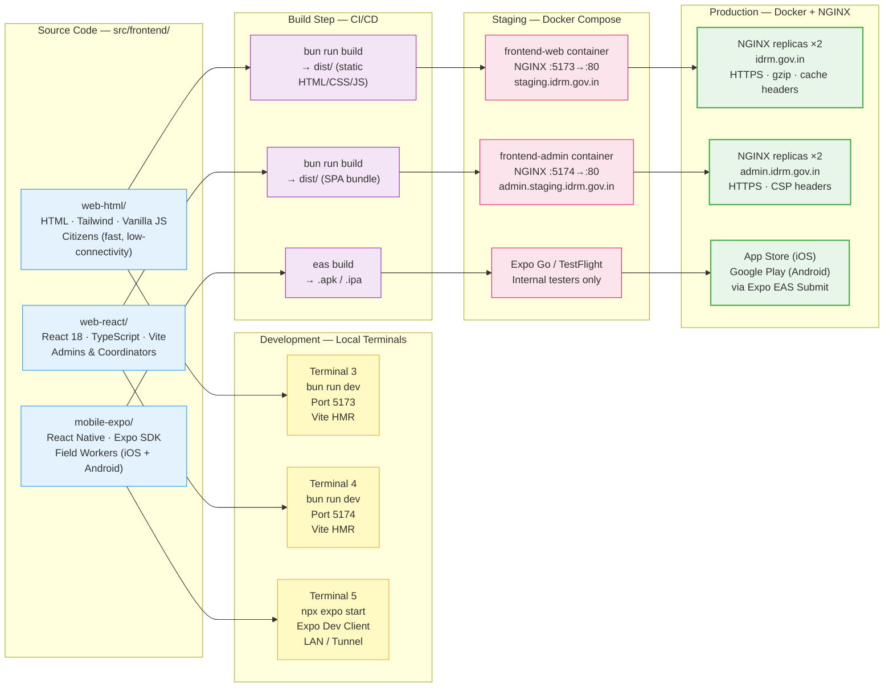

# IDRM Three-Frontend Deployment Diagram
## v3 — Platform-by-Platform Build & Runtime

**Source**: IDRM-DEPLOYMENT-GUIDE.md · IDRM-DEVELOPMENT-GUIDE.md  
**Type**: Deployment Diagram  
**Version**: 3.0  
**Purpose**: Shows how each of the three frontend platforms is built, served, and deployed across Development, Staging, and Production environments

---



---

## Platform Comparison

| Attribute | HTML/Tailwind (`web-html`) | React SPA (`web-react`) | React Native (`mobile-expo`) |
|-----------|--------------------------|------------------------|------------------------------|
| **Primary users** | Citizens in crisis | Admins · Coordinators | Field workers |
| **Dev command** | `bun run dev` | `bun run dev` | `npx expo start` |
| **Dev port** | 5173 | 5174 | Expo auto (LAN) |
| **Build tool** | Vite | Vite | Expo EAS / Metro |
| **Build output** | `dist/` (static files) | `dist/` (SPA bundle) | `.apk` / `.ipa` |
| **Production server** | NGINX in Docker | NGINX in Docker | App stores (EAS Submit) |
| **Offline support** | Graceful degradation | Partial | Full (offline-first) |
| **JavaScript runtime** | Vanilla (no framework) | React 18 + TypeScript | React Native (Hermes) |

---

## Startup Commands — Quick Reference

```bash
# HTML/Tailwind (Citizens)
cd src/frontend/web-html
bun run dev           # → http://localhost:5173

# React SPA (Admins)
cd src/frontend/web-react
bun run dev           # → http://localhost:5174

# React Native (Field Workers)
cd src/frontend/mobile-expo
bun install           # first time only
npx expo start        # → scan QR with Expo Go app
```

---

## Dockerfile Summary

### `web-html` & `web-react` — Multi-Stage NGINX Build

```
Stage 1 (builder): oven/bun:latest
  └─ bun install --frozen-lockfile
  └─ bun run build → dist/

Stage 2 (runtime): nginx:alpine
  └─ COPY dist/ → /usr/share/nginx/html
  └─ EXPOSE 80 443
```

### `mobile-expo` — No Dockerfile (Managed by EAS)

```
Local dev  → Expo Go app (scan QR code)
Staging    → Internal Distribution (TestFlight / APK direct)
Production → eas build + eas submit → App Stores
```

---

## NGINX Routing (Staging & Production)

```
https://idrm.gov.in
  └─ /          → frontend-web container (HTML/Tailwind)
  └─ /api/*     → api-gateway:3000 (proxied)
  └─ /ws        → api-gateway:3001 (WebSocket upgrade)

https://admin.idrm.gov.in
  └─ /          → frontend-admin container (React SPA)
  └─ /api/*     → api-gateway:3000 (proxied)
```

---

> **Why three frontends?** Each platform serves a distinct audience with fundamentally different capability requirements. HTML/Tailwind prioritises minimal payload and reliability in low-connectivity disaster zones. The React SPA delivers rich dashboard features (charts, data tables, real-time maps) for admin work. The mobile app provides GPS access, push notifications, and offline-first operation for field workers — none of which can be adequately served by a single approach.
