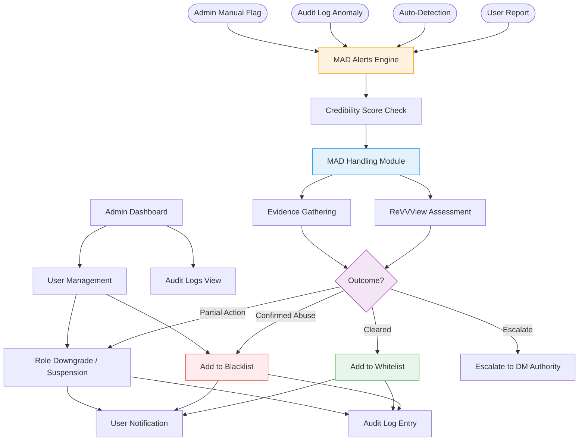
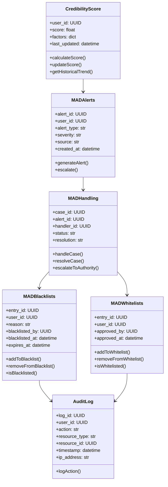

# IDRM MAD Management
## Misuse, Abuse, and Discrepancy Detection & Response

**Type**: Flow + Class Diagram (created from LLD admin section)  
**Version**: 3.0  
**Purpose**: Shows how the system detects, escalates, and resolves misuse, abuse, and discrepancies

> 🔒 **Post-MVP — planned, not in the MVP.** The MAD (Misuse/Abuse/Discrepancy) module — including credibility scoring — is deferred to a later phase (it overlaps the Auditor credibility-scoring, also Post-MVP). Kept here for future reference; see `docs/development/IDRM-FS.md` for current MVP scope.

---

## MAD Management Flow



---

## MAD Entity Classes



---

## Admin API Operations

| Operation | Endpoint | Authorization | Effect |
|-----------|----------|--------------|--------|
| List users | `GET /api/v1/admin/users` | ADMIN | View all users with filters |
| Deactivate user | `PATCH /api/v1/admin/users/{id}` | ADMIN | `is_active: false` |
| Change role | `PATCH /api/v1/admin/users/{id}` | ADMIN | Downgrade/upgrade role |
| View audit logs | `GET /api/v1/admin/audit-logs` | ADMIN or DM_AUTHORITY | Full action history |

## Blacklisting via Redis

Token invalidation on blacklist action:
```python
# Blacklist active JWT token immediately
redis_client.setex(
    f"blacklist:{token_jti}",
    settings.ACCESS_TOKEN_EXPIRE_MINUTES * 60,
    "1"
)
```

## Credibility Scoring Factors

| Factor | Impact | Weight |
|--------|--------|--------|
| Successful services fulfilled | Positive | High |
| Service cancellation rate | Negative | Medium |
| Community reports against user | Negative | High |
| Verification status | Positive | Medium |
| Historical audit flag count | Negative | High |

## Alert Severity Levels

| Severity | Trigger | Default Action |
|----------|---------|---------------|
| INFO | Minor anomaly detected | Log only |
| WARNING | Pattern of suspicious activity | Review queue |
| HIGH | Active misuse confirmed | Suspend + notify admin |
| CRITICAL | Fraudulent activity | Immediate blacklist + DM Authority escalation |
