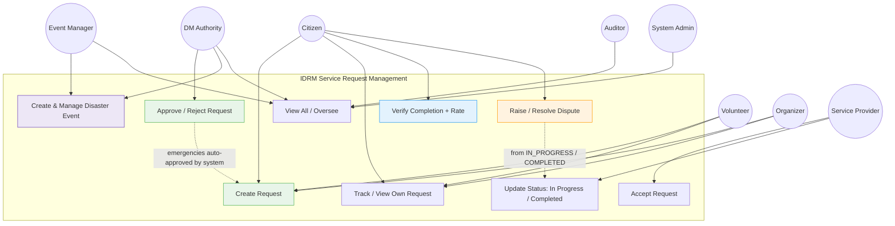

# IDRM Service Management Use Case
## Service Request Management Use Cases by Role

**Source**: DRM_Service_Management.png (re-modelled to the v3 canonical role set)  
**Type**: Use Case Diagram  
**Version**: 3.0 (reconciled 2026-05-30)  
**Purpose**: Who can do what across the service-request lifecycle. Canonical roles & permissions: [`docs/development/IDRM-FS.md`](../development/IDRM-FS.md) §3.3 (single source of truth).

---



---

## Role Capabilities (aligned with FS §3.3 Permission Matrix)

| Use Case | Citizen | Volunteer | Organizer | Service Provider | Event Manager | DM Authority | Auditor | System Admin |
|----------|:------:|:--------:|:--------:|:---------------:|:------------:|:-----------:|:------:|:-----------:|
| Create Request | ✅ | ✅ | ✅ | ❌ | ❌ | ✅ | ❌ | ✅ |
| Track / View Own Request | ✅ | ✅ | ✅ | ✅ | ✅ | ✅ | ✅ | ✅ |
| Accept Request | ❌ | ❌ | ❌ | ✅ | ❌ | ❌ | ❌ | ✅ |
| Update Status (In Progress / Completed) | ❌ | ❌ | ❌ | ✅ | ❌ | ❌ | ❌ | ✅ |
| Approve / Reject Request † | ❌ | ❌ | ❌ | ❌ | ❌ | ✅ | ❌ | ✅ |
| Verify Completion + Rate | ✅ own | ❌ | ❌ | ❌ | ❌ | ❌ | ❌ | ✅ |
| Raise Dispute | ✅ | ❌ | ❌ | ❌ | ❌ | resolves | ❌ | ✅ |
| Create & Manage Disaster Event | ❌ | ❌ | ❌ | ❌ | ✅ | ✅ | ❌ | ✅ |
| View All / Oversee | ❌ | ⚠️ Area | ⚠️ Area | ⚠️ Type | ⚠️ Event | ✅ Jurisdiction | ✅ Read-only | ✅ |

**† Approve**: Emergency/urgent requests are **auto-approved by the system**; the DM Authority handles non-urgent approvals and post-hoc review. The DM Authority ("Event Admin") may be a **Government Org or a vetted NGO**.

## Service Request Lifecycle

```
SUBMITTED → APPROVED → ACCEPTED → IN_PROGRESS → COMPLETED → VERIFIED
Branch / terminal states: REJECTED · CANCELLED · EXPIRED · DISPUTED
```

- Emergencies: `SUBMITTED → APPROVED` automatically (system), then reviewed for credibility afterward.
- `DISPUTED` is raised by the citizen from `IN_PROGRESS`/`COMPLETED`; the DM Authority resolves it back to `IN_PROGRESS` or to `REJECTED`.

## Notes

- Citizens, Volunteers, and Organizers create requests (Volunteers/Organizers on behalf of others, within their assigned area).
- Service Providers accept and deliver; they cannot create requests (conflict of interest).
- Approval authority is the **DM Authority**; the **Event Manager** runs the event operationally but does not approve requests.
- The **Auditor** is read-only (accountability); per-activity credibility scoring is Post-MVP.
- Notifications flow to all relevant parties at each state transition.
- **Canonical roles & permissions**: `docs/development/IDRM-FS.md` §3.3.
