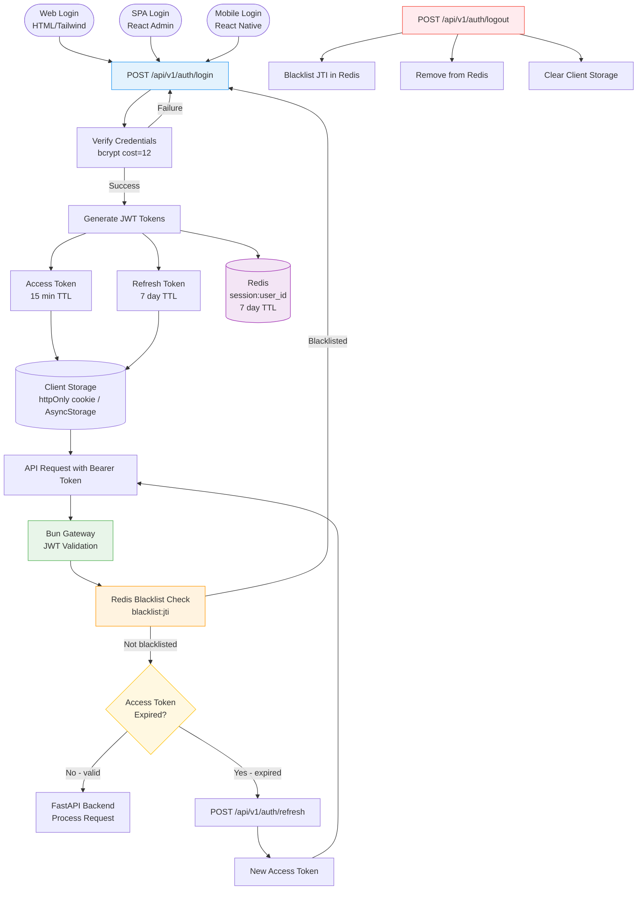
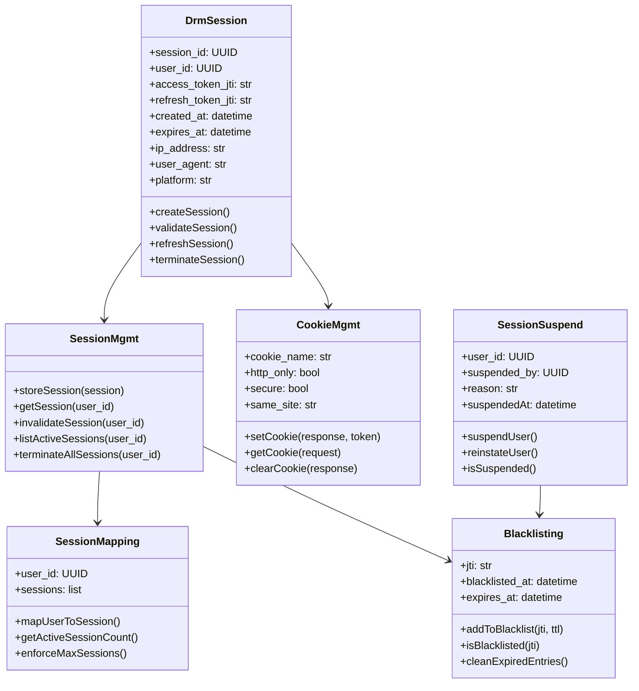

# IDRM Session Management
## Authentication Flow and Session Lifecycle

**Type**: Flow + Class Diagram (created from HLD auth/session section)  
**Version**: 3.0  
**Purpose**: Shows how user sessions are created, stored, validated, and terminated across all three platforms

---

## Session Lifecycle Flow

---

## Session Entity Classes

---

## Redis Key Patterns

| Key Pattern | Value | TTL | Purpose |
|-------------|-------|-----|---------|
| `session:{user_id}` | JWT payload + metadata | 7 days | Active session store |
| `blacklist:{jti}` | `"1"` | Access token TTL | Invalidated token registry |
| `rate_limit:{endpoint}:{ip}` | Request count | 60 seconds | Rate limiting per IP |
| `realtime:{service_id}` | Status JSON | 5 minutes | Real-time pub/sub state |

## Client-Side Storage by Platform

| Platform | Storage Method | Token Location |
|----------|---------------|----------------|
| HTML/Tailwind | httpOnly cookie | Set-Cookie header (Bun gateway) |
| React SPA | httpOnly cookie | Set-Cookie header (Bun gateway) |
| React Native | AsyncStorage | Stored securely on device |

## Token Specifications

| Token | Algorithm | TTL | Stored In |
|-------|----------|-----|----------|
| Access Token | HS256 (JWT) | 15 minutes | httpOnly cookie / AsyncStorage |
| Refresh Token | HS256 (JWT) | 7 days | httpOnly cookie / AsyncStorage |
| Session Record | — | 7 days | Redis `session:{user_id}` |

## Session Security Properties

- **httpOnly**: Cookie inaccessible to JavaScript (prevents XSS token theft)
- **SameSite=Lax**: Blocks CSRF from cross-site POSTs
- **Secure**: Cookie sent only over HTTPS (enforced in staging/production)
- **bcrypt cost=12**: Password hash rounds — balances security and login latency
- **JWT blacklist**: Immediate invalidation on logout or suspension (Redis TTL mirrors token expiry)

## Multi-Session Behavior

A user can have concurrent sessions from different platforms (web, admin, mobile). Each session has its own JTI pair. Logout from one platform only blacklists that session's tokens, leaving other platform sessions intact. Admin suspension via `SessionSuspend` terminates all active sessions for a user.
