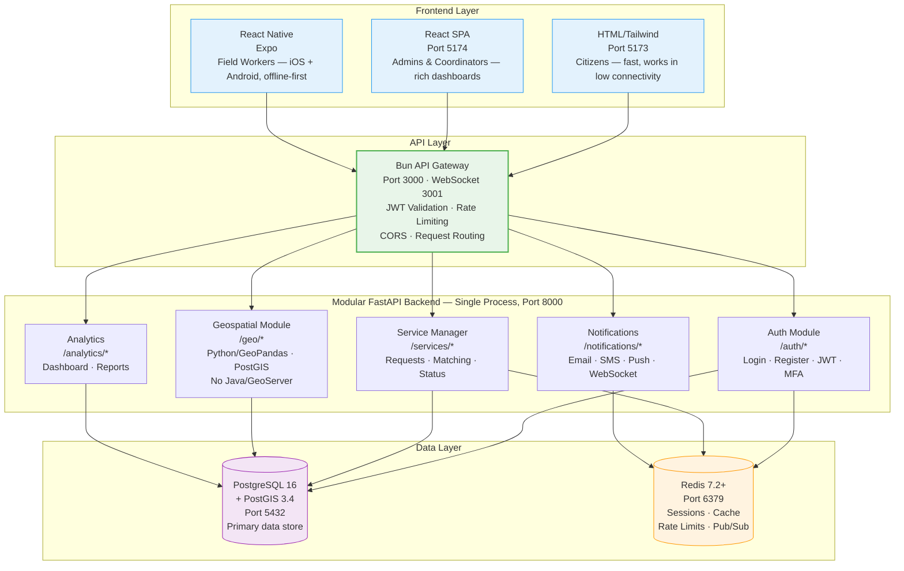

# IDRM System Architecture Diagram

## v3 Three-Platform Monolith Architecture

**Source**: 303-PNG-IMAGES-ANALYSIS-V3.md (new Mermaid — no equivalent PNG)
**Type**: System Architecture Diagram
**Version**: 3.0
**Purpose**: Shows the complete v3 system — three frontend platforms, Bun API gateway, modular FastAPI backend, and the data layer

---



---

## Architecture Decisions

| Decision         | Choice                                                    | Why                                                                   |
| ---------------- | --------------------------------------------------------- | --------------------------------------------------------------------- |
| API Gateway      | **Bun** (not Node.js)                               | 3–4× faster; built-in TypeScript, WebSocket, bundler                |
| Backend          | **Modular Monolith** (not microservices)            | Simpler ops for MVP; clean module boundaries enable future extraction |
| Geospatial       | **Python/GeoPandas + PostGIS** (not Java/GeoServer) | Lighter, no separate JVM process, same language as backend            |
| Cache / Sessions | **Redis**                                           | Sub-millisecond reads; native pub/sub for real-time events            |
| Python env       | **Miniconda** (not venv)                            | Manages binary geospatial dependencies (GDAL, GEOS, PROJ)             |
| Three frontends  | HTML/Tailwind + React SPA + React Native                  | Each platform serves a distinct audience and capability set           |

## Port Map

| Service             | Port      | Notes                                        |
| ------------------- | --------- | -------------------------------------------- |
| HTML/Tailwind (dev) | 5173      | Vite dev server                              |
| React SPA (dev)     | 5174      | Vite dev server                              |
| React Native        | Expo auto | Expo dev server                              |
| Bun API Gateway     | 3000      | All API traffic enters here                  |
| Bun WebSocket       | 3001      | Real-time event streaming                    |
| FastAPI Backend     | 8000      | Single modular process                       |
| PostgreSQL          | 5432      | Managed by systemd (dev) / Docker (staging+) |
| Redis               | 6379      | Managed by systemd (dev) / Docker (staging+) |

## Request Flow

```
User (any platform)
  → NGINX (prod only — SSL termination)
    → Bun Gateway (JWT check · rate limit · CORS)
      → FastAPI Backend (business logic · DB queries)
        → PostgreSQL / Redis
          → Response back up the chain
```

> **Monolith boundary**: All five modules (Auth, Services, Geo, Analytics, Notifications) run in one `uvicorn` process. Module boundaries are logical — clean internal separation that allows future extraction into separate microservices without architectural debt. See `archive/MIGRATION-TO-MICROSERVICES-v3.md` for the Year 2–3 migration plan.
