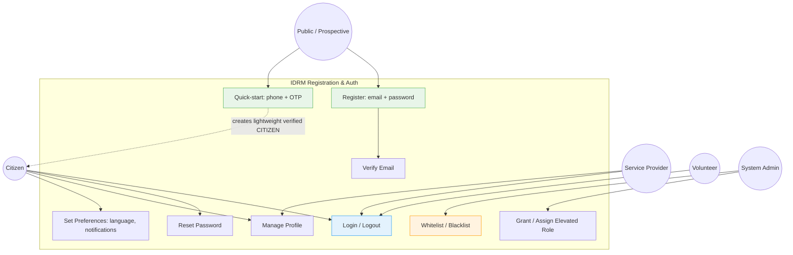

# IDRM User Registration Use Case
## Registration and Authentication Use Cases by Role

**Source**: DRM_Registration.png (re-modelled to the v3 canonical role set)  
**Type**: Use Case Diagram  
**Version**: 3.0 (reconciled 2026-05-30)  
**Purpose**: Registration and authentication capabilities per role. Canonical roles: [`docs/development/IDRM-FS.md`](../development/IDRM-FS.md) §3.3.

---

---

## Role Capabilities

| Use Case | Public | Citizen | Volunteer | Service Provider | System Admin |
|----------|:-----:|:------:|:--------:|:---------------:|:-----------:|
| Register (email + password) | ✅ | — | — | — | — |
| Quick-start (phone + OTP) → CITIZEN | ✅ | — | — | — | — |
| Verify email | ✅ | ✅ | ✅ | ✅ | ✅ |
| Login / Logout | — | ✅ | ✅ | ✅ | ✅ |
| Reset password | — | ✅ | ✅ | ✅ | ✅ |
| Manage profile | — | ✅ | ✅ | ✅ | ✅ |
| Set preferences (language `en`/`hi`/`te`) | — | ✅ | ✅ | ✅ | ✅ |
| Grant / assign elevated role | — | — | — | — | ✅ |
| Whitelist / Blacklist (🔒 Post-MVP) | — | — | — | — | ✅ |

## Self-Service vs Granted Roles

- **Self-registration** is limited to `CITIZEN`, `PROVIDER`, `VOLUNTEER`.
- **All elevated roles** (`ORGANIZER`, `MANAGER`, `EVENT_MANAGER`, `EXECUTIVE` 🔒, `DM_AUTHORITY`, `AUDITOR`, `ADMIN`) are **granted by a System Admin** via `POST /users/{id}/role` — they cannot be self-assigned. (`EXECUTIVE` is Post-MVP.)
- The **`DM_AUTHORITY`** ("Event Admin") role may be granted to a Government Org **or** a vetted NGO.

## Notes

- Emergency fast-path: a citizen in crisis uses **phone + OTP quick-start**, which instantly creates a lightweight verified `CITIZEN` account (no long form).
- JWT auth: **15-minute access token + 7-day refresh**; token sent as `Authorization: Bearer`.
- **Whitelisting / blacklisting** belongs to the MAD module — **🔒 Post-MVP**.
- Canonical roles & permissions: `docs/development/IDRM-FS.md` §3.3.
