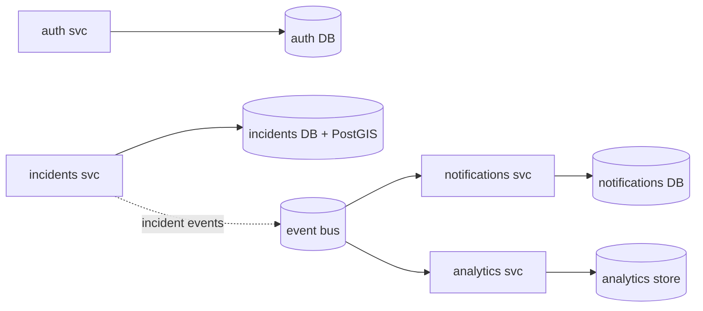

# IDRM FFP — Data Architecture (Per-Service Ownership)

> *Type: Document (specification) · Audience: backend devs, DBAs · Status: FFP — next-phase (planned)*
> *Extends the MVP data model [`../idrm-mvp-docs/50-data-model.md`](../idrm-mvp-docs/50-data-model.md). Adds the **deferred tables**, **per-service data ownership**, and cross-service consistency. Consolidates `v3/50-data-model.md`, `51-data-query-reference.md`, and the FFP portion of `../assets/idrm-data-model.xlsx`.*

> **Invariant:** PostgreSQL/PostGIS stays the **system of record**; the MVP's 13 tables + enum/UUID/PostGIS
> conventions are unchanged. The FFP **adds** tables and **splits ownership** as services extract — Redis and
> brokers never become authoritative.

---

## 1. Deferred MVP tables — now realised
From the MVP data model §10:

| Domain | Tables (FFP) |
|---|---|
| **Disaster events** | `disaster_events`, `affected_areas` (PostGIS polygons; incidents auto-link) |
| **Financial** | `financial_transactions`, `fund_allocations`, `donation_receipts` |
| **Analytics** | `service_clusters` (hotspots), `system_metrics` (time-series) |
| **Realtime** | `websocket_connections`, `chat_messages` |
| **IAM (extended)** | org/jurisdiction, ABAC policy, full-role, `organization_verifications`/`_capacity` history |
| **Incident (extended)** | `disputed` status; per-request **privacy levels** (Public/Protected/Private) |

Enum growth is **additive** (e.g. `ALTER TYPE incident_status ADD VALUE 'disputed'`), never renaming.

## 2. Per-service data ownership (database-per-service)
As a module extracts (FFP-ADR-009), it **owns its schema**; other services **never** read its tables
directly. Cross-service data flows via **events + local projections/read-models** (eventual consistency).

## 3. Consistency & replication
- **Within a service:** ACID transactions (as MVP).
- **Across services:** eventual consistency via events; **idempotent** consumers; **outbox** pattern for
  reliable publish; **projections** for cross-service queries (CQRS where justified).
- **Read scale:** PostgreSQL **read replicas**; PostGIS for spatial; Redis caches hot reads.
- **Object storage:** distributed MinIO / cloud S3 (same S3 API; MVP ADR-007).

## 4. Governance
Data classification, retention, lineage, and quality tracked per entity (blueprint §9/§13). PII encrypted at
rest (see [`22-architecture-security-and-iam.md`](22-architecture-security-and-iam.md)); audit spans services
via correlation IDs.

## 5. Migrations
Each service manages its own **Alembic** (or runtime-appropriate) migrations; the extraction of a module
includes a data-migration/backfill step that preserves the MVP schema's records.

---

*Related:* [`25-module-elucidation.md`](25-module-elucidation.md) · [`26-conformance-pics.md`](26-conformance-pics.md) · [`20-architecture-system.md`](20-architecture-system.md) · [`40-api-specification.md`](40-api-specification.md) ·
[`81-ops-messaging-and-async.md`](81-ops-messaging-and-async.md) · MVP data [`../idrm-mvp-docs/50-data-model.md`](../idrm-mvp-docs/50-data-model.md).
