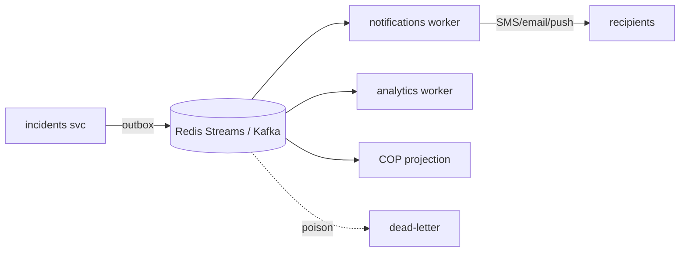

# IDRM FFP — Messaging & Async (Redis Streams · Brokers · Workers)

> *Type: Document (specification) · Audience: backend devs, SRE · Status: FFP — next-phase (planned)*
> *The one **FFP-only** doc (no MVP counterpart — the MVP deferred all async infra, [MVP ADR-012](../idrm-mvp-docs/21-architecture-decisions.md)). Defines the event backbone, workers, and deep real-time push. Consolidates `v3/81-ops-redis.md` and the charter's async row.*

> **Invariant:** PostgreSQL/PostGIS stays the **system of record**; the bus carries **events**, not truth.
> Async is introduced **on trigger** — start light (Redis Streams), graduate only when needed.

> **FFP acronyms/terms (expanded once):** **SSE** = Server-Sent Events (one-way live updates to the browser) ·
> **DLQ** = Dead-Letter Queue (where messages that keep failing are parked) · **Outbox** = write the event in the
> same DB transaction as the data, then publish it (no lost events) · **Idempotency** = processing the same
> message twice has the same effect as once · **Consumer group** = a set of workers sharing a stream's load ·
> **At-least-once** = every message is delivered one or more times (so consumers must be idempotent) ·
> **Backpressure** = slowing producers when consumers fall behind.

---

## 1. Why async (vs the MVP)
The MVP dispatches notifications **inline with retry** (near-real-time, acceptable). At FFP scale — fan-out
to many consumers, durable event history, deep real-time COP, heavy background work — an **event backbone**
and **workers** are justified.

## 2. The progression

| Tier | Tech | Use | Trigger |
|---|---|---|---|
| 1 | **Redis / Redis Streams** | cache, sessions, light events, simple queues | first async/caching need |
| 2 | **RabbitMQ** | reliable routing, work queues, DLQ | complex routing / guaranteed delivery |
| 3 | **Kafka** | durable log, replay, high-throughput fan-out, analytics | scale/replay/streaming-analytics |

Pick the **lowest tier that meets the need**; not all three are required at once.

## 3. Event patterns
- **Outbox** — services write events transactionally with their data, then publish (no lost events).
- **Idempotent consumers** — every event carries a key; re-delivery is safe.
- **Versioned events** — schemas evolve additively; correlation/request IDs tie events to a request.
- **Dead-letter queues** — poison messages are quarantined + retried/inspected.
- **Projections** — consumers build read-models for cross-service queries (CQRS where justified).

## 4. Workers & background jobs
Notification dispatch, media pipeline (transcode/thumbnail/scan — deferred from MVP media rules), analytics
rollups, and scheduled jobs run as **workers/queues**, scaled independently of the request path.

## 5. Deep real-time push
Live COP, tasking, and chat use **websockets/SSE** via the **Bun/Node/Deno edge** (behind APISIX), fed by the
event bus — replacing the MVP's near-real-time polling with true push.

---

*Related:* [`25-module-elucidation.md`](25-module-elucidation.md) · [`26-conformance-pics.md`](26-conformance-pics.md) · [`20-architecture-system.md`](20-architecture-system.md) · [`40-api-specification.md`](40-api-specification.md) ·
[`50-data-model.md`](50-data-model.md) · [`80-ops-platform-and-deployment.md`](80-ops-platform-and-deployment.md).
