# IDRM MVP — Modular Monolith Architecture

> *Type: Document (specification) · Audience: complete novices → architects · Status: MVP — current*
> *Generated from [`prompts/IDRM MVP Architecture - CO-STAR Prompt.md`](prompts/IDRM%20MVP%20Architecture%20-%20CO-STAR%20Prompt.md); domain detail consolidated from the archived generations v0–v3 (now retired to `../_removed/`). Deferred technologies are marked **→ FFP** and belong to the [FFP charter](../idrm-ffp-docs/prompts/instructions_idrm_ffp_docs.md).*

> **Key principle:** Build the simplest architecture that satisfies the MVP. Do not add
> infrastructure because it is "modern" — add it only when a concrete requirement justifies it.

> **Read alongside this document (its three companions):**
> - **What/why/how of each of the 10 modules** → [`25-module-elucidation.md`](25-module-elucidation.md)
> - **A per-technology map** (what each tool is + why IDRM uses it) → [`../idrm-mvp-guides/learn/tech-stack-101.md`](../idrm-mvp-guides/learn/tech-stack-101.md)
> - **The checkable build obligations** this architecture must satisfy → the signed-off [`26-conformance-pics.md`](26-conformance-pics.md)

---

## 1. Executive Summary

**IDRM (Integrated Disaster Response Management)** is a web platform that helps people and agencies
report, coordinate, and respond to disasters and incidents. This document describes how the **MVP
(Minimum Viable Product)** is built.

The MVP is a **modular monolith**: **one** deployable Python application, divided *inside* into
clean, loosely-coupled modules. Its web pages are plain **HTML + Tailwind CSS v4 + JavaScript**; its
backend is **FastAPI/Python**; its single source of truth is **PostgreSQL + PostGIS**.

Technologies often assumed to be mandatory — a separate API gateway (APISIX, with Bun/Node/Deno edge services), microservices,
React, mobile apps, Redis, message brokers, Docker, Kubernetes — are **deliberately deferred to the
next phase (the FFP, Full-Fledged Product)**. They are not rejected; they are postponed until a real
need appears, and the architecture is designed so each can be added later *without a rewrite*.

| | MVP (now) | FFP (later) → [charter](../idrm-ffp-docs/prompts/instructions_idrm_ffp_docs.md) |
|---|---|---|
| Shape | One modular monolith | Selective microservices |
| Web UI | HTML + Tailwind CSS v4 + JS | + React SPA |
| Mobile | — | React Native / Expo |
| API edge | FastAPI serves directly | + APISIX API gateway (+ Bun/Node/Deno edge) |
| Async | (none needed) | Redis Streams / brokers / workers |
| Runtime | One process | Docker / Swarm / Kubernetes |

---

## 2. What Is IDRM?

IDRM is a **disaster-response coordination system**. During a flood, earthquake, fire, or other
emergency, many things must happen at once: incidents are reported, resources (ambulances, shelters,
supplies) are located and dispatched, responders are assigned, people are alerted, and everything is
recorded for accountability. IDRM gives all of these a **single, map-aware, shared system**.

Core things IDRM keeps track of (its **domain**):

- **Users & Organizations** — citizens, responders, coordinators, administrators, and the agencies they belong to.
- **Incidents** — reported events, with types, status updates, and locations.
- **Resources** — the people, vehicles, shelters, and supplies available to respond.
- **Locations** — geographic points and areas (this is where **maps** matter).
- **Alerts** — warnings sent to people and teams.
- **Notifications, Reports, Audit** — messages, summaries, and a permanent record of who did what.

Because *where* things are matters so much, IDRM is **geospatial** at its core — it stores and
queries map data directly in the database.

---

## 3. What Is an MVP?

An **MVP (Minimum Viable Product)** is the **smallest version of a product that is genuinely useful**.
It is not a toy and not a throwaway prototype — it is a real, working system that does the *essential*
job well, built with the *least* complexity needed to do so.

The MVP mindset for IDRM:

> **Simple to learn → simple to build → easy to test → modular by design → ready to evolve.**

An MVP intentionally leaves things out. Every "not yet" is a decision we can reverse later — and we
record *why* we deferred it (see the ADRs in [`21-architecture-decisions.md`](21-architecture-decisions.md)).

---

## 4. What Is a Monolith? What Is a Modular Monolith?

A **monolith** is **one program that runs as one unit**. All its features live in a single codebase
and deploy together.

A **modular monolith** keeps that single-unit simplicity **but organizes the code inside into clear
modules** with firm boundaries — like rooms in one house rather than separate buildings. Each module
(users, incidents, resources…) owns its own logic and talks to others through well-defined interfaces.

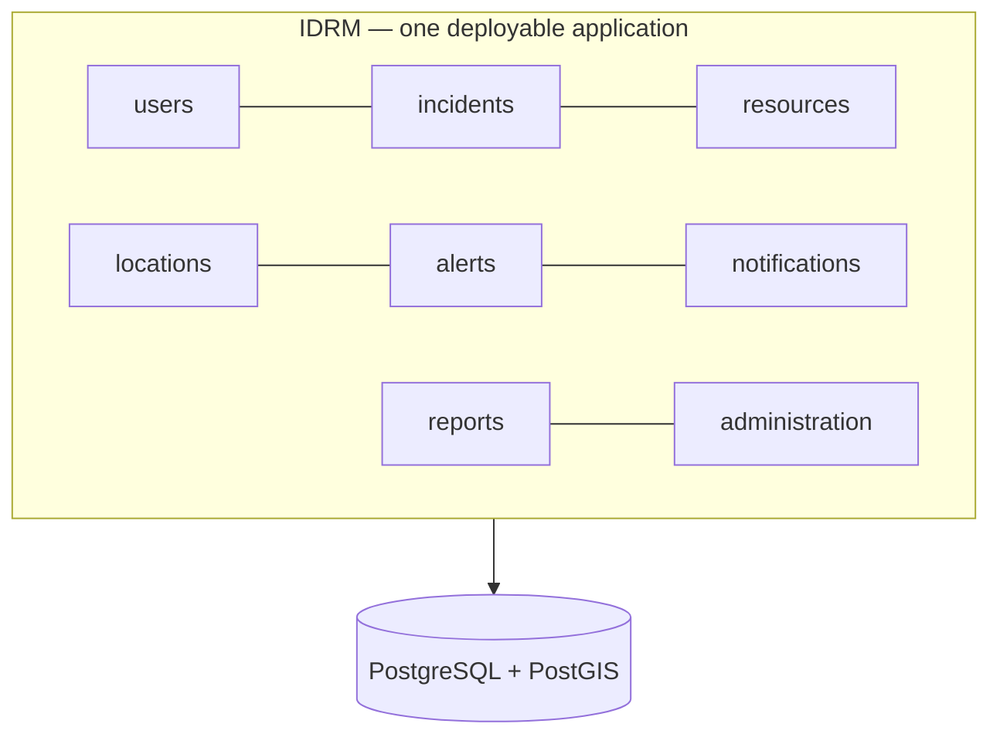
*One application, many well-separated modules inside it, all backed by one database. This is the
whole MVP in a picture.*

The opposite extreme — **microservices** — splits each module into its own separately-deployed
service. That adds power *and* a great deal of operational complexity (networking, versioning,
distributed failures). **IDRM does not start there.** → *microservices are FFP.*

---

## 5. Why a Modular Monolith Is Right for IDRM

| Concern | Modular monolith (MVP) | Microservices (FFP) |
|---|---|---|
| Learning curve | One codebase, one runtime — a newcomer can grasp it | Many services, networking, orchestration |
| Local setup | `run` one app + one database | Run many services + a broker + a gateway |
| Debugging | One log, one process, standard tools | Distributed tracing across services |
| Changing a feature | Edit one module | Coordinate across services & deploys |
| Cost & ops | Minimal | Significant |
| Future scale | Extract a module into a service **when needed** | Already paid the cost up front |

The modular monolith gives us **80% of the benefit at 20% of the cost**, and — crucially — its firm
module boundaries mean we can extract a service later **without rewriting**. We get simplicity now
and a credible path to scale.

### Why not start with microservices?
Because you pay the full operational price (networking, discovery, distributed debugging, more
infrastructure) *before* you have the scale or team size that justifies it. Start simple; split under
real pressure. → *microservices are FFP.*

---

## 6. Architecture at a Glance

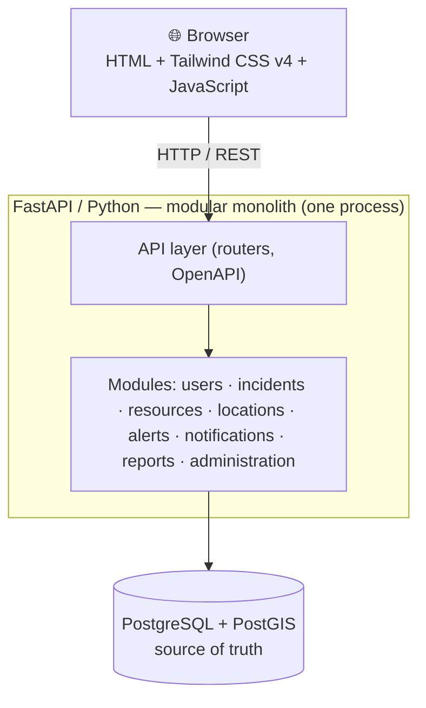
*A browser (plain HTML/Tailwind/JS) talks over HTTP to a single FastAPI application. Inside, requests
flow through the API layer into the right module, which reads/writes PostgreSQL+PostGIS. Nothing else
is required for the MVP.*

---

## 7. Technology Stack

### Required MVP stack
| Technology | Role | Why it's here |
|---|---|---|
| **HTML5** | Page structure | Universal, no build needed |
| **Tailwind CSS v4** | Styling | Utility-first CSS; fast, consistent UI without a heavy framework; works via CDN or a tiny build |
| **JavaScript** | Interactivity | Progressive enhancement; calls the API |
| **Python** | Language | Readable, huge ecosystem, great for geospatial |
| **FastAPI** | Web/API framework | Fast, typed, automatic OpenAPI docs |
| **Pydantic** | Validation/schemas | Validates data at the edge, before business logic |
| **SQLAlchemy** | Database access (**ORM** = Object-Relational Mapper: lets Python objects stand in for DB rows) | Keeps business logic away from raw SQL |
| **PostgreSQL** | Database | Reliable system of record |
| **PostGIS** | Geospatial extension | Maps, distances, areas — inside the database |
| **MinIO** | Object storage (S3-compatible) | Stores uploaded photos/documents (incident evidence, completion proof); the DB keeps only object keys/URLs, not binary blobs |
| **Alembic** | Schema migrations | Controlled, versioned database changes |
| **pytest** | Testing | Tests from day one |
| **Git** | Version control | Collaboration & history |

### Explicitly deferred (**→ FFP**, not rejected)
`APISIX` API gateway · `Bun / Node / Deno` edge services · `React` · `React Native / Expo` · `Redis` · `RabbitMQ / Kafka` ·
background workers/queues · `Docker` · `Docker Swarm / Kubernetes` · advanced distributed
observability · microservices. Each is introduced only when a concrete requirement justifies it —
see the [FFP charter](../idrm-ffp-docs/prompts/instructions_idrm_ffp_docs.md).

> **Key principle:** PostgreSQL is the source of truth. Redis, brokers, and caches must never become
> the authoritative store.

> **On file storage (MinIO):** uploaded files (photos, documents) are **not** stored in PostgreSQL as
> blobs. They go to **MinIO**, an on-prem, **S3-compatible** object store; PostgreSQL holds only the
> object key/URL and metadata (so it stays the source of truth for *records*, MinIO for *bytes*). MinIO is
> chosen over the local filesystem precisely because it exposes the **S3 API** — the same contract the
> code uses in the MVP (single MinIO server) carries **unchanged** into the FFP, where MinIO scales to a
> distributed cluster or is swapped for cloud S3 **without a code rewrite**. Accessed with the standard
> `boto3`/S3 client.

> **Media handling (compress-first):** uploads are **compressed and quality-checked on the device before
> upload**, then **re-validated on the server** (never trust the client). Rules: files **≤ 10 MB**
> (multi-page PDFs target **≤ ~1.5 MB/page** for page-by-page upload on weak links); photos resized to
> **≤ 1920 px**, **≥ 640×480**, blur-checked, EXIF/GPS stripped; an **emergency "lite" mode** sends one
> **≤ ~500 KB** photo on slow connections. Person photos get a **lightweight client-side face *detection***
> quality gate (clear face present — nothing biometric stored). Heavier **FaceNet face *recognition*** and
> a scaled server-side media pipeline (workers/transcoding) are **→ FFP**. Full rules live in
> [`40-api-specification.md`](40-api-specification.md) §5.7.

---

## 8. Web Interface (HTML + Tailwind CSS v4 + JavaScript)

The MVP UI is intentionally simple: **server-friendly HTML**, styled with **Tailwind CSS v4**
(utility classes for consistent, responsive design without a component framework), enhanced with
**vanilla JavaScript** that calls the IDRM API.

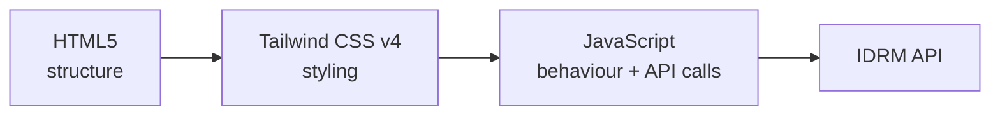
*Each layer has one job. Tailwind gives a clean, consistent look with no build-heavy toolchain; the
JavaScript talks to the same API a future React client would use.*

Typical screen flow:

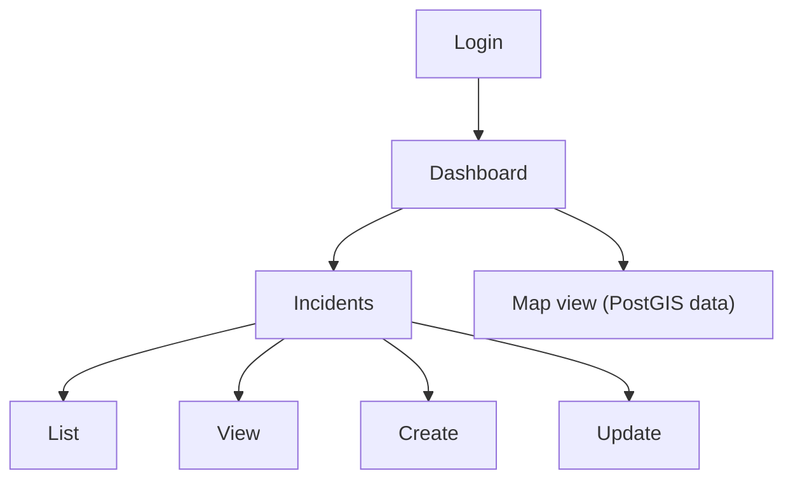
*Because the UI only consumes the API, it can later be **replaced or supplemented** by a React SPA
(→ FFP) with no backend change.*

---

## 9. FastAPI Backend

FastAPI is the **backend and API layer**. It receives HTTP requests, validates them, routes them to
the right module, and returns JSON.

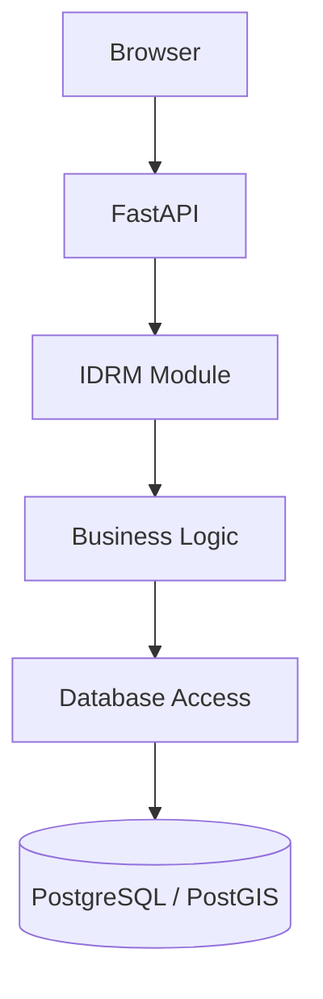
*A request travels down clear layers and back up. Each layer is testable on its own.*

FastAPI handles: routing · request/response · validation (with Pydantic) · API versioning (`/api/v1/…`) ·
automatic **OpenAPI** docs · authentication/authorization hooks · consistent error handling.

> *(**OpenAPI** = the industry-standard, machine-readable description of a REST API. FastAPI generates it
> automatically, which also gives interactive "try-it" docs for free — see [`40-api-specification.md`](40-api-specification.md).)*

---

## 10. API-First Architecture

The **API is a product**, not an afterthought. It is the stable contract every client depends on.

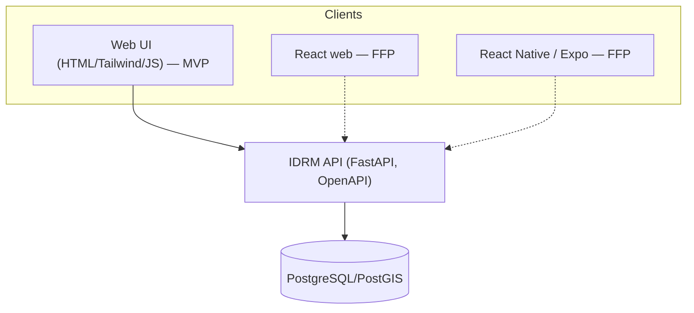
*The MVP web UI uses the API today; tomorrow's React web and mobile apps (→ FFP) use the **same**
contract. Design the API well once, reuse it everywhere.*

Representative endpoints:
```
GET    /api/v1/incidents
GET    /api/v1/incidents/{id}
POST   /api/v1/incidents
PUT    /api/v1/incidents/{id}
DELETE /api/v1/incidents/{id}
# … and /users, /resources, /locations, /alerts, /notifications, /reports
```
The machine-readable contract lives in [`40-api-specification.md`](40-api-specification.md) (+ `openapi.yaml`).

---

## 11. Modular Python Architecture

Recommended project layout:

```text
idrm/
├── app/
│   ├── core/            # config, security, exceptions, dependencies, logging
│   ├── modules/         # the domain, one folder per module
│   │   ├── users/
│   │   ├── incidents/
│   │   ├── resources/
│   │   ├── locations/
│   │   ├── alerts/
│   │   ├── notifications/
│   │   ├── reports/
│   │   └── administration/
│   ├── infrastructure/
│   │   └── database/    # engine, session, base classes
│   └── main.py          # assembles the app
├── tests/
├── alembic/             # migrations
├── docs/
├── pyproject.toml
└── README.md
```
- **core/** — cross-cutting concerns shared by all modules.
- **modules/** — the heart of IDRM; each module is a self-contained slice of the domain.
- **infrastructure/database/** — how the app connects to PostgreSQL; kept separate from business logic.
- **main.py** — wires the modules into one FastAPI app.

---

## 12. Module Structure (inside one module)

Every module follows the **same internal shape**, so once you learn one, you know them all:

```text
incidents/
├── router.py       # HTTP/API endpoints
├── schemas.py      # Pydantic request/response models
├── models.py       # SQLAlchemy database models
├── service.py      # business/application logic
├── repository.py   # database read/write operations
└── tests/          # tests for this module
```

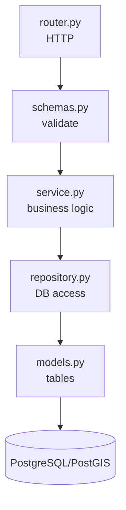
*Each file has one responsibility. The **service** (business logic) never talks to the database
directly — it goes through the **repository**. This separation is what makes a module easy to test
and, later, easy to extract into a service (→ FFP) without rewriting.*

---

## 13. Functional & Cohesive Python

The code favours **small, focused functions**, **explicit inputs/outputs**, **minimal global state**,
and **separating I/O (HTTP, database) from pure business logic**.

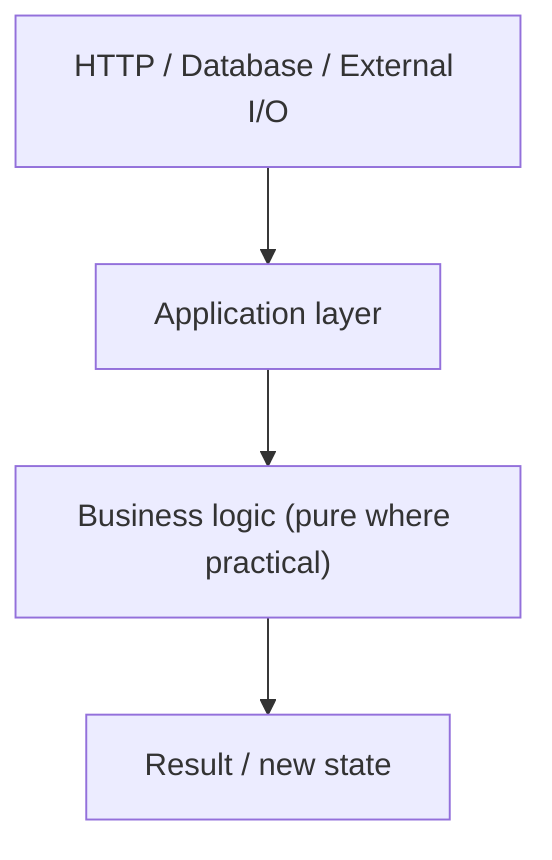
*Keeping decision-making logic pure (no hidden I/O) makes it **easy to test, debug, reuse, and reason
about** — and lets several contributors work in parallel without stepping on each other.*

---

## 14. PostgreSQL — the System of Record

> **PostgreSQL is the authoritative source of truth for IDRM.**

All durable business data lives here: users, organizations, incidents, resources, locations, alerts,
reports, audit records, and workflow state. It gives us transactions, constraints, indexes, and
decades of reliability. We optimise PostgreSQL first (schema, indexes, queries, pooling) **before**
reaching for a cache. → *Redis is FFP.*

---

## 15. PostGIS — Maps Inside the Database

**PostGIS** extends PostgreSQL with **geospatial** power, so IDRM stores and queries *where* things
are without a separate map server.

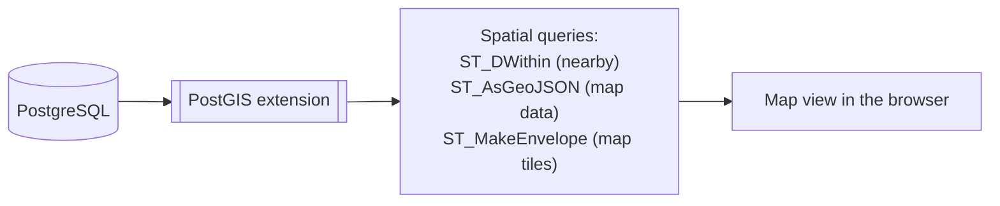
*IDRM uses PostGIS for incident locations, affected areas, evacuation zones, shelters, routes, and
"find the nearest resource" queries. A dedicated GIS/tile server is only considered later if map
workloads demand it (→ FFP); the MVP does not use Java GeoServer.*

---

## 16. Pydantic — Validation at the Edge

Pydantic defines the **shape of data** entering and leaving the API and validates it *before* any
business logic runs.

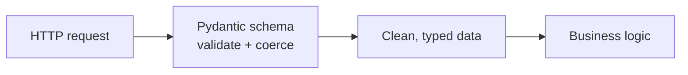
*Validating first means the business logic only ever sees well-formed data — fewer bugs, clearer errors.*

## 17. SQLAlchemy — Clean Database Access

SQLAlchemy is the **layer between Python and PostgreSQL**. Business logic asks the repository for
data in Python terms; SQLAlchemy turns that into SQL. Business logic stays **decoupled** from raw
database operations, which keeps it testable and portable.

## 18. Alembic — Controlled Schema Evolution

Databases change over time. **Alembic** versions those changes as **migrations**, so the schema
evolves safely and repeatably — never by hand-editing a production database.

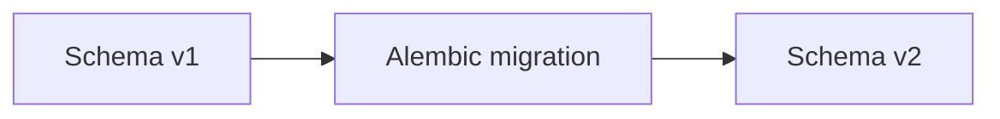
*Every schema change is a reviewed, reversible, version-controlled step.*

---

## 19. Testing (from day one)

Testing is part of the architecture, not an afterthought.

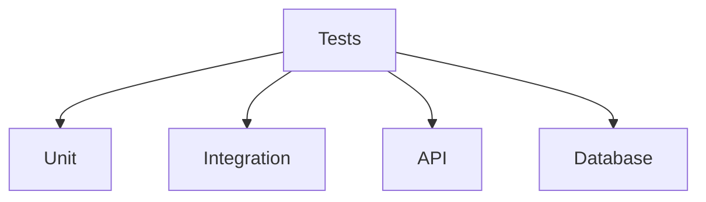
*For the MVP the emphasis is **Unit + API + Integration** (with real database tests), run with
**pytest**. Broader performance, security, and end-to-end suites grow later.* Full detail lives in
[`70-quality-test-strategy.md`](70-quality-test-strategy.md).

---

## 20. Security (simple must never mean weak)

Security exists **from the start**. The MVP includes: HTTPS · secure authentication · authorization
via **RBAC** (roles → permissions) · input validation · secure password hashing · token/session
security · audit logging · least-privilege database access · secure error handling · security
headers · secrets management · backups.

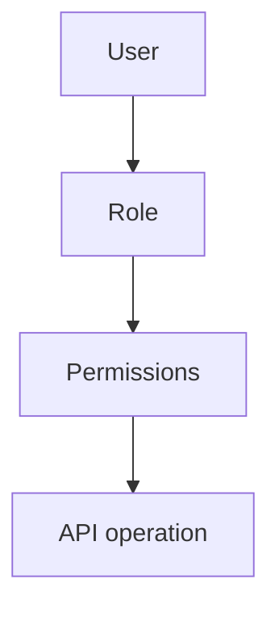
*Every API operation maps to a permission a role must hold.* Detail lives in
[`22-architecture-security-and-iam.md`](22-architecture-security-and-iam.md). More advanced schemes
(gateway auth, zero-trust, and **ABAC** = Attribute-Based Access Control — permissions from attributes like
department/location, not just role) are → FFP.

## 21. Reliability

MVP-appropriate reliability: database **transactions**, **constraints**, validation, structured
**error handling**, **logging**, **tests**, **health checks**, and **backups/restore**. Replication,
load balancing, orchestration, and distributed observability arrive with scale (→ FFP).

---

## 22. Why Redis Is *Not* in the MVP

> **Redis is not required for the initial IDRM MVP.**

Redis is excellent for caching, rate limiting, temporary state, and background-job queues — but the
MVP has no measured need for any of these yet. Adding it now would be **complexity without benefit**,
and risks hiding poor database design. First optimise PostgreSQL (schema, indexes, queries, pooling,
transactions, profiling). **Add Redis only when a concrete, measured requirement justifies it.** → *FFP.*

## 23. Future: Redis / Redis Streams (→ FFP)

When asynchronous work becomes necessary, **Redis Streams** can provide durable stream entries,
consumer groups, acknowledgements, and message recovery — covering many queue/event needs.

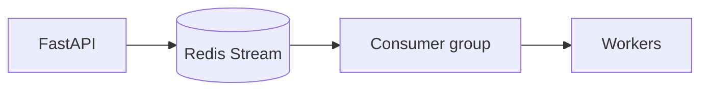
*A future path for background processing — introduced only under real load.*

## 24. Future: Workers & Queues (→ FFP)

Background workers let slow jobs (notifications, report generation, heavy geoprocessing) run outside
the request/response cycle. Deferred until a task genuinely needs to run asynchronously.

## 25. RabbitMQ / Kafka — When and Why (→ FFP)

Redis Streams and brokers are **not** identical. **RabbitMQ** (complex routing, exchanges,
dead-lettering) or **Kafka** (high-throughput event streaming) become attractive only when IDRM's
messaging needs outgrow Streams. Introduced only when justified.

## 26. Docker — Later (→ FFP)

The MVP runs directly on a developer machine (Python + FastAPI + PostgreSQL + browser). **Docker**
later gives reproducible environments, packaging, and CI/CD consistency — an operations improvement,
not an application prerequisite.

## 27. Docker Swarm / Kubernetes — Later (→ FFP)

Orchestration (replication, scheduling, service discovery, rolling updates, failure recovery) is a
**deployment/scale** concern, introduced when production scale demands it — never in the MVP.

## 28. React — Later (→ FFP)

The MVP ships **HTML + Tailwind CSS v4 + JavaScript**. **React** is added when rich client-side
interactivity is needed — and it consumes the **same API**, so the backend does not change.

## 29. React Native / Expo — Later (→ FFP)

Native **mobile** apps come once field/offline use is required. They too consume the same API.

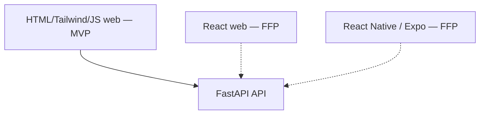
*Every current and future client speaks to one stable API.*

---

## 30. Student / Rookie Contribution Model

The architecture is designed so **a newcomer can contribute in a bounded area without understanding
the whole system**.

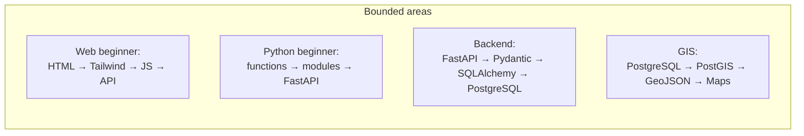
*A contributor picks a lane. The module structure (Section 12) means their change is contained and
testable.* The advanced lane (Redis → workers → Docker → orchestration → microservices) is → FFP.
Onboarding detail lives in [`../idrm-mvp-guides/30-contribute-developer-guide.md`](../idrm-mvp-guides/30-contribute-developer-guide.md).

> A contributor should not need to understand the entire system before making a useful contribution.

## 31. Future Microservice Extraction (→ FFP)

Because modules already have firm boundaries and talk through interfaces, a module can later become
its own service **one at a time**, starting with the least-coupled.

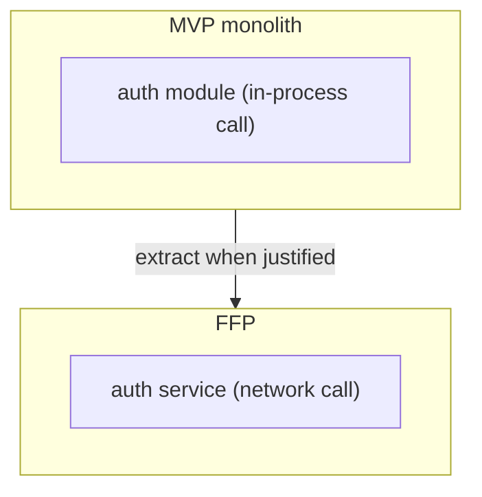
*The interface stays the same; only the wiring changes. No big-bang rewrite.*

> **Polyglot at FFP scale (→ FFP):** an extracted service may be re-implemented in **Java, Go, or a
> JS runtime** where scale, security, or resilience calls for it — runtime diversity also serving as a
> resilience/backup strategy — while **Python is kept for rapid prototyping and DS/ML tasks & modeling**.
> Every service keeps the same public API contract.

---

## 32. Architecture Evolution Roadmap

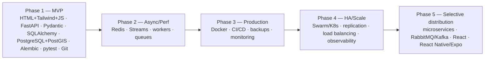
*Phase 1 is the MVP (this document). Phases 2–5 are the **FFP** — entered only when concrete needs
justify each step. Each transition is recorded as an ADR.*

## 33. MVP Checklist

- [ ] One FastAPI/Python application (modular monolith), not microservices
- [ ] Modules with firm boundaries (`router/schemas/models/service/repository`)
- [ ] HTML + **Tailwind CSS v4** + JavaScript web UI (no React)
- [ ] API-first, versioned (`/api/v1`), OpenAPI published
- [ ] PostgreSQL + PostGIS as the single source of truth
- [ ] Pydantic validation at the edge; SQLAlchemy for data access; Alembic migrations
- [ ] pytest: unit + API + integration (incl. DB)
- [ ] Security from day one (HTTPS, RBAC, audit, secrets, backups)
- [ ] No Redis / broker / Docker / Swarm / K8s / microservices (all → FFP, with an ADR each)

---

## 34. GenAI Visual / Poster Prompts

*Prompts for an image-generation system. Prefer diagrams, icons, labels, and short captions — avoid
large blocks of tiny text.*

### Poster 1 — "IDRM MVP at a Glance"
- **Purpose:** one-glance overview of the MVP architecture. **Audience:** everyone.
- **Composition:** vertical flow, top→bottom: Browser (HTML + Tailwind CSS v4 + JS) → FastAPI/Python monolith (show 8 labeled module chips) → PostgreSQL + PostGIS cylinder.
- **Hierarchy:** three clear bands; largest label on the monolith. **Typography:** one clean sans-serif, big headings, few words. **Style:** flat, modern, friendly. **Colors:** calm blue/teal, high contrast; colour-blind-safe. **Accessibility:** AA contrast, no meaning by colour alone. **Aspect ratio:** 3:4 (portrait). **Avoid:** photorealism, tiny paragraphs, clutter.

### Poster 2 — "What Is a Modular Monolith?"
- **Purpose:** explain the concept visually. **Audience:** novices/students.
- **Composition:** one house outline containing labelled rooms (modules); beside it, a faded set of separate buildings labelled "microservices (later)".
- **Hierarchy:** the single house dominates. **Style:** simple line + flat fill. **Colors:** warm, two-tone accent. **Accessibility:** AA. **Aspect ratio:** 4:3. **Avoid:** network/cloud jargon.

### Poster 3 — "IDRM Request Journey"
- **Purpose:** show how a browser request travels. **Audience:** developers/students.
- **Composition:** left→right arrows: Browser → FastAPI → module (router→service→repository) → PostgreSQL/PostGIS → back.
- **Hierarchy:** numbered steps 1–5. **Style:** clean flowchart with icons. **Colors:** single accent + neutrals. **Accessibility:** number the steps (not colour-coded). **Aspect ratio:** 16:9. **Avoid:** overlapping arrows.

### Poster 4 — "IDRM — Now → Later Evolution"
- **Purpose:** MVP vs FFP roadmap. **Audience:** stakeholders/leads.
- **Composition:** five phase blocks left→right (MVP → Async → Production → HA/Scale → Selective distribution), MVP highlighted, later phases lighter with "when justified" tags.
- **Hierarchy:** MVP block boldest. **Style:** milestone timeline. **Colors:** gradient from solid (now) to faded (later). **Accessibility:** label each phase in text. **Aspect ratio:** 16:9. **Avoid:** implying later phases are mandatory.

### Poster 5 — "IDRM Technology Learning Path"
- **Purpose:** show contributor lanes. **Audience:** newcomers.
- **Composition:** four parallel lanes (Web: HTML→Tailwind→JS→API · Python: functions→modules→FastAPI · Backend: FastAPI→Pydantic→SQLAlchemy→PostgreSQL · GIS: PostgreSQL→PostGIS→GeoJSON→Maps), a faded "Advanced (FFP)" lane below.
- **Hierarchy:** four equal lanes. **Style:** subway-map style. **Colors:** one hue per lane, all AA-contrast. **Accessibility:** icons + text labels per stop. **Aspect ratio:** 4:3. **Avoid:** tiny stop labels.

---

## 35. Final Architectural Principles

> # **Build Simple. Design Modularly. Test Thoroughly. Evolve Deliberately.**
>
> **IDRM begins as a simple, secure, testable FastAPI/Python modular monolith with an
> HTML + Tailwind CSS v4 + JavaScript web interface and PostgreSQL/PostGIS as its source of truth.**
>
> **An APISIX API gateway, Bun/Node/Deno edge services, Redis, workers, queues, Docker, Swarm/Kubernetes, React, mobile clients,
> message brokers, and microservices are introduced only when real requirements justify them — as the
> [FFP](../idrm-ffp-docs/prompts/instructions_idrm_ffp_docs.md).**
>
> **The goal is not maximum technology. It is maximum clarity with a credible path to enterprise scale.**

---

*Related MVP documents:* [`10-requirements-prd.md`](10-requirements-prd.md) ·
[`22-architecture-security-and-iam.md`](22-architecture-security-and-iam.md) ·
[`25-module-elucidation.md`](25-module-elucidation.md) · [`26-conformance-pics.md`](26-conformance-pics.md) ·
[`40-api-specification.md`](40-api-specification.md) · [`50-data-model.md`](50-data-model.md) ·
[`70-quality-test-strategy.md`](70-quality-test-strategy.md) · decisions in
[`21-architecture-decisions.md`](21-architecture-decisions.md). See the plan in
[`prompts/instructions_idrm_mvp_docs.md`](prompts/instructions_idrm_mvp_docs.md).
