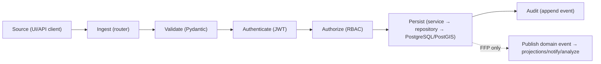
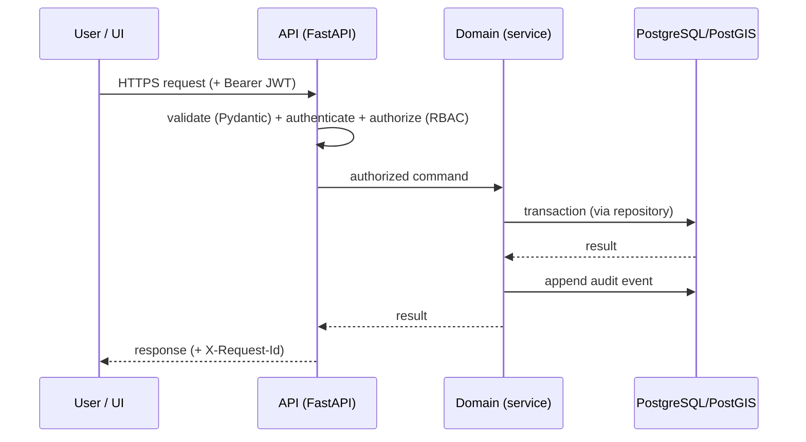

# IDRM MVP — Design: Data Flow & Module Specifications

> *Type: Document (specification / design) · Audience: backend developers, architects, QA · Status: MVP — current*
> *The **design layer** between architecture ([`20-architecture-system.md`](20-architecture-system.md)) and code:
> how a request flows through the system, the cross-cutting mechanisms every request obeys, and a **per-module
> component spec** using one standard template. Source: documentation blueprint §8, §10, §11.*

> **Phase note:** the MVP data path is **synchronous** — there is **no event bus** in the MVP. The blueprint's
> "Publish Event / Event Bus" step is **FFP**; it appears below as a dashed, FFP-only branch so the seam exists
> without being built now.

---

## 1. The canonical data path (MVP = synchronous)

Every write follows the same path:



In the MVP, steps after **Persist** happen **inline** (e.g. a notification is written directly). In FFP the dashed
branch becomes real (Redis Streams → brokers) — same seam, no rewrite.

## 2. Packet / API flow (one request, end to end)



*(FFP adds a Gateway/WAF hop in front and an Event Bus after the transaction — see
[`../idrm-ffp-docs/20-architecture-system.md`](../idrm-ffp-docs/20-architecture-system.md).)*

## 3. Cross-cutting mechanisms (every critical request)

| Mechanism | MVP | Notes |
|-----------|-----|-------|
| **Request ID** | ✅ `X-Request-Id` echoed on every response | tracing seed ([`40`](40-api-specification.md) §) |
| **Idempotency key** | ✅ on create/transition | prevents double-submit on flaky field networks |
| **Validation** | ✅ Pydantic at the boundary | reject early with error `code` |
| **Audit** | ✅ every state change | tamper-evident record |
| **Timeout / retry** | basic (client) | no auto-retry on writes |
| **Correlation ID / event versioning / DLQ** | — (FFP) | arrive with the event bus |
| **Data freshness / provenance** | basic | deepen in FFP COP |

Each critical endpoint in [`40-api-specification.md`](40-api-specification.md) defines: protocol, endpoint, authN,
authZ, request/response schema, errors, timeout, idempotency, logging. (Rate-limiting/tracing = gateway, FFP.)

---

## 4. Module specification template

Every module ([`20-architecture-system.md`](20-architecture-system.md) lists them) is documented with **one
standard template** so all modules read the same:

```text
Purpose · Responsibilities · Actors · Inputs · Outputs · APIs · Events ·
Database Entities · Business Rules · Security Rules · Failure Modes ·
Dependencies · Tests · Metrics · Owner
```

## 5. The modules (filled specs — MVP)

Below, the two most central modules are filled as worked examples; the rest follow the same template (fill as
each is built — keep in step with [`50-data-model.md`](50-data-model.md) and [`40-api-specification.md`](40-api-specification.md)).

### 5.1 Incidents (the core)
- **Purpose:** capture and drive help requests through their lifecycle.
- **Actors:** citizen, provider, coordinator/admin.
- **APIs:** `/api/v1/incidents` (+ status transitions). **Events:** (FFP) `incident_*`.
- **Database entities:** incidents, incident_assignments, incident_updates, incident_ratings; locations (PostGIS).
- **Business rules:** the 8-state machine; critical → approval; illegal transitions **impossible**.
- **Security rules:** RBAC per action; audit every change.
- **Failure modes:** invalid transition (reject), oversized upload (reject), unauthorized (403).
- **Tests:** state-machine, RBAC, API contract. **Metrics:** incidents by state, time-in-state.
- **Owner:** see [`90-governance-and-raci.md`](90-governance-and-raci.md).

### 5.2 Users / IAM
- **Purpose:** identity, roles, sessions.
- **APIs:** `/api/v1/auth/*`, `/users`. **Entities:** users, sessions.
- **Business/Security rules:** RS256 JWT (access+refresh), RBAC (4 roles + guest), bcrypt-12, 5/15-min lockout.
- **Failure modes:** bad credentials, lockout, expired token → refresh.
- **Tests:** auth unit + API, per-role authorization. **Owner:** Security.

### 5.3 Remaining modules (same template, to fill)
locations (GIS) · resources · alerts · notifications · reports · files (MinIO) · audit · administration.

---

## 6. Traceability & follow-up
- Data path ↔ security controls: [`22-architecture-security-and-iam.md`](22-architecture-security-and-iam.md).
- Module ↔ capability ↔ owner: [`12-…operating-model.md`](12-domain-capability-and-operating-model.md) ·
  [`90-governance-and-raci.md`](90-governance-and-raci.md).
- **FFP delta (planned):** the event model (producers/consumers, topics, idempotent consumers, DLQ) →
  [`../idrm-ffp-docs/81-ops-messaging-and-async.md`](../idrm-ffp-docs/81-ops-messaging-and-async.md).

*Related:* [`20-architecture-system.md`](20-architecture-system.md) · [`40-api-specification.md`](40-api-specification.md) ·
[`50-data-model.md`](50-data-model.md) · [`25-module-elucidation.md`](25-module-elucidation.md) (per-module what/why/how) ·
[`26-conformance-pics.md`](26-conformance-pics.md).
