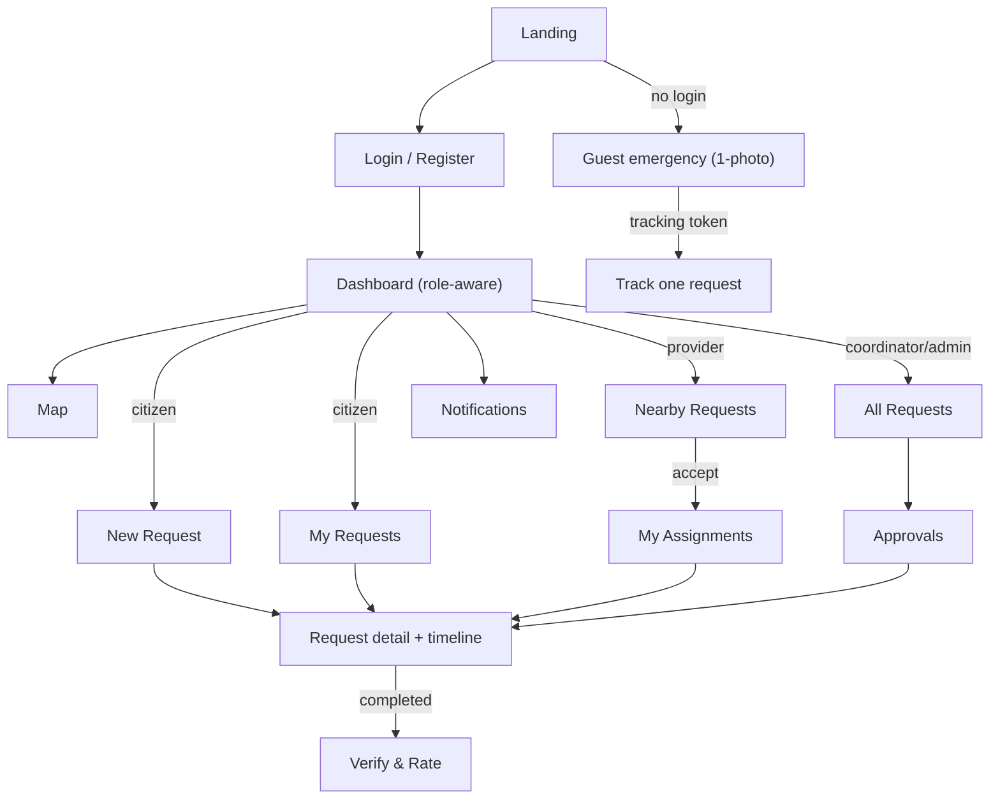

# IDRM MVP — Web Design System (HTML + Tailwind CSS v4 + vanilla JS)

> *Type: Document (design system / deep-dive) · Audience: complete novices → frontend developers & designers · Status: MVP — current*
> *The deep-dive behind [`27-implementation-roadmap.md`](27-implementation-roadmap.md) §9. Where
> [`60-uidesign-web-interaction.md`](60-uidesign-web-interaction.md) says **which screens exist and which API each
> calls**, this says **how they should look, feel, and stay consistent** — the reusable "rulebook" of colours,
> type, spacing, and components so every page is one coherent, accessible system. Stack: **HTML5 · Tailwind CSS v4 ·
> vanilla JavaScript · Leaflet** (no React/TypeScript — those are **→ FFP**). Accessibility target: **WCAG 2.2 AA**.*

---

## 1. What a "design system" is, and why IDRM needs one

A **design system** is a small, reusable rulebook — a shared set of **colours, fonts, spacing, and components** —
that every screen draws from, so the whole app looks and behaves as *one* product instead of a patchwork. Think of
it as the **interior-design scheme** of our house (§0.1 of the roadmap): pick the palette and the fittings once,
and every room feels part of the same home.

Why it matters especially here: IDRM is used **in emergencies, on basic smartphones, over weak networks, by people
under stress** — some with low digital literacy. A consistent, high-contrast, obvious interface isn't cosmetic; it
is how a frightened person finds the "get help" button in three seconds. New to accessible UI?
[`accessibility-testing-101.md`](../idrm-mvp-guides/learn/accessibility-testing-101.md) is the primer.

> **One honest note:** IDRM has no fixed brand yet, so the palette below is a **sensible, accessibility-checked
> default** — trustworthy, calm, high-contrast. Every colour is a **token** (a named variable), so swapping in a
> future brand is a one-place change, not a repaint.

## 2. Design tokens (the single source of visual truth)

**Tokens** are named values (`--color-primary`, `--space-4`) used everywhere instead of raw numbers. Change the
token, change the whole app. In **Tailwind CSS v4** they live in a `@theme` block and become utility classes
automatically:

```css
/* app.css — the one place visual values are defined */
@import "tailwindcss";
@theme {
  /* Neutrals (structure & text) */
  --color-bg:        #ffffff;   --color-surface:  #f8fafc;   --color-border: #e2e8f0;
  --color-text:      #0f172a;   --color-text-muted: #475569;               /* AA on white */
  /* Brand / primary action */
  --color-primary:   #1d4ed8;   --color-primary-hover: #1e40af;   --color-on-primary: #ffffff;
  /* Semantic status */
  --color-success:   #15803d;   --color-warning: #b45309;   --color-danger: #b91c1c;   --color-info: #0369a1;
  /* Incident PRIORITY (locked in doc 60 — never colour-only, always icon+label too) */
  --color-critical:  #dc2626;   --color-high: #ea580c;   --color-medium: #d97706;   --color-low: #16a34a;
  /* Type scale (system fonts = zero download, fast on weak networks) */
  --font-sans: system-ui, -apple-system, "Segoe UI", Roboto, "Noto Sans", sans-serif;
  --text-xs: .75rem; --text-sm: .875rem; --text-base: 1rem; --text-lg: 1.125rem;
  --text-xl: 1.25rem; --text-2xl: 1.5rem; --text-3xl: 1.875rem;
  /* Spacing (4px base), radius, focus ring */
  --space-1:.25rem; --space-2:.5rem; --space-3:.75rem; --space-4:1rem; --space-6:1.5rem; --space-8:2rem;
  --radius-sm:.25rem; --radius-md:.5rem; --radius-lg:.75rem;
  --ring: 0 0 0 3px rgba(29,78,216,.45);   /* visible keyboard-focus ring */
}
```

> **Contrast is a requirement, not a preference (WCAG 2.2 AA):** body text needs a contrast ratio **≥ 4.5:1**
> against its background; large text and UI borders **≥ 3:1**. The neutrals + primary above are chosen to pass; any
> new token must be re-checked (§8). *Chart/data-viz colours are out of scope here — the MVP dashboard shows basic
> metrics; rich dashboards are → FFP. If/when we build charts, follow the dataviz palette rules then.*

## 3. Visual hierarchy — guiding the eye

**Visual hierarchy** is arranging a screen so the eye lands on the most important thing first. Four tools, in order
of strength: **size**, **weight**, **colour/contrast**, **spacing**. IDRM's rules:

- **One primary action per screen** — rendered as the single filled `--color-primary` button (e.g. *"Get Help
  Now"*, *"Submit Request"*). Everything else is secondary (outline) or tertiary (text) so it never competes.
- **Critical information is loudest** — an incident's **priority** and **status** use the strongest colour +
  an icon + a label, high on the card.
- **Generous spacing and short lines** — breathing room and large tap targets beat density on a phone in a crisis.
- **Consistent alignment** — a predictable left-aligned rhythm; the user never hunts.

## 4. Components (the reusable fittings)

Each component below lists its **states** and its **accessibility** must-haves. States matter because a button a
user can't tell is *disabled* or *loading* causes double-submits in a panic.

| Component | States | Accessibility essentials |
|---|---|---|
| **Button** (primary / secondary / tertiary / danger) | default · hover · focus (visible ring) · active · **disabled** · **loading** | real `<button>`; ≥ 44 px tap target; label not colour-only; `aria-busy` while loading |
| **Text input / select / textarea** | default · focus · **error** · disabled | always-visible `<label>`; error text tied via `aria-describedby`; `aria-invalid` on error |
| **Form** | idle · validating · submit-disabled-while-pending · error summary | inline validation mirrors the API (§4.6 `details`); errors announced to screen readers |
| **Card** (incident / provider) | default · hover · selected | heading is a real heading; whole card not a single ambiguous link |
| **Table / list** | loading · **empty** · error · row-hover | `<table>` semantics or ARIA list; server-paginated; explicit empty state |
| **Status badge** | one per lifecycle state | icon **+** text **+** colour (never colour alone) |
| **Priority marker** (map + card) | critical / high / medium / low | colour **+** shape/icon **+** label; ARIA label on map markers |
| **Toast** (success / error) | enter · auto-dismiss · manual close | `role="status"` (success) / `role="alert"` (error); dismissible; not the *only* signal |
| **Alert banner** (active alerts) | info · warning · critical | persistent, top-of-page; keyboard-reachable; readable at AA |
| **Nav / header** | role-aware items; current-page marked | `aria-current="page"`; hidden items also enforced server-side (§8.5) |
| **Modal / dialog** (confirm cancel, verify+rate) | open · focus-trapped · close | focus trapped inside; `Esc` closes; focus returns to the trigger |
| **Notification bell** | idle · unread-count badge | count is text, not colour-only; `aria-label` states the count |

> **Build them once:** these live as small HTML partials + a handful of shared Tailwind component classes (via
> `@apply`) and tiny vanilla-JS behaviours — reused across every screen, so consistency is automatic and a fix in
> one place fixes everywhere (the DRY principle, §5.3 of the roadmap).

## 5. Page templates & the app shell

Every page is built from **one app shell** so structure never varies:

```
┌───────────────────────────────────────────────┐
│ Header:  logo · role-aware nav · alerts banner · 🔔 · profile │  <- consistent, sticky
├───────────────────────────────────────────────┤
│ Main:    page content (single column on phones)               │
│          [breadcrumb/title] [primary action]                  │
│          …cards / table / map / form…                         │
├───────────────────────────────────────────────┤
│ Footer:  language (en/hi/te) · help · version                 │
└───────────────────────────────────────────────┘
```

Core templates (each realises screens from [`60-uidesign-web-interaction.md`](60-uidesign-web-interaction.md) §4):
**Auth** (login/register/reset), **Dashboard** (role-aware), **List** (my requests / nearby / all), **Detail**
(incident + timeline + actions), **Form** (new request: map-pin → type → priority → describe → photos),
**Map** (Leaflet, priority-coloured markers), and the **Guest emergency** one-photo lite page.

## 6. Page-transition map (how screens connect)

The navigation you asked about — *which page leads where* — mirrors the role-aware nav and the incident lifecycle:



Transitions are **predictable and shallow** (rarely more than two clicks to any action), and every navigation item
a role may not use is both **hidden** and **server-enforced** (§8.5).

## 7. Responsiveness, motion & low-bandwidth posture

- **Mobile-first:** design for the phone first, enhance for wider screens (Tailwind breakpoints `sm/md/lg/xl`);
  single column on phones; large tap targets.
- **Low bandwidth:** **system fonts** (no web-font download), lazy-loaded map tiles, client-side image compression
  before upload (§4.6 emergency-lite), paginated lists.
- **Motion:** subtle only, and honour **`prefers-reduced-motion`** (a WCAG 2.2 consideration) — no animation that
  could disorient a stressed user.

## 8. Accessibility (WCAG 2.2 AA) — non-negotiable

Baked into the tokens and components above, verified in §9:

- **Contrast** ≥ 4.5:1 text / ≥ 3:1 large-text & UI. **Never colour-only** — priority/status always carry an icon +
  label. **Visible keyboard focus** on every interactive element (the `--ring` token).
- **Keyboard-operable** everything; logical tab order; modals trap focus and restore it on close.
- **Semantic HTML** first (`<button>`, `<label>`, `<nav>`, headings), ARIA only to fill gaps; map markers carry
  ARIA labels. **Target size** suited to touch. **Accessible auth** (clear errors) — a WCAG 2.2 criterion that also
  matters because security must never lock out someone who needs help ([`22`](22-architecture-security-and-iam.md) §8).

## 9. How it's implemented & verified

- **Implementation:** the tokens (§2) in one `app.css`; component partials in `frontend/templates/`; shared classes
  and tiny behaviours in `frontend/static/{css,js}` (§5.1 of the roadmap) — all **served same-origin** by FastAPI
  (no CORS in the MVP). Copy comes from a **message catalogue** (`en`/`hi`/`te`), never hard-coded (F11).
- **Verification (§10):** automated **accessibility checks** (e.g. axe) on key templates assert contrast, labels,
  focus, and ARIA; component states are eyeballed against this doc; keyboard-only walkthroughs of the core flows are
  part of the **Definition of Done** (§14).

## 10. The FFP seam

Because every screen already names its API calls and uses tokenised, componentised markup, the **React SPA** and
**React Native/Expo** clients rebuild this exact system against the **same** endpoints and the **same** token
values — the design system carries forward as a shared visual contract. Rich data-viz dashboards, offline-first
capture, deep real-time push, and full 12-language localization are **→ FFP**
([`60-uidesign-web-interaction.md`](60-uidesign-web-interaction.md) §7; the FFP frontend standards
`../idrm-ffp-docs/61-frontend-engineering-standards.md`).

---

*Related:* roadmap [`27-implementation-roadmap.md`](27-implementation-roadmap.md) §9 · screens & flows [`60-uidesign-web-interaction.md`](60-uidesign-web-interaction.md) ·
API [`40-api-specification.md`](40-api-specification.md) · security/RBAC [`22-architecture-security-and-iam.md`](22-architecture-security-and-iam.md) ·
code structure [`27-implementation-roadmap.md`](27-implementation-roadmap.md) §5 · primer [`accessibility-testing-101.md`](../idrm-mvp-guides/learn/accessibility-testing-101.md) ·
FFP frontend [`../idrm-ffp-docs/61-frontend-engineering-standards.md`](../idrm-ffp-docs/61-frontend-engineering-standards.md).
