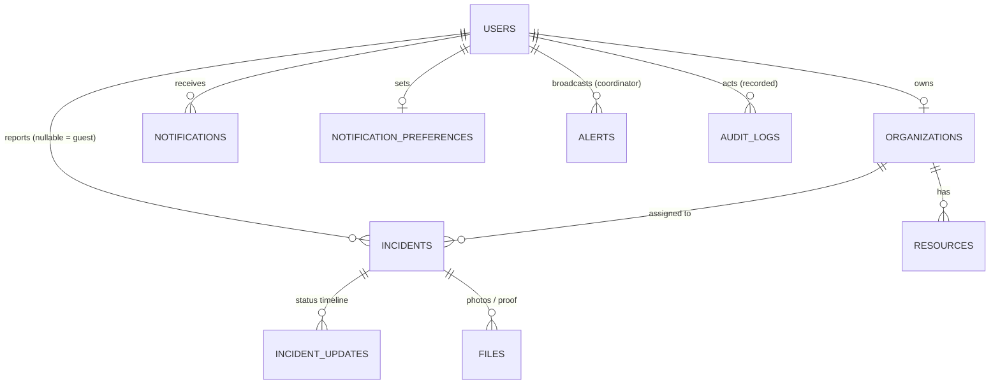

# IDRM MVP — Data Model & Database Design

> *Type: Document (specification) · Audience: backend developers, DBAs, testers · Status: MVP — current*
> *The PostgreSQL + PostGIS model behind the locked API ([`40-api-specification.md`](40-api-specification.md) / [`40-api-openapi.yaml`](40-api-openapi.yaml)). Consolidated from the archived `../assets/idrm-data-model.xlsx` (25-table design) and the v3 data model, **trimmed to the MVP** and **renamed to the canonical, incident-centric scheme**. Every table traces to an API resource; disaster/financial/realtime tables are **→ FFP**.*

> **One source of truth:** **PostgreSQL is the system of record.** Uploaded files live in **MinIO**
> (S3-compatible) — the DB stores only their **keys/URLs + metadata** (see [`20-architecture-system.md`](20-architecture-system.md) §7).

---

## 1. How to read this document

Three levels, from plain to precise:
- **§3 Conceptual** — the handful of real-world things IDRM tracks, and how they relate (one diagram).
- **§4 Logical** — each entity's meaningful attributes and the relationships/cardinalities.
- **§5 Physical** — the actual PostgreSQL tables: columns, types, keys, constraints, indexes, PostGIS
  columns. §6 enums · §7 indexing · §8 conventions · §9 migrations · §10 what's deferred → FFP.

Everything uses the frozen API conventions: **UUID** keys, **snake_case**, **ISO-8601 UTC** `*_at`
timestamps, and **lowercase snake_case enum values** identical to the API wire values.

> **PostgreSQL terms you'll meet in this doc (expanded once):** **UUID** = a random, non-guessable id ·
> **TIMESTAMPTZ** = a timestamp that carries its timezone (always stored UTC here) · **PostGIS** = the PostgreSQL
> extension that adds map/geometry types · **SRID 4326 / WGS-84** = the "GPS latitude/longitude" coordinate
> system every location uses · **GiST** = the spatial index that makes "what's nearby?" queries fast · **JSONB** =
> PostgreSQL's efficient binary-JSON column type · **PK / FK / NN / UQ** = primary key / foreign key / NOT NULL /
> unique (the notation used in §5).

---

## 2. Scope — tables in the MVP

**13 tables**, grouped by the API resource they back:

| Domain | Tables | Backs API |
|---|---|---|
| Users & auth | `users` · `user_sessions` · `password_reset_tokens` · `email_verification_tokens` | `/auth`, `/users` |
| Providers | `organizations` · `resources` | `/organizations`, `/resources` |
| **Core** | **`incidents`** · `incident_updates` | `/incidents` (+ transitions, `/updates`) |
| Comms | `alerts` · `notifications` · `notification_preferences` | `/alerts`, `/notifications` |
| Files | `files` | `/files` (MinIO refs) |
| Audit | `audit_logs` | `/audit-logs` |

*(Deferred to FFP — not created in the MVP schema: `disaster_events`, `affected_areas`,
`financial_transactions`, `fund_allocations`, `donation_receipts`, `service_clusters`, `system_metrics`,
`websocket_connections`, `chat_messages`. See §10.)*

---

## 3. Conceptual model



**In plain terms:** a **user** (citizen) reports an **incident** (a help request) at a location; a guest
can report one too (so `requester` is optional). A **provider organization** owns **resources** and gets
**assigned** to incidents. Every status change writes an **incident_update** (the timeline). Photos/proof
become **files** (stored in MinIO). Users get **notifications**; coordinators send **alerts**. Every
significant action is written to the **audit log**.

---

## 4. Logical model (entities & relationships)

| Entity | Means | Key attributes | Relationships |
|---|---|---|---|
| **User** | A registered account | email, name, phone, **role**, status, language | owns 0..1 Organization; reports 0..N Incidents |
| **Organization** | A provider (NGO/hospital/volunteer group) | name, **type**, service categories, service area (point + radius), capacity, verified | owned by 1 User; has 0..N Resources; assigned 0..N Incidents |
| **Resource** | A provider asset (ambulance, boat, beds…) | name, kind, quantity, location, available | belongs to 1 Organization |
| **Incident** | A citizen help request | **service_type**, **priority**, **status**, description, **location**, rating | reported by 0..1 User (guest→null); assigned 0..1 Organization; has N Updates, N Files |
| **IncidentUpdate** | One status transition (the timeline) | from_status, to_status, actor, note | belongs to 1 Incident |
| **Alert** | A coordinator area broadcast | title, message, severity, area, active, expires | created by 1 User (coordinator) |
| **Notification** | A message to one user | title, message, type, read | belongs to 1 User |
| **NotificationPreference** | A user's channel choices | email, sms, in_app | 1:1 with User |
| **File** | An uploaded photo/document | bucket, object_key, url, content_type, size, purpose | uploaded by 0..1 User; linked to an entity |
| **AuditLog** | An append-only action record | actor, action, resource, old/new values | references the acting User |

**Cardinality rules (from the locked business rules):** an Incident has **exactly one** assigned
Organization at a time (single-claim); a User has **at most one** owned Organization at MVP; a rating is
**one per Incident** (stored on the incident, set at `verify`).

---

## 5. Physical model (PostgreSQL tables)

> Notation: **PK** primary key · **FK→** foreign key · `NN` NOT NULL · `UQ` unique. All `id` columns are
> `UUID DEFAULT gen_random_uuid()`. All `*_at` are `TIMESTAMPTZ`. Geometry is PostGIS SRID **4326** (WGS-84
> lat/lng).

### 5.1 `users`
| Column | Type | Notes |
|---|---|---|
| id | UUID | **PK** |
| email | VARCHAR(255) | NN, **UQ** |
| password_hash | VARCHAR(255) | NN (bcrypt; see security doc) |
| name | VARCHAR(255) | NN |
| phone | VARCHAR(20) | e.g. `+919876543210` |
| role | `user_role` | NN, default `citizen` |
| status | `user_status` | NN, default `pending` |
| email_verified | BOOLEAN | NN, default false |
| failed_login_attempts | INTEGER | NN, default 0 |
| locked_until | TIMESTAMPTZ | account lock expiry |
| last_login_at | TIMESTAMPTZ | |
| language | VARCHAR(5) | NN, default `en` (`en`/`hi`/`te`) |
| preferences | JSONB | NN, default `'{}'` |
| created_at / updated_at | TIMESTAMPTZ | NN |
| deleted_at | TIMESTAMPTZ | soft delete (NULL = active) |

### 5.2 `user_sessions` · `password_reset_tokens` · `email_verification_tokens`
- **user_sessions:** id **PK** · user_id **FK→users** NN · refresh_token VARCHAR(500) NN **UQ** · expires_at NN · ip_address INET · user_agent TEXT · created_at NN.
- **password_reset_tokens:** id **PK** · user_id **FK→users** NN · token VARCHAR(255) NN **UQ** · expires_at NN · used_at · created_at NN.
- **email_verification_tokens:** id **PK** · user_id **FK→users** NN · token VARCHAR(255) NN **UQ** · expires_at NN · verified_at · created_at NN.

### 5.3 `organizations`
| Column | Type | Notes |
|---|---|---|
| id | UUID | **PK** |
| name | VARCHAR(255) | NN |
| type | `org_type` | NN |
| owner_user_id | UUID | **FK→users** NN |
| service_categories | `service_type[]` | NN, default `'{}'` (GIN) |
| service_area_center | `GEOMETRY(Point,4326)` | service-area centre (GiST) |
| service_radius_km | NUMERIC(8,2) | NN, default 10.0 |
| capacity | INTEGER | NN, default 0 |
| available_capacity | INTEGER | NN, default 0 |
| is_available | BOOLEAN | NN, default true |
| is_verified | BOOLEAN | NN, default false |
| verified_by | UUID | **FK→users** (coordinator) |
| verified_at | TIMESTAMPTZ | |
| rating | NUMERIC(3,2) | 0.00–5.00 |
| total_requests_completed | INTEGER | NN, default 0 |
| contact_phone | VARCHAR(20) | |
| created_at / updated_at / deleted_at | TIMESTAMPTZ | |

### 5.4 `resources`
| Column | Type | Notes |
|---|---|---|
| id | UUID | **PK** |
| organization_id | UUID | **FK→organizations** NN |
| name | VARCHAR(255) | NN |
| kind | VARCHAR(50) | e.g. `ambulance`, `boat`, `beds` |
| quantity | INTEGER | NN, default 1 |
| location | `GEOMETRY(Point,4326)` | optional (GiST) |
| is_available | BOOLEAN | NN, default true |
| created_at / updated_at / deleted_at | TIMESTAMPTZ | |

### 5.5 `incidents`  *(the core table — the citizen "help request")*
| Column | Type | Notes |
|---|---|---|
| id | UUID | **PK** |
| service_type | `service_type` | NN |
| priority | `priority` | NN |
| status | `incident_status` | NN, default `created` |
| description | TEXT | NN |
| location | `GEOMETRY(Point,4326)` | NN (GiST) |
| requester_id | UUID | **FK→users** — **NULL = guest/anonymous** |
| guest_contact | VARCHAR(20) | optional phone for guest submissions |
| tracking_token | VARCHAR(64) | **UQ** — guest follow-up token |
| assigned_organization_id | UUID | **FK→organizations** (single-claim) |
| approved_by | UUID | **FK→users** (coordinator, for critical) |
| rating | SMALLINT | 1–5, set at `verify` (CHECK 1..5) |
| review | TEXT | optional, set at `verify` |
| rejection_reason | TEXT | set at `reject` |
| cancellation_reason | TEXT | set at `cancel` |
| created_at / updated_at | TIMESTAMPTZ | NN |
| verified_at | TIMESTAMPTZ | terminal-state stamp |
| deleted_at | TIMESTAMPTZ | soft delete |

### 5.6 `incident_updates`  *(status timeline — feeds `GET /incidents/{id}/updates`)*
| Column | Type | Notes |
|---|---|---|
| id | UUID | **PK** |
| incident_id | UUID | **FK→incidents** NN |
| from_status | `incident_status` | NULL for the first (create) row |
| to_status | `incident_status` | NN |
| actor_id | UUID | **FK→users** (NULL = system/guest) |
| note | TEXT | reason/eta/notes |
| created_at | TIMESTAMPTZ | NN |

### 5.7 `alerts`
| Column | Type | Notes |
|---|---|---|
| id | UUID **PK** · title VARCHAR(255) NN · message TEXT NN · severity `alert_severity` NN | |
| area | `GEOMETRY(MultiPolygon,4326)` | NULL = platform-wide (GiST) |
| active | BOOLEAN | NN, default true |
| created_by | UUID | **FK→users** (coordinator) NN |
| expires_at / created_at | TIMESTAMPTZ | |

### 5.8 `notifications` · `notification_preferences`
- **notifications:** id **PK** · user_id **FK→users** NN · title NN · message TEXT NN · type `notification_type` NN · is_read BOOLEAN NN default false · link VARCHAR(255) · created_at NN · deleted_at (soft delete).
- **notification_preferences:** id **PK** · user_id **FK→users** NN **UQ** · email BOOLEAN default true · sms BOOLEAN default true · in_app BOOLEAN default true · updated_at.

### 5.9 `files`  *(metadata only; bytes live in MinIO)*
| Column | Type | Notes |
|---|---|---|
| id | UUID | **PK** |
| uploaded_by | UUID | **FK→users** (NULL = guest) |
| bucket | VARCHAR(63) | e.g. `idrm-uploads` |
| object_key | VARCHAR(512) | NN — the MinIO/S3 key |
| url | VARCHAR(1024) | may be a pre-signed link |
| content_type | VARCHAR(100) | `image/jpeg` · `image/png` · `application/pdf` |
| size_bytes | BIGINT | CHECK ≤ 10 MB |
| purpose | `file_purpose` | `incident_photo` · `completion_proof` · `org_document` |
| entity_type | VARCHAR(30) | e.g. `incident`, `organization` |
| entity_id | UUID | the linked record |
| created_at | TIMESTAMPTZ | NN |

### 5.10 `audit_logs`  *(append-only — no update/delete)*
| Column | Type | Notes |
|---|---|---|
| id | UUID **PK** · actor_id **FK→users** (NULL = system) · action VARCHAR(100) NN (e.g. `incident.accepted`) | |
| resource_type | VARCHAR(50) | e.g. `incident` |
| resource_id | UUID | affected record |
| ip_address | INET | |
| old_values / new_values | JSONB | before/after snapshots |
| created_at | TIMESTAMPTZ | NN (no `updated_at`, no `deleted_at`) |

---

## 6. Enumerated types (match the API wire values exactly)

```sql
CREATE TYPE user_role        AS ENUM ('citizen','provider','coordinator','admin');
CREATE TYPE user_status      AS ENUM ('pending','active','suspended','deactivated');
CREATE TYPE org_type         AS ENUM ('ngo','government','private','hospital','volunteer_group');
CREATE TYPE service_type     AS ENUM ('medical','food','rescue','water','shelter','other');
CREATE TYPE priority         AS ENUM ('low','medium','high','critical');
CREATE TYPE incident_status  AS ENUM ('created','approved','accepted','in_progress','completed','verified','cancelled','rejected');
CREATE TYPE alert_severity   AS ENUM ('info','warning','critical');
CREATE TYPE notification_type AS ENUM ('incident_update','assignment','alert','verification','system');
CREATE TYPE file_purpose     AS ENUM ('incident_photo','completion_proof','org_document');
```

> **Why native `ENUM` types** (not free text): the database itself rejects an invalid value, so bad data
> can't get in. The FFP **adds** values without renaming — e.g. `ALTER TYPE incident_status ADD VALUE
> 'disputed';` — keeping the contract stable (mirrors the API's "URIs/enums only grow" rule).

---

## 7. Indexing strategy

- **Spatial (GiST)** — `incidents.location`, `organizations.service_area_center`, `resources.location`,
  `alerts.area`: powers "find requests/providers **near** me" (PostGIS `ST_DWithin`) — the map's core query.
- **Filter (B-tree)** — `incidents(status)`, `incidents(service_type)`, `incidents(priority)`,
  `incidents(requester_id)`, `incidents(assigned_organization_id)`, `incidents(created_at)`;
  `organizations(is_verified)`, `organizations(is_available)`; `notifications(user_id, is_read)`;
  `audit_logs(resource_type, resource_id)`, `audit_logs(created_at DESC)`.
- **Array/JSON (GIN)** — `organizations.service_categories` (match providers by service), `users.preferences`.
- **Full-text (GIN)** — `incidents` on `to_tsvector('english', description)` for the `?q=` search.
- **Unique (B-tree)** — `users.email`, `incidents.tracking_token`, token tables, `notification_preferences.user_id`.

---

## 8. Cross-cutting conventions

- **Keys:** UUID v4 (`gen_random_uuid()`) everywhere — non-guessable, and merge-safe when modules become
  services in the FFP.
- **Timestamps & audit fields:** `created_at`/`updated_at` on every table; `updated_at` is bumped by a
  shared `set_updated_at()` **trigger**. `audit_logs` also captures who/what/old/new.
- **Soft delete:** user-facing tables (`users`, `organizations`, `resources`, `incidents`,
  `notifications`) carry `deleted_at`; the API never hard-deletes (cancel = a state, not a row removal).
  `audit_logs` is **append-only** and has no `deleted_at`.
- **Geometry:** all `GEOMETRY(...,4326)`; input arrives as `{latitude, longitude}` and is stored as a
  PostGIS point; map layers are emitted as GeoJSON (per API §2).
- **Money:** none — financial tables are FFP.

---

## 9. Migrations (Alembic)

- The schema is created and evolved **only** through **Alembic** revisions — never hand-edited in the DB.
- **Revision 0001 (baseline):** `CREATE EXTENSION postgis;` → the enum types (§6) → the 13 tables (§5) →
  indexes (§7) → the `set_updated_at()` trigger.
- Each later change is a **new revision** with `upgrade()`/`downgrade()`; applied migrations are never
  edited. Spatial columns use **GeoAlchemy2** so SQLAlchemy models and Alembic understand PostGIS types.
- Seed/reference data (e.g. a first admin) ships as a separate, idempotent data migration.

---

## 10. Deferred to the FFP (not in the MVP schema)

Recorded so nothing is lost (see the [FFP charter](../idrm-ffp-docs/prompts/instructions_idrm_ffp_docs.md)):

| Deferred table(s) | Why |
|---|---|
| `disaster_events`, `affected_areas` | The "Disaster Event" entity is FFP (MVP is request-centric). |
| `financial_transactions`, `fund_allocations`, `donation_receipts` | Money/donations are FFP. |
| `service_clusters`, `system_metrics` | Analytics/clustering are FFP (MVP = basic reports). |
| `websocket_connections`, `chat_messages` | Deep realtime push & in-app messaging are FFP. |
| `organization_verifications`, `organization_capacity` (history) | MVP folds these into columns on `organizations`; the full history tables are FFP. |
| `locations` (reusable/reverse-geocode cache) | MVP stores geometry on each row; a shared locations table is FFP. |
| privacy-level column; `disputed` status; auto-close | Per the scope doc (doc 11 §3) — FFP. |

---

## 11. Traceability & follow-up

- Every table backs an API resource (§2) whose behaviour is fixed in
  [`40-api-specification.md`](40-api-specification.md); tests in [`70-quality-test-strategy.md`](70-quality-test-strategy.md)
  assert the DB-backed flows (lifecycle, single-claim, audit).
- **Asset reconciliation (2026-08-12 ✅):**
  [`../assets/idrm-data-model.xlsx`](../assets/idrm-data-model.xlsx) and
  [`../assets/idrm-triggers-views-complete.xlsx`](../assets/idrm-triggers-views-complete.xlsx) now match
  the canonical names (`service_requests`→`incidents`, enums → `incident_status_enum`/`priority_enum`/
  `service_type_enum`, `urgency`→`priority`, `category`→`service_type`) with a **`Phase (MVP/FFP)`** column
  (11 MVP / 14 FFP tables). See the changelog.

*Related:* [`10-requirements-prd.md`](10-requirements-prd.md) · [`11-requirements-scope-and-acceptance.md`](11-requirements-scope-and-acceptance.md) ·
[`20-architecture-system.md`](20-architecture-system.md) · [`40-api-specification.md`](40-api-specification.md) ·
[`22-architecture-security-and-iam.md`](22-architecture-security-and-iam.md) · [`25-module-elucidation.md`](25-module-elucidation.md) ·
[`26-conformance-pics.md`](26-conformance-pics.md) (LOC/data conformance rows). Plan: [`prompts/instructions_idrm_mvp_docs.md`](prompts/instructions_idrm_mvp_docs.md).
