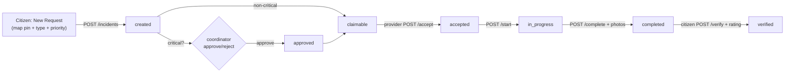

# IDRM MVP — Web Interface & Interaction Specification

> *Type: Document (specification) · Audience: frontend developers, designers · Status: MVP — current*
> *The screens, navigation, forms, tables, and maps of the MVP web app, and exactly which API calls each one makes. Practical, not a full UX system. Built on the locked API ([`40-api-specification.md`](40-api-specification.md)), features F1–F11 ([`11-requirements-scope-and-acceptance.md`](11-requirements-scope-and-acceptance.md)), and the HTML + Tailwind CSS v4 + JS decision (ADR-004). React **SPA** (Single-Page Application) + native mobile are **→ FFP**.*

> **Design intent:** map-first, few steps, works on a **basic smartphone / low bandwidth**, accessible
> (**WCAG 2.2 AA** — raised from 2.1 in the T3 standards alignment, 2026-08-14; see
> [`13-requirements-traceability-matrix.md`](13-requirements-traceability-matrix.md) §4). Every screen names the
> API calls it makes, so it can be re-skinned as a React client later against the **same** endpoints.

---

## 1. Technology & structure

- **Stack:** HTML5 · **Tailwind CSS v4** (utility classes; CDN or a tiny build) · vanilla **JavaScript**
  (fetch calls, progressive enhancement) · **Leaflet** for the map (OpenStreetMap tiles).
- **Served by** the FastAPI app (static pages + the API on the same origin → no CORS in the MVP).
- **Auth in the browser:** the access token is sent as `Authorization: Bearer <jwt>`; on `401` the JS
  silently calls `POST /auth/refresh`, then retries once, else routes to Login.
- **Language:** an `Accept-Language` header (`en` / `hi` / `te`); all copy comes from a message catalogue,
  never hard-coded (F11).

---

## 2. Navigation & information architecture

Three role-based experiences behind one login (the nav adapts to the user's role):

```
Login / Register ── Guest emergency (no login)
      │
      ▼
  Dashboard (role-aware)
   ├── Map (all roles)
   ├── Citizen:      My Requests · New Request
   ├── Provider:     Nearby Requests · My Assignments · My Organization
   ├── Coordinator:  All Requests · Approvals · Organizations · Reports · Alerts
   └── (all)         Notifications · Profile
```

- **Guest emergency** is reachable **without** login from the landing page (life-safety).
- Unauthorised nav items are hidden **and** enforced server-side (RBAC, [`22-architecture-security-and-iam.md`](22-architecture-security-and-iam.md)).

---

## 3. Global UI patterns

- **Forms:** labels always visible; inline validation mirrors the API (required fields, enum choices,
  `latitude/longitude` ranges); a submit is disabled while pending; errors render the API's
  `error.message` and per-field `details`.
- **Tables/lists:** server-paginated (`?page&limit`), sortable (`?sort=-created_at`), filterable; each row
  links to a detail view; empty and loading states are explicit.
- **Map:** Leaflet with **priority-coloured markers** (critical=red, high=orange, medium=amber, low=green);
  marker clustering when dense; "locate me"; click a marker → detail card.
- **Status:** every incident shows a **status badge** and a **timeline** (from `GET /incidents/{id}/updates`).
- **Notifications:** a bell with an unread badge (`GET /notifications/unread-count`).
- **Feedback:** toasts for success/failure; a global banner for active **alerts** (`GET /alerts`).
- **Accessibility:** keyboard-navigable, visible focus, ARIA labels on controls/map markers, AA contrast,
  never colour-only meaning (icons/labels accompany colour); target sizes suit touch.

---

## 4. Screens → API interactions

> Each screen lists the API calls it makes (see [`40-api-specification.md`](40-api-specification.md)).

### 4.1 Auth
| Screen | Actions → API |
|---|---|
| **Register** | `POST /auth/register` → "check your email"; then `POST /auth/verify-email` from the emailed link |
| **Login** | `POST /auth/login` → store tokens → Dashboard; "forgot?" → `POST /auth/forgot-password` |
| **Reset password** | `POST /auth/reset-password` (from emailed token) |
| **Profile** | `GET /users/me`, `PATCH /users/me` (name, phone, language), `POST /auth/change-password`, `POST /auth/logout` |

### 4.2 Citizen
| Screen | Actions → API |
|---|---|
| **New Request** | drop a map pin → `latitude/longitude`; pick **service type** + **priority**; describe; attach photos (`POST /files` → urls) → `POST /incidents` → confirmation + tracking |
| **My Requests** (list) | `GET /incidents/mine?status&page` |
| **Request detail** | `GET /incidents/{id}` + `GET /incidents/{id}/updates` (timeline); when `completed` → **Verify & Rate** → `POST /incidents/{id}/verify` (optional rating); **Cancel** (pre-delivery) → `POST /incidents/{id}/cancel` |
| **Guest emergency** | one-photo lite capture → `POST /incidents` (anonymous) → **tracking token**; track via the returned token |

### 4.3 Provider
| Screen | Actions → API |
|---|---|
| **Nearby Requests** | map + list: `GET /incidents/nearby?latitude&longitude&radius_km&service_type` |
| **Claim** | on a request → `POST /incidents/{id}/accept` (→ 409 if already taken, shows "taken") |
| **My Assignments** | `GET /incidents/assigned?status`; **Start** → `POST …/start`; **Complete** → `POST …/complete` (notes + proof photos via `POST /files`) |
| **My Organization** | `GET /organizations/mine`, `PATCH /organizations/{id}`, `PATCH …/capacity`, `PATCH …/availability`; assets: `GET/POST/PATCH /resources` |

### 4.4 Coordinator / Admin
| Screen | Actions → API |
|---|---|
| **Dashboard** | `GET /reports/dashboard` (live metrics) |
| **All Requests** | `GET /incidents?status&service_type&priority&q&sort&page` (map + table) |
| **Approvals** (critical) | `POST /incidents/{id}/approve` · `POST /incidents/{id}/reject` (reason) · manual `POST /incidents/{id}/assign` |
| **Organizations** | `GET /organizations`, `POST /organizations/{id}/verify` |
| **Reports** | `GET /reports/response-times`, `GET /reports/fulfillment`, export `GET /reports/{name}/export?format=csv` |
| **Alerts** | `POST /alerts` (broadcast), `GET /alerts` |
| **Audit** (admin/coord) | `GET /audit-logs?…` (read-only) |

### 4.5 Shared
| Screen | Actions → API |
|---|---|
| **Map** | markers from `GET /incidents` (role-scoped) + `GET /locations/map/{layer}` (GeoJSON); providers/resources layers |
| **Notifications** | `GET /notifications`, `POST /notifications/{id}/read`, `POST /notifications/read-all`, `GET /notifications/preferences` / `PATCH …/preferences` |

---

## 5. Key flows (map to acceptance criteria)



Each transition triggers a **notification** to the relevant party and a **timeline** entry — surfaced on the
request detail screen. Flows realise F2→F5, F7, F8 and the lifecycle in doc 11 §4.

---

## 6. Responsiveness, performance & offline posture

- **Mobile-first** layouts (Tailwind breakpoints); single-column on phones; large tap targets.
- **Low bandwidth:** images are **compressed client-side** before upload (media rules, [`40-api-specification.md`](40-api-specification.md) §5.7);
  lists are paginated; the map loads tiles lazily; an **emergency lite** capture path minimises payload.
- **Degraded connectivity:** clear pending/retry states; a failed notification never blocks the user's
  action. *(True offline capture/sync and push are **→ FFP**.)*

---

## 7. Deferred → FFP

React SPA (rich admin) · React Native/Expo mobile · offline-first capture & sync · deep real-time push
(websockets) · in-app messaging · advanced data-viz dashboards · full 12-language localization. All consume
the **same** API. See the [FFP charter](../idrm-ffp-docs/prompts/instructions_idrm_ffp_docs.md).

---

*Related:* [`40-api-specification.md`](40-api-specification.md) · [`11-requirements-scope-and-acceptance.md`](11-requirements-scope-and-acceptance.md) ·
[`20-architecture-system.md`](20-architecture-system.md) · [`22-architecture-security-and-iam.md`](22-architecture-security-and-iam.md) ·
[`25-module-elucidation.md`](25-module-elucidation.md) · [`26-conformance-pics.md`](26-conformance-pics.md) (LOC/accessibility rows).
Plan: [`prompts/instructions_idrm_mvp_docs.md`](prompts/instructions_idrm_mvp_docs.md).
