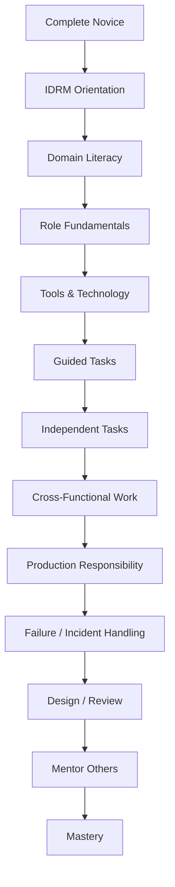
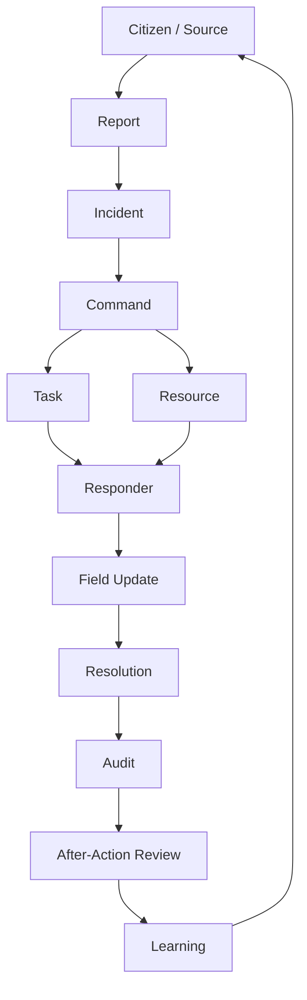

# IDRM — Learning Paths & Guide Library (start here)

> *Type: Guide (orientation / index) · Audience: complete novices → mentors · Status: MVP — current*
> *"I just joined IDRM and I don't know where to start reading." This is the map. It shows the maturity path
> everyone follows, the end-to-end flow everyone shares, the order to read things in, and the catalogue of
> short 101 guides. Source: `../assets/idrm-mvp-documentation-blueprint.md` (§24–30).*

---

## 1. How mastery works here (the universal pattern)

Every role — product, engineering, security, operations — climbs the **same ladder**. Only the *content* of
each rung differs. **Mastery is demonstrated by capability, not by finishing a course.**

**Terms:** *Domain literacy* = understanding the real-world problem (disaster relief) before the software.
*Role fundamentals* = the core skills of your job. *Production responsibility* = you can be on-call for it.

---

## 2. The one flow everyone shares

Whatever your role, you eventually need this end-to-end mental model — a citizen's cry for help becoming a
coordinated response and, finally, organisational learning:

Specialists then descend into their own branch (see the role maps, §4).

---

## 3. What to read, in what order

**Do not read all the specs at once.** Use progressive disclosure — problem first, advanced design last.

**Reading pyramid (bottom-up):** Fundamentals → Role Skills → IDRM Domain Knowledge → Professional Practice →
Architecture / Standards / Design → Mastery.

**New-joinee path (first weeks):**
`IDRM Orientation → Vision → Stakeholders → Disaster Lifecycle → Business Domains → Operational Flow →
Architecture Overview → Security Overview → My Role → My Responsibilities → My Tools → My Module → My Workflows →
My APIs/Data → My Tests → My Deployment → My Runbooks → Shadow → Guided Work → Independent Work → Mentor.`

> New here? Start with **[Disaster Management 101](learn/disaster-management-101.md)**, then your role map (§4),
> then the [Developer/Contributor guide](30-contribute-developer-guide.md) when you're ready to build.

---

## 4. Role-specific mastery maps (12)

Each role has its own rung-by-rung map and a **mastery test** (the capability that proves you've arrived).
These are being expanded into per-role **learning-journey guides** under [`roles/`](roles/) (index:
[`roles/README.md`](roles/README.md)) — each sequences the exact 101s + docs to read, phase-tagged:

| # | Role | Mastery test (can you…) |
|---|------|--------------------------|
| 1 | Product Manager / Owner | explain what IDRM solves, for whom, why, what's next, how success is measured |
| 2 | Business / Domain Analyst | turn ambiguous operational problems into precise, testable requirements |
| 3 | Solution / Software Architect | justify structure against quality attributes + failure modes (ADRs) |
| 4 | Backend Engineer | ship a module end-to-end: API → domain → data → tests → observability |
| 5 | Frontend Engineer | build accessible, offline-aware UI on the API (MVP: HTML/JS; FFP: React) |
| 6 | GIS / Geospatial Engineer | model + query spatial data (PostGIS) and drive the map/COP |
| 7 | QA / SDET | design tests from requirements through E2E, security, resilience, drills |
| 8 | Security Engineer | reason from networking → IAM → OIDC/OAuth 2.1+PKCE → threat modeling → response |
| 9 | DevOps / SRE | own deploy → observability → SLOs → incident response → backup/DR |
| 10 | Data Engineer | model, quality-check, and govern operational + spatial data |
| 11 | Incident / Operations Manager | run the lifecycle: assess → command → task → close → after-action |
| 12 | Technical / Application Support | triage from logs/dashboards → runbooks → escalation → RCA |

*(Phase note: FFP-only rungs — React, OIDC/OAuth, Docker/K8s, SRE — are learned when that phase begins;
MVP roles stop at the MVP tech line. See the [domain card](../instructions/domain.md) and locked decisions.)*

---

## 5. The 101 guide library (39, by track) → [`learn/`](learn/)

Short **101 / intermediate / advanced** guides that back the specs. Each is written to the novice→mastery
quality bar (define every term, worked examples, explain the *why*). **Bold = MVP-relevant now**; the rest are
**FFP** fundamentals (learn when that phase starts).

**Domain** — **1 Disaster Management 101** ✅ · **2 Incident Management 101** ✅ · 3 Emergency Operations Centre 101 ✅ ·
4 Common Operational Picture 101 ✅ · **5 GIS for Emergency Response** ✅ · **6 Resource Management 101** ✅ ·
7 Emergency Communications 101 ✅ · 8 Incident Command 101 ✅

**Software Engineering** — **9 SDLC 101** ✅ · **10 Git/GitHub 101** ✅ · **11 REST API 101** ✅ ·
**12 Database 101** ✅ · **13 PostgreSQL/PostGIS 101** ✅ · 14 Event-Driven Architecture 101 ✅ · 15 Docker 101 ✅ ·
16 CI/CD 101 ✅ · **17 Observability 101** ✅

**Security** — **18 IAM 101** ✅ · 19 OIDC 101 ✅ · 20 OAuth 2.1 + PKCE 101 ✅ · 21 MFA 101 ✅ · **22 RBAC/ABAC 101** ✅ ·
23 Threat Modeling 101 ✅ · **24 Secure Coding 101** ✅

**Quality** — **25 Testing 101** ✅ · **26 API Testing 101** ✅ · 27 E2E Testing 101 ✅ · 28 Performance Testing 101 ✅ ·
29 Security Testing 101 ✅ · **30 Accessibility Testing 101** ✅ · 31 Disaster Drill / Scenario Testing 101 ✅

**Operations** — **32 Linux 101** ✅ · 33 Networking 101 ✅ · 34 Cloud 101 ✅ · 35 Monitoring 101 ✅ ·
36 Incident Response 101 ✅ · **37 Backup & Restore 101** ✅ · 38 Disaster Recovery 101 ✅ · 39 SRE 101 ✅

**✅ All 39 guides complete** — plus a synthesis map:
**➕ 40 Technology Stack 101** ✅ — the *component map* (what each tool is + why IDRM uses it, MVP vs FFP) →
[`learn/tech-stack-101.md`](learn/tech-stack-101.md).

*(✅ = written. File scheme: `learn/<name>-101.md`, catalogued in `learn/README.md`.)*

> **Going deeper than the guides:** the per-**module** *what/why/how* lives in the specs
> [`../idrm-mvp-docs/25-module-elucidation.md`](../idrm-mvp-docs/25-module-elucidation.md); the checkable build
> obligations are the signed-off [`../idrm-mvp-docs/26-conformance-pics.md`](../idrm-mvp-docs/26-conformance-pics.md).

---

*Related:* [`30-contribute-developer-guide.md`](30-contribute-developer-guide.md) ·
domain vocabulary [`../instructions/domain.md`](../instructions/domain.md) ·
blueprint [`../assets/idrm-mvp-documentation-blueprint.md`](../assets/idrm-mvp-documentation-blueprint.md).
