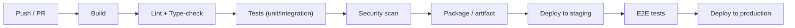

# CI/CD 101

> *Type: Guide (101 / foundational) · Audience: novices → developers · Status: **FFP** — next-phase · Track: Software Engineering (#16)*
> *How does tested code get from a developer's branch to running in production — safely and repeatedly? CI/CD
> automates that path. This guide explains it; note IDRM's **MVP deploys natively**, with full CI/CD an FFP goal.*

---

## 1. What CI/CD means

- **CI — Continuous Integration** — every code change is automatically **built and tested** as soon as it's
  pushed, so problems surface within minutes, not weeks. It keeps the shared `main` branch always working.
- **CD — Continuous Delivery / Deployment** — the tested change is automatically prepared for release
  (**Delivery**) and, in its fullest form, released to production automatically (**Deployment**).

Together they replace slow, error-prone manual steps with an automated, repeatable **pipeline**.

---

## 2. A typical pipeline

Each stage is a **gate**: if tests or scans fail, the pipeline stops and nothing ships. This is how automation
enforces quality (it runs the checks from [Testing 101](testing-101.md) on every change).

---

## 3. Why it matters

- **Fast feedback** — catch bugs at push time, cheaply.
- **Repeatability** — the same steps every time; no "forgot a step" releases.
- **Confidence** — green pipeline = safe to ship; easy, frequent, small releases beat rare, risky big ones.
- **Traceability** — every release is tied to the exact code and tests that produced it.

Common tools: **GitHub Actions**, GitLab CI, Jenkins.

---

## 4. IDRM's phasing

- **MVP:** deployment is **native and largely manual/scripted** on Ubuntu (systemd + the setup script). Tests run
  with pytest; the discipline exists even if the automation is light. Keeping it simple is deliberate.
- **FFP:** a full CI/CD pipeline — build → lint/type-check → test → security scan → containerise → deploy to
  staging → E2E → production — typically with **Docker** images ([Docker 101](docker-101.md)) and Kubernetes.
  Adopted when multiple services and frequent releases make automation pay off.

---

## 5. Mastery check

1. Define **CI** and **CD** (delivery vs deployment).
2. Describe the stages of a typical pipeline and what a **gate** is.
3. Give three benefits of CI/CD.
4. Name a common CI/CD tool.
5. Explain IDRM's MVP approach and what FFP adds.

---

## 6. Go deeper

- GitHub Actions — docs.github.com/actions · Continuous Delivery (Humble/Farley, reference) — continuousdelivery.com
- Related: [Testing 101](testing-101.md) · [Docker 101](docker-101.md) · [SDLC 101](sdlc-101.md)

---
*Next:* OIDC 101 (Security track) · *Up:* [Learning Paths](../00-start-learning-paths.md)
