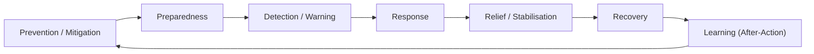

# Disaster Management 101

> *Type: Guide (101 / foundational) · Audience: complete novices · Status: MVP — current · Track: Domain (#1)*
> *The very first thing to read at IDRM. You need **no** technical background. By the end you'll understand what
> disaster management is, the vocabulary everyone uses, how India organises it, and how IDRM fits in — enough to
> follow every other IDRM document with confidence.*

> **How to read this:** each section defines its terms as it goes. Nothing here assumes prior knowledge. The
> **Mastery check** at the end tells you when you've "got it."

---

## 1. Why this guide exists

IDRM is software for **disaster relief**. If you don't first understand the *real-world problem* — how disasters
unfold and how humans respond — the software will look like a random collection of screens and tables. Learn the
domain first; the technology then makes sense. (This is the "domain literacy before role fundamentals" rung from
the [learning paths](../00-start-learning-paths.md).)

---

## 2. Hazard, emergency, disaster — three words people mix up

- **Hazard** — a *potential* source of harm: a flooding river, an earthquake fault, a cyclone offshore. A hazard
  that never reaches people is just a natural event.
- **Emergency** — a serious situation that local resources can *still* handle (a single building fire).
- **Disaster** — an event that **overwhelms** the affected community's own capacity to cope, so outside help is
  needed. Scale and *overwhelm* are the key ideas.

> Rule of thumb: **hazard + exposed, vulnerable people = disaster risk.** Reduce any factor and you reduce risk.

**Types** you'll see in IDRM: *natural* (flood, cyclone, earthquake, landslide, heatwave) and *human-induced*
(industrial accident, fire, stampede). India faces them all.

---

## 3. The disaster lifecycle (the heartbeat of everything)

Disaster management is not one action — it's a **cycle** that repeats and improves each time:

- **Prevention / Mitigation** — reduce risk *before* anything happens (embankments, building codes).
- **Preparedness** — plans, drills, stockpiles, trained responders ready to go.
- **Detection / Warning** — spot the event and alert people (the earlier, the more lives saved).
- **Response** — the acute phase: search & rescue, medical aid, evacuation. **This is where IDRM's MVP focuses.**
- **Relief / Stabilisation** — food, water, shelter, restoring basic services.
- **Recovery** — rebuilding homes, livelihoods, infrastructure (weeks to years).
- **Learning** — the **After-Action Review**: what worked, what didn't, feed it back into prevention.

> IDRM's MVP concentrates on **Response + Relief** — connecting affected people to responders fast. The other
> phases are where the product grows later (FFP).

---

## 4. How a response is organised

When many organisations converge on a disaster, chaos is the enemy. Two ideas tame it:

- **Incident Command System (ICS)** — a standard *management structure* so everyone knows who's in charge of
  what (command, operations, planning, logistics). It scales from one team to a national effort.
- **Emergency Operations Centre (EOC)** — the *room/system* where coordinators see the whole picture and direct
  resources.

And two shared artefacts:

- **Common Operational Picture (COP)** — a single, shared, map-based view of "what is happening where," so all
  responders act on the *same* information. (IDRM's map is a COP in miniature.)
- **Resource** — anything that can help: an ambulance, a rescue team, food kits, a hospital bed. Response is
  largely the art of matching **needs** to **resources** in time.

---

## 5. Who runs disaster management in India

India has a three-tier structure (worth knowing because IDRM is India-focused):

- **NDMA** — National Disaster Management Authority (national policy; chaired by the Prime Minister).
- **SDMA** — State Disaster Management Authority (state level).
- **DDMA** — District Disaster Management Authority (district level — closest to the ground).
- **NDRF** — National Disaster Response Force (the specialised rescue force that deploys to disasters).

The legal backbone is the **Disaster Management Act, 2005**. IDRM's government roles (coordinator/admin) mirror
this real-world chain of command.

---

## 6. How this maps to IDRM (connecting the dots)

Now the payoff — the domain words above are exactly IDRM's building blocks:

| Real-world concept | In IDRM |
|---|---|
| A person needs help | an **incident** (shown to users as a **"help request"**) |
| The response structure (ICS) | **roles**: citizen, provider, coordinator/admin, guest |
| The shared map (COP) | IDRM's **map-driven** interface (Leaflet + PostGIS) |
| Matching needs to resources | the **resources** and **incidents** modules |
| The command chain (NDMA→DDMA) | government **coordinator/admin** approvals |
| After-Action learning | the **audit** trail + reporting |

The moment a citizen reports flooding and a coordinator routes a rescue team, you're watching the
disaster lifecycle's **Response** phase run through software. Everything else in IDRM elaborates this.

*(For the exact modules, roles, and the 8-state incident lifecycle, see the
[domain quick-reference](../../instructions/domain.md).)*

---

## 7. Mastery check

You've mastered Disaster Management 101 when you can, in your own words:

1. Explain the difference between a **hazard**, an **emergency**, and a **disaster**.
2. Name the **disaster lifecycle** phases and say which two IDRM's MVP focuses on.
3. Explain what a **COP** is and why a shared picture matters.
4. Say what **NDMA / SDMA / DDMA / NDRF** are, roughly.
5. Map "a citizen needs help" to the IDRM word **incident** and name the four roles.

If you can do all five without notes, move on to **Incident Management 101** and your **role map**
([learning paths §4](../00-start-learning-paths.md)).

---

## 8. Go deeper (authoritative sources)

- India NDMA — ndma.gov.in · Disaster Management Act 2005 — legislative.gov.in
- UNDRR (UN Office for Disaster Risk Reduction) terminology — undrr.org/terminology
- Sphere Handbook (humanitarian standards) — spherestandards.org
- ISO 22320 (emergency management / incident response) · UN OCHA (coordination) — unocha.org

---
*Next:* [Incident Management 101](README.md) · *Up:* [Learning Paths](../00-start-learning-paths.md)
