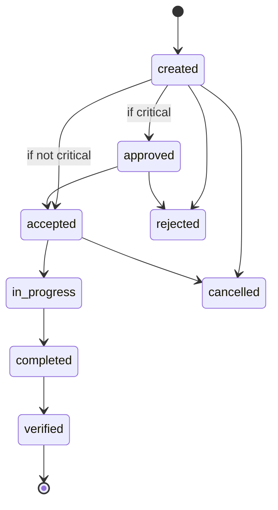

# Incident Management 101

> *Type: Guide (101 / foundational) · Audience: all stakeholders → developers · Status: MVP — current · Track: Domain (#2)*
> *Read [Disaster Management 101](disaster-management-101.md) first. That guide gave you the big picture; this one
> zooms into the single most important object in IDRM — the **incident** — and the exact lifecycle it moves
> through. Non-technical readers get the concepts; developers get the state machine they'll actually build.*

---

## 1. What "incident management" means

In emergency response, an **incident** is a single, trackable event that needs a response — a flooded street, an
injured person, a family needing shelter. **Incident management** is the disciplined process of taking that
event from *reported* to *resolved* without losing, duplicating, or dropping it. The whole point is
**accountability**: at every moment, someone knows the incident exists, its urgency, and who owns it.

> In IDRM the user-facing term is **"help request"**; the API and database call the same thing an **`incident`**.
> One concept, two names — keep them mapped (see the [domain card](../../instructions/domain.md)).

---

## 2. Incident vs. task vs. resource (don't conflate them)

- **Incident** — the *need* ("there is flooding at X; 3 people stranded").
- **Task** — a *unit of work* to address the need ("dispatch boat team to X"). One incident may spawn several.
- **Resource** — the *means* to do the work (a boat, a medic, food kits). See [Resource Management 101](resource-management-101.md).

Keeping these separate is what lets one incident be worked by many responders without chaos.

---

## 3. Classifying an incident: service type + priority

Before anyone acts, an incident is **triaged** — sorted by what's needed and how urgently.

- **service_type** (what kind of help): `medical · food · rescue · water · shelter · other`
- **priority** (how urgent): `low · medium · high · critical`

**Triage** = deciding priority so the scarcest resources go to the gravest needs first. `critical` incidents in
IDRM require government **approval** before dispatch — a deliberate check on the highest-stakes cases.

---

## 4. The IDRM incident lifecycle (the state machine)

This is the heart of the system — a **LOCKED** 8-state flow. A *state machine* means an incident is always in
exactly one state, and only certain moves are legal.

| State | Meaning | Who moves it |
|-------|---------|--------------|
| `created` | Citizen has reported the need | citizen |
| `approved` | (Critical only) government cleared it for response | coordinator/admin |
| `accepted` | A provider has taken ownership | provider |
| `in_progress` | Work is underway in the field | provider |
| `completed` | Provider says the need is met | provider |
| `verified` | Coordinator confirms it truly was | coordinator/admin |
| `cancelled` | Withdrawn (e.g., citizen no longer needs it) | citizen/coordinator |
| `rejected` | Declined (invalid/duplicate/out of scope) | coordinator/admin |

**For developers:** model this as an explicit enum + a guarded transition function — illegal jumps (e.g.
`created → verified`) must be impossible, not merely discouraged. Every transition is written to the **audit**
trail. (Disputed + auto-close states are deferred to FFP.)

---

## 5. Who does what (roles in the flow)

- **Citizen** — reports the incident, can cancel it.
- **Provider** (NGO / hospital / volunteer) — accepts, works, completes it.
- **Coordinator / admin** (government) — approves critical cases, verifies completion, rejects invalid ones.
- **Guest** — a narrow, logged-out path (e.g. emergency reporting) with limited powers.

This mirrors India's real chain of command (NDMA → SDMA → DDMA) from Disaster Management 101.

---

## 6. Why the discipline matters (and how we measure it)

Sloppy incident management costs lives and trust. IDRM's MVP success targets put numbers on "good":
**average response time 12h → 2h** and **fulfilment rate 60% → 80%**. Every state change is a timestamp, so the
system can *prove* how fast incidents move and where they stall — the raw material for the **After-Action
Review** from Disaster Management 101.

---

## 7. Mastery check

You've got Incident Management 101 when you can:

1. Define **incident**, **task**, and **resource** and give an IDRM example of each.
2. List the **8 lifecycle states** and name who can trigger each move.
3. Explain why `critical` incidents need **approval**, and what **triage** is.
4. Explain why an illegal state jump must be *impossible* in code, not just avoided.
5. Say which two metrics prove incident management is working.

---

## 8. Go deeper

- IDRM data model & lifecycle: [`../../idrm-mvp-docs/50-data-model.md`](../../idrm-mvp-docs/50-data-model.md) ·
  API contract: [`../../idrm-mvp-docs/40-api-specification.md`](../../idrm-mvp-docs/40-api-specification.md)
- ISO 22320 (incident response coordination) · ICS (Incident Command System) — fema.gov/ics
- State machines (concept) — en.wikipedia.org/wiki/Finite-state_machine

---
*Next:* [GIS for Emergency Response](gis-for-emergency-response.md) · *Up:* [Learning Paths](../00-start-learning-paths.md)
