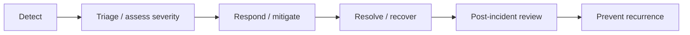

# Incident Response 101

> *Type: Guide (101 / foundational) · Audience: novices → developers/ops · Status: MVP-aware (formalises in FFP) · Track: Operations (#36)*
> *When the **software** breaks — an outage, a bug, a security breach — how does the team respond calmly and fast?
> This guide covers operational incident response.*

> **Naming note:** here "incident" means a **system/operational problem** (an outage), **not** a disaster
> "help request" ([Incident Management 101](incident-management-101.md)). Same word, different world — keep them
> apart.

---

## 1. What operational incident response is

An **operational incident** is an unplanned disruption to the service — IDRM is down, slow, or misbehaving.
**Incident response** is the disciplined process to detect, contain, resolve, and learn from it, minimising harm.
For disaster software this is doubly critical: an outage during a disaster is a mission failure.

---

## 2. The lifecycle of a response

- **Detect** — monitoring/alerts (or a user) surface the problem ([Monitoring 101](monitoring-101.md)).
- **Triage** — how bad is it? Assign a **severity** (SEV1 = critical/outage → SEV3 = minor).
- **Respond** — mitigate first (restore service — e.g. roll back, restart, failover), diagnose fully later.
- **Resolve** — service restored and confirmed healthy.
- **Review** — a blameless **post-mortem**: what happened, why, what we'll change.

---

## 3. Roles and communication

- **Incident Commander** — coordinates the response (note the deliberate echo of
  [Incident Command 101](incident-command-101.md) — the same idea, applied to a system outage).
- **Responders** — the engineers fixing it.
- **Communications** — keeping stakeholders/users informed; honesty and status updates build trust.
- **Runbooks** — pre-written step-by-step guides for known failure modes, so responders don't improvise under
  stress.

---

## 4. Blameless culture

The goal of a post-mortem is **learning, not blame**. People make mistakes; systems should be designed so mistakes
don't cause outages. Blame hides information; blamelessness surfaces it — and prevents recurrence.

---

## 5. IDRM context

- **MVP:** lightweight — alerts from the health/metrics endpoints, a few **runbooks** for likely failures (DB
  down, disk full, MinIO unreachable), `systemctl`/`journalctl` to diagnose ([Linux 101](linux-101.md)), and a
  quick written review after any real incident.
- **FFP:** formal on-call rotations, severity policies, incident-management tooling, and SLO/error-budget-driven
  response ([SRE 101](sre-101.md)).

---

## 6. Mastery check

1. Distinguish an **operational** incident from a disaster **help request**.
2. Walk the response lifecycle (detect → review).
3. Explain **severity/triage** and "mitigate before diagnose".
4. Describe the roles and what a **runbook** is for.
5. Explain **blameless** post-mortems and why they work.

---

## 7. Go deeper

- Google SRE — Incident Management & Postmortems — sre.google/books · PagerDuty Incident Response — response.pagerduty.com
- Related: [Monitoring 101](monitoring-101.md) · [Disaster Recovery 101](disaster-recovery-101.md) · [SRE 101](sre-101.md)

---
*Next:* [Disaster Recovery 101](disaster-recovery-101.md) · *Up:* [Learning Paths](../00-start-learning-paths.md)
