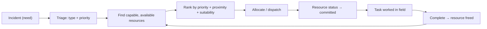

# Resource Management 101

> *Type: Guide (101 / foundational) · Audience: all stakeholders → developers · Status: MVP — current · Track: Domain (#6)*
> *An incident is a **need**; a resource is the **means** to meet it. Response is, at its core, the art of
> matching the two — fast, fairly, and without waste. This guide explains resources and allocation for every
> stakeholder, then how IDRM models them for developers.*

---

## 1. What a "resource" is

A **resource** is anything that can be applied to meet a need: an ambulance, a rescue boat, a medical team,
food kits, blankets, a hospital bed, a shelter's spare capacity. In disaster response, resources are almost
always **scarce** relative to needs — which is exactly why managing them well saves lives.

> The chain to hold in your head: **incident (need) → task (work) → resource (means).**
> See [Incident Management 101](incident-management-101.md).

---

## 2. The four questions resource management answers

1. **What do we have?** — an accurate, current inventory (availability, not just existence).
2. **Where is it?** — location matters as much as quantity (see [GIS for Emergency Response](gis-for-emergency-response.md)).
3. **What's it committed to?** — a resource already dispatched isn't available; double-booking kills trust.
4. **How do we match it to needs?** — **allocation**: assigning the right resource to the right incident.

**Allocation** = deciding which resource serves which incident. Good allocation weighs **priority** (a `critical`
incident first), **proximity** (nearest capable resource), and **suitability** (a boat for a flood rescue, not a
food truck).

---

## 3. Capacity, availability, and status

- **Capacity** — how much a resource can do (an ambulance carries 1–2 patients; a shelter holds 200).
- **Availability** — whether it's free right now (available / committed / out-of-service).
- Keeping availability **truthful and current** is the hardest, most important discipline — a stale inventory is
  worse than none, because people rely on it.

---

## 4. Matching needs to resources (the core loop)

In the MVP this matching is **human-driven** (a coordinator decides, the system supports). **AI-assisted
matching** is deliberately deferred to FFP — the MVP proves the workflow first.

---

## 5. How it maps to IDRM

| Resource concept | In IDRM |
|---|---|
| Resource inventory | the **`resources`** module |
| Provider offering help | the **provider** role (NGO / hospital / volunteer) |
| Location of a resource | `location` (EPSG:4326, PostGIS) |
| Matching need ↔ means | linking an **incident** to a resource / task |
| Availability truthfulness | resource **status**, updated by providers |
| Fair prioritisation | incident **priority** drives allocation order |

**For developers:** resources are a first-class module with the standard shape
(`router / schemas / models / service / repository / tests`). Availability transitions, like incident states,
should be explicit and audited so the inventory can always be trusted.

---

## 6. Why it matters (the metric link)

The MVP's **fulfilment rate (60% → 80%)** target is *directly* a resource-management outcome: fulfilment rises
when capable resources are found and allocated before a need goes stale. Response time falls when the *nearest*
suitable resource is matched, not just any.

---

## 7. Mastery check

You've got Resource Management 101 when you can:

1. Define **resource**, **capacity**, and **availability**, with IDRM examples.
2. Recite the need→means chain (incident → task → resource).
3. Explain **allocation** and the three factors that rank a match.
4. Say why truthful, current availability is the hardest discipline.
5. Explain why MVP matching is human-driven and what's deferred to FFP.

---

## 8. Go deeper

- IDRM data model (resources): [`../../idrm-mvp-docs/50-data-model.md`](../../idrm-mvp-docs/50-data-model.md)
- Logistics/resource typing (reference) — FEMA Resource Typing · UN OCHA logistics — logcluster.org
- Related: [Incident Management 101](incident-management-101.md) · [GIS for Emergency Response](gis-for-emergency-response.md)

---
*Next:* SDLC 101 (Software-Engineering track) · *Up:* [Learning Paths](../00-start-learning-paths.md)
