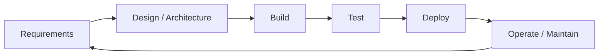

# SDLC 101

> *Type: Guide (101 / foundational) · Audience: all stakeholders → developers · Status: MVP — current · Track: Software Engineering (#9)*
> *The SDLC is the disciplined path from "we have a problem" to "working software people rely on." This guide
> explains that path for everyone, then shows how IDRM's own documents ARE the SDLC made concrete.*

---

## 1. What the SDLC is

**SDLC = Software Development Life Cycle** — the sequence of stages software goes through, from idea to running
system to retirement. It exists to answer a hard question: *how do we build the right thing, correctly, without
chaos?* Skipping stages is how projects ship the wrong product or collapse under bugs.

---

## 2. The stages (and IDRM's artefact for each)

| Stage | Question it answers | IDRM document |
|-------|---------------------|---------------|
| **Requirements** | What must it do (and for whom)? | `10-requirements-prd.md` (tech-free needs) |
| **Design / Architecture** | How is it structured? | `20-architecture-system.md`, `21-architecture-decisions.md` |
| **Build** | Write the code | the module pattern (`router/schemas/models/service/repository/tests`) |
| **Test** | Does it work + stay working? | `70-quality-test-strategy.md` |
| **Deploy** | Get it running for real | `80-ops-deployment-and-operations.md` |
| **Operate** | Keep it healthy; learn | ops runbooks, audit, After-Action Review |

> **Key insight:** IDRM's numbered doc set is not bureaucracy — it *is* the SDLC. Each spec is the output of one
> stage and the input to the next. That's why the [reading path](../00-start-learning-paths.md) follows the
> same order.

---

## 3. The two big phases: MVP then FFP

IDRM runs an **iterative** SDLC (loop, don't waterfall): build the smallest useful thing, learn, evolve.

- **MVP (Minimum Viable Product)** — the lean first build (FastAPI modular monolith). Prove the workflow.
- **FFP (Full-Fledged Product)** — the enterprise evolution on the *same* API contract, added only when a
  concrete **trigger** justifies it. Nothing is dropped; advanced tech is *deferred*, not discarded.

---

## 4. Requirements → design → tests: the golden thread

A mature SDLC keeps **traceability**: every requirement links to a design decision, an API endpoint, a data
field, and a test that proves it. If you can't trace a line of code back to a need, question why it exists. (The
blueprint's Requirements Traceability matrix is exactly this thread.)

---

## 5. The IDRM working discipline

Two habits keep the life cycle honest here:

- **Decisions are recorded** — architecture choices become **ADRs** (Architecture Decision Records) with the
  *why* and the *trigger*; progress is logged in dated **CHANGELOGs** (Keep-a-Changelog style).
- **Change is proposed, not sprung** — for a non-technical stakeholder, a change is offered as *options + a
  recommendation*, then confirmed before it's written. One source of truth per decision; cross-link, don't
  duplicate.

Supporting tools you'll meet next: **[Git](git-github-101.md)** (version control), **[Testing](testing-101.md)**,
and later CI/CD (automating build→test→deploy — an FFP concern).

---

## 6. Mastery check

You've got SDLC 101 when you can:

1. Name the SDLC stages and the question each answers.
2. Point to the IDRM document that is the output of each stage.
3. Explain **iterative** development and the MVP→FFP "trigger" idea.
4. Explain **traceability** (the requirement→design→API→data→test thread).
5. Say what an **ADR** and a **CHANGELOG** are for.

---

## 7. Go deeper

- IDRM specs index: [`../../idrm-mvp-docs/README.md`](../../idrm-mvp-docs/README.md)
- ADRs (concept) — adr.github.io · Keep a Changelog — keepachangelog.com · Semantic Versioning — semver.org
- Agile/iterative (reference) — agilemanifesto.org

---
*Next:* [Git / GitHub 101](git-github-101.md) · *Up:* [Learning Paths](../00-start-learning-paths.md)
