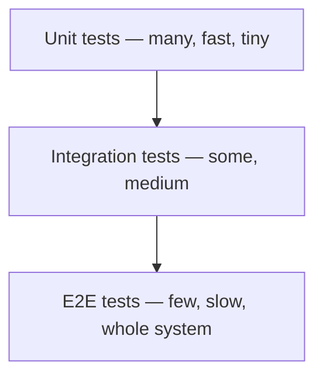

# Testing 101

> *Type: Guide (101 / foundational) · Audience: novices → developers · Status: MVP — current · Track: Quality (#25)*
> *Testing is how we know the software works — and keeps working as we change it. In disaster response, an
> untested bug can mean help that never arrives. This guide explains testing from first principles, then IDRM's
> approach.*

---

## 1. Why test at all

Every change risks breaking something that used to work (a **regression**). Tests are **automated checks** that
catch breakage instantly, so you can change code with confidence instead of fear. They're also *executable
documentation*: a good test says exactly how the code is meant to behave.

---

## 2. The testing pyramid

Not all tests are equal. The **testing pyramid** advises **many fast, small tests** and **few slow, broad ones**:



- **Unit test** — checks one small piece (a function, a lifecycle transition) in isolation. Milliseconds.
- **Integration test** — checks pieces working together (service + database; an API endpoint end to end).
- **End-to-end (E2E) test** — drives the whole system like a real user (report a help request → accept →
  complete). Most realistic, slowest, fewest.

Too many slow tests = a suite nobody runs. The pyramid keeps feedback fast.

---

## 3. Anatomy of a test: Arrange–Act–Assert

Every test has three beats:

```python
def test_incident_starts_in_created_state():
    incident = create_incident(service_type="rescue", priority="high")  # Arrange
    result = incident.status                                             # Act
    assert result == "created"                                          # Assert
```

- **Arrange** — set up the situation.
- **Act** — do the thing under test.
- **Assert** — check the outcome is what you expect.

Test **behaviour**, not internal wiring — so tests survive refactoring.

---

## 4. What good tests cover

- The **happy path** (valid input → expected result).
- **Edge cases** and **failures** (invalid input, missing permissions, illegal state jumps).
- IDRM examples: a citizen *cannot* verify their own incident; `created → verified` must be **rejected**; a
  `critical` incident requires approval; an upload over 10 MB is refused.

---

## 5. IDRM's approach

- The MVP uses **pytest** (Python's testing framework). Each module ships a `tests/` folder beside its code.
- The overall plan — what to test, coverage expectations, and the quality gates — lives in
  [`../../idrm-mvp-docs/70-quality-test-strategy.md`](../../idrm-mvp-docs/70-quality-test-strategy.md).
- **Coverage** (the % of code exercised by tests) is a useful *floor*, not the goal — 100% coverage of trivial
  code proves little; test the logic that matters (the lifecycle, auth, validation).
- Specialised testing follows in its own guides: [API Testing 101](api-testing-101.md),
  [Accessibility Testing 101](accessibility-testing-101.md), and (FFP) performance, security, and disaster-drill
  testing.

---

## 6. Mastery check

1. Explain what a **regression** is and how tests prevent it.
2. Describe the **testing pyramid** and unit vs integration vs E2E.
3. Write a test in **Arrange–Act–Assert** shape.
4. Give three IDRM behaviours worth testing, including a failure case.
5. Explain why **coverage** is a floor, not the target.

---

## 7. Go deeper

- IDRM test strategy: [`../../idrm-mvp-docs/70-quality-test-strategy.md`](../../idrm-mvp-docs/70-quality-test-strategy.md)
- pytest — docs.pytest.org · Test pyramid (Martin Fowler) — martinfowler.com/bliki/TestPyramid.html
- Related: [SDLC 101](sdlc-101.md) · [Secure Coding 101](secure-coding-101.md)

---
*Next:* [API Testing 101](api-testing-101.md) · *Up:* [Learning Paths](../00-start-learning-paths.md)
