# Role-Mastery — Frontend Engineer

> *Type: Guide (role-mastery / learning journey) · Audience: frontend dev, from novice → mastery · Status: MVP — current · Blueprint §25.5*
> *You build what people actually touch — under stress, on cracked phones, in a disaster. **Important phase note:**
> the IDRM **MVP frontend is HTML + Tailwind + vanilla JS + Leaflet — NO React**. React/TypeScript is **FFP**.*

---

## 1. Your mission

Deliver a fast, accessible, resilient interface on the `/api/v1` API. In the MVP that's server-friendly
HTML/JS + a Leaflet map; in the FFP it grows into a React SPA + React Native app. Accessibility and offline-
awareness are requirements, not polish.

## 2. Your mastery map (phase-tagged)

```mermaid
flowchart LR
    A["HTML / CSS"] --> B["JavaScript"]
    B --> C["API Integration"]
    C --> D["Authentication"]
    D --> E["GIS / COP (Leaflet)"]
    E --> F["Accessibility"]
    F --> G["State / Error Handling"]
    G --> H["TypeScript (FFP)"]
    H --> I["React (FFP)"]
    I --> J["Offline UX (FFP)"]
    J --> K["E2E Testing"]
    K --> L["Mastery"]
```

*(The blueprint map front-loads TypeScript/React; corrected here — those are **FFP** rungs for IDRM. MVP mastery
is reachable on HTML/Tailwind/JS + Leaflet.)*

## 3. Your learning path (rung → what to read)

1. **HTML/CSS/JS + tooling** → [Git/GitHub 101](../learn/git-github-101.md) ·
   [Developer/Contributor guide](../30-contribute-developer-guide.md) · Tailwind (see the [ui spoke](../../instructions/ui.md))
2. **API integration** → [REST API 101](../learn/rest-api-101.md) ·
   [`60-uidesign-web-interaction.md`](../../idrm-mvp-docs/60-uidesign-web-interaction.md) (screen→API tables)
3. **Authentication** → [IAM 101](../learn/iam-101.md) (JWT access/refresh, token storage — never localStorage)
4. **GIS / COP** → [GIS for Emergency Response](../learn/gis-for-emergency-response.md) ·
   [Common Operational Picture 101](../learn/common-operational-picture-101.md) (Leaflet; React-Leaflet in FFP)
5. **Accessibility** → [Accessibility Testing 101](../learn/accessibility-testing-101.md) — WCAG 2.2 AA (both
   phases, since T3), the **map must have a list alternative**. This is core, not optional.
6. **State/error handling + E2E** → [E2E Testing 101](../learn/e2e-testing-101.md)
7. **FFP rungs** → [`../../idrm-ffp-docs/61-frontend-engineering-standards.md`](../../idrm-ffp-docs/61-frontend-engineering-standards.md)
   (React + TS + TanStack Query + RHF/Zod, offline-first RN) · [ui spoke](../../instructions/ui.md)

## 4. MVP vs FFP for you

- **MVP (build now):** semantic HTML + Tailwind + vanilla JS + Leaflet, on the API, WCAG 2.2 AA. No build-heavy
  framework.
- **FFP:** React SPA + React Native/Expo (offline-first), WCAG 2.2 AA — same design tokens, same API. Governed by
  doc 61.

## 5. Mastery test

You can build an **accessible, resilient UI feature on the API** — keyboard- and screen-reader-operable, with a
non-map path, handling loading/empty/error states — and E2E-test the journey. (In FFP: the same, in React/RN with
offline UX.)

---
*Related:* [GIS Engineer](gis-engineer.md) · [Backend Engineer](backend-engineer.md) · [QA / SDET](qa-sdet.md)
