# Role-Mastery — Security Engineer

> *Type: Guide (role-mastery / learning journey) · Audience: security engineer, from novice → mastery · Status: MVP — current · Blueprint §25.8*
> *You protect disaster victims' data and the integrity of the response. Your reasoning runs from the network up
> to identity, threats, and incident response — building security in, then proving it holds.*

---

## 1. Your mission

Ensure IDRM is secure by design and in operation: sound identity and access control, OWASP-grade application
security, DPDP-Act privacy, and a plan for when something goes wrong — across both the lean MVP and the
enterprise FFP.

## 2. Your mastery map

```mermaid
flowchart LR
    A["Networking"] --> B["Web Security"]
    B --> C["Cryptography"]
    C --> D["IAM"]
    D --> E["OIDC"]
    E --> F["OAuth 2.1 + PKCE"]
    F --> G["MFA"]
    G --> H["RBAC / ABAC"]
    H --> I["Threat Modeling"]
    I --> J["Secure SDLC"]
    J --> K["Application Security"]
    K --> L["Cloud Security"]
    L --> M["Response"]
    M --> N["Mastery"]
```

## 3. Your learning path (rung → what to read)

1. **Networking + web security** → [Networking 101](../learn/networking-101.md) (TLS/certs, private networks) ·
   [Secure Coding 101](../learn/secure-coding-101.md) (OWASP Top 10)
2. **Cryptography + IAM** → [IAM 101](../learn/iam-101.md) (RS256 JWT access/refresh, bcrypt, lockout)
3. **OIDC / OAuth 2.1+PKCE / MFA** (FFP) → [OIDC 101](../learn/oidc-101.md) ·
   [OAuth 2.1 + PKCE 101](../learn/oauth-2.1-pkce-101.md) · [MFA 101](../learn/mfa-101.md)
4. **RBAC / ABAC** → [RBAC/ABAC 101](../learn/rbac-abac-101.md) ·
   [`22-architecture-security-and-iam.md`](../../idrm-mvp-docs/22-architecture-security-and-iam.md) (MVP) +
   [`../../idrm-ffp-docs/22-architecture-security-and-iam.md`](../../idrm-ffp-docs/22-architecture-security-and-iam.md) (FFP)
5. **Threat modeling + secure SDLC + app security** → [Threat Modeling 101](../learn/threat-modeling-101.md)
   (STRIDE → IDRM defences) · [Security Testing 101](../learn/security-testing-101.md) (SAST/DAST/SCA)
6. **Cloud security + response** → [Cloud 101](../learn/cloud-101.md) (data sovereignty) ·
   [Incident Response 101](../learn/incident-response-101.md) · [security spoke](../../instructions/security.md)

## 4. IDRM-specific must-knows

- **Privacy (DPDP Act 2023):** EXIF/GPS stripped on upload; face **detection-only** (nothing biometric stored);
  no PII in logs/URLs; recognition/matching is a consented **FFP** feature.
- **Boundary:** the **API is the security boundary** — UI hiding is never enforcement; the server re-checks always.
- **Secrets:** in env/vault, never in code or Git; TLS everywhere.

## 5. MVP vs FFP for you

- **MVP:** RS256 JWT + RBAC (4 roles + guest), NIST-aligned passwords, SAST/dependency/secrets scanning.
- **FFP:** OIDC/SSO, OAuth 2.1+PKCE, MFA, ABAC + Auditor role, WAF (`coraza-waf`), DAST/pen tests, secrets vault,
  zero-trust.

## 6. Mastery test

You can **reason from networking → IAM → OIDC/OAuth → threat modeling → application security → response**, threat-
model an IDRM change, choose proportionate controls, and lead the response when something goes wrong.

---
*Related:* [Solution Architect](solution-architect.md) · [Backend Engineer](backend-engineer.md) ·
[QA / SDET](qa-sdet.md) · [DevOps / SRE](devops-sre.md)
