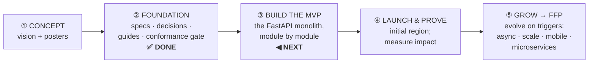
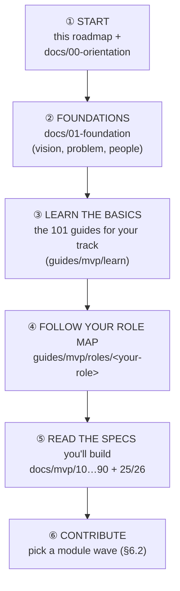

# IDRM — The Complete Roadmap (Concept → MVP → Full-Fledged Product)

> *Type: Document (roadmap / orientation) · Audience: **everyone** — non-technical stakeholders, rookies &
> freshly-inducted engineers, product & delivery leads · Status: current (2026-08-16) · Depth: overview → mastery*

> **What this document is:** the **single, plain-language map of IDRM's whole journey** — where it came from,
> what is being built now, and how it grows later — written so a **complete beginner or a non-technical
> stakeholder can follow it**, while still giving a new engineer the path to **mastery**. It does not assume you
> have read anything else first; every term is explained on first use.

> **The whole story in one line:** IDRM is *"Uber for disaster relief"* — connect people who need help with those
> who can give it, on a live map. We build the **smallest genuinely useful version first (the MVP)**, prove it
> saves time and lives, then **grow it step by step (the FFP)** — never adding complexity before there is a real
> reason.

> **Two roadmaps, two purposes (so you pick the right one):** *this* document is the **strategic map** — the
> whole journey, for every audience. When you're ready to **actually build the MVP**, switch to the hands-on
> **builder's roadmap**, [`mvp/27-implementation-roadmap.md`](mvp/27-implementation-roadmap.md) — the turn-by-turn
> directions (data foundation → API → code → tests → CI, module by module). Think *map of the journey* (here)
> vs *driving directions* (there).

---

## 1. How to read this roadmap (pick your lane)

You do **not** need to read all of it. Start where you fit:

| You are… | Read | You'll come away knowing |
|---|---|---|
| A **non-technical stakeholder** (sponsor, government, partner) | §2, §3, §4, §9 | what IDRM is, why it's phased, where it stands, and how success is measured |
| A **rookie / freshly-inducted engineer** | all of it — especially §6, §8 | the build plan, and the exact learning path to becoming productive |
| A **returning contributor / lead** | §4, §5, §6, §7 | current status, the phase plan, and the next concrete steps |

> **Five words you'll meet everywhere (defined once):**
> - **MVP — Minimum Viable Product:** the *lean first build* — the smallest system that truly helps, built as
>   simply as possible. **This is what we build now.**
> - **FFP — Full-Fledged Product:** the *later, full-scale* system the MVP grows into (national scale, mobile
>   apps, AI, …). Nothing is thrown away — deferred items are **routed to the FFP**, not dropped.
> - **Module:** one self-contained part of the software (e.g. *incidents*, *users*) — like a room in a house.
> - **Trigger:** a *concrete, real reason* (more users, a performance limit, a new need) that unlocks the next
>   step. We add advanced technology **only when a trigger fires** — never "because it's modern".
> - **PICS — the conformance checklist:** the signed-off list of *every obligation the code must satisfy*; it is
>   the gate the build is measured against. (Full glossary: §10.)

---

## 2. The whole journey in one picture

**In plain terms:** the *thinking and the documentation are finished* (①②). The next job is to *build the working
software* (③). Once it runs in a first region and we can **measure** that it helps (④), we **grow** it — one
justified step at a time — toward the enterprise-scale vision (⑤).

---

## 3. The big idea — and why we build it in phases

**The vision.** IDRM is a **digital nervous system for disaster response**: a *neural network* that carries
**information** (who needs what, where, right now) and a *circulatory system* that moves **resources** (people,
supplies, capacity) to where they are needed — all on one shared, live map.

**The problem it solves (India today).** During floods and cyclones, citizens call many separate emergency lines,
responders coordinate over scattered phone calls and spreadsheets, and no one has a single live picture. Requests
are duplicated or missed; there is no accountability.

**Why phased (MVP first, then FFP).** Building the whole enterprise platform up front would be slow, expensive,
and risky — and people need help *now*. So IDRM:
1. Builds the **MVP** — the essential help-request loop, as simply as possible, so it can **start saving time and
   lives sooner**; and
2. Grows into the **FFP** **only as real needs (triggers) appear**, and — crucially — **without a rewrite**,
   because the MVP is designed with clean seams from day one.

> *This "start simple, grow deliberately" choice is the single most important idea in the whole project.*

---

## 4. Where we are today (an honest status)

| Part of the journey | Status | Meaning |
|---|---|---|
| **Vision & posters** | ✅ done | the authoritative product vision exists |
| **Specifications** (MVP + FFP) | ✅ done | 14 MVP specs + 15 FFP specs, all cross-linked and elucidated |
| **Architecture decisions** (ADRs) | ✅ done | every major choice recorded with its *why* |
| **Learning library** (guides) | ✅ done | 40 "101" guides + 12 role-mastery maps + learning hubs |
| **Conformance gate** (the PICS) | ✅ **signed off** | the checklist the build must satisfy is agreed and locked |
| **The MVP code** | ◻ **not started — this is next** | `services/monolith/` is empty; the build is fully unblocked |
| **The FFP** | ◻ later, on triggers | evolves after the MVP is live |

**One-line status:** *everything needed to build is ready and agreed; the next step is writing the MVP code.*

---

## 5. The phases at a glance

| Phase | Name | What happens | When |
|---|---|---|---|
| **0** | **Foundation** | specs, decisions, guides, the signed-off conformance checklist | ✅ complete |
| **1** | **Build the MVP** | write the FastAPI modular-monolith code, module by module, to pass the PICS | **now** |
| **1b** | **Launch & prove** | deploy to an initial region; measure response time & fulfilment | after Phase 1 |
| **2** | **FFP · Async & performance** | background workers, caching/streams | trigger: async load appears |
| **3** | **FFP · Production hardening** | containers, CI/CD, monitoring | trigger: ops maturity needed |
| **4** | **FFP · High-availability & scale** | orchestration, replication, full observability | trigger: scale/uptime demands |
| **5** | **FFP · Selective distribution** | split out services, add mobile apps & real-time push | trigger: ownership/scale/reach |

Phases 2–5 are **not a fixed schedule** — each begins only when its trigger fires. (Details: §7.)

---

## 6. Phase 1 — Building the MVP (the plan)

### 6.1 What the MVP delivers
One responsive **web app** (works on an ordinary smartphone) with three role-based views:
- **Citizens** create a *help request* on a map and track it.
- **Providers** (NGOs, hospitals, volunteers) see nearby requests and respond.
- **Coordinators/Admins** (government) oversee the live picture and approve critical requests.

Under the hood it is a **modular monolith** — *one* FastAPI/Python application, cleanly divided into **ten
modules**: `users · incidents · resources · locations · alerts · notifications · reports · files · audit ·
administration`. One database (**PostgreSQL + PostGIS**) is the single source of truth; uploaded photos live in
**MinIO**; the web pages are plain **HTML + Tailwind + JavaScript + Leaflet** maps.

**The core loop** every module serves: **sense** a need (an incident) → **route** it to someone who can act (a
provider) → **record** it honestly (audit). A help request moves through a locked **8-state lifecycle**:
`created → (approved, if critical) → accepted → in_progress → completed → verified` (plus `cancelled` / `rejected`).

### 6.2 The build order (module by module)
We build like constructing a house — foundation first, then the rooms that everything else depends on, then the
rest. Each **wave** is only "done" when its [conformance checklist rows](mvp/26-conformance-pics.md) pass with
real tests.

| Wave | Build | Why this order |
|---|---|---|
| **0 · Foundation** | project skeleton, database + PostGIS, config, the shared module pattern | everything sits on this |
| **1 · Users & access** (USR) | registration, login (RS256 JWT), roles/RBAC, sessions in Postgres | nothing is allowed until we know *who* and *what they may do* |
| **2 · Incidents** (INC) | create a request; enforce the 8-state lifecycle; audit every change | the **heart** of the system |
| **3 · Locations + Resources** (LOC, RES) | PostGIS proximity ("nearest capable provider"); provider assets | makes matching real |
| **4 · Files, Notifications, Alerts** (FIL, NTF, ALR) | photo/proof uploads to MinIO; status notifications; area alerts | evidence + keeping people informed |
| **5 · Reports, Audit, Administration** (RPT, AUD, ADM) | operational reports; the tamper-evident record; reference data | oversight & accountability |
| **6 · Web UI** | the screens, forms, and map — **WCAG 2.2 AA** accessible | what people actually touch |
| **7 · Hardening & launch** | tests ≥ 80%, security review, native-systemd deploy, backups/DR | ready for real users |

> **Recommended first step (for engineers):** Wave 0 + Wave 1 (users/auth) — auth is the least-coupled module and
> sets the pattern every other module copies. Then incidents. Full obligations per module are in the
> [conformance checklist](mvp/26-conformance-pics.md); the *what/why/how* of each module is in
> [module elucidation](mvp/25-module-elucidation.md).

### 6.3 How we know a feature is "done"
A feature is done when each of its **acceptance criteria** (in [scope & acceptance](mvp/11-requirements-scope-and-acceptance.md))
has a **passing automated test**, its access rules are enforced, and its actions are audited. The MVP as a whole
is done when the whole `created → verified` loop works end-to-end for the initial region. (This is the
**Definition of Done**, and it is what flips each checklist row from *Planned* to *Yes*.)

---

## 7. Phase 2+ — Growing into the FFP (only on triggers)

The **FFP (Full-Fledged Product)** is the MVP **evolved**, never rewritten. The golden rule: **add each advanced
technology only when a concrete trigger justifies it.** Until then, the simple MVP choice stays.

| FFP phase | What it adds | The trigger that unlocks it | Deep-dive |
|---|---|---|---|
| **2 · Async & performance** | background **workers**, caching / event **streams** (Redis) | slow jobs or notification fan-out need to run outside the request | [ffp/81](ffp/81-ops-messaging-and-async.md) |
| **3 · Production hardening** | **containers** (Docker), **CI/CD** pipelines, monitoring | repeatable deploys & release automation are needed | [ffp/80](ffp/80-ops-platform-and-deployment.md) |
| **4 · High-availability & scale** | **Kubernetes**, replication, full **observability** | uptime/scale demands exceed one server | [ffp/80](ffp/80-ops-platform-and-deployment.md) |
| **5 · Selective distribution** | split modules into **microservices** (auth first) behind an **APISIX** gateway; **React web + mobile apps**; message brokers; deep real-time push | one part needs independent scaling/ownership; mobile/field use required | [ffp/20](ffp/20-architecture-system.md) |

Also chartered for the FFP (deferred from the MVP, **not dropped**): money/donations, a "disaster event" entity,
AI-assisted matching, per-request privacy levels, full 12-language localization, and multi-channel intake
(WhatsApp/voice). Each returns via its own decision record naming the trigger. The **public API contract stays
identical** throughout — new capability is *added* at the same paths, never renamed.

---

## 8. The learning roadmap (novice → mastery)

IDRM is designed so a newcomer can become productive **without understanding the whole system first**. Climb this
ladder:

- **Everyone starts** with this roadmap and [`00-orientation.md`](00-orientation.md) → [`01-foundation.md`](01-foundation.md).
- **The 101 guide library** ([`../guides/mvp/learn/`](../guides/mvp/learn/README.md)) teaches each concept from
  scratch — 40 short guides (disaster management, REST APIs, PostgreSQL/PostGIS, security, testing, …), plus the
  **[Technology Stack 101](../guides/mvp/learn/tech-stack-101.md)** map (what each tool is and *why* we use it).
- **Role maps** ([`../guides/mvp/roles/`](../guides/mvp/roles/README.md)) sequence the guides + specs into a path
  for *your* job (backend, frontend, GIS, QA, security, DevOps, PM, BA, …).
- **The specs** ([`mvp/`](mvp/README.md)) are the authoritative detail; the **[module elucidation](mvp/25-module-elucidation.md)**
  explains each module's *what/why/how*, and the **[conformance checklist](mvp/26-conformance-pics.md)** is what
  "done" means.

| If your role is… | Your fastest path to mastery |
|---|---|
| **Backend engineer** | Tech-Stack-101 → REST/Database/PostGIS 101s → `docs/mvp/20, 30, 40, 50` → module waves |
| **Frontend engineer** | Tech-Stack-101 → GIS-for-emergency-response → `docs/mvp/60` (HTML/Tailwind/JS/Leaflet) |
| **GIS engineer** | PostgreSQL/PostGIS 101 → `docs/mvp/50` (SRID/GiST) → LOC module |
| **QA / tester** | Testing & API-Testing 101 → `docs/mvp/11` (acceptance) + `70` (test strategy) |
| **Security engineer** | IAM / RBAC-ABAC / Secure-Coding 101 → `docs/mvp/22` |
| **DevOps / SRE** | Linux / Backup-Restore 101 → `docs/mvp/80` (native systemd) |
| **Non-technical stakeholder** | this roadmap §2–§4, §9 → `docs/01-foundation.md` |

---

## 9. Milestones & success metrics

The MVP targets, measured in the field once live (initial region), by **Q4 2026**:

| Measure | Baseline (today) | MVP target |
|---|---|---|
| Coverage | — | **2 states, 50+ districts** |
| Registered users | — | **10,000+** |
| Partner organizations | — | **50+** |
| Average response time | ~12 hours | **~2 hours** |
| Request fulfilment rate | ~60% | **~80%** |
| Lives saved (annual, est.) | — | **500+** |
| User satisfaction | — | High (tracked) |

**"MVP complete" means:** every essential feature works end-to-end (`created → verified`) for the initial region,
guest emergency submission works, access control + audit pass a security review, and the conformance checklist's
mandatory rows are all *Yes*. (Precise checks: [`mvp/11`](mvp/11-requirements-scope-and-acceptance.md) §7.)

---

## 10. Key terms (plain-language glossary)

| Term | Plain meaning |
|---|---|
| **MVP** | Minimum Viable Product — the lean first build (what we make now). |
| **FFP** | Full-Fledged Product — the later, full-scale system the MVP grows into. |
| **Modular monolith** | one deployable application, cleanly divided inside into modules (rooms in one house). |
| **Module** | a self-contained part of the system (users, incidents, …). |
| **Incident / help request** | the core record a citizen creates asking for help (UI says "help request"; the system calls it an `incident`). |
| **Lifecycle** | the fixed sequence of states a request moves through (`created → … → verified`). |
| **Trigger** | a concrete real reason that unlocks the next FFP step (we never add complexity before it). |
| **PICS / conformance checklist** | the signed-off list of every obligation the code must meet — the build gate. |
| **PostGIS** | the map/location engine built into the PostgreSQL database. |
| **RBAC** | Role-Based Access Control — permissions attached to a role. |
| **ADR** | Architecture Decision Record — a short note capturing a decision and *why*. |
| **WCAG 2.2 AA** | the international accessibility standard IDRM's screens meet. |

---

## 11. Where to go next (by who you are)

- **Stakeholder:** you're done here — for the "why", read [`01-foundation.md`](01-foundation.md).
- **New engineer:** climb the ladder in §8, starting with the [learning hub](../guides/mvp/00-start-learning-paths.md).
- **Ready to build:** open the [conformance checklist](mvp/26-conformance-pics.md) and start **Wave 0 + 1** (§6.2);
  the module *what/why/how* is in [module elucidation](mvp/25-module-elucidation.md).

---

*Related:* [`00-orientation.md`](00-orientation.md) · [`01-foundation.md`](01-foundation.md) ·
[`08-organization.md`](08-organization.md) (ownership & governance) · MVP specs [`mvp/`](mvp/README.md) ·
FFP specs [`ffp/`](ffp/README.md) · guides [`../guides/`](../guides/) · decisions [`99-decisions-and-history.md`](99-decisions-and-history.md).
