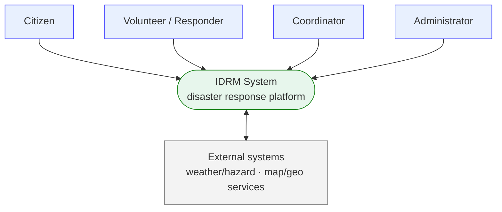
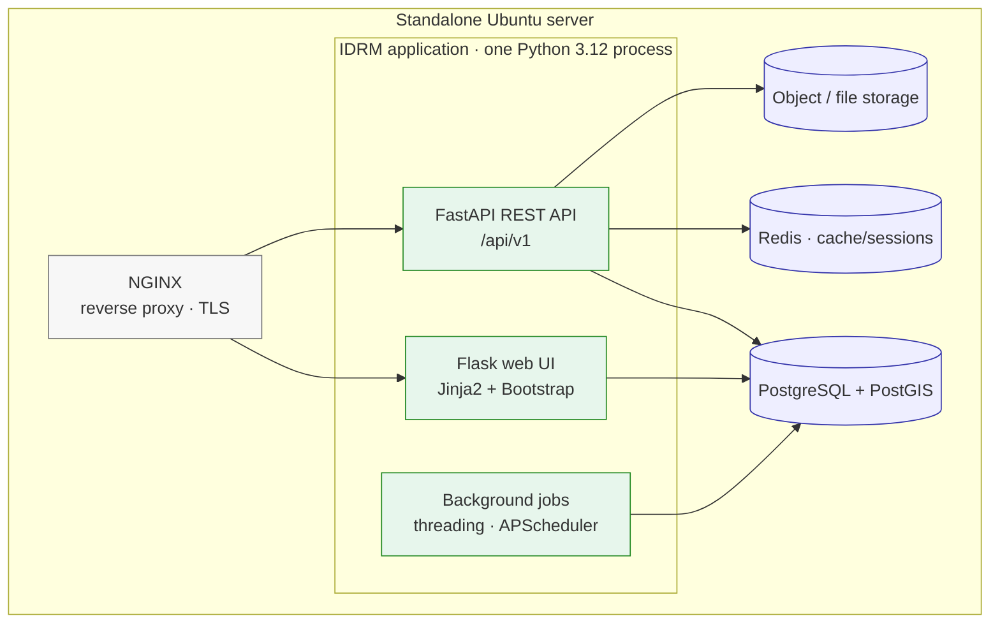

# Architecture & Detailed Design (MVP)

> **⚠️ Stack note (ADR-012):** MVP view layer = FastAPI-served HTML+Tailwind+JS+Leaflet (not Flask/Jinja/Bootstrap); no Redis (sessions in Postgres) + MinIO for files; where this file says Flask/Bootstrap/Redis, defer to [`../mvp/`](../mvp/) and [`../99-decisions-and-history.md`](../99-decisions-and-history.md) (ADR-012).

> **Part of:** IDRM Documentation · `deep-dive/11-architecture-and-design.md`
> **Answers:** How is the MVP structured internally, and how is each module designed?
> **Source posters:** MVP execution posters (system, layered, modular, packet-flow); conforms to
> [`../02-architecture.md`](../02-architecture.md). (Vision posters 17/20/23 describe the future/FFP and are
> **not** used for the MVP — see the conformance record in [`../99-decisions-and-history.md`](../99-decisions-and-history.md).)
> **Standards:** ISO/IEC/IEEE 42010:2022 · arc42 · C4 model · IEEE 1016 (detailed design)
> **Audience:** Architects, developers · **Depth:** Deep
> **Status:** Draft

---

## 1. Introduction & goals *(arc42 §1)*
Deepens [`../02-architecture.md`](../02-architecture.md). Quality goals: reliability, security, accessibility,
maintainability, and easy evolution (see NFRs in [`10-srs.md`](10-srs.md)).

## 2. Constraints *(arc42 §2)*
One Python 3.12 process (modular monolith); server-rendered UI; PostgreSQL/PostGIS + Redis; standalone Ubuntu
deployment; WCAG 2.2 AA; DPDP Act 2023; standards-based APIs (OpenAPI 3.1).

## 3. Context & scope *(arc42 §3 — C4 Level 1: System Context)*

*Text:* citizens, responders, coordinators, and administrators use IDRM; IDRM exchanges data with essential
external systems (weather/hazard feeds, map/geo services).

## 4. Solution strategy *(arc42 §4)*
Modular monolith with clean module boundaries; server-rendered UI for accessibility and speed; in-process
background work; one authoritative database with spatial support. Rationale in the ADRs
([`../99-decisions-and-history.md`](../99-decisions-and-history.md)).

## 5. Building-block view *(arc42 §5)*

### 5.1 Containers *(C4 Level 2)*

*Text:* NGINX fronts one Python process exposing a Flask web UI and a FastAPI API, with in-process background
jobs. All persist to PostgreSQL/PostGIS; Redis provides caching/sessions; files go to object storage.

### 5.2 Components *(C4 Level 3 — inside the application)*
Business modules (each a slice across `models`/`schemas`/`services`/`apis`/`routes`):

```mermaid
flowchart LR
    subgraph Cross[Cross-cutting]
      sec[Security<br/>authN/Z]:::x
      val[Validation<br/>Pydantic]:::x
      log[Logging/Audit]:::x
      cfg[Config]:::x
    end
    subgraph Modules[Business modules]
      auth[Auth & Access]:::m
      inc[Incident]:::m
      res[Resource]:::m
      rsp[Responder]:::m
      geo[Geospatial]:::m
      notif[Notification/Alerts]:::m
      doc[Document/Media]:::m
      rpt[Analytics]:::m
      aud[Audit]:::m
    end
    repo[Repositories · SQLAlchemy ORM]:::r
    Modules --> repo
    Cross -.applies to.-> Modules
    classDef m fill:#e7f6ec,stroke:#282;
    classDef x fill:#fdf6e3,stroke:#b58900;
    classDef r fill:#eef,stroke:#33a;
```

## 6. Runtime view *(arc42 §6 — key scenarios)*

**Report an incident:** UI/API request → auth → RBAC → validation → Incident service creates record (with
PostGIS location) → Audit writes entry → Notification job raises alerts → response. *(Mirrors the packet-flow
poster and [`../02-architecture.md`](../02-architecture.md) §6.)*

**Deploy a resource:** Coordinator posts a deployment → Resource service links resource↔incident (via
`deployments`) → resource status updated → audit + notification.

**Scheduled work:** APScheduler triggers periodic reports/cleanups via the background worker.

## 7. Deployment view *(arc42 §7)*
Single Ubuntu server; NGINX + Gunicorn (Flask) + Uvicorn (FastAPI) + PostgreSQL/PostGIS + Redis, managed by
systemd. Details in [`../07-operations.md`](../07-operations.md).

## 8. Cross-cutting concepts *(arc42 §8)*
Security (authN/Z, encryption, headers), validation (Pydantic), structured logging + audit trail,
configuration via environment, error handling, internationalisation (multilingual-ready), and the Repository
pattern for data access.

## 9. Architecture decisions *(arc42 §9)*
Recorded as ADRs in [`../99-decisions-and-history.md`](../99-decisions-and-history.md) (ADR-001…011).

## 10. Quality requirements *(arc42 §10)*
Mapped to the NFRs in [`10-srs.md`](10-srs.md) §4 and verified per [`../06-quality.md`](../06-quality.md).

## 11. Risks & technical debt *(arc42 §11)*
Single-server availability (mitigated by backups/DR); disciplined module boundaries required to preserve the
clean monolith; surge performance validated by load testing.

---

## 12. Detailed design *(IEEE 1016 — per-module)*

Each module exposes a service interface, owns entities, and depends only on shared cross-cutting services and
the repository layer. Entities reference [`13-data-model.md`](13-data-model.md); operations reference
[`12-api-spec.md`](12-api-spec.md).

| Module | Responsibilities | Owns entities | Key API |
|---|---|---|---|
| **Auth & Access** | Login, JWT, RBAC, user/role admin | `users`, `roles` | `/auth/*`, `/users`, `/roles` |
| **Incident** | Report/classify/track/escalate incidents & timeline | `incidents`, `incident_types`, `incident_updates` | `/incidents*` |
| **Resource** | Inventory, deployments, tasks | `resources`, `resource_types`, `deployments`, `tasks` | `/resources`, `/deployments`, `/tasks` |
| **Responder** | Responder profiles, skills, availability | `responders` | `/responders` |
| **Geospatial** | Locations, layers, spatial queries (PostGIS) | `locations`, `geospatial_data` | `/map/layers`, `/locations` |
| **Notification/Alerts** | Alerts & communication across channels | `alerts`, `communication_logs` | `/alerts`, `/communication-logs` |
| **Document/Media** | Attachments in object storage | `documents`, `media` | `/documents`, `/media` |
| **Analytics** | Dashboards, KPIs, reports (basic) | (reads across) | `/reports` (read) |
| **Audit** | Immutable action trail | `audit_logs` | `/audit-logs` |

**Design rules (all modules):** input validated by Pydantic; data access via Repository/ORM; state changes
audited; errors returned in the standard envelope ([`12-api-spec.md`](12-api-spec.md) §5); background/async work
handed to the jobs component.

---

*Conforms to the MVP execution posters; expressed with arc42 + C4 + IEEE 1016.*
