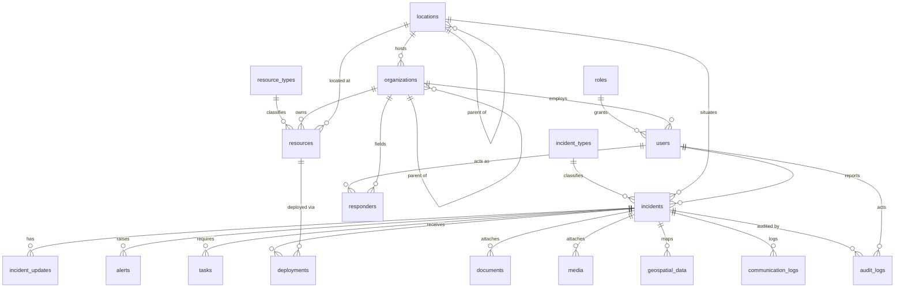

# Data Model (MVP)

> **⚠️ Stack note (ADR-012):** MVP view layer = FastAPI-served HTML+Tailwind+JS+Leaflet (not Flask/Jinja/Bootstrap); no Redis (sessions in Postgres) + MinIO for files; where this file says Flask/Bootstrap/Redis, defer to [`../mvp/`](../mvp/) and [`../99-decisions-and-history.md`](../99-decisions-and-history.md) (ADR-012).

> **Part of:** IDRM Documentation · `deep-dive/13-data-model.md`
> **Answers:** What are the database entities, their fields, relationships, and rules?
> **Source posters:** **Poster 22 (Entity Relationship Overview)** — authoritative; Poster 21 (Database
> Architecture); Poster 23 (GIS). Deepens [`../04-data.md`](../04-data.md).
> **Standards:** ERD (crow's-foot / Mermaid) · data dictionary · ISO/IEC 11179 metadata principles
> **Audience:** Developers · **Depth:** Deep
> **Status:** Draft — conformed to Poster 22

---

## 1. Purpose & conformance

This is the field-level data model for the IDRM MVP. **It conforms to Poster 22 (Entity Relationship
Overview)** — the entity names, columns, relationships, entity groups, and naming conventions below are taken
directly from that poster. It runs on **PostgreSQL + PostGIS**, with **Redis** for caching and **Object
Storage** for files (Poster 21).

The model has **18 tables** in five entity groups. Read §2 (conventions) once, scan the
[ERD](#3-entity-relationship-diagram), then use the [data dictionary](#5-entity-catalog) while building.

---

## 2. Conventions (from Poster 22 "Naming Conventions")

| Convention | Rule |
|---|---|
| **Primary keys** | `<entity>_id` suffix; UUID by default (`gen_random_uuid()`); high-volume logs may use `BIGSERIAL`. |
| **Foreign keys** | `<entity>_id` suffix, referencing the parent table. |
| **Timestamps** | `created_at` on all tables; `updated_at` on mutable tables (auto-stamped by a shared trigger). |
| **Soft delete / state** | `status` and/or `is_active` flags rather than hard deletes where history matters. |
| **Spatial types** | All spatial entities use **PostGIS Geometry** types (WGS-84 / EPSG:4326). |
| **Design** | Normalised for integrity and scalability; JSONB for open-ended attributes/properties. |
| **Files & media** | Stored in **Object Storage**; the database keeps the reference (`file_url` / `storage_type`). |

---

## 3. Entity-relationship diagram

*Text description (accessibility):* **Roles** and **organizations** each have many **users**; **locations**
host organizations and situate incidents (locations and organizations are self-referencing hierarchies). An
**incident** is classified by an **incident type**, sits at a **location**, is reported by a **user**, and has
many **updates, alerts, tasks, deployments, documents, media, geospatial layers, communication logs, and audit
logs**. **Responders** are users acting on behalf of organizations. **Resources** are classified by
**resource type**, owned by organizations, and connected to incidents through **deployments** (a many-to-many
link). **Users** generate **audit logs**.

---

## 4. Entities by group (Poster 22 "Entity Groups")

| Group | Tables |
|---|---|
| **Access & Administration** | `users`, `roles`, `organizations`, `locations` |
| **Incident Management** | `incidents`, `incident_types`, `incident_updates`, `alerts` |
| **Response Management** | `responders`, `resources`, `resource_types`, `deployments`, `tasks` |
| **Data & Content Management** | `documents`, `media`, `geospatial_data` |
| **Communication & Audit** | `communication_logs`, `audit_logs` |

---

## 5. Entity catalog (data dictionary)

Columns are exactly those shown on Poster 22. `(Geometry)` = PostGIS geometry; `(JSONB)` = JSON column.

### Access & Administration

**`users`**
| Column | Key | Description |
|---|---|---|
| `user_id` | PK | Identifier. |
| `full_name` | | Display name. |
| `email` | | Login & contact (unique). |
| `phone` | | Contact number. |
| `password_hash` | | Hashed password (never plaintext). |
| `role_id` | FK → `roles` | Access role. |
| `organization_id` | FK → `organizations` | Affiliation (nullable for citizens). |
| `status` | | Account state (e.g. active/suspended). |
| `created_at` | | Created timestamp. |

**`roles`**
| Column | Key | Description |
|---|---|---|
| `role_id` | PK | Identifier. |
| `role_name` | | e.g. Citizen, Responder, Coordinator, Admin. |
| `description` | | What the role is for. |

**`organizations`**
| Column | Key | Description |
|---|---|---|
| `organization_id` | PK | Identifier. |
| `name` | | Organisation name. |
| `type` | | e.g. NGO, hospital, govt agency. |
| `parent_org_id` | FK → `organizations` | Parent (hierarchy). |
| `location_id` | FK → `locations` | Base location. |
| `status` | | State. |
| `created_at` | | Created timestamp. |

**`locations`**
| Column | Key | Description |
|---|---|---|
| `location_id` | PK | Identifier. |
| `name` | | Place name. |
| `admin_level` | | Administrative level (state/district/etc.). |
| `boundary` | (Geometry) | Area boundary (PostGIS). |
| `type` | | Location category. |
| `parent_location_id` | FK → `locations` | Parent (hierarchy). |

### Incident Management

**`incidents`**
| Column | Key | Description |
|---|---|---|
| `incident_id` | PK | Identifier. |
| `incident_number` | | Human-readable reference. |
| `title` | | Short title. |
| `incident_type_id` | FK → `incident_types` | Classification. |
| `severity_level` | | Severity. |
| `status` | | Lifecycle state. |
| `location_id` | FK → `locations` | Where it occurred. |
| `reported_by` | FK → `users` | Reporter. |
| `occurred_at` | | When it occurred. |
| `description` | | Details. |
| `created_at` | | Created timestamp. |

**`incident_types`**
| Column | Key | Description |
|---|---|---|
| `incident_type_id` | PK | Identifier. |
| `type_name` | | e.g. Flood, Fire, Medical. |
| `description` | | Meaning. |

**`incident_updates`**
| Column | Key | Description |
|---|---|---|
| `update_id` | PK | Identifier. |
| `incident_id` | FK → `incidents` | Parent incident. |
| `created_by` | FK → `users` | Author. |
| `update_type` | | Kind of update. |
| `message` | | Update text. |
| `created_at` | | Timestamp. |

**`alerts`**
| Column | Key | Description |
|---|---|---|
| `alert_id` | PK | Identifier. |
| `incident_id` | FK → `incidents` | Related incident. |
| `alert_type` | | Kind of alert. |
| `message` | | Alert content. |
| `severity` | | Severity. |
| `channel` | | Delivery channel (email/SMS/push/in-app). |
| `sent_at` | | When sent. |
| `status` | | Delivery state. |

### Response Management

**`responders`**
| Column | Key | Description |
|---|---|---|
| `responder_id` | PK | Identifier. |
| `user_id` | FK → `users` | The person. |
| `organization_id` | FK → `organizations` | On behalf of. |
| `responder_type` | | e.g. volunteer, medical, fire. |
| `skills` | | Capabilities. |
| `status` | | Availability state. |
| `created_at` | | Timestamp. |

**`resources`**
| Column | Key | Description |
|---|---|---|
| `resource_id` | PK | Identifier. |
| `name` | | Resource/asset name. |
| `resource_type_id` | FK → `resource_types` | Classification. |
| `quantity` | | Amount. |
| `unit` | | Unit of measure. |
| `owner_org_id` | FK → `organizations` | Owner. |
| `status` | | State (available/allocated/etc.). |
| `location_id` | FK → `locations` | Where it is. |

**`resource_types`**
| Column | Key | Description |
|---|---|---|
| `resource_type_id` | PK | Identifier. |
| `type_name` | | e.g. Vehicle, Equipment, Supply, **Shelter**. |
| `description` | | Meaning. |

> **Shelters (MVP):** shelters are modelled as **`resources` with `resource_type` = SHELTER** (using
> `quantity`/`status` for capacity/occupancy and `location_id` for place). A dedicated `shelters` entity is a
> future extension if richer shelter attributes are needed.

**`deployments`** *(links resources to incidents — the resource↔incident M:N)*
| Column | Key | Description |
|---|---|---|
| `deployment_id` | PK | Identifier. |
| `incident_id` | FK → `incidents` | Where deployed. |
| `resource_id` | FK → `resources` | What was deployed. |
| `deployed_by` | FK → `users` | Who deployed it. |
| `deployed_at` | | When deployed. |
| `returned_at` | | When returned. |
| `status` | | Deployment state. |
| `notes` | | Notes. |

**`tasks`**
| Column | Key | Description |
|---|---|---|
| `task_id` | PK | Identifier. |
| `incident_id` | FK → `incidents` | Parent incident. |
| `assigned_to` | FK → `users` | Assignee. |
| `title` | | Task title. |
| `priority` | | Priority. |
| `status` | | State. |
| `due_at` | | Due date/time. |
| `created_at` | | Timestamp. |

### Data & Content Management

**`documents`**
| Column | Key | Description |
|---|---|---|
| `document_id` | PK | Identifier. |
| `incident_id` | FK → `incidents` | Related incident. |
| `uploaded_by` | FK → `users` | Uploader. |
| `file_name` | | Original name. |
| `file_type` | | MIME/type. |
| `file_url` | | Object-storage reference. |
| `storage_type` | | Where stored. |
| `uploaded_at` | | Timestamp. |

**`media`**
| Column | Key | Description |
|---|---|---|
| `media_id` | PK | Identifier. |
| `incident_id` | FK → `incidents` | Related incident. |
| `uploaded_by` | FK → `users` | Uploader. |
| `media_type` | | Photo/video/etc. |
| `file_url` | | Object-storage reference. |
| `thumbnail_url` | | Preview image. |
| `captured_at` | | When captured. |
| `location_id` | FK → `locations` | Where captured. |
| `description` | | Caption. |

**`geospatial_data`**
| Column | Key | Description |
|---|---|---|
| `geo_data_id` | PK | Identifier. |
| `incident_id` | FK → `incidents` | Related incident. |
| `layer_type` | | Layer kind (see [§6](#6-geospatial-data-postgis)). |
| `geometry` | (Geometry) | PostGIS geometry (point/line/polygon). |
| `properties` | (JSONB) | Feature attributes. |
| `source` | | Data source. |
| `created_at` | | Timestamp. |

### Communication & Audit

**`communication_logs`**
| Column | Key | Description |
|---|---|---|
| `comm_log_id` | PK | Identifier. |
| `incident_id` | FK → `incidents` | Related incident. |
| `channel` | | Channel used. |
| `direction` | | Inbound/outbound. |
| `message` | | Content. |
| `sent_at` | | When sent. |
| `received_at` | | When received. |
| `status` | | State. |

**`audit_logs`**
| Column | Key | Description |
|---|---|---|
| `audit_log_id` | PK | Identifier. |
| `user_id` | FK → `users` | Actor. |
| `action` | | What was done. |
| `entity_name` | | Affected table. |
| `entity_id` | | Affected record. |
| `old_values` | (JSONB) | Before-state. |
| `new_values` | (JSONB) | After-state. |
| `created_at` | | Timestamp. |

---

## 6. Geospatial data (PostGIS)

Per Poster 21/23, spatial data is stored and queried in **PostgreSQL + PostGIS** (no separate map server for
the MVP — GIS is served with Python + GDAL). Spatial columns: `locations.boundary` (areas) and
`geospatial_data.geometry` (layer features), plus point geometry where needed.

- **CRS:** WGS-84 / **EPSG:4326** (global); UTM/projected as needed per project.
- **Layer types** (`geospatial_data.layer_type`, from Poster 21): Locations, Boundaries, Hazard Zones,
  Assets (Points), Routes (Lines), Areas (Polygons).
- **Indexing:** **GiST** spatial indexes for fast "within X km", bounding-box, and viewport queries.
- **Distance:** cast geometry to `geography` for metre-based queries (`ST_DWithin`, `ST_Distance`).

---

## 7. Enumerations (indicative — finalised in `10-srs.md`)

Poster 22 names the enum-bearing columns but not all their values. Indicative sets (to be confirmed in the
SRS):

| Column | Indicative values |
|---|---|
| `incidents.severity_level` | Critical, High, Medium, Low |
| `incidents.status` | Reported → Verified → In-Progress → Resolved → Closed |
| `alerts.channel` / `communication_logs.channel` | Email, SMS, Push, In-App, Voice |
| `communication_logs.direction` | Inbound, Outbound |
| `tasks.priority` | Critical, High, Medium, Low |
| `resources.status` | Available, Allocated, Depleted, Maintenance |
| `deployments.status` | Deployed, Returned, Cancelled |

---

## 8. Migrations, integrity & governance

- **Migrations:** every schema change is an **Alembic** migration (versioned, reversible).
- **Referential integrity:** foreign keys with sensible `ON DELETE` behaviour; hierarchies via
  `parent_*_id` self-references.
- **Validation at write time:** `CHECK` constraints enforce enums, ranges, and cross-field rules.
- **Audit:** `audit_logs` records who/what/when with before/after JSONB — rows are never updated or deleted.
- **Retention & backups:** [`../07-operations.md`](../07-operations.md). **PII & privacy (DPDP):**
  [`../05-security.md`](../05-security.md).

---

## 9. Traceability

Every entity maps to a business domain in [`../04-data.md`](../04-data.md) and forward to API resources in
`12-api-spec.md`. Consolidated links live in `14-traceability-matrix.md`. Canonical entity list recorded in
[`../99-decisions-and-history.md`](../99-decisions-and-history.md) (Poster conformance record).

---

*Conforms to Poster 22 (Entity Relationship Overview) — the authoritative IDRM MVP data model.*
