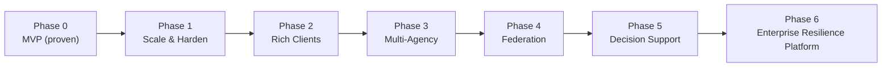

# IDRM FFP — Scope & Roadmap

> *Type: Document (specification) · Audience: product, architects, delivery · Status: FFP — next-phase (planned)*
> *Extends the MVP scope doc [`../idrm-mvp-docs/11-requirements-scope-and-acceptance.md`](../mvp/11-requirements-scope-and-acceptance.md). Defines **what the FFP is/ isn't**, and the **phased roadmap** by which the MVP grows into it — each step gated by a **concrete trigger**, never "because enterprise." Consolidates `v3/91-project-roadmap.md`, `92-project-migration-to-microservices.md`, `v2/90-project-roadmap.md`.*

> **Core principle (charter):** *"Do not build the enterprise platform inside the MVP. Build the seams that
> let it emerge."* Every FFP addition enters via an **ADR naming its trigger** ([`21-architecture-decisions.md`](21-architecture-decisions.md)).

---

## 1. In scope (FFP)
The MVP-deferred capabilities, delivered incrementally: selective **microservices**, **APISIX** gateway,
**React** web + **React Native/Expo** mobile, **Redis → brokers** + workers, **Docker → K8s**, full
**observability/HA/DR**, **OIDC/MFA/ABAC**, **disaster events + COP**, **financial transparency**,
**AI-assisted matching**, **advanced analytics**, **full localization**, **multi-channel intake**, **deep
real-time push**, **biometric matching** (consent-gated), **multi-agency federation**.

## 2. Out of scope (still)
Anything without a concrete trigger yet; speculative "enterprise" tech adopted for its own sake. The FFP is
**demand-driven** — a capability waits until scale/ownership/performance/reliability/regulatory need is
measured.

## 3. Phased evolution roadmap

| Phase | Focus | Key additions | **Trigger** |
|---|---|---|---|
| **0 · MVP** | proven modular monolith | — | (baseline, done) |
| **1 · Scale & Harden** | run reliably under load | **Docker**, **APISIX** gateway, **Redis** cache, observability, HA, CI/CD | monolith hits load/ops limits; need TLS/rate-limit/routing centrally |
| **2 · Rich Clients** | better UX | **React** SPA, **React Native/Expo** mobile (offline), **deep push** | field/offline use; rich admin dashboards demanded |
| **3 · Multi-Agency** | coordinate agencies | **disaster events + COP**, RBAC→**ABAC**, **OIDC/SSO/MFA**, first **service extraction** (auth) | multiple agencies/jurisdictions onboard |
| **4 · Federation** | cross-org scale | more **microservices**, **RabbitMQ/Kafka**, **Swarm/Kubernetes**, per-service data | independent deploy/ownership/scale pressure per module |
| **5 · Decision Support** | insight | **AI-assisted matching**, **advanced/predictive analytics**, **financial transparency** | measured need for optimization & accountability |
| **6 · Enterprise Resilience** | national platform | **biometric matching** (consent), **multi-channel intake**, **full localization**, polyglot (Java/Go) hot paths | national rollout & resilience mandates |

## 4. Extraction order (least-coupled first)
Auth/identity → notifications → reports/analytics → resources/locations → incidents (core, last).
Each extraction preserves the **public API contract** and is justified by its own ADR.

### 4.1 Migration pattern & checklists (from v2 + v3 playbooks)
Extraction uses the **Strangler Fig pattern** — the new service grows *around* the monolith module and
gradually takes its traffic at the gateway, so the old code is "strangled" out with **no big-bang cutover**
and an easy rollback at any step.
- **Splitting a service:** define its API + owned data → add an anti-corruption/event boundary → dual-run
  (monolith module + new service) → shift traffic at the gateway → backfill/migrate data → remove the old module.
- **Adding real-time:** introduce the event bus + an edge/websocket service **behind APISIX** before wiring
  live push (see [`81-ops-messaging-and-async.md`](81-ops-messaging-and-async.md)).
- **Moving to cloud:** map on-prem pieces to managed equivalents (RDS/ElastiCache/S3/MSK/EKS) — the standalone
  Ubuntu deploy stays supported ([`80-ops-platform-and-deployment.md`](80-ops-platform-and-deployment.md) §6).
- **Success metrics per extraction:** contract tests green, latency/error SLOs held, independent deploy proven,
  rollback tested. *(A service mesh is optional and only at large scale — Year 3+.)*

## 5. Acceptance (per phase)
A phase is "done" when its trigger is satisfied **and** the added capability meets its SLA, passes an
**operational drill**, and keeps every prior MVP acceptance criterion green (no regression of the proven core).

---

*Related:* [`25-module-elucidation.md`](25-module-elucidation.md) · [`26-conformance-pics.md`](26-conformance-pics.md) · [`10-requirements-prd.md`](10-requirements-prd.md) · [`20-architecture-system.md`](20-architecture-system.md) ·
[`21-architecture-decisions.md`](21-architecture-decisions.md) · MVP scope [`../idrm-mvp-docs/11-requirements-scope-and-acceptance.md`](../mvp/11-requirements-scope-and-acceptance.md).
