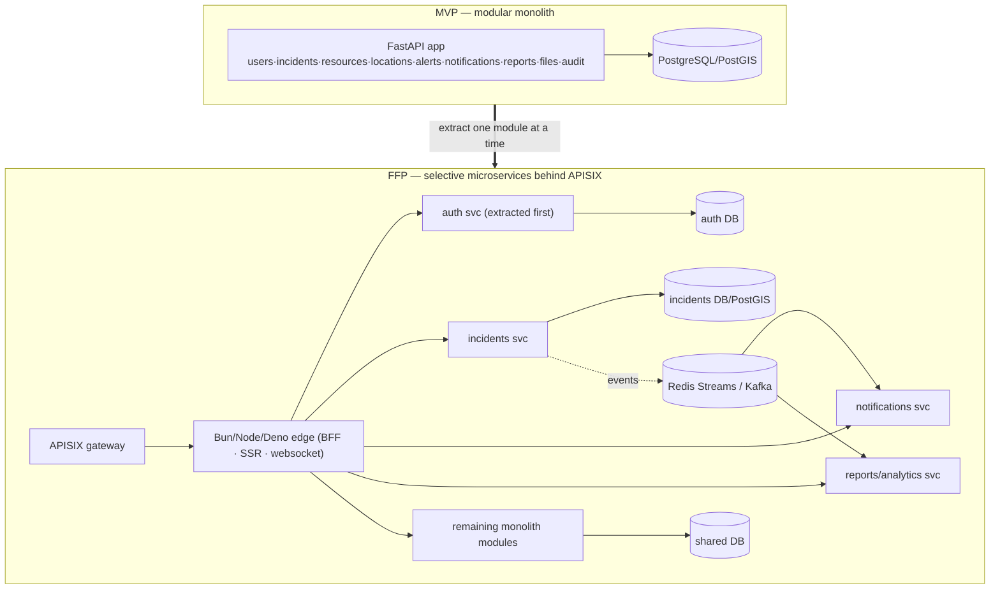

# IDRM FFP — Enterprise Architecture (Selective Microservices)

> *Type: Document (specification) · Audience: novice → architect · Status: FFP — next-phase (planned)*
> *Extends the MVP architecture [`../idrm-mvp-docs/20-architecture-system.md`](../mvp/20-architecture-system.md). Generated from the [FFP CO-STAR prompt](prompts/IDRM%20FFP%20Architecture%20-%20CO-STAR%20Prompt.md); consolidates the microservices/gateway/React material from `v2/21-architecture-corrected-final.md`, `v3/21-hld`, `82-api-gateway`, `92-migration-to-microservices`, `31-design-backend`.*

> **The one idea:** the FFP is the MVP monolith **evolved into selective microservices** — extract one
> module at a time, **only** when scale / ownership / deploy-independence / performance / reliability demands
> it — **never a rewrite**. The **public API contract and module boundaries are preserved** throughout.

> **FFP acronyms (expanded once):** **APISIX** = the API gateway (front door: routing, auth, rate-limit, TLS,
> WAF) · **BFF** = Backend-for-Frontend (a thin per-client edge service) · **Strangler Fig** = a migration
> pattern that grows the new system around the old and retires it piece by piece · **HA** = High Availability ·
> **K8s** = Kubernetes (container orchestration) · **SPA** = Single-Page Application.

---

## 1. FFP vs MVP at a glance

| Concern | MVP | FFP |
|---|---|---|
| Shape | one FastAPI **modular monolith** | **selective microservices** (extracted from the same modules) |
| Front door | uvicorn (+ light TLS proxy) | **APISIX** API gateway (plugins) |
| Edge | — | **Bun / Node / Deno** BFF/SSR/websocket services **behind** APISIX |
| Web | HTML + Tailwind + JS | **React SPA** (same API) |
| Mobile | — | **React Native / Expo** (same API) |
| Runtimes | Python | **polyglot** — Java/Go/JS for hot paths; **Python kept** for prototyping + DS/ML |
| Async | inline + retry | **Redis Streams → RabbitMQ/Kafka**, workers/queues |
| Data | one PostgreSQL/PostGIS | **per-service ownership** + replication (PostGIS still system of record) |
| Deploy | native systemd | **Docker → Swarm/Kubernetes**, CI/CD, HA |
| Files | single MinIO | **distributed MinIO / cloud S3** (same S3 API) |

## 2. Triggers — why move from monolith to services
A module becomes a service **only** when at least one holds: **scale** (a hot path needs independent
horizontal scaling), **team ownership** (a team needs autonomous deploys), **deploy independence** (release
cadence differs), **performance** (needs a different runtime, e.g. Go/Java), or **reliability** (fault
isolation). No trigger → it stays in the monolith. Each extraction = **one ADR** ([`21-architecture-decisions.md`](21-architecture-decisions.md)).

## 3. Monolith → services evolution

## 4. The APISIX gateway
APISIX is the FFP **API gateway** — a single, policy-driven front door. Its plugins deliver **all NGINX
reverse-proxy capabilities and more**:

| Concern | APISIX plugin/role |
|---|---|
| Reverse proxy / routing | upstreams + route matching to services |
| TLS termination | SSL/cert management (Let's Encrypt/ACME) |
| Authentication | `openid-connect`, `jwt-auth`, `key-auth` (verifies the MVP's RS256 tokens) |
| Authorization | `authz-*` / opa integration (ABAC) |
| Rate limiting | `limit-req` / `limit-count` (per-consumer) |
| Caching | `proxy-cache` |
| Load balancing | round-robin / ewma across service instances |
| Observability | `prometheus`, `opentelemetry`, access logs |

Clients always call the **same public `/api/v1` paths**; APISIX routes them to the right service (or the
monolith for not-yet-extracted modules). **Bun/Node/Deno edge services sit *behind* APISIX** for BFF,
SSR, and websocket/real-time concerns — they are **not** the gateway.

## 5. Clients reuse the same contract
The **React web SPA** and **React Native/Expo** apps consume the **exact same `/api/v1` endpoints** the MVP
defined (URIs never change — [MVP ADR-003](../mvp/21-architecture-decisions.md)). No server change
is needed to add a client; a BFF edge service may compose calls for a specific client without altering the
public contract. Details in [`60-uidesign-frontend.md`](60-uidesign-frontend.md).

## 6. Polyglot service runtimes
Runtime diversity is a **resilience/backup strategy**, adopted **per service, as justified**:

| Runtime | Used for | Why |
|---|---|---|
| **Python** (kept) | prototyping, DS/ML, geospatial, most services | speed of change, ecosystem |
| **Go** | high-throughput hot paths (gateway-adjacent, matching) | concurrency, low latency |
| **Java** | heavy transactional/integration services | maturity, throughput |
| **JS (Bun/Node/Deno)** | edge/BFF/SSR/websocket | client-facing real-time |

All services keep the **same public API contract** and shared data conventions (snake_case, UUID, ISO-8601,
enums) so they interoperate.

### 6.1 Representative service decomposition (concrete)
A workable first decomposition — consolidated from v2's "corrected-final" design, **reframed to APISIX** (v2
used an NGINX + Bun gateway; the FFP gateway is APISIX, with Bun/Node/Deno as edge behind it):

| Service | Owns | Notes |
|---|---|---|
| **Auth / identity** | users, sessions, tokens | extracted **first** (least-coupled) |
| **Service management** | incidents + lifecycle, assignments | the core domain service |
| **Geospatial** | maps, tiles, spatial queries | **Python** service (see 6.2) |
| **Analytics / reports** | dashboards, metrics, exports | read-model/event consumer |
| **Notifications** | SMS / email / push dispatch | event consumer + workers |

### 6.2 Geospatial service — Python, not Java GeoServer
The FFP's answer to the charter's "dedicated tile/GIS server if needed" is a **Python FastAPI +
GeoPandas / Shapely** service over PostGIS — **not** Java GeoServer (heavier runtime, more config). It
serves: WMS-like **raster tiles** (`/geo/tiles/{z}/{x}/{y}.png`), WFS-like **features** (GeoJSON),
**spatial queries** (nearby / within / cluster via `ST_DWithin` / `ST_ClusterKMeans`), and **Mapbox-GL
styles**. It runs behind APISIX like any service; **PostGIS stays the system of record**. *(This keeps the
MVP's "PostGIS in the DB" decision and scales it out only when map load demands a dedicated service.)*

## 7. Data across services
PostGIS stays the **system of record**. As services extract, each owns its data (**database-per-service**);
cross-service reads use **events + projections** (eventual consistency), never direct table access. Redis is
a cache/stream — never the source of truth. Full model in [`50-data-model.md`](50-data-model.md).

## 8. Messaging
Start with **Redis Streams** (light event flows, background work); graduate to **RabbitMQ/Kafka** when
durability, fan-out, replay, or throughput demand it. Workers/queues handle async work (notifications,
analytics, media pipeline). Full patterns in [`81-ops-messaging-and-async.md`](81-ops-messaging-and-async.md).

## 9. Containerisation & orchestration
Services are **containerised (Docker)**, orchestrated with **Docker Swarm** first (simpler) then
**Kubernetes** at scale; CI/CD, autoscaling, rolling deploys, HA. Full detail in
[`80-ops-platform-and-deployment.md`](80-ops-platform-and-deployment.md).

## 10. Security & observability at scale
Zero-trust behind the gateway; **OIDC/SSO, MFA, ABAC**; secrets vault; mTLS between services. Full
logs/metrics/traces + **domain-health** signals (active/critical incidents, unacked tasks, GIS freshness).
See [`22-architecture-security-and-iam.md`](22-architecture-security-and-iam.md) and the ops docs.

## 11. Migration roadmap
Phased per [`11-requirements-scope-and-roadmap.md`](11-requirements-scope-and-roadmap.md): harden → rich
clients → multi-agency (extract auth) → federation (more services + brokers + K8s) → decision support →
enterprise. Least-coupled module first; contract preserved at every step.

---

## GenAI Visual / Poster Prompts (≥5)
1. **"Monolith → Microservices"** — the MVP box evolving into services behind an APISIX gateway; arrow labelled "one module at a time, on trigger."
2. **"APISIX Front Door"** — a gateway with plugin chips (TLS, auth, rate-limit, cache, LB, observability) routing to services + the monolith.
3. **"One Contract, Many Clients"** — HTML/React/React-Native all calling the same `/api/v1`.
4. **"Polyglot Resilience"** — services in Python/Go/Java/JS around a shared contract, captioned "runtime diversity = backup strategy."
5. **"Event Backbone"** — incidents service emitting events via Redis Streams/Kafka to notifications & analytics.

## FFP architectural principles
- **Evolution, not rewrite.** · **Preserve the public API contract.** · **One trigger, one ADR per addition.**
- **Extract least-coupled first.** · **PostGIS stays the system of record.** · **Runtime diversity for resilience.**
- **Zero-trust behind the gateway.** · **Observable by default.**

---

*Related:* [`25-module-elucidation.md`](25-module-elucidation.md) · [`26-conformance-pics.md`](26-conformance-pics.md) · [`21-architecture-decisions.md`](21-architecture-decisions.md) · [`40-api-specification.md`](40-api-specification.md) ·
[`50-data-model.md`](50-data-model.md) · [`81-ops-messaging-and-async.md`](81-ops-messaging-and-async.md) ·
MVP arch [`../idrm-mvp-docs/20-architecture-system.md`](../mvp/20-architecture-system.md).
