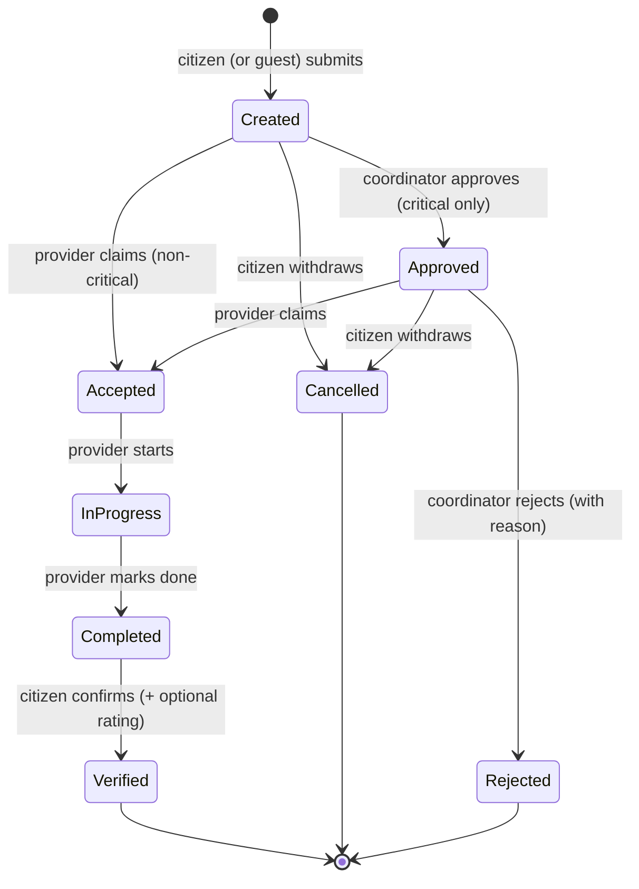

# IDRM MVP — Scope & Acceptance Criteria

> *Type: Document (specification) · Audience: product, developers, testers · Status: MVP — current*
> *Consolidated from [`10-requirements-prd.md`](10-requirements-prd.md) (the source of truth) and the archived v3 Functional Specification (`../idrm-docs-v3/docs/11-requirements-functional-spec.md`), trimmed to MVP size. Capabilities larger than the MVP are recorded as **→ FFP** and captured in the [FFP charter](../ffp/prompts/instructions_idrm_ffp_docs.md).*

> **What this document is:** the PRD says *what IDRM must do and why*. This document says **exactly
> what "MVP complete" means** — what is in, what is out, and, for every in-scope capability, the
> **testable acceptance criteria** that decide pass or fail. It is kept separate from the PRD on
> purpose, so scope cannot quietly creep. It states behaviour, **not** technology (the stack lives in
> [`20-architecture-system.md`](20-architecture-system.md); security specifics in
> [`22-architecture-security-and-iam.md`](22-architecture-security-and-iam.md)).

---

## 1. How to read this document

Each in-scope capability is written as a **chain**:

> **Feature → Requirement → Acceptance Criteria → Test**

- **Feature** — a user-facing capability, with its PRD requirement ID(s) and priority.
- **Acceptance Criteria** — written as **Given / When / Then** so they are unambiguous and testable.
- **Test** — the kind of automated test that will prove it (see [`70-quality-test-strategy.md`](70-quality-test-strategy.md)):
  **Unit** (a single function/rule), **API** (an endpoint's contract), **Integration** (a flow through
  the database, e.g. PostGIS proximity or the request lifecycle).

**Priority legend:** 🔴 Essential (MVP fails without it) · 🟠 Important (MVP ships with it, but a small
gap is survivable).

*(The Given/When/Then style is standard **BDD** — Behaviour-Driven Development — phrasing: it states a
starting situation, an action, and the expected outcome so a test can check it exactly.)*

> **Conformance twin:** each acceptance criterion below is also captured as a checkable, signed-off row in
> [`26-conformance-pics.md`](26-conformance-pics.md) (the build gate); the module-level *what/why/how* behind
> these features is in [`25-module-elucidation.md`](25-module-elucidation.md).

---

## 2. In scope — the MVP

The MVP is **one responsive web platform** (works on an ordinary smartphone) with **three role-based
views**. In scope:

- **Accounts & access** — registration and login; **guest emergency** request submission; three roles
  with role-based access control.
- **Help requests** — a citizen creates a request with a **map location**, **service type**
  (e.g. RESCUE, FOOD, MEDICAL), **priority**, and description.
- **Map** — an interactive map showing open requests and available providers/resources.
- **Discover & claim** — a provider sees nearby requests, **filters** them, and **claims** one
  (exactly one provider per request — no duplicates).
- **Lifecycle** — status is tracked end-to-end: created → *(approved, if critical)* → accepted →
  in-progress → completed → verified, with **cancelled** / **rejected** exits (§4).
- **Notifications** — SMS/email on key status changes.
- **Track, verify & rate** — the citizen follows their request in near-real-time and confirms/rates it.
- **Coordinator dashboard** — live overview, **approve/reject critical** requests, monitor response
  times, manage organizations.
- **Audit log** — significant actions are recorded.
- **Basic reports** — response time and fulfilment, with export.
- **Multi-language ready** — English + at least one regional language at MVP.

## 3. Out of scope — deferred to the FFP

Explicitly **not** in the MVP (recorded so nothing is lost — see the
[FFP charter](../ffp/prompts/instructions_idrm_ffp_docs.md)):

| Out of scope (MVP) | Why it waits | Where it goes |
|---|---|---|
| **Full role hierarchy** (Volunteer, Organizer, Manager, Executive, Event Admin, Auditor, System Admin) | MVP needs only citizen / provider / coordinator-admin | FFP IAM |
| **Money & donations** (donation recording, fund allocation, financial reports, Auditor role) | MVP coordinates *help*, not *funds* | FFP |
| **Disputed** state and **automatic Close** | MVP lifecycle stays lean and human-verified | FFP |
| **Per-request privacy levels** (Public / Protected / Private) | MVP protects data via role-based access instead | FFP |
| **"Disaster Event" entity** (declare event, draw affected zone, auto-link, area calc) | MVP is request-centric | FFP |
| AI/automated matching · native mobile apps · rich SPA · national rollout · advanced analytics · full 12-language localization · WhatsApp/voice/IVR intake · deep real-time push | PRD §13 deferrals | FFP |

These are **confirmed deferrals** (2026-08-12), not rejections.

---

## 4. The request lifecycle (authoritative for the MVP)

Every help request moves through this lifecycle. It is the lean MVP version of the PRD business rules;
the richer v3 states (Disputed, auto-Close) are **→ FFP**.

| State | Meaning | Who advances it | Allowed next |
|---|---|---|---|
| **created** | Submitted; awaiting a provider (non-critical) or coordinator approval (critical) | — | approved · accepted · cancelled |
| **approved** | A **critical** request cleared by a coordinator; now claimable | coordinator | accepted · rejected · cancelled |
| **accepted** | Claimed by **exactly one** provider | provider | in-progress |
| **in-progress** | Provider is delivering the service | provider | completed |
| **completed** | Provider marked the work done | citizen | verified |
| **verified** | Citizen confirmed completion (and may rate) | — (terminal) | — |
| **cancelled** | Citizen (or coordinator) withdrew it before delivery | citizen / coordinator | — (terminal) |
| **rejected** | Coordinator declined a critical request, with reason | coordinator | — (terminal) |

**Lifecycle rules (source: PRD §10 business rules):**
- A **critical** request requires **coordinator approval** before it can be accepted.
- A request is **claimed by one provider at a time** — no duplicate fulfilment.
- States are **not skipped**; a request cannot be deleted once accepted (it can only reach a terminal
  state). History is preserved for audit.
- **Emergency/guest** requests are allowed (life-safety over friction).

---

## 5. Feature → Requirement → Acceptance → Test

### F1 · Accounts & access — 🔴 Essential
*Requirement: **FR-1** (register/authenticate; guest emergency submission), **FR-9** (role-based access).*

- **AC-1.1 — Registration.** *Given* a new visitor with a unique email, *when* they register with the
  required details, *then* an account is created for a valid role and they can subsequently sign in.
- **AC-1.2 — Duplicate email rejected.** *Given* an email already registered, *when* someone tries to
  register with it again, *then* the system refuses and explains why.
- **AC-1.3 — Login / logout.** *Given* valid credentials, *when* a user signs in, *then* they receive an
  authenticated session; *when* they sign out, *then* the session is no longer usable.
- **AC-1.4 — Guest emergency request.** *Given* an unregistered person in an emergency, *when* they
  submit a request as a guest, *then* the request is accepted (life-safety) even without an account.
- **AC-1.5 — Role-based access.** *Given* a signed-in user, *when* they attempt an action their role does
  not permit (e.g. a citizen approving a critical request), *then* the system denies it. *(Full
  role→permission→endpoint matrix lives in [`22-architecture-security-and-iam.md`](22-architecture-security-and-iam.md).)*
- **Tests:** Unit (email-uniqueness, role checks) · API (register/login/logout, guest submit) · Integration (guest request reaches the map).

### F2 · Create a help request — 🔴 Essential
*Requirement: **FR-2**.*

- **AC-2.1 — Required fields.** *Given* a citizen (or guest), *when* they create a request, *then* it
  must carry a **map location**, a **service type**, a **priority**, and a description before it can be
  submitted.
- **AC-2.2 — Valid values.** *Given* a request being created, *when* the service type or priority is not
  one of the allowed values, *then* the system rejects it with a clear message.
- **AC-2.3 — Location captured.** *Given* the map, *when* the citizen drops a pin (or uses detected
  location), *then* the request stores those coordinates for later proximity search.
- **AC-2.4 — Confirmation.** *Given* a valid submission, *when* it is saved, *then* the request enters
  **created** state, gets an identifier, and the requester sees a confirmation.
- **Tests:** Unit (field & enum validation) · API (create endpoint, 201 + error cases) · Integration (created request is queryable and appears on the map).

### F3 · Interactive map — 🔴 Essential
*Requirement: **FR-3**.*

- **AC-3.1 — Requests on the map.** *Given* open requests exist, *when* a user opens the map, *then* each
  is shown as a marker distinguished by **priority**.
- **AC-3.2 — Providers/resources on the map.** *Given* available providers/resources, *when* the map
  loads, *then* they are shown with a distinct marker.
- **AC-3.3 — Role-scoped view.** *Given* the viewer's role, *when* the map loads, *then* it shows only
  what that role may see (a citizen sees their own request; a provider sees claimable nearby requests; a
  coordinator sees all).
- **Tests:** API (map-data endpoints return role-scoped sets) · Integration (markers reflect real DB state).

### F4 · Discover, filter & claim — 🔴 Essential
*Requirement: **FR-4**.*

- **AC-4.1 — Nearby requests.** *Given* a provider at/for a location, *when* they open the request list,
  *then* they see open requests **near** them (proximity search), nearest first.
- **AC-4.2 — Filter.** *Given* a list of requests, *when* the provider filters by **service type** and/or
  **priority**, *then* only matching requests remain.
- **AC-4.3 — Claim once.** *Given* an open request, *when* a provider claims it, *then* it moves to
  **accepted** and is bound to that one provider.
- **AC-4.4 — No double-claim.** *Given* a request already accepted, *when* a second provider tries to
  claim it, *then* the system refuses (no duplicate fulfilment) and tells them it is taken.
- **AC-4.5 — Capacity/type.** *Given* a provider, *when* they view claimable requests, *then* they see
  only requests matching their **service type** (and are not offered work beyond their capacity).
- **Tests:** Unit (single-claim rule, filter logic) · API (list + claim endpoints, conflict on double-claim) · Integration (PostGIS proximity; concurrent claim resolves to exactly one winner).

### F5 · Update status & complete — 🔴 Essential
*Requirement: **FR-5**.*

- **AC-5.1 — Start work.** *Given* an accepted request, *when* its provider marks it started, *then* it
  moves to **in-progress**.
- **AC-5.2 — Complete.** *Given* an in-progress request, *when* the provider marks it done, *then* it
  moves to **completed** and the citizen is prompted to verify.
- **AC-5.3 — Legal transitions only.** *Given* any request, *when* a transition is attempted that the
  lifecycle (§4) does not allow, *then* the system refuses and the state is unchanged.
- **AC-5.4 — Only the assigned provider.** *Given* an accepted request, *when* a provider **other than**
  the one who claimed it tries to update it, *then* the system denies it.
- **Tests:** Unit (state-machine transition table) · API (status-update endpoint, illegal transition rejected) · Integration (full created→verified walk).

### F6 · Notifications — 🟠 Important
*Requirement: **FR-6**.*

- **AC-6.1 — Notify on key changes.** *Given* a request changes state at a key point (accepted,
  completed, verified; critical approved/rejected), *when* the change is saved, *then* a notification
  (SMS/email) is dispatched to the relevant party.
- **AC-6.2 — Right recipient.** *Given* a status change, *when* the notification is created, *then* it
  targets the correct person (requester and/or assigned provider), not others.
- **AC-6.3 — Failure is non-blocking.** *Given* the messaging channel is temporarily unavailable, *when*
  a notification cannot be sent, *then* the state change still succeeds and the failure is recorded for
  retry (near-real-time is acceptable — deep push infrastructure is **→ FFP**).
- **Tests:** Unit (recipient selection) · API/Integration (state change enqueues exactly one notification; channel outage does not roll back the change).

### F7 · Track, verify & rate — 🔴 Essential
*Requirement: **FR-7**.*

- **AC-7.1 — Track.** *Given* a citizen's own request, *when* they open it, *then* they see its current
  state and history in near-real-time.
- **AC-7.2 — Verify.** *Given* a completed request, *when* the citizen confirms it, *then* it moves to
  **verified**.
- **AC-7.3 — Rate.** *Given* a request being verified, *when* the citizen adds a rating, *then* the rating
  is stored against the request/provider. Rating is **optional** — verification succeeds without it.
- **Tests:** API (track + verify endpoints) · Integration (state reaches verified; rating persisted).

### F8 · Coordinator dashboard & critical approval — 🔴 Essential
*Requirement: **FR-8**.*

- **AC-8.1 — Live overview.** *Given* a coordinator, *when* they open the dashboard, *then* they see all
  current requests with status and basic response-time information.
- **AC-8.2 — Approve critical.** *Given* a **critical** request in **created**, *when* the coordinator
  approves it, *then* it moves to **approved** and becomes claimable by providers.
- **AC-8.3 — Reject critical.** *Given* a critical request awaiting approval, *when* the coordinator
  rejects it **with a reason**, *then* it moves to **rejected** (terminal) and the requester is notified.
- **AC-8.4 — Manage organizations.** *Given* a coordinator/admin, *when* they add or update a provider
  organization, *then* the change takes effect and is recorded.
- **Tests:** API (dashboard data, approve/reject, org management — all role-gated) · Integration (approval unblocks claiming; rejection closes the request).

### F9 · Audit log — 🔴 Essential
*Requirement: **FR-10**.*

- **AC-9.1 — Significant actions recorded.** *Given* a significant action (login, request create/claim/
  status-change, critical approve/reject, org/role change), *when* it happens, *then* an audit entry is
  written with who, what, when, and the affected item.
- **AC-9.2 — Append-only.** *Given* an existing audit entry, *when* any user attempts to edit or delete
  it, *then* the system does not allow it. *(Retention specifics live in [`22-architecture-security-and-iam.md`](22-architecture-security-and-iam.md).)*
- **Tests:** Unit (audit-writer) · API/Integration (a lifecycle action produces a matching immutable audit row).

### F10 · Basic reports — 🟠 Important
*Requirement: **FR-11**.*

- **AC-10.1 — Core metrics.** *Given* recorded activity, *when* a coordinator runs a report, *then* it
  shows at least **average response time** and **fulfilment rate** for a chosen period/area.
- **AC-10.2 — Export.** *Given* a generated report, *when* the coordinator exports it, *then* they receive
  a downloadable file of the same figures.
- **Tests:** Unit (metric calculations against known data) · API (report + export endpoints).

### F11 · Multi-language ready — 🟠 Important
*Requirement: **FR-12**.*

- **AC-11.1 — Two languages at MVP.** *Given* the interface, *when* a user selects the supported regional
  language, *then* core screens render in it (English + at least one regional language).
- **AC-11.2 — No hard-coded copy.** *Given* the UI, *when* a new language is added later, *then* it
  requires only translations — user-facing text is externalised, not baked into code. (Full 12-language
  localization is **→ FFP**.)
- **Tests:** Unit (copy resolves through the message catalogue, no literals) · manual/UI check for the second language.

---

## 6. Non-functional acceptance (MVP intent)

These come from PRD §9. They are **intent-level** at MVP; precise budgets are set in the architecture and
test-strategy docs.

| NFR | Acceptance intent (MVP) |
|---|---|
| **NFR-2 Performance** | Core actions (open map, create request, claim) remain usable on a basic smartphone / low bandwidth. Concrete latency budgets → [`70-quality-test-strategy.md`](70-quality-test-strategy.md). |
| **NFR-3 Security & privacy** | Access is role-gated; personal/location data is not exposed to those without permission; significant actions are audited. Details → [`22-architecture-security-and-iam.md`](22-architecture-security-and-iam.md). |
| **NFR-4 Usability** | A stressed, non-technical citizen can file a request in **minimal steps** (map-first). |
| **NFR-5 Accessibility** | Core flows are keyboard-navigable and screen-reader-labelled (**WCAG 2.2 AA**-aligned; WCAG = Web Content Accessibility Guidelines). |
| **NFR-6 Reliability & integrity** | No request is lost or duplicated; the lifecycle (§4) is always consistent. |

---

## 7. Definition of Done

**A feature is done when:**
- Its acceptance criteria (§5) each have at least one passing automated test of the stated type.
- Illegal/edge inputs are handled (validation, illegal transitions, permission denials).
- Role-based access is enforced for every new endpoint it adds.
- Significant actions it introduces are audited.
- The change is reviewed, and the relevant MVP doc(s) updated.

**The MVP is done when:**
- Every 🔴 **Essential** feature (F1–F5, F7–F9) is complete by the above bar.
- The 🟠 **Important** features (F6, F10, F11) are complete or have an explicitly accepted, documented gap.
- The request lifecycle (§4) works end-to-end — **created → verified** — for the initial region, with
  guest emergency submission working.
- Non-functional intent (§6) is met, and a security review of access control + audit has passed.
- Out-of-scope items (§3) remain out — nothing from the FFP list crept in.

*(This operationalises the PRD's success targets in §12 — 2 states / 50+ districts, response ~12h→~2h,
fulfilment ~60%→~80% — which are measured in the field once the MVP is live.)*

---

*Related MVP documents:* [`10-requirements-prd.md`](10-requirements-prd.md) ·
[`20-architecture-system.md`](20-architecture-system.md) ·
[`25-module-elucidation.md`](25-module-elucidation.md) · [`26-conformance-pics.md`](26-conformance-pics.md) (conformance twin) ·
[`40-api-specification.md`](40-api-specification.md) · [`50-data-model.md`](50-data-model.md) ·
[`22-architecture-security-and-iam.md`](22-architecture-security-and-iam.md) ·
[`70-quality-test-strategy.md`](70-quality-test-strategy.md).
Plan: [`prompts/instructions_idrm_mvp_docs.md`](prompts/instructions_idrm_mvp_docs.md).
