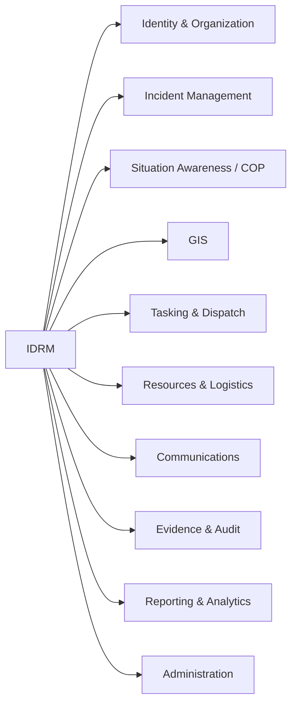
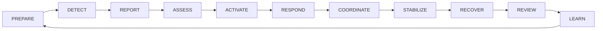

# IDRM MVP — Business Domain, Capability & Operating Model

> *Type: Document (specification) · Audience: product, domain analysts, architects, all stakeholders · Status: MVP — current*
> *The **domain framing** the rest of the specs assume: what capabilities IDRM provides, and the disaster
> operating model they serve. Sits between the PRD ([`10-requirements-prd.md`](10-requirements-prd.md)) and the
> architecture ([`20-architecture-system.md`](20-architecture-system.md)). Source: documentation blueprint §5.*

> **Why this doc exists (T1 gap):** the PRD says *what to build* and the architecture says *how*; this says
> *what business the software is in* — the capabilities and the real-world operating cycle — so every module and
> requirement traces back to a capability and a lifecycle phase.

---

## 1. Business Capability Model

A **capability** is *what* the organisation can do, independent of *how* it's implemented. IDRM's ten core
capabilities (each realised by one or more modules — see [`20-architecture-system.md`](20-architecture-system.md)):

| # | Capability | What it means | MVP module(s) | MVP depth |
|---|-----------|---------------|---------------|-----------|
| 1 | Identity & Organization | who users are, their roles/orgs | users, administration | Full (RBAC, 4 roles + guest) |
| 2 | Incident Management | capture → resolve help requests | incidents | **Core** (8-state lifecycle) |
| 3 | Situation Awareness / COP | shared live picture | incidents + locations + UI map | Basic COP (map + list) |
| 4 | GIS | spatial data & queries | locations (PostGIS) | Full (native PostGIS) |
| 5 | Tasking & Dispatch | assign work to responders | incidents (assignment) | Basic (human-driven) |
| 6 | Resources & Logistics | inventory & allocation | resources | Basic (human matching) |
| 7 | Communications | alerts & notifications | alerts, notifications | Basic (in-app) |
| 8 | Evidence & Audit | tamper-evident record | files, audit | Full (audit trail; MinIO uploads) |
| 9 | Reporting & Analytics | operational reporting | reports | Basic (MVP metrics) |
| 10 | Administration | manage the system | administration | Basic |

*(AI matching, deep analytics, multi-channel comms, per-request privacy = capability depth reserved for **FFP**.)*

> *Acronyms used above: **COP** = Common Operational Picture (one shared, live view of the situation everyone
> works from) · **GIS** = Geographic Information System (software for map/location data) · **RBAC** = Role-Based
> Access Control (permissions attached to a role).*

---

## 2. The Disaster Operating Model (lifecycle)

Capabilities exist to serve the real-world disaster cycle. IDRM frames its work against this operating model:

**MVP focus (deepest support):** **Detect → Assess → Respond → Coordinate → Stabilize** — while preserving
enough structure (audit, reporting) for Recover and Review/Learn. Prepare and deep Recover are lightly supported
in the MVP and grow in FFP.

| Phase | What happens | IDRM support (MVP) |
|-------|--------------|--------------------|
| Prepare | readiness, plans | light (out of MVP focus) |
| Detect / Report | a need is identified & reported | citizen creates an **incident** |
| Assess | triage severity | `service_type` + `priority`; critical → approval |
| Activate / Respond | mobilise responders | provider **accepts** → **in_progress** |
| Coordinate | direct effort, allocate | coordinator assigns; resources module |
| Stabilize | need met | **completed** → **verified** |
| Recover | longer-term rebuild | light (FFP) |
| Review / Learn | after-action | audit trail → reporting; drills |

---

## 3. Capability ↔ lifecycle map (how they meet)

The [incident lifecycle](../../archive/instructions/domain.md) (`created → … → verified`) is the **operating model made
executable**: each state advances the disaster cycle. Capabilities 2–6 carry the Respond→Stabilize core;
capabilities 1, 8, 10 are cross-cutting (identity, evidence, admin); 3, 7, 9 provide awareness, comms, and
learning.

---

## 4. Standards alignment (T3)

The operating model aligns with recognised emergency-management practice:
- **ISO 22320** (emergency management / incident response) — clear command/coordination roles, structured
  information flow, and interoperability between responders. IDRM's coordinator/admin chain, audit trail, and
  the incident lifecycle realise these.
- **ICS (Incident Command System)** principles — unity of command, span of control — inform the role model
  ([incident-command guide](../../guides/mvp/learn/incident-command-101.md)). *(NIMS is the US framework that
  standardises ICS; IDRM is India-based on the **NDMA** (National Disaster Management Authority) / Disaster Management Act 2005 chain — NIMS is cited for
  structure only, not as the governing regime.)*

Full standards map + owners: [`13-requirements-traceability-matrix.md`](13-requirements-traceability-matrix.md) §4.

## 5. Traceability & follow-up

- Every **requirement** ([`11-requirements-scope-and-acceptance.md`](11-requirements-scope-and-acceptance.md))
  should map to a **capability** here and a **lifecycle phase** — captured in the
  [`13-requirements-traceability-matrix.md`](13-requirements-traceability-matrix.md).
- Capability **ownership** (one Accountable owner each) is in
  [`90-governance-and-raci.md`](90-governance-and-raci.md).
- FFP delta (planned): capability depth increases (AI matching, decision support, national COP) — see
  [`../idrm-ffp-docs/11-requirements-scope-and-roadmap.md`](../ffp/11-requirements-scope-and-roadmap.md).

*Related:* [`10-requirements-prd.md`](10-requirements-prd.md) · [`20-architecture-system.md`](20-architecture-system.md) ·
[`25-module-elucidation.md`](25-module-elucidation.md) · [`26-conformance-pics.md`](26-conformance-pics.md) ·
domain quick-reference [`../instructions/domain.md`](../../archive/instructions/domain.md).
