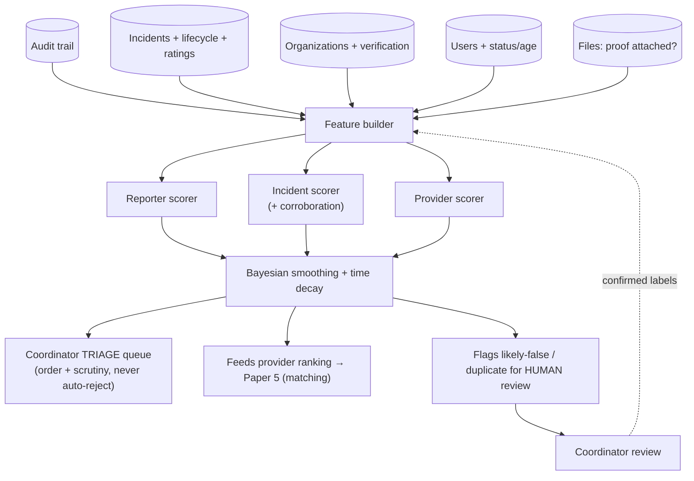

# White Paper 3 — Anomaly-Detection Engine #2: Credibility Assessment (reporters · incidents · providers)

> *Type: White paper (design-now / build-FFP) · Audience: complete novices → ML/trust-&-safety engineers &
> coordinators · Status: engine → FFP; MVP seam shipped.*
> *Scores the trustworthiness of the three actors in a request. MVP seams: the append-only **audit trail**, org
> **verification**, the incident **lifecycle + ratings**, and **completion-proof** files. Hub: [`README.md`](README.md).*

---

## 1. The problem (in plain language)

Not every report is genuine, and not every provider is reliable. In a disaster this matters twice over: a **false
report** wastes a rescue team that a real victim needed, and an **unreliable provider** who accepts a request but
never delivers leaves someone stranded. **Credibility assessment** is the engine that answers three questions from
*observed history*, so coordinators can triage wisely:

1. **Reporter credibility** — *is this person likely reporting truthfully?* (Have their past reports checked out?)
2. **Incident credibility** — *is this specific request likely real?* (Is it corroborated, complete, plausible?)
3. **Provider reliability** — *does this organization actually deliver when it accepts?*

One term first: **reputation** here means *a score summarising an actor's track record* — earned from what they've
actually done, not who they are.

> **The overriding rule (the theme of every paper in this hub):** **a low credibility score triggers *scrutiny*,
> never *refusal*.** Dismissing a real emergency as "not credible" is a **false negative** (*missing a true case*),
> and in a disaster a false negative can be fatal. So credibility changes the **order and depth of human review and
> the ranking of providers** — it *never* auto-rejects a person's plea for help. Everyone gets help; the score only
> decides *how carefully and how fast we look*.

---

## 2. Where it fits — the MVP seam (already shipped)

The MVP already records every ingredient this engine needs — it just doesn't *score* them yet:

- **Org verification** — `organizations.is_verified` / `verified_by` (a coordinator's human trust decision).
- **Incident outcomes** — the 8-state lifecycle: an incident ending `verified` is a *confirmed-genuine* signal;
  `rejected` is a *false/unsubstantiated* signal; `cancelled` is ambiguous. Plus `rating`/`review` on completion.
- **Timeline & response** — `incident_updates` gives who did what, when (so we can measure provider speed).
- **Completion proof** — `files` (an `incident_photo` / `completion_proof`) is evidence a job was really done.
- **The append-only audit trail** — [`../../services/monolith/app/modules/audit`](../../services/monolith/app/modules/audit) is the tamper-
  evident history the scores are computed from.
- **Account signals** — `users.status`, `email_verified`, account age.

The FFP engine **reads** these and emits three reputation scores. Nothing in the MVP schema changes; the scores are
a new, additive layer.

---

## 3. Data inputs

| For | Signal | Source | Reads as… |
|---|---|---|---|
| **Reporter** | verified-vs-rejected report ratio, duplicate/false rate, account age, email-verified | incidents, users | a track record of truthful reporting |
| **Reporter** | corroboration (independent reports of the same event/area) | incidents (spatial/time) | many voices → likely real |
| **Incident** | reporter's score, completeness (photo? precise location?), plausibility (time/place) | incidents, files | is *this* request well-formed and likely real |
| **Incident** | did it pass coordinator approval? | lifecycle | a human already sanity-checked critical ones |
| **Provider** | completion rate (accepted → completed/verified vs cancelled) | lifecycle | do they finish what they accept |
| **Provider** | average rating/review, response time, volume handled, disputes | incidents, updates | quality + reliability + experience |
| **Provider** | verification status | organizations | a baseline human trust decision |

No message content or sensitive personal attributes are used — only *behavioural outcomes* already in the system.

---

## 4. Method options + recommendation (the classical-first ladder)

### Tier 0 — manual/binary trust *(MVP today)*
Coordinators verify orgs (a yes/no flag); citizens rate providers 1–5; account status gates action. Human,
transparent, but coarse and unranked. The safe baseline.

### Tier 1 — transparent weighted reputation, smoothed & time-decayed *(recommended first build)*
A single, explainable 0–1 score per actor from the §3 signals, with two essential statistical corrections a novice
must understand:

- **Bayesian average (smoothing for small samples).** A provider with *one* 5-star rating should **not** outrank
  one with *two hundred* ratings averaging 4.8 — one data point is luck, not evidence. A **Bayesian average**
  blends each actor's own average toward the *global* average, weighted by how much data they have: little data →
  trust the global prior; lots of data → trust their own record. (The **Wilson score** is a related tool that gives
  a cautious lower-bound on a success rate.) This stops both lucky newcomers and unlucky ones from being mis-ranked.
- **Time decay.** Recent behaviour matters more than ancient behaviour; weight events so old ones fade. A provider
  who was great last year but unreliable lately shouldn't coast on old glory.
- **Corroboration boost for incidents.** Multiple independent reports of the same event/area raise that incident's
  credibility fast — the classic signal that something real is happening.

Each score ships with its **reasons** ("provider score 0.82: 47 completions, 4.7★, median response 22 min,
verified"). Because it's a weighted sum, you can always answer *"why?"* — which you must, since these are decisions
about people.

### Tier 2 — supervised models + trust propagation
Once labelled outcomes accumulate (verified-genuine vs rejected-false), train a **logistic regression** or
**gradient-boosted trees** to predict `P(genuine)` for a new incident — still explainable, cheap, and calibratable.
For the reporter↔incident↔provider network, **trust propagation** (a **PageRank**-style algorithm — *trust flows
along links, like web-page authority*) spreads credibility: reporters whose incidents are consistently verified by
reliable providers gain trust, and vice-versa.

### Tier 3 — graph & content credibility
At scale: **graph neural networks** for trust propagation and **collusion/fraud-ring detection** (rings of fake
accounts rating each other), plus *optional, carefully-bounded* content signals — NLP on descriptions or
**detection-only** image forensics on photos (consistent with the DPDP, *no biometric identity* stance of
[`../mvp/21-architecture-decisions.md`](../mvp/21-architecture-decisions.md) ADR-011). Reserve for proven need.

### At-a-glance comparison

| Tier | Method | Explainable? | Cost | Needs labels? | Best at |
|---|---|---|---|---|---|
| 0 | Manual verify + raw rating | total | ~0 | no | a human baseline |
| **1** | **Weighted reputation + Bayesian smoothing + time decay + corroboration** | **high** | **low** | **no** | **the recommended first build** |
| 2 | Logistic/GBT `P(genuine)` + PageRank trust propagation | medium | med | some | sharper, networked trust |
| 3 | GNN / fraud-ring / content forensics | low | high | mixed | collusion & content fakery at scale |

**Recommendation:** ship **Tier 1** (transparent, smoothed, decayed reputation for all three actors); add **Tier 2**
once you have labelled genuine/false outcomes; reserve **Tier 3** for coordinated fraud. Always human-in-the-loop.

---

## 5. Architecture

Note the outputs are all **decision-support**: a *triage order*, a *provider ranking*, and *review flags* — with a
human deciding, and their decisions feeding back as labels. No arrow leads to "auto-reject the citizen".

---

## 6. Privacy / DPDP

- **A reputation score is profiling of a person** → it falls squarely under DPDP Act 2023. Give **transparency**
  (a person can learn their score exists and roughly why), **contestability** (an appeal / correction path), and
  **human review** before any consequential use.
- **No sensitive or proxy attributes.** Score on *behaviour only* — never caste, religion, gender, wealth, or
  geography, and watch that behavioural features don't become *proxies* for them.
- **No permanent black marks.** Time-decay + the "scrutiny-not-refusal" rule prevent one bad episode (or a
  first-timer's thin record) from permanently locking someone out. New reporters start neutral, not guilty.
- **Guard against feedback loops.** If low-scored reporters get slower help, they may look "less real" later — an
  unfair spiral. Monitor fairness across new-vs-established users (§8) and correct for it.
- **Purpose limitation + audit.** Scores are used for triage/matching/fraud-review only, and every consequential
  action is written to the audit trail.

Cross-refs: [`../mvp/22-architecture-security-and-iam.md`](../mvp/22-architecture-security-and-iam.md);
[`../mvp/13-requirements-traceability-matrix.md`](../mvp/13-requirements-traceability-matrix.md) §4 (DPDP).

---

## 7. MVP-seam vs FFP-build

| Aspect | MVP (today) | FFP (the engine) |
|---|---|---|
| Reporter trust | account status + email-verified | **reputation score** from verified/rejected history + corroboration |
| Incident trust | coordinator approval (critical only) | **`P(genuine)`** with corroboration + completeness |
| Provider trust | `is_verified` flag + raw ratings | **smoothed, time-decayed reliability score** |
| Small-sample fairness | none (1 rating = 1 rating) | **Bayesian average / Wilson score** |
| Networked trust | none | **PageRank-style propagation** (Tier 2) |
| Use | manual coordinator judgement | triage order + provider ranking (Paper 5) + fraud flags |
| Governance | — | reasons, appeal, human review, audited |
| PICS row | (verification/rating rows exist) | a new `PICS-AD2-*` block when built |

**Trigger to build:** enough incident history to compute meaningful rates, *and* coordinator time lost to false/
duplicate reports or to unreliable providers.

---

## 8. Metrics (how we'll know it works)

| Metric | Plain meaning | Target direction |
|---|---|---|
| **False-report detection precision/recall** | catching false reports vs coordinator ground truth | ↑ |
| **False-suppression rate** | real emergencies wrongly deprioritised/flagged | **must be ≈ 0 — the dominant metric** |
| **Provider-score calibration** | do high scores actually predict good outcomes? (*calibration* = predicted ≈ observed) | tight |
| **Triage-time saved** | faster attention to likely-real, likely-severe cases | ↑ |
| **Fairness gap** | score/help disparity between new and established reporters | → 0 |
| **Appeal-overturn rate** | share of credibility decisions reversed on review | ↓ (high = mis-tuned) |

As in Papers 1–2, the **false-suppression rate** dominates: it is always safer to over-scrutinise a false report
than to under-serve a real victim. Fairness across new-vs-established reporters is tracked as a first-class number,
not an afterthought.

---

## References

- MVP seams: [`../../services/monolith/app/modules/audit`](../../services/monolith/app/modules/audit) (trail),
  [`../../services/monolith/app/modules/resources`](../../services/monolith/app/modules/resources) (org verification),
  [`../../services/monolith/app/modules/incidents`](../../services/monolith/app/modules/incidents) (lifecycle + ratings),
  [`../../services/monolith/app/modules/files`](../../services/monolith/app/modules/files) (completion proof).
- [`../mvp/21-architecture-decisions.md`](../mvp/21-architecture-decisions.md) (ADR-011, detection-not-biometric) ·
  [`../mvp/25-module-elucidation.md`](../mvp/25-module-elucidation.md) · [`../mvp/26-conformance-pics.md`](../mvp/26-conformance-pics.md).
- Feeds **Paper 5** (incident-notification routing / provider matching): [`5-recommender-incident-notification-routing.md`](5-recommender-incident-notification-routing.md).
- Hub + shared template: [`README.md`](README.md).
