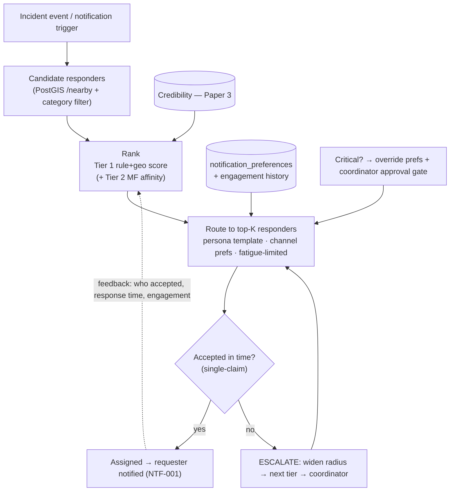

# White Paper 5 — Recommender System #2: Incident-Notification Routing (the operational matcher)

> *Type: White paper (design-now / build-FFP) · Audience: complete novices → ML engineers, ops & product ·
> Status: engine → FFP; MVP seam shipped.*
> *The **operational** recommender: match each incident to the best responder, and route each notification to the
> right person, persona & channel. Method backbone: the Zee recommender notebooks
> [`../../archive/analyses/notebooks/Zee_Recommender_System_Final.ipynb`](../../archive/analyses/notebooks/Zee_Recommender_System_Final.ipynb).
> Consumes credibility from [`3-credibility-assessment.md`](3-credibility-assessment.md). Hub: [`README.md`](README.md).*

---

## 1. The problem (in plain language)

Where Paper 4 pointed *money* at needs, this paper points *people and attention* at needs. It solves two linked
matching problems in disaster operations:

1. **Responder matching** — an incident arrives ("injured person, medical, critical, at these coordinates"). *Which
   provider organization should be notified/assigned?* The best answer balances **who is nearest, capable,
   available, and trustworthy** — and who tends to actually show up.
2. **Notification routing** — someone needs to be told something. *Who* (which person, in which **persona/role**),
   through *which channel* (in-app, email, SMS), *how urgently*, and *without drowning them in noise*?

Both are **recommendation** problems (ranking the best option from many), and both fail in two opposite, dangerous
ways — which gives this paper its governing rule:

> **The overriding rule:** **avoid both under-response and alert fatigue.** *Under-response* = an incident nobody is
> effectively told about, so it falls through the cracks (someone waits, unhelped). *Alert fatigue* = so many
> notifications that responders tune them **all** out and miss the real one. A good router gets the **right**
> alert to the **right** person **fast**, and *stays quiet otherwise* — and it **escalates** rather than lets
> anything drop. Speed-to-help and coverage dominate; the router *suggests and notifies*, humans still *accept*.

---

## 2. Where it fits — the MVP seam (already shipped)

This is the engine with the **richest** MVP seam — most of the raw machinery already exists:

- **Geospatial matching** — `GET /incidents/nearby` and `GET /locations/nearby` use PostGIS `ST_DWithin` to find
  open incidents / providers within a radius, nearest first. This is the literal "nearest capable provider" seam
  (`PICS-RES-003`, [`../mvp/26-conformance-pics.md`](../mvp/26-conformance-pics.md)).
- **Capability & availability** — `organizations.service_categories`, `service_area_center/radius`, `capacity`,
  `available_capacity`, `is_available`.
- **Notifications** — the module already generates a notification on every incident state change (**NTF-001**) and
  stores per-user channel choices in `notification_preferences` (email / sms / in-app).
- **Credibility** — Paper 3's scores rank *which* capable provider is most reliable.

Today these are *manual/pull*: providers browse `/nearby` and self-select; notifications are delivered in-app and
polled. The FFP engine turns this into *active, ranked routing* — same data, smarter direction.

---

## 3. Data inputs

| For | Signal | Source |
|---|---|---|
| **Responder match** | incident: service_type, priority, location, status | incidents |
| | provider: service_categories, service-area, capacity/availability, **credibility (Paper 3)**, response-time & completion history | organizations, audit, incident timeline |
| **Notification routing** | recipient persona/role, channel preferences, past engagement (opened/acted), area of interest | users, `notification_preferences`, audit |
| **Context** | active alerts/disasters, current load, time-of-day (quiet hours) | alerts, system |

**Need-to-know:** a provider being matched sees the incident's *need and location*, not the citizen's full identity
— minimum data to help (§6).

---

## 4. Method options + recommendation (the classical-first ladder)

### Tier 0 — pull + self-select *(MVP today)*
Providers browse `/nearby`; the requester is notified in-app on changes. Works, but relies on providers looking,
and offers no ranking, routing, or escalation.

### Tier 1 — rule + geo scoring, preference routing, escalation *(recommended first build)*
Two transparent scorers, plus a safety net:

- **Responder score** for each candidate provider of an incident:
  ```
  score(provider | incident) = w1·proximity(PostGIS distance)      # nearer = faster
                             + w2·category_match(service_type)      # can they do this kind of help
                             + w3·availability(spare capacity)      # can they take it now
                             + w4·credibility(Paper 3)              # will they deliver  (hard floor for critical)
                             + w5·responsiveness(past accept speed) # do they act quickly
  ```
  Notify (or suggest to the coordinator) the **top-K** providers; the first to **accept** wins (the MVP's
  single-claim rule already handles the race). Explainable, cheap, uses only existing data.
- **Notification routing by persona + preference:** deliver through the recipient's chosen channels
  (`notification_preferences`), with **persona-specific content** (a citizen gets a status update; a provider gets
  a nearby-open-incident alert; a coordinator gets approvals/oversight). Respect **quiet hours**, **deduplicate**,
  and **rate-limit per person to fight alert fatigue** — *except* that a **critical** alert overrides preferences
  (an emergency reaches you by every channel). Precision over volume.
- **Escalation (the fail-safe against under-response):** if no top-K provider accepts within a time budget,
  automatically **widen the radius → notify the next tier → alert a coordinator**. Nothing is allowed to fall
  silently through.

**Why recommend this first:** it directly upgrades the existing `/nearby` seam, is fully explainable ("matched:
1.2 km, medical, 8 free slots, 0.9 credibility, accepts in ~5 min"), needs no training data, and its escalation
logic structurally prevents the worst failure (under-response).

### Tier 2 — CF / MF affinity + engagement ranking *(the Zee toolkit)*
Once history accumulates:

- **Provider–incident affinity via matrix factorization.** Build an (org × incident-type/area) **success matrix**
  from past outcomes and factor it (SVD/ALS, as in the notebooks) into **latent factors** — hidden "this org is
  great at rescue in riverine areas" signals — to predict the best responder even when simple rules tie.
- **Notification engagement ranking.** Learn, per persona, which notifications each user *opens and acts on*
  (**collaborative filtering** across users), and rank/route to maximise *useful* alerts and minimise noise — the
  same idea as email/feed relevance ranking, applied to reduce fatigue.
- **Ensemble** the Tier-1 rule/geo score with the Tier-2 affinity (as the notebooks ensemble models).

### Tier 3 — global optimisation & learning-to-rank
At scale, matching one incident at a time is greedy and can be globally sub-optimal. Treat it as an **assignment
problem** — *optimally pair many incidents with many providers at once* — solvable with the **Hungarian algorithm**
(*a classic method for optimal one-to-one assignment*) or its capacity-aware extensions. Add **learning-to-rank**
and **contextual bandits** (occasionally try a less-obvious provider to *learn* and to balance load / avoid
burning out the same few responders), and, eventually, reinforcement-learning dispatch.

### At-a-glance comparison

| Tier | Method | Explainable? | Cost | Needs history? | Best at |
|---|---|---|---|---|---|
| 0 | Pull + self-select | total | ~0 | no | the MVP baseline |
| **1** | **Rule+geo score + preference routing + escalation** | **high** | **low** | **no** | **the recommended first build; no under-response** |
| 2 | MF affinity + engagement ranking + ensemble | medium | med | yes | subtler matches, less fatigue |
| 3 | Hungarian assignment / L2R / bandits | low | high | mixed | global optimum, load balance |

**Recommendation:** ship **Tier 1** (ranked routing + escalation on the existing geo seam); add **Tier 2** affinity
and engagement ranking once outcomes accumulate; use **Tier 3** for global optimisation and load-balancing at
scale. Coordinators keep oversight; critical assignments keep their approval gate.

---

## 5. Architecture



The escalation loop (no acceptance → widen → coordinator) is the structural guarantee against **under-response**;
the fatigue-limited, preference-aware routing is the guard against **alert fatigue**; and outcomes feed back to
improve ranking.

---

## 6. Privacy / DPDP

- **Location, contact details, and engagement profiles are personal data** (DPDP Act 2023) → consent for each
  channel (SMS/email), purpose limitation, minimisation.
- **Need-to-know disclosure.** A matched provider sees the *need and coordinates*, not the citizen's full identity,
  until assignment — the minimum to respond. This protects vulnerable reporters.
- **Channel consent & fatigue.** Honour opt-outs and quiet hours; the *only* override is a genuine **critical**
  emergency, which is proportionate and should be rare and logged.
- **No over-profiling.** Engagement models exist to reduce noise and speed help — not to build rich behavioural
  dossiers. Keep features minimal and scores explainable.
- **Fairness / load.** Don't always route to the same top provider (monopoly + burnout); balance load and give
  newer, credible providers a fair chance (bounded exploration) — never at the cost of speed for a critical case.
- **Audit.** Routing/assignment decisions hit the append-only trail
  ([`../../services/monolith/app/modules/audit`](../../services/monolith/app/modules/audit)).

Cross-refs: [`../mvp/22-architecture-security-and-iam.md`](../mvp/22-architecture-security-and-iam.md);
[`../mvp/13-requirements-traceability-matrix.md`](../mvp/13-requirements-traceability-matrix.md) §4 (DPDP).

---

## 7. MVP-seam vs FFP-build

| Aspect | MVP (today) | FFP (the engine) |
|---|---|---|
| Matching | pull: providers browse `/nearby` | **active ranked routing** to top-K (rule+geo → MF affinity) |
| Ranking inputs | proximity + category (manual) | + availability + **credibility** + responsiveness |
| Notifications | in-app, generated on state change (NTF-001) | **multi-channel** (in-app/email/SMS) via broker, persona-templated |
| Preferences | stored, in-app delivery | honoured across channels + **quiet hours + fatigue limits** |
| No-response | provider must look | **automatic escalation** (widen → next tier → coordinator) |
| Optimisation | one incident at a time | **global assignment** (Hungarian), load-balancing, bandits |
| PICS row | `PICS-RES-003` (nearest capable) | a new `PICS-REC2-*` block when built |

**Trigger to build:** enough concurrent incidents + providers that manual browsing is too slow, *and* the FFP push
infrastructure (broker + SMS/email channels — [`../mvp/21-architecture-decisions.md`](../mvp/21-architecture-decisions.md)).

---

## 8. Metrics (how we'll know it works)

| Metric | Plain meaning | Target direction |
|---|---|---|
| **Under-response / fall-through rate** | incidents that reach no responder in time | **must be ≈ 0 — the dominant metric** |
| **Top-K acceptance rate** | how often a recommended provider accepts | ↑ |
| **Time-to-accept / time-to-resolve** | speed from report to help | ↓ |
| **Alert-fatigue proxy** | mute/opt-out rate, declining open/act rate | ↓ (rising = over-notifying) |
| **Notification precision** | share of alerts that were relevant/acted on | ↑ |
| **Provider load balance (Gini)** | evenness of work across providers | ↓ (avoid monopoly/burnout) |
| **Match affinity error (Tier 2)** | RMSE/MAE of predicted vs actual success (Zee metrics) | ↓ |

The two poles that define success are **under-response rate ≈ 0** (nothing falls through) and a low
**alert-fatigue proxy** (people still trust their alerts) — with speed and load-balance close behind.

---

## References

- Method backbone: [`../../archive/analyses/notebooks/Zee_Recommender_System_Final.ipynb`](../../archive/analyses/notebooks/Zee_Recommender_System_Final.ipynb)
  & [`Zee_Recommender_Academic_v2.ipynb`](../../archive/analyses/notebooks/Zee_Recommender_Academic_v2.ipynb) (CF, MF SVD/ALS, KNN, ensemble; RMSE/MAE).
- Consumes **Paper 3** (credibility): [`3-credibility-assessment.md`](3-credibility-assessment.md).
- MVP seams: [`../../services/monolith/app/modules/locations`](../../services/monolith/app/modules/locations) (`/nearby`),
  [`../../services/monolith/app/modules/incidents`](../../services/monolith/app/modules/incidents) (`/incidents/nearby`, single-claim),
  [`../../services/monolith/app/modules/notifications`](../../services/monolith/app/modules/notifications) (NTF-001, preferences),
  [`../../services/monolith/app/modules/resources`](../../services/monolith/app/modules/resources) (service_categories, capacity).
- [`../mvp/25-module-elucidation.md`](../mvp/25-module-elucidation.md) · [`../mvp/26-conformance-pics.md`](../mvp/26-conformance-pics.md) (`PICS-RES-003`).
- Hub + shared template: [`README.md`](README.md).
