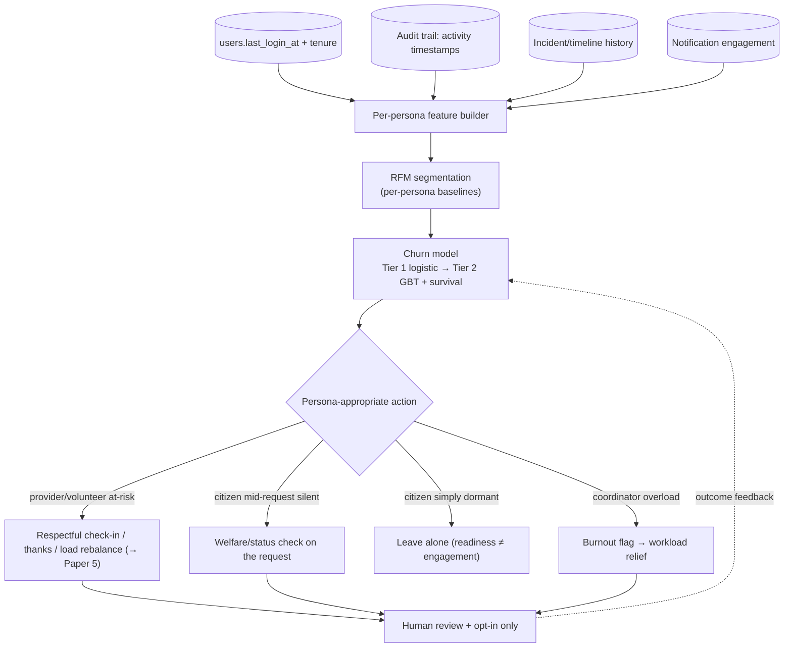

# White Paper 6 — Churn Detection: keeping responders ready and requests un-abandoned

> *Type: White paper (design-now / build-FFP) · Audience: complete novices → ML engineers, ops & product ·
> Status: engine → FFP; MVP seam shipped.*
> *Detects disengagement across **all personas** (citizens, providers, volunteers, coordinators) and functional
> modules — ethically, without dark patterns. MVP seam: `users.last_login_at` + the activity timestamps in the
> audit trail and incident/notification history. Hub: [`README.md`](README.md).*

---

## 1. The problem (in plain language)

**Churn** means *people drifting away from a platform and eventually stopping altogether*. For most apps, detecting
churn is about protecting revenue — keep users hooked, coming back daily. **IDRM is different, and this difference
is the whole point of this paper:**

> **The overriding rule:** **IDRM's goal is readiness, not engagement.** A citizen who never opens the app because
> there's no disaster near them is a *success*, not a churned user. We must **not** nag citizens to "re-engage" —
> that would be a **dark pattern** (*a manipulative design that serves the platform, not the person*) and, in a
> safety service, an abuse of trust. Churn detection here has three *legitimate*, persona-specific aims:
>
> 1. **Retain responder readiness** — providers, volunteers, and coordinators are the response *capacity* that must
>    be there when the next disaster strikes. If they quietly drift away, the platform is hollow when it matters.
> 2. **Catch mid-request abandonment** — a citizen who filed an incident then went silent may be in trouble, or the
>    request may be stalling; that deserves a *check-in*, not a marketing push.
> 3. **Spot coordinator/volunteer burnout** — over-loaded responders disengage; catching it early protects both
>    them and the people they serve.

So this is not a "growth-hacking" engine. It is a **capacity-and-care** engine: keep the helpers ready, make sure no
one in need is forgotten, and leave everyone else in peace.

---

## 2. Where it fits — the MVP seam (already shipped)

The MVP already records the raw activity signals; it simply doesn't model them:

- **`users.last_login_at`** and `created_at` — recency and tenure per account.
- **The append-only audit trail** ([`../../services/monolith/app/modules/audit`](../../services/monolith/app/modules/audit)) — a timestamped
  record of *who did what, when*, across every module: the ground truth for "activity."
- **Incident & timeline history** — when a provider last accepted/completed, when a citizen's request last moved.
- **Notification engagement** — read/acted signals (a proxy for attention).
- **Org cadence** — `total_requests_completed` over time (a provider's contribution trend).

The FFP engine reads these to compute a **per-persona engagement/churn signal**. No schema change — an additive
analytics layer over data the MVP already keeps.

---

## 3. Data inputs (and why "engagement" is persona-specific)

The single biggest modelling mistake here would be one universal "active user" definition. Each persona's *healthy*
pattern is different:

| Persona | Healthy pattern | "At-risk" looks like | Signals |
|---|---|---|---|
| **Citizen** | *episodic* — active only when they need help | mid-request silence; or (if opted-in) never returning after a bad experience | incident activity, last_login, request outcome |
| **Provider / org** | *regular* — accepting & completing over time | was regular, now silent for N weeks; falling completion cadence | accept/complete timestamps, `total_requests_completed` trend |
| **Volunteer** | *periodic* — shows up for events/drives | attendance/response tailing off | activity cadence, response rate |
| **Coordinator** | *steady* — ongoing oversight | overload then withdrawal (burnout) | action volume, response latency trend |

The model computes features **per persona** against **persona-specific baselines** — comparing a citizen to
citizens, a provider to providers.

---

## 4. Method options + recommendation (the classical-first ladder)

### Tier 0 — nothing *(MVP today)*
Raw timestamps exist; no analysis. The safe baseline.

### Tier 1 — RFM segmentation + rule flags + logistic regression *(recommended first build)*
Three cheap, explainable techniques:

- **RFM analysis.** **RFM** = **Recency, Frequency, Monetary** — a classic, decades-old segmentation. We adapt
  "Monetary" to **Contribution** (completions for a provider, requests for a citizen): *how recently, how often, and
  how much* has this actor engaged. Score each on a simple scale and segment into **active / at-risk / dormant** —
  per persona. It's transparent, needs no training, and already tells you *who* to care about.
- **Rule-based at-risk flags.** e.g. *"a provider who averaged ≥1 acceptance/week for 8 weeks, then 0 for 3 weeks"*
  → at-risk. Obvious, auditable, effective for the clear cases.
- **Logistic regression** (*a simple model that outputs a probability from weighted features*) to predict a churn
  probability once you have history — explainable via its coefficients ("long time since last accept dominates").

**Why recommend this first:** RFM + rules capture most of the value immediately and are completely explainable —
which matters because the *action* (contacting someone) must be justified and respectful. No black box decides to
message a person.

### Tier 2 — gradient-boosted trees + survival analysis
When you want sharper prediction and *timing*:

- **Gradient-boosted trees** (**XGBoost/GBM**) — a strong, standard churn classifier; still interpretable via
  feature importance / **SHAP** (*a method that attributes a prediction to each input feature*).
- **Survival analysis** — the *right* tool for "**when** will they disengage?" It models **time-until-an-event** and
  correctly handles **censored data** (*people who haven't churned yet — you can't just ignore them*).
  **Kaplan–Meier** curves show drop-off over time; **Cox proportional-hazards** relates features to churn *risk*.
  This is ideal for volunteer/provider attrition ("this cohort loses half its providers by month 6").

### Tier 3 — sequence models & uplift
At scale: **LSTMs/transformers** over activity *sequences* (subtle disengagement trajectories), and **uplift
modelling** — *predict who will actually respond to a check-in*, so scarce, respectful outreach goes only where it
helps, not to everyone. Uplift is the ethical upgrade: contact the *persuadable and appropriate*, leave the rest
alone.

### At-a-glance comparison

| Tier | Method | Explainable? | Cost | Gives timing? | Best at |
|---|---|---|---|---|---|
| 0 | Raw timestamps | total | ~0 | no | baseline |
| **1** | **RFM + rules + logistic** | **high** | **low** | rough | **the recommended first build; who to care about** |
| 2 | GBT + survival (KM/Cox) | medium | med | **yes** | sharper risk + *when* |
| 3 | Sequence models + uplift | low | high | yes | trajectories + *who to contact* |

**Recommendation:** ship **Tier 1** (persona-aware RFM + rules), add **Tier 2 survival analysis** for responder/
volunteer retention timing, and use **Tier 3 uplift** so outreach is minimal and effective. Every consequential
action stays human-approved and opt-in.

---

## 5. Architecture

The branch that says **"citizen simply dormant → leave alone"** is the ethical heart of this design, and the
reason a generic engagement engine would be *wrong* here. Note the tie-in to **Paper 5**: rebalancing load away
from an over-worked provider is itself churn *prevention*.

---

## 6. Privacy / DPDP (and ethics)

- **Activity profiling is personal data** (DPDP Act 2023) → minimise, get **consent for re-engagement contact**,
  and honour opt-outs absolutely.
- **No dark patterns.** The engine may **not** manipulate, guilt-trip, or nag. Outreach must be genuinely useful
  (readiness, gratitude, a welfare check), infrequent, and easy to stop. A safety service abusing attention is a
  betrayal of trust.
- **The right to be left alone.** Citizen dormancy is *expected and fine*; the default for a non-active citizen is
  **no contact**. Re-engagement contact requires prior opt-in.
- **Explainable & contestable.** A churn/at-risk label is profiling → it must be explainable and correctable, and
  never used to disadvantage someone's access to help.
- **Audit.** Any outreach action is logged to the append-only trail.

Cross-refs: [`../mvp/22-architecture-security-and-iam.md`](../mvp/22-architecture-security-and-iam.md);
[`../mvp/13-requirements-traceability-matrix.md`](../mvp/13-requirements-traceability-matrix.md) §4 (DPDP).

---

## 7. MVP-seam vs FFP-build

| Aspect | MVP (today) | FFP (the engine) |
|---|---|---|
| Activity data | `last_login_at` + audit timestamps | the same, as **per-persona features** |
| Segmentation | none | **RFM** active/at-risk/dormant per persona |
| Prediction | none | logistic → **GBT + survival** (risk + timing) |
| Action | none | persona-appropriate, **opt-in**, human-approved outreach |
| Citizen default | n/a | **leave alone** (no nagging) |
| Responder retention | manual | early at-risk flags + load-rebalance (Paper 5) |
| PICS row | (activity fields exist) | a new `PICS-CHURN-*` block when built |

**Trigger to build:** enough longitudinal activity to model trends, *and* evidence of responder/volunteer attrition
worth preventing.

---

## 8. Metrics (how we'll know it works)

| Metric | Plain meaning | Target direction |
|---|---|---|
| **Responder/volunteer readiness retained** | active response capacity kept available over time | **↑ — the dominant metric (capacity, not vanity)** |
| **Mid-request abandonment caught** | silent active requests surfaced for a welfare/status check | ↑ |
| **Churn-prediction quality** | AUC / precision-recall of the model; calibration | ↑ / tight |
| **Lead time** | how early at-risk is flagged before drop-off | ↑ |
| **Re-engagement uplift** | of those *appropriately* contacted, share who return | ↑ |
| **Outreach complaint / opt-out rate** | annoyance signal from contact | **↓ — the anti-nag guardrail** |
| **Citizen "left-alone" compliance** | dormant citizens *not* contacted without opt-in | 100 % |

Success is defined by **responder readiness retained** and **abandonment caught**, kept honest by the **anti-nag
guardrail** (complaint/opt-out rate) and **100 % "leave dormant citizens alone."** Vanity engagement is explicitly
*not* a goal.

---

## References

- MVP seams: `users.last_login_at` ([`../../services/monolith/app/modules/users`](../../services/monolith/app/modules/users)),
  [`../../services/monolith/app/modules/audit`](../../services/monolith/app/modules/audit) (activity timestamps),
  [`../../services/monolith/app/modules/incidents`](../../services/monolith/app/modules/incidents),
  [`../../services/monolith/app/modules/notifications`](../../services/monolith/app/modules/notifications) (engagement).
- Ties to **Paper 5** (load-rebalance as churn prevention): [`5-recommender-incident-notification-routing.md`](5-recommender-incident-notification-routing.md).
- [`../mvp/21-architecture-decisions.md`](../mvp/21-architecture-decisions.md) ·
  [`../mvp/25-module-elucidation.md`](../mvp/25-module-elucidation.md) · [`../mvp/26-conformance-pics.md`](../mvp/26-conformance-pics.md).
- Hub + shared template: [`README.md`](README.md).
