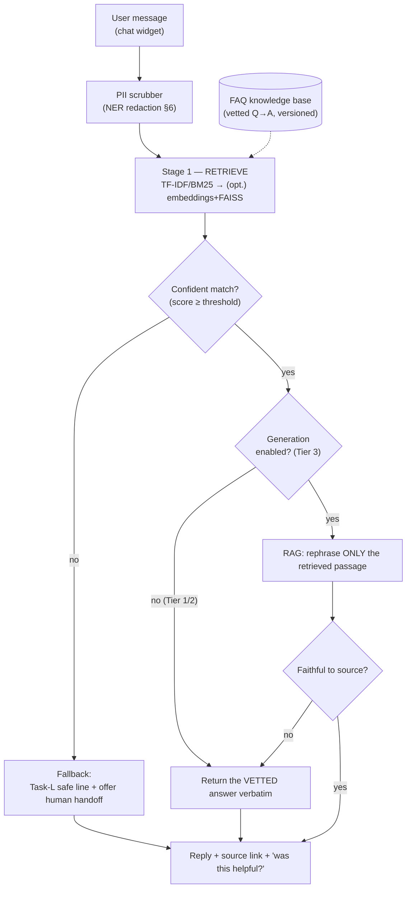

# White Paper 1 — The FAQ Chatbot: from a fixed stub to a grounded assistant

> *Type: White paper (design-now / build-FFP) · Audience: complete novices → NLP/ML engineers & product owners ·
> Status: engine → FFP; MVP seam shipped.*
> *Evolves the **Task-L** chatbot stub (`POST /notifications/chat`) into a real assistant. Method backbone:
> [`../../archive/analyses/notebooks/dsml_faqs_chatbot.ipynb`](../../archive/analyses/notebooks/dsml_faqs_chatbot.ipynb).
> Hub: [`README.md`](README.md).*

---

## 1. The problem (in plain language)

During a disaster, people ask the **same questions** over and over: *"How do I report someone trapped?"*, *"Where
is the nearest relief camp?"*, *"How do I check my request status?"*, *"What do I do in a flood?"*. Coordinators
are busy saving lives; they should not spend that time typing the same answers. A **FAQ chatbot** — *FAQ =
Frequently Asked Questions* — is a small assistant that reads a person's typed question and replies with the right
pre-written answer, freeing humans for the work only humans can do.

Two words we'll use throughout, defined once:

- **Retrieval** — *finding* the best existing answer from a fixed list (like a librarian pointing you to the right
  book). Nothing is invented; the reply is text a human already vetted.
- **Generation** — *writing* a brand-new sentence with a language model (like an author composing a reply). More
  fluent, but it can **hallucinate** — *hallucinate* means *confidently state something false*.

The single most important design rule for a **disaster** chatbot: **prefer retrieval; fear generation.** A wrong
but confident safety instruction ("drive through the flood water") can kill. So our assistant is built to *find
vetted answers first*, and only ever *rephrase* them under tight guardrails — never to freely invent advice.

---

## 2. Where it fits — the MVP seam (already shipped)

The MVP already ships the **hook** this engine plugs into: the **Task-L stub**. Today,
`POST /api/v1/notifications/chat` accepts a message and always returns one fixed, safe line:

> *"Your input is noted, we'll try to get back to you shortly, if possible."*

That is deliberately non-intelligent (no ML in the MVP), but it establishes the **contract** — the request/response
shape, the auth, the rate-limit, the place in the UI — so the FFP engine is a *drop-in replacement for the reply
logic*, not a new feature bolted on. See the stub at
[`../../code/app/modules/notifications/router.py`](../../code/app/modules/notifications/router.py) and its ADR
lineage in [`../mvp/21-architecture-decisions.md`](../mvp/21-architecture-decisions.md).

**The upgrade is purely internal:** same endpoint, same shape; the fixed string is replaced by a
retrieve-(then-maybe-rephrase) pipeline. No client change, no contract change.

---

## 3. Data inputs

| Input | What it is | Where it comes from | Sensitivity |
|---|---|---|---|
| **FAQ knowledge base** | A curated list of *(question, vetted answer, topic, links)* rows | Authored by coordinators/ops; versioned | Low (public help content) |
| **The user's message** | The free-text question typed now | The chat widget | **High** — may contain a name, phone, address |
| **Light context** *(optional)* | The user's role + current page (e.g. "citizen on the report screen") | The session (not the message) | Low |
| **Anonymised query logs** *(optional, consented)* | Past questions with PII stripped | For improving the FAQ set | Medium |

**What we deliberately do *not* need:** the person's identity, their incident's details, or their exact location.
The chatbot answers *how-to* questions; it is not given case data. This is **data minimisation** in action (§6).

---

## 4. Method options + recommendation (the classical-first ladder)

We climb this ladder only as far as the evidence justifies. Each rung is shippable on its own.

### Tier 0 — the fixed stub *(MVP today)*
The current behaviour: one safe, honest acknowledgement. **Zero** intelligence, **zero** risk. It is the fallback
that every higher tier falls back *to* when unsure.

### Tier 1 — keyword retrieval with TF-IDF / BM25 *(recommended first real build)*
**TF-IDF** (*Term Frequency–Inverse Document Frequency*) is a way to score how important each word is to a
document: a word is important if it appears often *here* but rarely *everywhere else* (so "flood" counts, "the"
doesn't). We turn every FAQ question into a **vector** — *a list of numbers* — of these scores, do the same for the
user's message, and pick the FAQ whose vector is most similar. **BM25** is a battle-tested refinement of the same
idea. The reply is the matched FAQ's **vetted answer, verbatim**.

- **Why recommend this first:** it is cheap (runs on a CPU in milliseconds), **fully explainable** ("we matched on
  the words *report* + *trapped*"), **cannot hallucinate** (it only ever returns human-written text), and needs no
  training — just the FAQ list. It solves the 80 % case (repeated, literal questions) immediately.
- **Its limit:** it matches *words*, not *meaning*. "My house is underwater" won't match a "flood" FAQ if the word
  "flood" isn't present.

### Tier 2 — semantic retrieval with embeddings + FAISS
An **embedding** is a vector that captures *meaning*, so "my house is underwater" and "flood at home" land close
together even with no shared words. The notebook uses **Word2Vec**; a modern equivalent is a small
**sentence-embedding** model (still runnable on-prem). **FAISS** (*Facebook AI Similarity Search*) is a library
that finds the nearest vectors among thousands in microseconds. Reply is still the **vetted answer** of the nearest
FAQ — retrieval, not generation, so still no hallucination.

- **Why:** handles paraphrases and typos; big jump in "did it understand me?" quality.
- **Cost:** one small model to host; embeddings to precompute.

### Tier 3 — grounded generation (RAG) with a small, quantized LLM
**RAG** (*Retrieval-Augmented Generation*) = *retrieve first, then let a language model rephrase **only** the
retrieved answer* — never free-form. The notebook uses **DistilGPT-2** (a small, fast GPT-2) with **quantization**
(*storing the model's numbers in fewer bits so it runs on a CPU with less memory*). The model is instructed:
*"Answer using ONLY the passage below; if it doesn't contain the answer, say you'll connect a human."*

- **Why (maybe):** friendlier, more natural phrasing; can combine two FAQs into one coherent reply.
- **Why cautiously:** generation can drift. In a disaster we accept this tier **only** with strict grounding, a
  **faithfulness check** (does the reply stay true to the source passage?), and an automatic fallback to Tier-1
  text or a human when confidence is low. Many deployments will stop at Tier 2 on purpose.

### At-a-glance comparison

| Tier | Method | Hallucination risk | CPU cost | Explainable? | Ships value |
|---|---|---|---|---|---|
| 0 | Fixed stub | none | ~0 | total | safe placeholder |
| **1** | **TF-IDF / BM25 retrieval** | **none** | **very low** | **high** | **the recommended first build** |
| 2 | Embeddings + FAISS retrieval | none | low–med | high | paraphrase robustness |
| 3 | RAG + quantized DistilGPT-2 | low *(if grounded)* | medium | medium | fluent phrasing |

**Recommendation:** build **Tier 1 first** (it captures most of the value at near-zero risk), add **Tier 2** when
logs show paraphrase misses hurting users, and adopt **Tier 3 only** behind grounding + faithfulness guardrails.

---

## 5. Architecture

The spine is **retrieve → check confidence → (optionally rephrase, then check faithfulness) → reply, else human**.
Notice generation is *fenced on both sides* — it only runs on a confident retrieval, and its output is discarded if
it strays from the source.

---

## 6. Privacy / DPDP

The user's message is the sensitive part, so it gets the strictest handling.

- **PII detection & redaction on the way in.** **PII** = *Personally Identifiable Information* (name, phone,
  address, ID numbers). **NER** (*Named-Entity Recognition*) is an ML technique that spots these spans in text; the
  notebook demonstrates NER-for-PII. We **redact** (mask) them *before* the message touches retrieval, logging, or
  any model — e.g. "My name is Rajesh, phone 90000…" → "My name is «NAME», phone «PHONE»".
- **Data minimisation (DPDP Act 2023).** The bot is never handed case data or identity; it only sees the (scrubbed)
  question. Less data held = less that can leak.
- **No third parties.** Every model runs **on-premises** (Tier-1 needs no model at all). No message is sent to an
  external AI API — a hard rule for citizen data and for offline resilience.
- **Consent + retention.** Storing anonymised questions to improve the FAQ set is **opt-in**, with a short
  retention window and PII already stripped. Raw messages are **not** logged (only redacted forms, briefly).
- **Safety > engagement.** The bot never invents medical/rescue advice; unsure → human. This is an ethical stance,
  not just a legal one.

Cross-refs: security posture in [`../mvp/22-architecture-security-and-iam.md`](../mvp/22-architecture-security-and-iam.md);
DPDP mapping in [`../mvp/13-requirements-traceability-matrix.md`](../mvp/13-requirements-traceability-matrix.md) §4.

---

## 7. MVP-seam vs FFP-build

| Aspect | MVP (today) | FFP (the engine) |
|---|---|---|
| Endpoint | `POST /notifications/chat` returns a fixed line | **Same endpoint**; reply comes from retrieve-(then-rephrase) |
| Knowledge | none | a versioned FAQ knowledge base (ops-authored) |
| Models | none | Tier 1 none → Tier 2 sentence-embeddings → Tier 3 quantized DistilGPT-2, all on-prem |
| Index | none | FAISS vector index (Tier 2+) |
| Privacy | message not persisted | NER PII-scrubbing + opt-in anonymised logs |
| Human handoff | implicit ("we'll get back to you") | explicit routing to a coordinator queue |
| PICS row | `PICS-NTF-004` (stub, Planned) | a new `PICS-CHAT-*` block when the engine is built |

**Trigger to build (when FFP work starts):** sustained repeat-question volume that measurably burdens coordinators,
*and* a maintained FAQ set to retrieve from. Until both exist, Tier 0 is the correct, honest behaviour.

---

## 8. Metrics (how we'll know it works)

| Metric | Plain meaning | Target direction |
|---|---|---|
| **Retrieval hit-rate / Recall@1** | How often the top answer is the right one | ↑ (e.g. ≥ 85 % on a labelled question set) |
| **Deflection / self-serve rate** | Share of chats resolved without a human | ↑ |
| **Human-handoff rate** | Share escalated to a coordinator | balanced — *too low* may mean over-confident bot |
| **Latency p95** | 95 % of replies faster than this | ↓ (e.g. < 300 ms Tier 1) |
| **Faithfulness** *(Tier 3)* | Does the generated reply stay true to the source passage? | ↑ (near 100 %; below → fall back) |
| **Harmful-answer rate** | Unsafe/incorrect advice served | **must be ~0** (the overriding safety metric) |
| **CSAT** | "Was this helpful?" thumbs-up share | ↑ |

Evaluate offline on a labelled question set before launch, then monitor live. A rising **harmful-answer rate**
halts higher tiers automatically — safety dominates every other number.

---

## References

- Method backbone: [`../../archive/analyses/notebooks/dsml_faqs_chatbot.ipynb`](../../archive/analyses/notebooks/dsml_faqs_chatbot.ipynb)
  (TF-IDF/BM25 retrieval, Word2Vec/LDA, DistilGPT-2, FAISS, quantization, NER-for-PII).
- MVP seam: [`../../code/app/modules/notifications/router.py`](../../code/app/modules/notifications/router.py) (`/notifications/chat`), Task L.
- [`../mvp/21-architecture-decisions.md`](../mvp/21-architecture-decisions.md) · [`../mvp/25-module-elucidation.md`](../mvp/25-module-elucidation.md) · [`../mvp/26-conformance-pics.md`](../mvp/26-conformance-pics.md) (`PICS-NTF-004`).
- Hub + shared template: [`README.md`](README.md).
