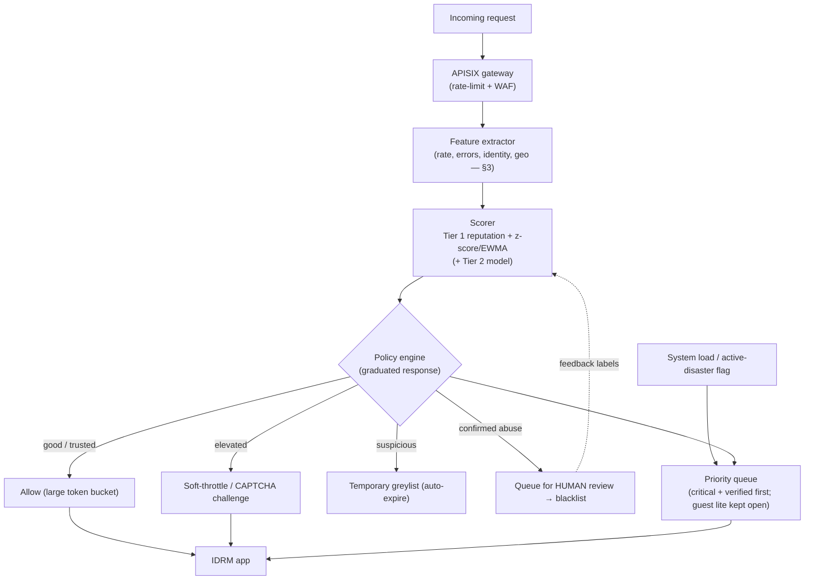

# White Paper 2 — Anomaly-Detection Engine #1: adaptive rate-limiting, prioritisation & smart lists

> *Type: White paper (design-now / build-FFP) · Audience: complete novices → security/ML engineers & SREs ·
> Status: engine → FFP; MVP seam shipped.*
> *The intelligent successor to the MVP's **static** rate-limiter and allow/deny lists (roadmap §8.4). MVP seam:
> [`../../code/app/core/rate_limit.py`](../../code/app/core/rate_limit.py). Hub: [`README.md`](README.md).*

---

## 1. The problem (in plain language)

A public disaster platform is a target *and* a magnet. Two very different floods of traffic hit it:

- **Malicious floods** — bots hammering the API, credential-stuffing (trying stolen passwords), scrapers, or a
  **DDoS** (*Distributed Denial of Service* — many machines flooding a server to knock it offline).
- **Legitimate floods** — a real disaster makes *thousands of real people* submit requests in minutes. In web
  terms this is a **flash crowd**: a sudden surge of *genuine* users.

Here is the hard part, and the theme of this paper: **from raw traffic counts, a flash crowd of real victims looks
almost identical to an attack.** The MVP's defence is **static** — a fixed "N requests per minute per IP" cap and
hand-maintained block lists. Static caps have two failure modes at exactly the worst moment: they are **too loose**
to stop a determined attacker, and **too tight** for a legitimate surge — so they can **block real victims during a
real emergency.** That trade-off is unacceptable, and fixing it is what this engine is for.

**Anomaly detection** = *learning what "normal" looks like, then flagging what deviates from it* — so the system
reacts to *behaviour*, not a fixed number. The engine has three jobs:

1. **Adaptive rate-limiting** — budgets that flex with who you are and how loaded the system is.
2. **Prioritisation** — under load, serve the most important traffic *first* (a coordinator acting on a critical
   incident beats an anonymous scraper).
3. **Smart allow/deny lists** — reputation-driven, auto-expiring "black/white lists" instead of static ones.

> **The overriding rule (like Paper 1's "fear generation"):** **prioritise, don't drop; throttle before you block;
> never hard-block a legitimate victim.** When unsure during a surge, the safe error is to *slow* traffic and *keep
> the emergency path open*, not to refuse it.

---

## 2. Where it fits — the MVP seam (already shipped)

The MVP already ships the **hooks**:

- **`rate_limit.py`** — an in-process limiter keyed by *(endpoint, client-IP)* over a fixed window, returning
  `429 Too Many Requests` + a `Retry-After` header. Its own docstring already says *"centralised/distributed rate
  limiting + a WAF arrive with APISIX (→ FFP)."* That is this engine's landing pad.
- **Static allow/deny lists** (roadmap §8.4): account `suspended`/`deactivated` (user deny), **verified**
  organizations (provider allow), token revocation (credential deny), blocked passwords, CORS origins (request
  allow), the scoped guest path.

**WAF** = *Web Application Firewall* (a filter that blocks malicious requests). **APISIX** is the API gateway the
FFP puts in front of the app. The FFP move is: lift rate-limiting/blocking out of the single process into the
**gateway** (shared, distributed), and feed it decisions from this engine. The MVP's rules are the *seam* the
engine plugs into — designed-in, not bolted-on.

---

## 3. Data inputs

All of these are **observed request metadata** — no message bodies, no case content.

| Signal | What it is | Why it helps |
|---|---|---|
| **Request rate & burstiness** | requests per second per IP/user, and how "spiky" | floods and bots are unusually fast/regular |
| **Error mix** | share of `4xx`/`5xx`, esp. `401`/`403` | credential-stuffing shows as many auth failures |
| **Endpoint entropy** | how varied the called endpoints are | a bot hitting one endpoint looks different from a human browsing |
| **Identity & status** | authenticated? role? account status? org verified? | a verified coordinator ≠ an anonymous IP |
| **Session age & history** | how long/known this session/user is | brand-new + fast = suspicious; long-good = trusted |
| **Network hints** | IP reputation, ASN, geo-velocity (*impossible travel*) | one account from two continents in a minute = takeover |
| **Time context** | current global load; is an alert/disaster active? | the same rate means different things in a surge |

**Personal data note:** an IP address and a behavioural profile are **personal data** under DPDP (§6). We treat
them as sensitive and minimise what we keep.

---

## 4. Method options + recommendation (the classical-first ladder)

### Tier 0 — static caps + static lists *(MVP today)*
Fixed per-IP window + hand-maintained lists. Simple, predictable; blind to context. The safe baseline.

### Tier 1 — adaptive budgets + statistical anomaly + reputation scores *(recommended first build)*
Three cheap, explainable pieces working together:

- **Adaptive rate-limiting with a token bucket.** A **token bucket** is a simple, standard idea: each identity has
  a bucket that refills at a set rate; each request spends a token; empty bucket → throttled. Make the **refill
  rate depend on trust and load**: verified coordinators get big buckets, anonymous IPs small ones, and *all*
  buckets shrink as system load rises. This flexes automatically — no magic numbers frozen in code.
- **Statistical anomaly detection.** Keep a rolling baseline of normal per-IP/user rate and compute a **z-score**
  (*how many standard deviations from normal* — a standard "how weird is this?" measure) or an **EWMA**
  (*Exponentially Weighted Moving Average* — a running average that weights recent activity more). A large,
  sustained deviation flags an anomaly. No training data needed.
- **Reputation score + graduated response.** Combine the signals from §3 into a single 0–1 **reputation** per
  IP/user/session (a transparent weighted rule to start). Then respond *gradually*, never with a blunt on/off:

  `monitor → soft-throttle → challenge (CAPTCHA) → temporary greylist → blacklist → human review`

  Lists are **auto-expiring** (a bad IP is throttled for minutes, not banned forever) and **appealable**.

- **Prioritisation under load.** When the system is saturated, serve a **weighted priority queue**: critical-incident
  and verified-responder traffic first, authenticated citizens next, anonymous/guest last — but the **emergency
  guest "lite" path stays open**. Drop *scrapers*, not *victims*.

**Why recommend Tier 1 first:** every piece is CPU-cheap, runs online, and is **explainable** ("throttled: 40×
normal rate, 90 % `401`s, brand-new IP") — which you *need*, because these are decisions about people. It stops the
common attacks and, crucially, its load-aware budgets **degrade gracefully in a surge** instead of hard-failing.

### Tier 2 — unsupervised ML anomaly models
When rules miss subtle patterns, add unsupervised models on session feature-vectors:
**Isolation Forest** (*isolates outliers by how easily they can be "split off"* — fast, popular for anomalies),
**Local Outlier Factor**, **One-Class SVM**, or clustering (**DBSCAN**) to find bot clusters. Still no labels
needed. Once you accumulate labelled abuse, a **logistic regression** or **gradient-boosted trees** classifier
(explainable, cheap) sharpens precision.

### Tier 3 — sequence & graph deep learning
For scale/sophistication: **autoencoders** or **LSTMs** over request *sequences* (detect abnormal journeys),
**graph** methods linking IPs/accounts/behaviour to spot coordinated botnets, and **online learning** that adapts
continuously. Reserve for proven need — expensive and harder to explain.

### At-a-glance comparison

| Tier | Method | Explainable? | Cost | Needs labels? | Best at |
|---|---|---|---|---|---|
| 0 | Static caps + lists | total | ~0 | no | predictability |
| **1** | **Token-bucket + z-score/EWMA + reputation + priority queue** | **high** | **low** | **no** | **the recommended first build; graceful under surge** |
| 2 | Isolation Forest / LOF / (later) GBT classifier | medium | med | no → some | subtle/novel anomalies |
| 3 | Autoencoder / LSTM / graph | low | high | mixed | coordinated botnets at scale |

**Recommendation:** ship **Tier 1** (adaptive budgets + statistical flags + reputation + prioritisation) at the
**APISIX gateway**; add **Tier 2** models when logs show rule-evading abuse; reserve **Tier 3** for scale. Keep a
human in the loop for every *hard* block.

---

## 5. Architecture

Two feedback ideas to notice: **load feeds the policy** (budgets tighten as the system fills), and **human review
feeds the scorer** (confirmed decisions become labels that improve Tier-2 models). Hard blocks are never fully
automatic.

---

## 6. Privacy / DPDP

- **IPs and behavioural profiles are personal data.** Store **aggregates and scores**, not long raw request logs;
  keep short retention windows; don't build persistent cross-session dossiers beyond the security need
  (**purpose limitation** + **data minimisation**, DPDP Act 2023).
- **Fairness / non-discrimination.** Do **not** block by crude geography or coarse demographics — during a regional
  disaster that would silence exactly the affected population. Decisions must rest on *behaviour*, not identity
  group.
- **Explainability + appeal.** A block is an adverse decision about a person, so it must carry a **reason** and an
  **appeal path**, and hard blocks get **human review**. Auto-expiry prevents indefinite lock-out of a real victim.
- **Transparency & proportionality.** Prefer the *least restrictive* effective action (throttle/challenge before
  block). Log security decisions to the append-only audit trail
  ([`../../code/app/modules/audit`](../../code/app/modules/audit)).

Cross-refs: [`../mvp/22-architecture-security-and-iam.md`](../mvp/22-architecture-security-and-iam.md) (security);
[`../mvp/13-requirements-traceability-matrix.md`](../mvp/13-requirements-traceability-matrix.md) §4 (DPDP mapping).

---

## 7. MVP-seam vs FFP-build

| Aspect | MVP (today) | FFP (the engine) |
|---|---|---|
| Enforcement point | in-process `rate_limit.py`, per box | **APISIX gateway** (shared, distributed) |
| Counters/state | in-memory (per process) | **Redis** shared store (survives, cluster-wide) |
| Rate limit | static N/min per IP | **adaptive token bucket** (trust × load) |
| Lists | static allow/deny (§8.4) | **reputation-driven, auto-expiring** grey/black lists |
| Under load | same cap for everyone | **priority queue** (critical + verified first; guest-lite open) |
| Detection | none (fixed rule) | z-score/EWMA + reputation → Isolation Forest/GBT |
| Governance | none | reasons, appeal, human-review, audited |
| PICS row | (MVP static controls in §8.4) | a new `PICS-AD1-*` block when built |

**Trigger to build:** measurable abuse/DDoS pressure, *or* the first real surge where static caps risk blocking
victims — and the arrival of APISIX + Redis in the FFP platform.

---

## 8. Metrics (how we'll know it works)

| Metric | Plain meaning | Target direction |
|---|---|---|
| **Detection recall** | share of real abuse caught | ↑ |
| **False-positive block rate** | legitimate users wrongly blocked | **must be ≈ 0 — the dominant metric** |
| **Legit-traffic-served-during-surge** | % of genuine requests served when flooded | ↑ (the disaster-readiness metric) |
| **Time-to-detect / time-to-mitigate** | how fast abuse is spotted and slowed | ↓ |
| **Appeal-overturn rate** | share of blocks reversed on review | ↓ (high = too aggressive) |
| **p95 latency under load** | responsiveness when saturated | ↓/stable |
| **Attack cost-to-serve** | resources spent absorbing junk traffic | ↓ |

The pair that dominates is **false-positive block rate** and **legit-traffic-served-during-surge**: in a disaster,
*wrongly refusing a real victim is far worse than serving one extra bot*. Tune conservatively, and let the human
review loop and appeal-overturn rate keep the system honest.

---

## References

- MVP seam: [`../../code/app/core/rate_limit.py`](../../code/app/core/rate_limit.py) (static per-IP limiter) and
  roadmap [`../mvp/27-implementation-roadmap.md`](../mvp/27-implementation-roadmap.md) §8.4 (static allow/deny lists).
- Security & DPDP: [`../mvp/22-architecture-security-and-iam.md`](../mvp/22-architecture-security-and-iam.md) ·
  [`../mvp/21-architecture-decisions.md`](../mvp/21-architecture-decisions.md) (APISIX gateway ADR) ·
  [`../mvp/25-module-elucidation.md`](../mvp/25-module-elucidation.md) · [`../mvp/26-conformance-pics.md`](../mvp/26-conformance-pics.md).
- Hub + shared template: [`README.md`](README.md).
