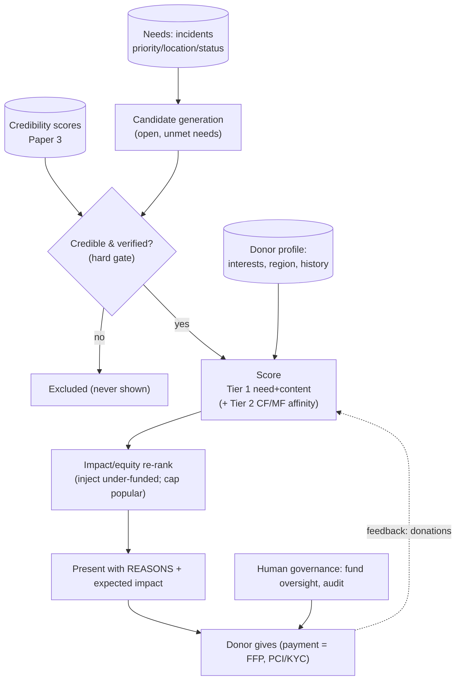

# White Paper 4 — Recommender System #1: the Financial / Charity module

> *Type: White paper (design-now / build-FFP) · Audience: complete novices → ML engineers, product & trust-&-safety
> · Status: engine **and** money → FFP; MVP seam = need signals only.*
> *A Shopify/Flipkart-style recommender that points donors to where their money does the **most good**. Method
> backbone: [`../../archive/analyses/notebooks/Zee_Recommender_System_Final.ipynb`](../../archive/analyses/notebooks/Zee_Recommender_System_Final.ipynb)
> & [`Zee_Recommender_Academic_v2.ipynb`](../../archive/analyses/notebooks/Zee_Recommender_Academic_v2.ipynb). Hub: [`README.md`](README.md).*

---

## 1. The problem (in plain language)

When a disaster strikes, generous people want to give money — but they face a paralysing question: *"Where will my
₹1,000 actually help the most?"* Left to guesswork, donations pile onto whatever cause is **loudest or most
photogenic**, while equally urgent but less visible needs go unfunded. A **recommender system** — *software that
suggests items to a person based on data* — can fix this by matching each donor to the causes where their gift has
the greatest impact.

But a charity recommender is **not** a shopping recommender, and confusing the two is the central risk of this
paper. Amazon's recommender maximises **revenue and clicks**; if it over-promotes popular items, that's fine —
that's the point. A donations recommender that copies this blindly creates **donation inequality**: a
**popularity bias** (*the tendency of recommenders to keep promoting already-popular items*) funnels money to a few
famous causes and starves the rest. Here, the objective is different:

> **The overriding rule (this hub's recurring theme):** **optimise for impact and equitable coverage of need — not
> donor delight or "revenue."** A good recommendation is one that gets funds to a *credible, urgent, under-funded*
> need the donor is willing to support — *and* helps the whole map of needs get covered, not just the popular
> corner. Donor preference is an *input*; need, urgency, credibility and equity are the *objective*.

Two guardrails follow immediately: **only ever recommend credible, verified causes** (this is where Paper 3's
credibility scores are essential — money must never flow to a fraudulent or unverified cause), and the module
recommends *where relief is needed* — it does **not** give investment or financial-returns advice.

---

## 2. Where it fits — the MVP seam (thin, on purpose)

**Money is entirely → FFP.** The MVP has **no** donations, transactions, or payment code (a locked decision — see
[`../mvp/21-architecture-decisions.md`](../mvp/21-architecture-decisions.md)). So the seam here is not a stub
endpoint but the **need signals** the MVP already produces, which the future engine will rank:

- **Incidents** carry `service_type`, `priority`, `location`, `status` — i.e. *what is needed, how urgently, where,
  and whether it's still open*.
- **Organizations** carry `is_verified`, `capacity`, `service_categories` — *who can deliver, and are they trusted*.
- **Credibility scores** (Paper 3) — *which causes/orgs are trustworthy enough to receive funds*.

The FFP build adds the money layer (donation / campaign / transaction tables, payment integration) **and** the
recommender on top. Designing the recommender now ensures those need-signals are captured in a shape the engine can
consume — need first, money later.

---

## 3. Data inputs

The recommender maps neatly onto the classic **user × item** picture from the Zee notebooks — with charity-specific
meanings:

| Recommender concept | In a shopping app | In IDRM's charity module |
|---|---|---|
| **User** | a shopper | a **donor** |
| **Item** | a product | a **fundable cause** (an incident/need, a relief campaign, an org, a region) |
| **Interaction / "rating"** | purchase, click, star | a **past donation**, a share, a saved cause |
| **Item features (content)** | category, price | service_type, urgency/priority, location, **credibility**, funding gap |
| **Objective** | revenue | **need met, equitably, from a credible cause** |

Additional signals: the donor's **stated interests/region**, engagement history, and context (which disasters are
active now). Payment/transaction data is **highly sensitive** and governed separately (§6).

---

## 4. Method options + recommendation (the classical-first ladder)

### Tier 0 — no personalisation *(the honest starting point)*
A simple public list of open needs, sorted by urgency. No donor modelling. Transparent, fair, but not tailored.

### Tier 1 — content-based + need-ranked scoring *(recommended first build)*
Score each *eligible* cause for a donor with a transparent formula, **before any donation history exists** — which
elegantly solves the **cold-start problem** (*the difficulty of recommending to brand-new users or for brand-new
items, when there's no interaction data yet*):

```
score(cause | donor) = w1·urgency(priority)          # how time-critical
                     + w2·funding_gap(target − raised) # how under-funded  ← counters popularity bias
                     + w3·credibility(Paper 3)         # is it trustworthy  (hard gate: below threshold ⇒ excluded)
                     + w4·donor_fit(interests, region) # will this donor care
                     − w5·popularity_penalty            # damp already-crowded causes
```

- **Content-based** means we match on the *features* of causes and the donor's stated interests — no history
  needed. It works on day one and centres **impact** (urgency + funding gap) with **donor fit** as a tie-breaker.
- **Credibility is a hard gate**, not just a weight: a cause below the trust threshold is *never* shown.
- Every recommendation ships its **reasons** ("critical, 20 % funded, verified NGO, near you") and the **expected
  impact** of a gift — transparency the donor deserves.

**Why recommend this first:** cheap, explainable, cold-start-proof, and it structurally fights donation inequality
by rewarding *under-funded* causes. It captures most of the value before any ML training.

### Tier 2 — collaborative filtering + matrix factorization *(the Zee toolkit)*
Once donation history accumulates, add the notebooks' proven methods:

- **Collaborative filtering (CF)** = *"donors like you also supported…"* — recommend from patterns across donors,
  not item features. The notebooks implement **item-based and user-based** CF via **Pearson correlation**,
  **cosine similarity**, and **KNN** (*k-Nearest-Neighbours — find the k most similar donors/causes*).
- **Matrix factorization (MF)** = *learn hidden "taste" dimensions* (**latent factors**) that explain who gives to
  what, filling in the huge, mostly-empty donor×cause matrix. The notebooks use **SVD** (Surprise) and **ALS**
  (cmfrec). This predicts a donor's affinity for causes they've never seen.
- **Ensemble** = *blend several models' outputs for a better result* (the notebooks build one). Here: blend the
  CF/MF **affinity** with the Tier-1 **need/credibility** score — affinity decides *which* of the worthy causes to
  show this donor; need/credibility decides *worthiness*.
- **De-bias re-ranking**: after scoring, deliberately re-rank to inject under-funded causes and cap how much any
  single popular cause dominates — the equity objective made operational.

### Tier 3 — learning-to-rank & contextual bandits
At scale: **learning-to-rank** (train a model to order causes directly) and **contextual bandits** (*a principled
explore/exploit method* — mostly show good matches, but occasionally surface an under-exposed cause to *learn* its
appeal and give it a fair chance). Bandits are a natural fit for the "give unglamorous causes visibility" goal.

### At-a-glance comparison

| Tier | Method | Cold-start? | Explainable? | Fights popularity bias? | Best at |
|---|---|---|---|---|---|
| 0 | Urgency-sorted list | ✅ | total | neutral | a fair baseline |
| **1** | **Content + need/credibility score** | **✅** | **high** | **yes (funding-gap term)** | **the recommended first build** |
| 2 | CF + MF (SVD/ALS) + ensemble + de-bias | ❌ for new causes | medium | via re-ranking | personalised affinity at scale |
| 3 | Learning-to-rank / contextual bandits | partial | low | strongly (exploration) | maximal impact + fairness |

**Recommendation:** ship **Tier 1** (need-ranked, credibility-gated, cold-start-proof); add **Tier 2** (the Zee
CF/MF ensemble) once donation history exists, always with **de-bias re-ranking**; use **Tier 3** bandits to give
under-funded causes a fair shot. Fund allocation stays **human-governed**.

---

## 5. Architecture



The two non-negotiables are visible: a **hard credibility gate** before scoring, and an **impact/equity re-rank**
after it — so the pipeline can't route money to an untrusted cause or pile it onto the already-popular.

---

## 6. Privacy / DPDP (and financial compliance)

Money makes this the most tightly-governed engine — which is *why* it's fully FFP.

- **Financial data is highly sensitive.** Payment handling requires **PCI-DSS** (*the payment-card security
  standard*) and **KYC** (*Know-Your-Customer* identity checks). IDRM should use a compliant payment processor and
  keep card data **out** of its own database (tokenised) — the same "store the key, not the blob" discipline as
  files.
- **DPDP Act 2023.** Donor identity, giving history, and financial data are personal data → consent, purpose
  limitation, minimisation, and the right to correction/erasure (subject to legal retention of financial records).
- **Indian charitable-giving rules.** Foreign contributions are regulated (**FCRA**); donation receipts and 80G tax
  treatment have legal form. The module must respect these — a compliance, not just an ML, concern.
- **No financial/investment advice.** The module recommends *where relief is needed*, with transparency of impact —
  it never advises on financial returns or investments (out of scope and, as personalised financial advice, off-
  limits).
- **Transparency of fund use.** Donors should see *why* a cause was recommended and *what their gift achieved* —
  trust is the currency of charity. All allocations hit the audit trail.

Cross-refs: [`../mvp/22-architecture-security-and-iam.md`](../mvp/22-architecture-security-and-iam.md);
[`../mvp/13-requirements-traceability-matrix.md`](../mvp/13-requirements-traceability-matrix.md) §4 (DPDP).

---

## 7. MVP-seam vs FFP-build

| Aspect | MVP (today) | FFP (the engine + money layer) |
|---|---|---|
| Money | **none** | donation / campaign / transaction tables + compliant payment processor |
| Needs | incidents (priority/location/status) | the same, as ranked **candidates** |
| Trust | org verification + (future) credibility | **hard credibility gate** (Paper 3) |
| Personalisation | none | content-based → CF/MF ensemble (Zee toolkit) |
| Fairness | urgency-sorted list | **funding-gap term + de-bias re-rank + bandit exploration** |
| Governance | — | human fund oversight, receipts (80G/FCRA), audit |
| PICS row | (need signals exist) | a new `PICS-REC1-*` block when built |

**Trigger to build:** a decision to accept donations at all (a product + legal step), *plus* enough concurrent
needs that donors genuinely benefit from guidance.

---

## 8. Metrics (how we'll know it works)

Because the objective differs from commerce, so do the headline metrics:

| Metric | Plain meaning | Target direction |
|---|---|---|
| **Need-coverage** | share of critical/urgent needs that got funded | ↑ *(a primary metric)* |
| **Funding equity (Gini)** | how evenly funds spread across causes (*Gini = an inequality measure, 0 = perfectly even*) | ↓ *(a primary metric)* |
| **Time-to-fund (urgent)** | how fast the most urgent needs reach their target | ↓ |
| **Fraud / mis-directed funds** | money to non-credible causes | **must be ≈ 0** |
| **Donation conversion / propensity error** | did recommendations lead to gifts; RMSE/MAE of predicted propensity (Zee metrics) | conversion ↑, error ↓ |
| **Coverage / diversity** | how many distinct causes get exposure | ↑ (anti-popularity-bias) |
| **Donor retention & trust** | do donors return; do they trust the impact reporting | ↑ |

Unlike a shopping recommender judged on revenue, this one is judged first on **need-coverage** and **funding
equity** — with **conversion** important but subordinate, and **fraud ≈ 0** as an absolute gate.

---

## References

- Method backbone: [`../../archive/analyses/notebooks/Zee_Recommender_System_Final.ipynb`](../../archive/analyses/notebooks/Zee_Recommender_System_Final.ipynb)
  and [`Zee_Recommender_Academic_v2.ipynb`](../../archive/analyses/notebooks/Zee_Recommender_Academic_v2.ipynb)
  (CF via Pearson/cosine/KNN, matrix factorization SVD/ALS, regression, ensemble, cold-start; RMSE/MAE/MAPE).
- Depends on **Paper 3** (credibility gate): [`3-credibility-assessment.md`](3-credibility-assessment.md).
- MVP need signals: [`../../code/app/modules/incidents`](../../code/app/modules/incidents) ·
  [`../../code/app/modules/resources`](../../code/app/modules/resources).
- [`../mvp/21-architecture-decisions.md`](../mvp/21-architecture-decisions.md) (money → FFP) ·
  [`../mvp/25-module-elucidation.md`](../mvp/25-module-elucidation.md) · [`../mvp/26-conformance-pics.md`](../mvp/26-conformance-pics.md).
- Hub + shared template: [`README.md`](README.md).
