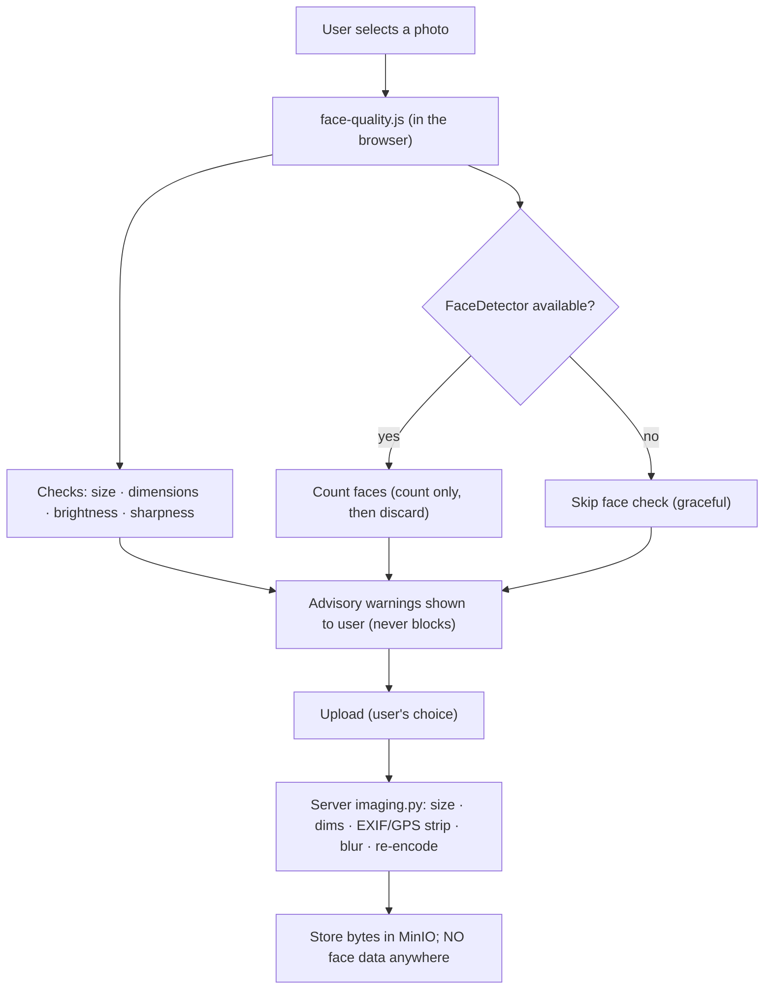

# Companion Note — The Face-Detection Photo-Quality Gate (detection-now / recognition-FFP)

> *Type: Design note (companion to the six white papers) · Audience: complete novices → frontend/ML engineers &
> privacy reviewers · Status: **MVP detection gate implemented (client-side)**; FaceNet recognition → FFP.*
> *Not one of the six engine papers — a focused note on `PICS-FIL-005` / **ADR-011**. Code:
> [`../../code/frontend/static/js/face-quality.js`](../../code/frontend/static/js/face-quality.js) (client) +
> [`../../code/app/modules/files/imaging.py`](../../code/app/modules/files/imaging.py) (server). Hub: [`README.md`](README.md).*

---

## 1. The problem (in plain language)

People in a disaster upload photos in a hurry — often blurry, too dark, or too small to be useful. A **quality
gate** catches this *before* upload and asks for a better shot. **ADR-011** specifies a **face-detection-only**
gate: use lightweight face detection as a *photo-quality* signal, while storing **nothing biometric**.

Two terms, defined once, because the difference is the whole privacy story:

- **Face *detection*** — *"is there a face in this picture?"* (a yes/no, or a count). It says nothing about *whose*
  face it is. This is all the MVP does.
- **Face *recognition*** — *"whose face is this?"* (matching an identity, e.g. **FaceNet**). This is powerful and
  privacy-sensitive; under the DPDP Act 2023 it needs explicit consent and safeguards. It is **out of the MVP** and
  deferred to the FFP (ADR-011).

> **The governing rule:** **detect, never identify; on the device, never on the server; warn, never block.** The
> gate improves photo quality and confirms "a real photo of a scene/person" without ever computing or keeping
> biometric identity data.

---

## 2. What we built (MVP) and where it lives

Per ADR-011's word — *client-side* — the detection gate runs **in the browser**, and the server does the
non-face quality re-checks it already had:

- **Client (implemented):** [`face-quality.js`](../../code/frontend/static/js/face-quality.js) — a dependency-free
  vanilla-JS module. On file selection it decodes the image on-device and checks **size, dimensions, brightness,
  sharpness (a blur proxy)**, and — best-effort — a **face *count*** via the browser's built-in `FaceDetector`
  API. It returns friendly warnings ("too dark", "blurry", "no clear face"). It is **advisory** — it never blocks
  the upload — and **graceful**: if `FaceDetector` isn't available, the face check is simply skipped.
- **Server (unchanged, authoritative):** [`imaging.py`](../../code/app/modules/files/imaging.py) `process_image`
  re-checks size/dimensions, **strips EXIF/GPS**, downscales, and runs its own blur check — because we never trust
  the client. `passes_face_quality_gate` is a deliberate **no-op**: the server computes **no** face data at all.

This split is the privacy design: the only place a face is ever *looked at* is the user's own device, and only to
*count* — the count is used, then everything is discarded.

---

## 3. Method options + recommendation

| Option | Where | Biometric data leaves device? | Dependency | Verdict |
|---|---|---|---|---|
| **Browser `FaceDetector` API** | client | **no** | none (built-in) | **✅ recommended** — matches ADR-011, zero deps, on-device |
| `face-api.js` / TF.js model | client | no | a JS model download | fallback if `FaceDetector` coverage is too thin |
| **OpenCV (Haar/DNN) server-side** | server | image is sent to server anyway | heavy Python CV lib | ✗ for MVP — against ADR-011's "client-side"; adds a heavy dep |
| FaceNet **recognition** | server/service | **yes (identity)** | model + vector store | **→ FFP only**, with explicit consent (DPDP) |

**Recommendation (what we did):** the **browser `FaceDetector` API**, advisory, with the reliable quality checks
(size/brightness/blur) as the dependable core and the face *count* as a best-effort bonus. Reach for a small
client JS model (`face-api.js`) only if browser coverage proves insufficient. Keep the server a no-op for faces.

---

## 4. Architecture

Notice there is **no arrow carrying face data to the server** — by construction.

---

## 5. Privacy / DPDP

- **Nothing biometric is stored or transmitted.** Faces are only *counted* on-device, then discarded; the server
  computes no face data. This is the strongest possible reading of "nothing biometric stored" (ADR-011).
- **Detection ≠ recognition.** We never attempt identity. Recognition (FaceNet) is a separate, consent-gated FFP
  feature — see the FFP path below.
- **On-device processing** honours **data minimisation** and works offline.
- **Advisory, not gatekeeping.** A quality warning never denies someone help — they can upload anyway, and a
  low-quality photo never blocks an emergency report.

Cross-refs: [`../mvp/21-architecture-decisions.md`](../mvp/21-architecture-decisions.md) (ADR-011);
[`../mvp/22-architecture-security-and-iam.md`](../mvp/22-architecture-security-and-iam.md);
[`../mvp/13-requirements-traceability-matrix.md`](../mvp/13-requirements-traceability-matrix.md) §4 (DPDP).

---

## 6. MVP-seam vs FFP-build

| Aspect | MVP (today) | FFP |
|---|---|---|
| Face use | **detection-only, count** (client, advisory) | (optional) **recognition** with consent |
| Location | on-device (browser) | a dedicated, access-controlled service |
| Stored data | **none** (biometric) | face templates only under explicit DPDP consent + purpose limits |
| Server role | no-op for faces; quality re-checks only | recognition behind strict authz + audit |
| PICS row | `PICS-FIL-005` (detection gate — client-side) | a new `PICS-FACEREC-*` block if ever built |

**Trigger to build recognition:** a concrete, lawful, consented use-case (e.g. reuniting families) with DPDP sign-
off — never as a default. Detection stays the MVP norm.

---

## 7. Metrics (how we'll know it works)

| Metric | Plain meaning | Target |
|---|---|---|
| **Poor-photo catch rate** | share of low-quality photos flagged before upload | ↑ |
| **Retake rate after warning** | users who improve the photo after a nudge | ↑ |
| **False-warning rate** | good photos wrongly warned | ↓ |
| **Never-blocks-emergency** | quality warnings that prevented an upload | **0 (advisory only)** |
| **Biometric data stored** | face/identity data retained anywhere | **0 — absolute** |

The two absolutes define success: the gate **never blocks an emergency**, and **zero biometric data** is ever
stored.

---

## Honest status

The client gate is **implemented** ([`face-quality.js`](../../code/frontend/static/js/face-quality.js)); the server
seam is documented as a no-op by design. Because it is browser code, it is **not** exercised by the Python
`make qa` suite — it needs a quick **manual browser check** on the upload screen (which is itself still to be built
out in the frontend). So `PICS-FIL-005` stays **Planned** until that manual verification, per roadmap §14.

## References

- Client: [`../../code/frontend/static/js/face-quality.js`](../../code/frontend/static/js/face-quality.js) ·
  Server: [`../../code/app/modules/files/imaging.py`](../../code/app/modules/files/imaging.py).
- [`../mvp/21-architecture-decisions.md`](../mvp/21-architecture-decisions.md) (ADR-011) ·
  [`../mvp/26-conformance-pics.md`](../mvp/26-conformance-pics.md) (`PICS-FIL-005`).
- Hub: [`README.md`](README.md).
