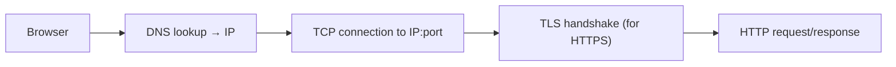

# Networking 101

> *Type: Guide (101 / foundational) · Audience: complete novices → developers/ops · Status: MVP-aware · Track: Operations (#33)*
> *Every request in IDRM travels across a network. You don't need to be a network engineer, but knowing the basics
> demystifies URLs, ports, HTTPS, and "connection refused." This guide gives you that foundation.*

---

## 1. How computers find each other

- **IP address** — a computer's numeric address on a network (e.g. `10.0.0.5`). Like a postal address for a machine.
- **DNS (Domain Name System)** — the internet's phonebook: turns a human name (`idrm.example.gov.in`) into an IP
  address. Type a name, DNS finds the number.
- **Port** — a numbered "door" on a machine for a specific service. Web servers commonly use **80** (HTTP) and
  **443** (HTTPS); PostgreSQL uses **5432**; MinIO **9000/9001**; a dev server often **8000**.

So `https://host:443` means "speak HTTPS to this host on door 443."

---

## 2. The request's journey (client → server)

- **TCP** — the reliable delivery protocol that makes sure data arrives complete and in order.
- **HTTP** — the language of web requests ([REST API 101](rest-api-101.md)) that rides on top of TCP.
- **HTTPS = HTTP + TLS** — the same, but **encrypted** so nobody in between can read or tamper.

---

## 3. TLS and certificates (why the padlock)

**TLS (Transport Layer Security)** encrypts traffic and proves the server's identity using a **certificate** (a
signed document from a trusted authority). This is what stops eavesdropping and impersonation. **IDRM uses HTTPS
everywhere** — non-negotiable when handling disaster victims' data ([Secure Coding 101](secure-coding-101.md)).

---

## 4. Keeping networks safe

- **Firewall** — controls which ports/addresses can connect; expose only what's needed (least privilege for the
  network).
- **Private vs public** — databases (Postgres, MinIO) should sit on a **private** network, never open to the
  internet; only the web entry point is public.
- **Reverse proxy / gateway** — a front door that routes and protects traffic. IDRM's **FFP** uses **APISIX**
  ([api-gateway spoke](../../../archive/instructions/api-gateway.md)); the MVP is simpler.

---

## 5. Troubleshooting vocabulary

- **"Connection refused"** — nothing is listening on that host/port.
- **"Timeout"** — a firewall/network is silently dropping the connection.
- **404 vs 502** — 404 = server reached, resource missing; 502 = the proxy couldn't reach the app behind it.

---

## 6. Mastery check

1. Explain **IP**, **DNS**, and **port** with an IDRM example.
2. Walk the journey of a browser request (DNS → TCP → TLS → HTTP).
3. Explain **HTTPS/TLS** and what a **certificate** proves.
4. Explain why databases sit on a **private** network behind a firewall.
5. Interpret "connection refused", "timeout", and a 502.

---

## 7. Go deeper

- MDN — How the web works — developer.mozilla.org · Cloudflare Learning — cloudflare.com/learning
- Related: [REST API 101](rest-api-101.md) · [Linux 101](linux-101.md) · [Cloud 101](cloud-101.md)

---
*Next:* [Cloud 101](cloud-101.md) · *Up:* [Learning Paths](../00-start-learning-paths.md)
